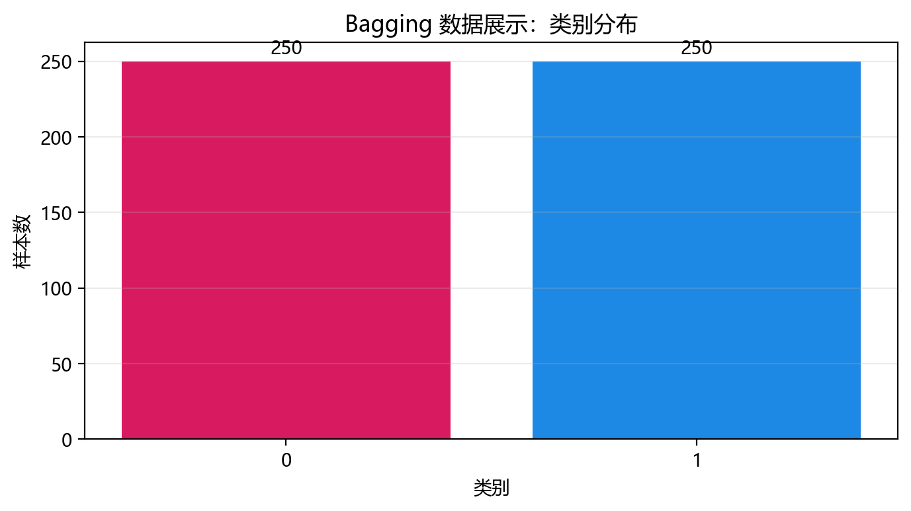
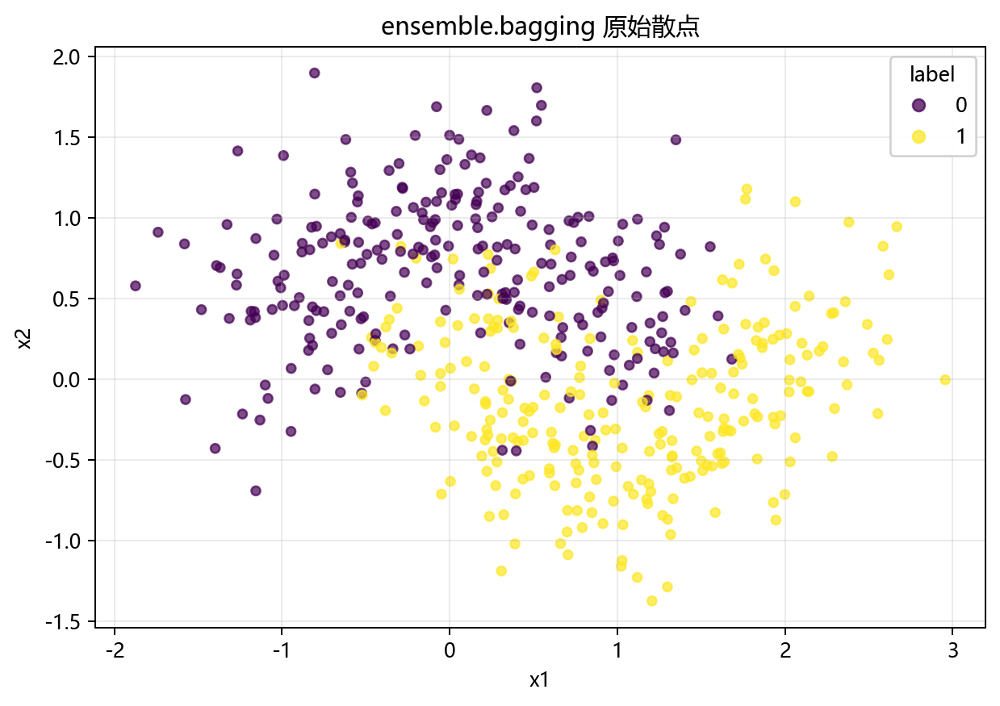
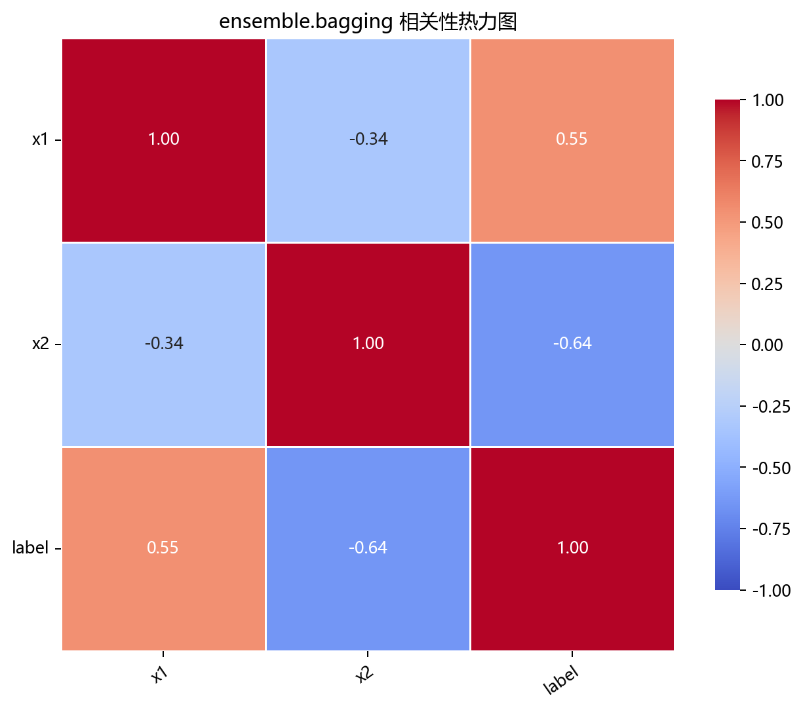

# 数据构成

## 本章目标

1. 明确本仓库 Bagging 数据来自 `EnsembleData.bagging()` 构造的高噪声双月牙二分类数据。
2. 理解为什么选择高噪声数据——`noise=0.35` 使单棵完全生长树严重过拟合，从而最大程度体现 Bagging 的方差缩减价值。
3. 明确当前流程中的训练/测试切分（分层抽样）和标准化顺序。

## 重点方法与概念速览

| 名称 | 类型 | 作用 |
|---|---|---|
| `EnsembleData.bagging()` | 方法 | 生成 Bagging 使用的高噪声双月牙二分类数据 |
| `make_moons(...)` | 函数 | scikit-learn 提供的双月牙数据生成器 |
| `bagging_data` | 变量 | 在 `data_generation/__init__.py` 中导出的 DataFrame |
| `bagging_noise` | 参数 | 噪声水平 `0.35`——刻意高于其他算法，体现 Bagging 降方差优势 |
| `StandardScaler` | 类 | 对特征做 Z-score 标准化——训练集拟合、测试集变换 |

## 1. 数据生成：`EnsembleData.bagging()`

当前 Bagging 数据来自 `EnsembleData.bagging()`，底层调用 `sklearn.datasets.make_moons()`。

### 参数速览

适用函数：`make_moons(n_samples=500, noise=0.35, random_state=42)`

| 参数名 | 类型 | 说明 | 示例取值 |
|---|---|---|---|
| `n_samples` | `int` | 总样本数。默认 `500`——适中规模，80 个 Bagging 子学习器可在秒级完成训练 | `500`、`1000` |
| `noise` | `float` | 标签噪声的标准差。`0.35` 刻意偏高——使单棵树严重过拟合，凸显 Bagging 的方差缩减效果 | `0.1`、`0.35` |
| `random_state` | `int` | 随机种子，保证数据可复现。默认 `42` | `42` |
| 返回值 | `(ndarray, ndarray)` | `(X, y)` 元组，$X$ 形状 $(500, 2)$，$y$ 取值 $\{0, 1\}$ | — |

### 示例代码

```python
X, y = make_moons(
    n_samples=500,
    noise=0.35,
    random_state=42,
)
data = DataFrame({"x1": X[:, 0], "x2": X[:, 1], "label": y})
```

### 理解重点

- `make_moons` 生成两个交错弯月形的类别——边界弯曲且非线性，单棵完全生长树容易在噪声区域过拟合出极其复杂的锯齿状边界。
- `noise=0.35` 是设计选择——高于 DBSCAN 分册中的 `noise=0.08`。高噪声使单棵树的决策边界充满"噪声驱动的伪结构"，这正是 Bagging 擅长处理的场景。
- 与 DBSCAN 使用同一数据生成器但不同噪声水平——DBSCAN 需要干净的密度结构（低噪声），Bagging 需要高噪声来展示方差缩减。

## 2. 特征列与标签列

### 参数速览

| 参数名 | 类型 | 说明 | 示例取值 |
|---|---|---|---|
| `X` | `DataFrame`，形状 $(500, 2)$ | 含 2 个连续特征的特征矩阵，列名 `x1`、`x2` | `data.drop(columns=["label"])` |
| `y` | `Series`，形状 $(500,)$ | 二分类标签 $\{0, 1\}$——参与 Bagging 训练和评估 | `data["label"]` |

### 示例代码

```python
X = data.drop(columns=["label"])
y = data["label"]
```

### 理解重点

- `label` 是真正的二分类监督标签——参与 `model.fit()`、`model.predict()` 和混淆矩阵/ROC 评估。
- 这是监督分类（与降维和聚类分册不同）——`label` 既是训练目标，也是评估基准。

## 3. 训练/测试切分与标准化

### 参数速览

适用 API：`train_test_split(X, y, test_size=0.2, random_state=42, stratify=y)`

| 参数名 | 类型 | 说明 | 示例取值 |
|---|---|---|---|
| `X` | `DataFrame`，形状 $(500, 2)$ | 全量特征矩阵 | `X` |
| `y` | `Series`，形状 $(500,)$ | 全量标签 | `y` |
| `test_size` | `float` | 测试集比例。默认 `0.2` | `0.2`、`0.3` |
| `stratify` | `array_like` | 分层抽样依据——确保训练/测试集中类别比例一致 | `y` |
| `random_state` | `int` | 随机种子。默认 `42` | `42` |
| 返回值 | `(DataFrame, DataFrame, Series, Series)` | `X_train`（400 样本）、`X_test`（100 样本）及对应标签 | — |

### 示例代码

```python
X_train, X_test, y_train, y_test = train_test_split(
    X, y, test_size=0.2, random_state=42, stratify=y
)

scaler = StandardScaler()
X_train_s = scaler.fit_transform(X_train)
X_test_s = scaler.transform(X_test)
```

### 理解重点

- 当前流水线**有**训练/测试切分——这与降维和聚类分册不同，与分类分册（SVC、Naive Bayes）一致。
- `stratify=y` 确保两个集合中类别比例与原始数据一致——对于二分类月牙数据，这避免了某个集合中一类完全缺失。
- 标准化采用监督学习的标准做法：`fit_transform` 在训练集上计算 $\mu$ 和 $\sigma$，`transform` 在测试集上使用相同统计量——防止测试集信息泄露。

## 数据可视化







## 常见坑

1. 把高噪声当成数据缺陷——`noise=0.35` 是有意设计，噪声太低无法体现 Bagging 相对于单棵树的优势。
2. 忽略 `stratify=y` 的重要性——不平衡数据上不设分层抽样可能导致测试集中某类别缺失。
3. 在测试集上 `fit_transform` 而非 `transform`——这是数据泄露的典型错误，测试集标准化必须使用训练集的统计量。

## 小结

- 当前 Bagging 数据来自 `make_moons(n_samples=500, noise=0.35)`：2 个连续特征、二分类、高噪声双月牙。
- 数据流为：`make_moons` → DataFrame（`x1`、`x2` + `label`）→ 分层训练/测试切分 → 训练集拟合标准化器 / 测试集变换。
- `noise=0.35` 的设计意图是让单棵完全生长树过拟合到锯齿状边界——从而最大程度体现 Bagging 通过并行投票平滑边界的价值。
