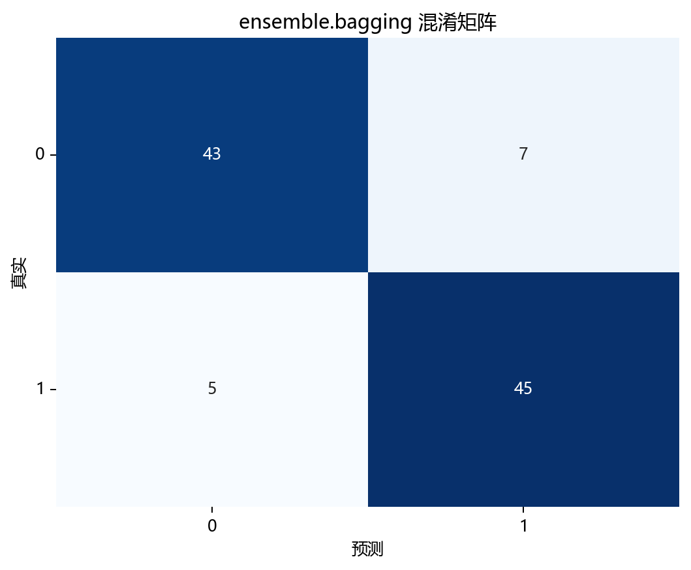

# 思路与直觉

## 本章目标

1. 用直观方式理解 Bagging 的核心思路——"找一群各执己见的专家，让他们投票决定"。
2. 理解为什么 Bagging 选择完全生长的决策树作为基学习器——高方差才有缩减空间。
3. 通过与单棵决策树和 Boosting 的对比，建立 Bagging 在集成学习谱系中的定位。

## 重点方法与概念速览

| 名称 | 类型 | 作用 |
|---|---|---|
| Bootstrap 采样 | 基础操作 | 从原始数据中有放回抽样——每个基学习器看到的数据略有不同 |
| 并行训练 | 训练方式 | $n$ 个基学习器完全独立训练——互不依赖，可并行加速 |
| 投票聚合 | 输出方式 | 分类时多数投票——每个基学习器一票，少数服从多数 |
| 方差缩减 | 核心收益 | 多个"意见不同但各有道理"的模型取平均——抵消各自的随机波动 |
| OOB 估计 | 免费诊断 | 用未参与训练的样本评估——不需要额外划分验证集 |
| 高噪声数据 | 场景设计 | `noise=0.35` 使单棵树严重过拟合——充分展示 Bagging 的平滑作用 |

## 1. 为什么需要 Bagging

单棵完全生长的决策树有一个致命弱点：**对训练数据的微小变化极其敏感**。稍微换一批训练数据，树的形状可能完全不同——这就是高方差的表现。

Bagging 的思路很直接：

> 既然一棵树太"神经质"，那就种一片森林。每棵树的训练数据略有不同，过拟合的模式也各不相同。让它们投票——各自的过拟合噪声互相抵消，剩下的就是真正的信号。

### 理解重点

- 这就像做一个重要决定前咨询多个朋友——每个人都有自己的偏见（方差），但多数人的共识往往更可靠。
- Bagging 不改变基学习器的偏差（它没有纠正错误），它只降低方差（让不同模型的错误互相抵消）。
- 因此 Bagging 的两个前提是：（1）基学习器偏差足够低（能拟合数据）；（2）基学习器之间足够不同（采样子集差异足够大）。

## 2. 用"不同老师教出的不同学生"理解 Bagging

Bagging 的工作方式可以想象成：

1. **从同一份教材中每人随机抽取一部分章节**（Bootstrap 采样——每棵树看到约 63.2% 的数据）
2. **每个人独立学习，完全不受他人影响**（并行训练——80 棵树各自 `fit`）
3. **每人学到的东西略有不同**（不同的采样子集 → 不同的决策边界）
4. **面对新问题时投票决定**（分类：80 棵树投票，多数票为最终答案）

### 理解重点

- 第一个学生可能在噪声点上纠结出极其复杂的规则——这是过拟合。
- 但 80 个学生在不同子集上纠结出的噪声规则各不相同——投票时这些噪声规则互相矛盾，自动抵消。
- 而真正的信号（两个月牙的整体形状）在所有子集中都存在——投票时信号会被放大。
- 这就是方差缩减的直觉：**噪声随机、信号一致 → 平均后噪声减弱、信号增强**。

## 3. 为什么选择完全生长的决策树

决策树的 `max_depth` 决定了它的偏差-方差特征：

- `max_depth=1`（决策树桩）：偏差极高、方差极低——Bagging 70 个树桩仍然是高偏差
- `max_depth=5`：中等偏差、中等方差——Bagging 有改善但有限
- `max_depth=None`（完全生长）：**偏差极低、方差极高**——Bagging 最受益

### 理解重点

- Bagging 只能降方差，不能降偏差——因此必须从低偏差的基学习器出发。
- 完全生长的决策树对数据极其敏感——两个 Bootstrap 子集产出的树结构可能完全不同，这正是方差缩减的前提。
- 当前源码 `max_depth=None, min_samples_split=2, min_samples_leaf=1`——每一项参数都在鼓励树"充分生长、高度敏感"。

## 4. 为什么高噪声数据最适合展示 Bagging

当前数据 `make_moons(noise=0.35)` 的噪声水平远高于常规设置：

- **低噪声**（`noise=0.1`）：单棵树的边界已经比较平滑——Bagging 的改善空间有限
- **高噪声**（`noise=0.35`）：单棵树的边界是锯齿状迷宫——严重过拟合噪声点
- Bagging 80 棵树投票后：锯齿被平滑为接近真实弯月形状的边界

### 理解重点

- Bagging 的优势在**高噪声场景下最明显**——这正是当前数据设计的意图。
- 如果数据本身就很干净，单棵树已经表现良好——Bagging 的边际收益就很小。
- 教学型数据设计刻意放大了场景差异——让读者一眼看出 Bagging 在做什么。

## 5. OOB 得分的直觉：免费的考试

每次 Bootstrap 采样后，约 36.8% 的样本没有被抽中——它们天然构成了该树的"测试集"。

- 对每个样本，找出所有"没见过它"的树，只用这些树预测它
- 这些预测的准确率就是 OOB 得分——**不需要额外划分验证集**

### 理解重点

- 这就像每个学生只学了教材的一部分，考全班时只看他没学过的那部分的得分——对泛化能力的无偏估计。
- 当前源码 `oob_score=True` 启用此功能——训练完成后 `model.oob_score_` 直接给出估计。
- OOB 得分与测试集准确率通常接近——如果差距很大，说明数据分布可能有问题。

## 6. 与 Boosting 的直觉对比

| 维度 | Bagging | Boosting |
|---|---|---|
| 核心问题 | 如何让一群"太敏感"的模型冷静下来？ | 如何让一个"太迟钝"的模型变得更聪明？ |
| 训练方式 | 平行——各学各的，最后投票 | 串行——后面的人补前面的人犯的错 |
| 基学习器 | 强学习器（完全生长树——偏差低方差高） | 弱学习器（浅层树——偏差高方差低） |
| 核心收益 | 降方差——投票平滑了过拟合的锯齿 | 降偏差——接力修正了欠拟合的粗糙 |
| 过拟合风险 | 低——并行平均天然正则化 | 较高——串行纠错可能过度追逐噪声 |
| 并行能力 | 天然可并行——各树独立训练 | 必须串行——每棵树依赖前序结果 |
| 理想场景 | 高噪声数据 + 复杂基学习器 | 中等噪声数据 + 简单基学习器 |

### 理解重点

- Bagging 和 Boosting 不是"谁更强"——Bagging 是个"过于敏感"的解决方案（降方差），Boosting 是个"过于迟钝"的解决方案（降偏差）。
- 当前高噪声双月牙数据 + 完全生长树，恰好是 Bagging 最理想、Boosting 需要小心控制的场景。

## 可视化

## 常见坑

1. 把 Bagging 当成"万能的模型增强器"——它只对高方差基学习器有效，对已低方差的模型收效甚微。
2. 以为 `n_estimators` 越多越好——边际收益递减，`n_estimators=80` 后继续增加带来的方差缩减微乎其微。
3. 忽略 Bagging 与 Boosting 在基学习器选择上的本质差异——Bagging 用强学习器，Boosting 用弱学习器。
4. 不启用 `oob_score`——放弃了免费的泛化能力估计。

## 小结

- Bagging 的直觉核心是并行集成降方差：Bootstrap 采样产生差异化的训练子集 → 并行训练多个高方差基学习器 → 投票平均使随机噪声互相抵消 → 决策边界更平滑。
- 当前高噪声双月牙数据 + 完全生长决策树 + `n_estimators=80` 是展示 Bagging 方差缩减能力的最佳教学组合。
- Bagging 与 Boosting 在直觉上截然相反：一个靠"人多势众"抵消个体偏见（降方差），一个靠"接力纠错"逐步逼近真相（降偏差）——选哪个取决于基学习器是"过于敏感"还是"过于迟钝"。
