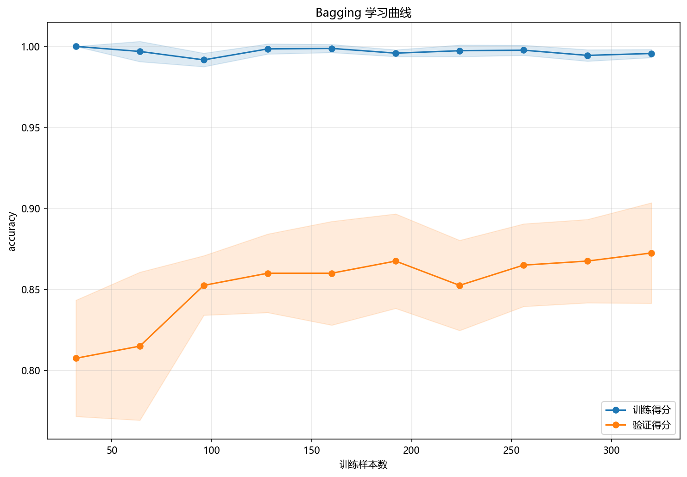
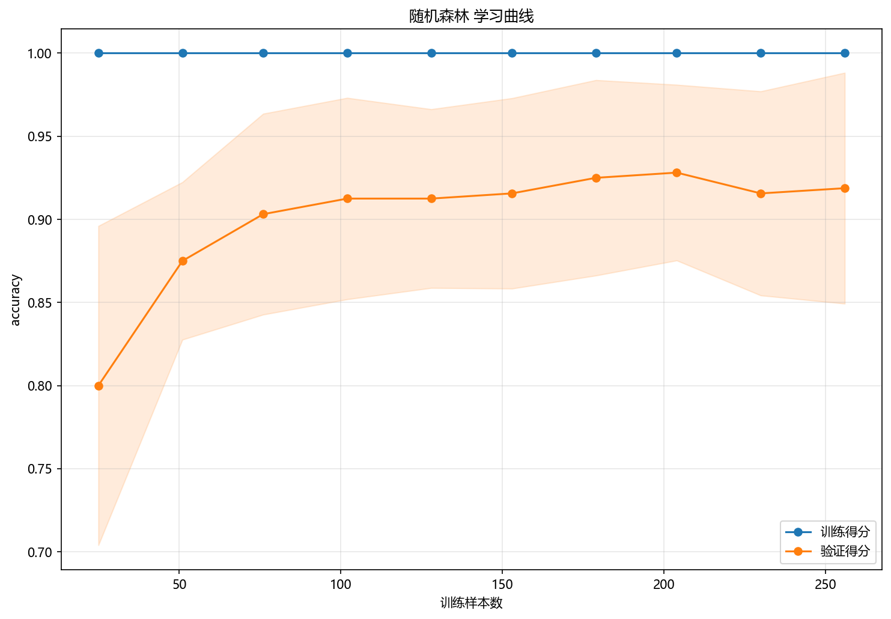

# 训练与预测

> 对应代码：`pipelines/ensemble/bagging.py`、`model_training/ensemble/bagging.py`
>  
> 运行方式：`python -m pipelines.ensemble.bagging`

## 本章目标

1. 明确当前流水线从取数到生成分类评估图的完整执行顺序。
2. 理解训练阶段、预测阶段和条件性概率输出分别由哪个函数负责。
3. 明确当前 Bagging 实现包含分层切分、标准化和 OOB 训练日志。

## 重点方法与概念速览

| 名称 | 类型 | 作用 |
|---|---|---|
| `run()` | 函数 | Bagging 端到端流水线入口 |
| `train_test_split(..., stratify=y)` | 函数 | 拆分训练集与测试集并保持类别比例 |
| `StandardScaler` | 类 | 对训练和测试特征做一致标准化 |
| `train_model(...)` | 函数 | 训练 Bagging 分类模型 |
| `model.predict(X_test_s)` | 方法 | 输出预测类别 |
| `model.predict_proba(X_test_s)` | 方法 | 在可用时输出分类概率 |

## 1. 端到端入口 `run()`

### 参数速览（本节）

适用函数：`run()`

| 项目 | 当前实现 |
|---|---|
| 数据源 | `bagging_data.copy()` |
| 标签列 | `label` |
| 切分方式 | `test_size=0.2, random_state=42, stratify=y` |
| 训练入口 | `train_model(X_train_s, y_train)` |
| 预测入口 | `model.predict(X_test_s)` |
| 概率入口 | 条件性 `model.predict_proba(X_test_s)` |
| 可视化入口 | 混淆矩阵 + 条件性 ROC 曲线 |

### 示例代码

```python
def run():
    data = bagging_data.copy()
    X = data.drop(columns=["label"])
    y = data["label"]
```

### 理解重点

- 整个分册的运行入口就是 `pipelines/ensemble/bagging.py` 里的 `run()`。
- 这个函数不负责实现 Bootstrap 重采样或并行投票本身，而是把取数、标准化、训练、预测和评估图输出串成一条流程。
- 当前分册的工程重点不在复杂图表数量，而在 OOB 与分类输出边界的说明。

## 2. 训练前的数据准备顺序

### 参数速览（本节）

适用 API（分项）：

1. `train_test_split(X, y, test_size=0.2, random_state=42, stratify=y)`
2. `StandardScaler().fit_transform(X_train)`
3. `StandardScaler().transform(X_test)`

| 参数名 | 本例取值 | 说明 |
|---|---|---|
| `test_size` | `0.2` | 测试集占比 |
| `random_state` | `42` | 保证可复现划分 |
| `stratify` | `y` | 保持训练集和测试集类别比例一致 |
| `X_train_s` | 标准化训练特征 | 供 Bagging 训练使用 |
| `X_test_s` | 标准化测试特征 | 供 Bagging 预测使用 |

### 示例代码

```python
X_train, X_test, y_train, y_test = train_test_split(
    X, y, test_size=0.2, random_state=42, stratify=y
)
scaler = StandardScaler()
X_train_s = scaler.fit_transform(X_train)
X_test_s = scaler.transform(X_test)
```

### 理解重点

- 当前 Bagging 流水线真实包含标准化步骤，文档必须如实写清楚。
- `stratify=y` 对二分类任务依然重要，它能让测试集类别比例更稳定。
- 当前文档中的 `X_train_s`、`X_test_s` 都是源码里真实使用的变量名。

## 3. 训练阶段：调用 `train_model(...)`

### 参数速览（本节）

适用函数：`train_model(X_train_s, y_train)`

| 参数名 | 本例取值 | 说明 |
|---|---|---|
| `X_train_s` | 标准化后的训练特征 | 当前直接传入 Bagging 训练函数 |
| `y_train` | 训练标签 | 二分类目标 |
| 返回值 | `model` | 已训练好的 `BaggingClassifier` 模型 |

### 示例代码

```python
model = train_model(X_train_s, y_train)
```

### 理解重点

- 当前实现没有把训练和预测揉成同一个函数，而是先得到训练好的模型，再单独调用 `predict(...)`。
- 训练阶段最重要的副产物，不只是 `model` 对象，还有控制台里打印的采样配置和 `OOB 得分`。
- 这些日志帮助你确认当前 Bagging 配置到底是什么，以及袋外估计情况如何。

## 4. 预测阶段：类别输出与条件性概率输出

### 参数速览（本节）

适用流程（分项）：

1. `y_pred = model.predict(X_test_s)`
2. 条件性 `y_scores = model.predict_proba(X_test_s)`

| 参数名 | 本例取值 | 说明 |
|---|---|---|
| `y_pred` | 预测类别数组 | 用于混淆矩阵 |
| `y_scores` | 预测概率矩阵 | 仅在模型支持概率输出时用于 ROC 曲线 |
| `X_test_s` | 标准化后的测试特征 | 与训练时保持一致预处理 |

### 示例代码

```python
y_pred = model.predict(X_test_s)

if hasattr(model, "predict_proba"):
    y_scores = model.predict_proba(X_test_s)
```

### 理解重点

- `predict(...)` 给出最终类别判断，用于混淆矩阵。
- `predict_proba(...)` 在当前实现里是条件性使用的，这意味着 ROC 曲线也不是无条件保证输出。
- 文档必须如实写明这一点，不能机械套用其他分类分册的固定流程。

## 5. 预测后的图像输出

### 参数速览（本节）

适用函数（分项）：

1. `plot_confusion_matrix(...)`
2. 条件性 `plot_roc_curve(...)`

| 函数 | 当前作用 |
|---|---|
| `plot_confusion_matrix(...)` | 看类别预测混淆情况 |
| `plot_roc_curve(...)` | 在概率输出存在时看区分能力 |

### 示例代码

```python
plot_confusion_matrix(
    y_test,
    y_pred,
    title="Bagging 混淆矩阵",
    dataset_name=DATASET,
    model_name=MODEL,
)

if hasattr(model, "predict_proba"):
    plot_roc_curve(...)
```

### 理解重点

- 当前 Bagging 分册默认一定会输出混淆矩阵。
- ROC 曲线则依赖模型是否提供概率输出，因此属于条件性结果。
- 这也是当前分册在工程实现上区别于 GBDT / LightGBM 的一个小但重要的细节。

## 6. 用伪代码看完整流程

### 示例代码

```python
data = bagging_data.copy()
X = data.drop(columns=["label"])
y = data["label"]

X_train, X_test, y_train, y_test = train_test_split(..., stratify=y)
X_train_s = scaler.fit_transform(X_train)
X_test_s = scaler.transform(X_test)

model = train_model(X_train_s, y_train)
y_pred = model.predict(X_test_s)

plot_confusion_matrix(...)
if hasattr(model, "predict_proba"):
    plot_roc_curve(...)
```

### 理解重点

- 当前 Bagging 流水线的主线非常清楚：取数、分层切分、标准化、训练、预测类别、条件性概率预测、输出分类图。
- 这条链路里最关键的中间变量是训练后的 `model`、预测类别 `y_pred` 和可选的 `y_scores`。
- 只要把这条流程走清楚，整个 bagging 分册的工程部分就基本读懂了。

## 训练诊断可视化




## 常见坑

1. 把 Bagging 当前流程误写成 boosting 流程，忽略它其实是并行集成。\n+2. 把 ROC 曲线误写成固定输出，忽略当前源码里它是条件性生成。\n+3. 只看测试集图像，不看训练日志里的 `OOB 得分`，错过当前实现最有代表性的工程信号。

## 小结

- 当前流水线把数据准备、Bagging 训练、类别预测和分类评估图输出串成了一条完整路径。
- 训练函数负责“得到 Bagging 分类模型”，流水线函数负责“组织执行和产出结果”。
- 把这一层执行顺序读清楚，后续看评估与工程实现章节就会更顺。
