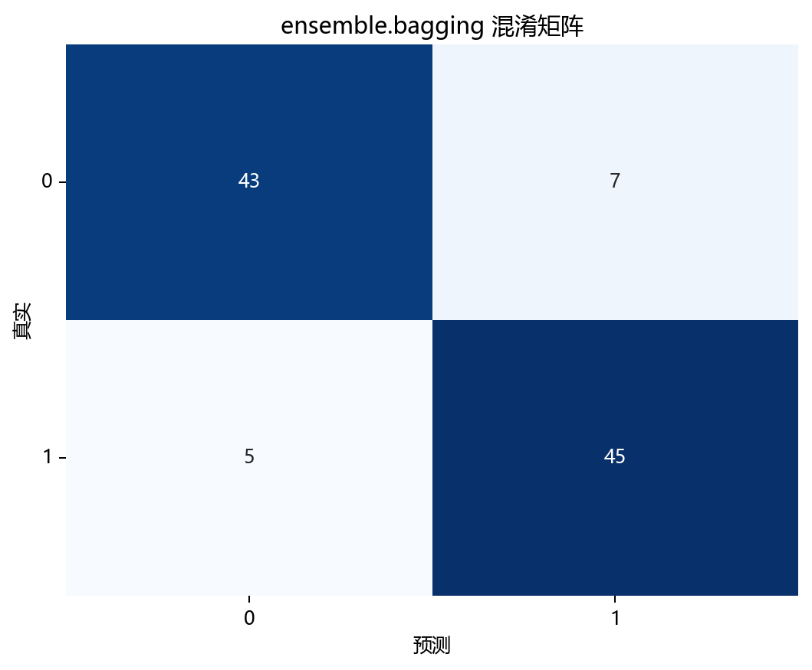
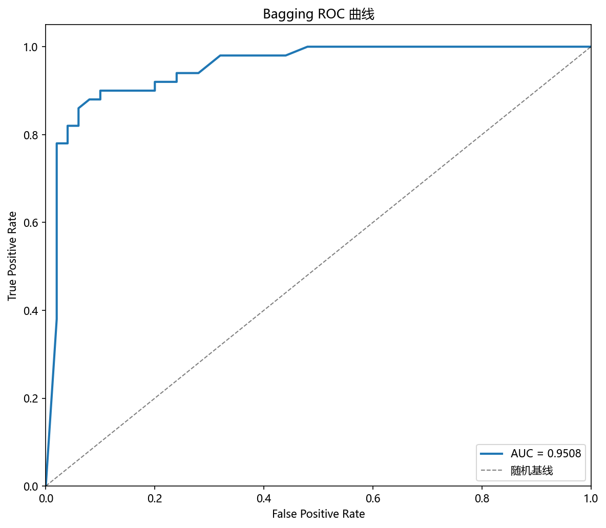
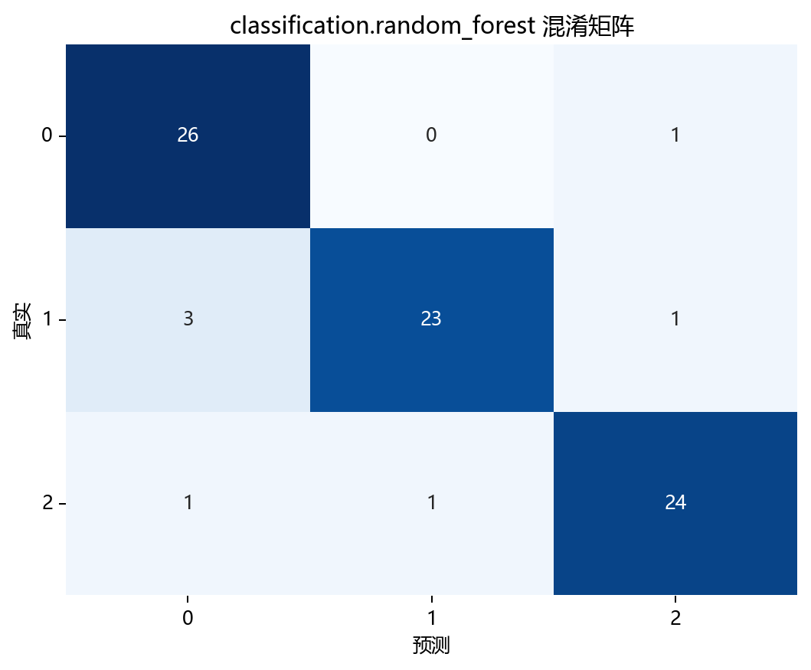
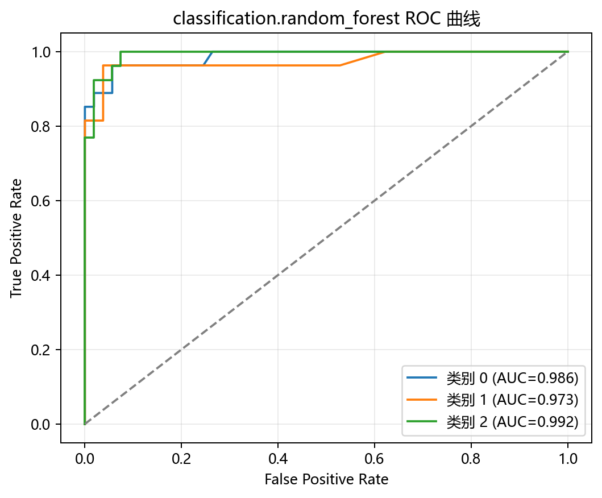
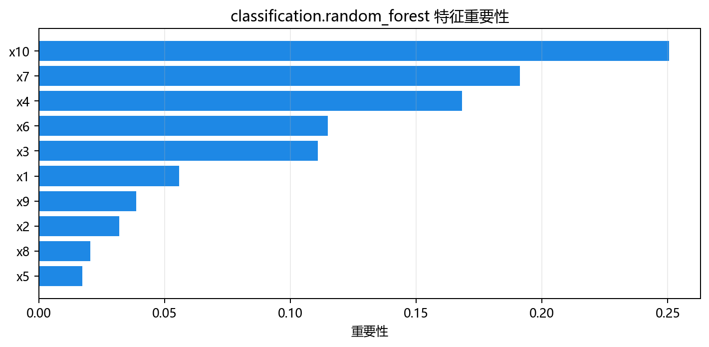

# 评估与诊断

> 对应代码：`pipelines/ensemble/bagging.py`、`result_visualization/confusion_matrix.py`、`result_visualization/roc_curve.py`、`model_training/ensemble/bagging.py`
>  
> 相关对象：`plot_confusion_matrix(...)`、`plot_roc_curve(...)`、`model.oob_score_`

## 本章目标

1. 明确当前仓库实际使用了哪些评估手段，而不是泛泛讨论所有分类指标。
2. 理解混淆矩阵、条件性 ROC 曲线和 OOB 得分分别能帮助我们诊断什么。
3. 明确当前实现没有做哪些数值指标与图像输出，以免误读源码能力边界。

## 重点方法与概念速览

| 名称 | 类型 | 作用 |
|---|---|---|
| `plot_confusion_matrix(...)` | 函数 | 生成分类混淆矩阵图 |
| `plot_roc_curve(...)` | 函数 | 在概率输出可用时生成 ROC 曲线图 |
| `model.oob_score_` | 属性 | 训练阶段基于袋外样本得到的参考得分 |
| `y_pred` / `y_scores` | 预测输出 | 当前 Bagging 的类别和可选概率结果 |

## 1. 当前实现真正做了什么评估

### 参数速览（本节）

适用评估手段（本节）：

1. 混淆矩阵
2. 条件性 ROC 曲线
3. OOB 得分日志

| 评估方式 | 来源 | 用途 |
|---|---|---|
| 混淆矩阵 | `plot_confusion_matrix(...)` | 观察二分类预测错误结构 |
| ROC 曲线 | `plot_roc_curve(...)` | 在概率输出存在时观察区分能力 |
| OOB 得分 | `model.oob_score_` | 观察袋外样本上的额外参考表现 |

### 理解重点

- 当前 Bagging 流水线没有显式打印 accuracy、precision、recall、F1、AUC 等数值指标。
- 这并不表示这些指标不重要，而是说明本仓库当前实现更强调混淆矩阵、条件性 ROC 和 OOB 日志。
- 因此阅读这一分册时，不能把“指标表格”想成已经在源码里实现的内容。

## 2. 混淆矩阵是怎么生成的

### 参数速览（本节）

适用函数：`plot_confusion_matrix(y_true, y_pred, title=..., dataset_name=..., model_name=...)`

| 参数名 | 本例取值 | 说明 |
|---|---|---|
| `y_true` | `y_test` | 测试集真实类别 |
| `y_pred` | 预测类别 | 模型对测试集的离散输出 |
| `dataset_name` | `"bagging"` | 输出目录名 |
| `model_name` | `"bagging"` | 输出文件名前缀 |

### 示例代码

```python
plot_confusion_matrix(
    y_test,
    y_pred,
    title="Bagging 混淆矩阵",
    dataset_name=DATASET,
    model_name=MODEL,
)
```

### 理解重点

- 混淆矩阵最适合看“正负类分别错在哪里”。
- 对当前二分类任务来说，它比单个准确率更容易暴露具体错误结构。
- 这也是为什么当前分册把它作为固定输出的第一类评估图。

## 3. ROC 曲线为什么是条件性输出

### 参数速览（本节）

适用代码：

1. `hasattr(model, "predict_proba")`
2. `model.predict_proba(X_test_s)`

| 条件 | 当前含义 |
|---|---|
| 模型支持 `predict_proba` | 才绘制 ROC 曲线 |
| 不支持 `predict_proba` | 当前流程不会输出 ROC 曲线 |

### 示例代码

```python
if hasattr(model, "predict_proba"):
    y_scores = model.predict_proba(X_test_s)
    plot_roc_curve(...)
```

### 理解重点

- 当前 ROC 曲线并不是无条件固定输出，而是依赖模型是否提供概率预测接口。
- 当前 BaggingClassifier 配合决策树基学习器时通常支持 `predict_proba`，所以当前实现一般能画出这张图。
- 但文档必须如实写清这是条件性逻辑，而不是硬编码保证。

## 4. OOB 得分在当前实现里表示什么

### 参数速览（本节）

适用属性：`model.oob_score_`

| 属性名 | 当前含义 |
|---|---|
| `oob_score_` | 用袋外样本估计得到的额外参考得分 |

### 示例代码

```python
if oob_score:
    print(f"OOB 得分: {model.oob_score_:.4f}")
```

### 理解重点

- OOB 得分是当前 Bagging 分册最有代表性的工程输出之一。
- 它来自 Bootstrap 采样后“未被某棵基学习器看到”的样本，而不是显式额外切出来的验证集。
- 这使它在教学上很有价值，但也不能被误写成完整测试集指标的替代物。

## 5. 看三类评估信息时重点观察什么

### 参数速览（本节）

适用观察点（本节）：

1. 错误结构
2. 概率区分能力
3. OOB 与测试表现是否大致一致

| 评估信息 | 重点观察什么 |
|---|---|
| 混淆矩阵 | 哪一类更容易被分错 |
| ROC 曲线 | 模型概率排序能力如何 |
| OOB 得分 | 袋外参考表现是否合理 |

### 理解重点

- 混淆矩阵帮助你理解“分错在哪里”。
- ROC 曲线帮助你理解“概率输出有没有区分力”。
- OOB 得分帮助你理解“Bagging 在训练阶段能否给出一个额外参考估计”。
- 只有把这三条线索结合起来，才能更完整理解当前 Bagging 实现。

## 6. 当前实现没有做什么

### 参数速览（本节）

当前源码未包含的内容：

1. 显式数值指标打印
2. 学习曲线
3. 特征重要性图
4. 决策边界图

| 未实现项 | 当前状态 |
|---|---|
| accuracy / precision / recall / F1 / AUC 打印 | 未在流水线中出现 |
| 学习曲线 | 当前流程未调用相关函数 |
| 特征重要性图 | 当前流程未调用相关函数 |
| 决策边界可视化 | 当前流程未调用相关函数 |

### 理解重点

- 评估章节必须以源码为准，不能把“Bagging 常见分析手段”写成“当前仓库已经实现”。
- 当前实现的评估重点是混淆矩阵、条件性 ROC 和 OOB 日志，而不是更多分类图表或数值面板。
- 如果后续扩展这部分，最自然的方向是补数值指标打印、决策边界图或更直接的 OOB / test 对比输出。

## 评估图表







## 常见坑

1. 只看测试集图像，不看 `OOB 得分`，错过当前分册最有代表性的工程信号。
2. 把 ROC 曲线误写成固定输出，忽略它在当前代码里是条件性生成。
3. 误以为当前流水线已经输出了 accuracy / AUC 指标表或更多图像，实际源码并没有这些步骤。

## 小结

- 当前 Bagging 的评估主线由三部分组成：混淆矩阵、条件性 ROC 曲线和 OOB 得分。
- 它们分别从错误结构、概率区分能力和袋外参考估计三个角度解释模型表现。
- 只有把这三条线索一起看，才能更完整地理解当前实现的表现。
