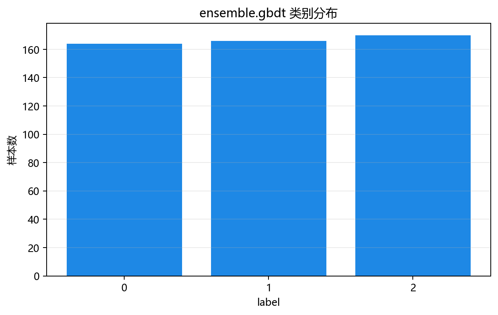
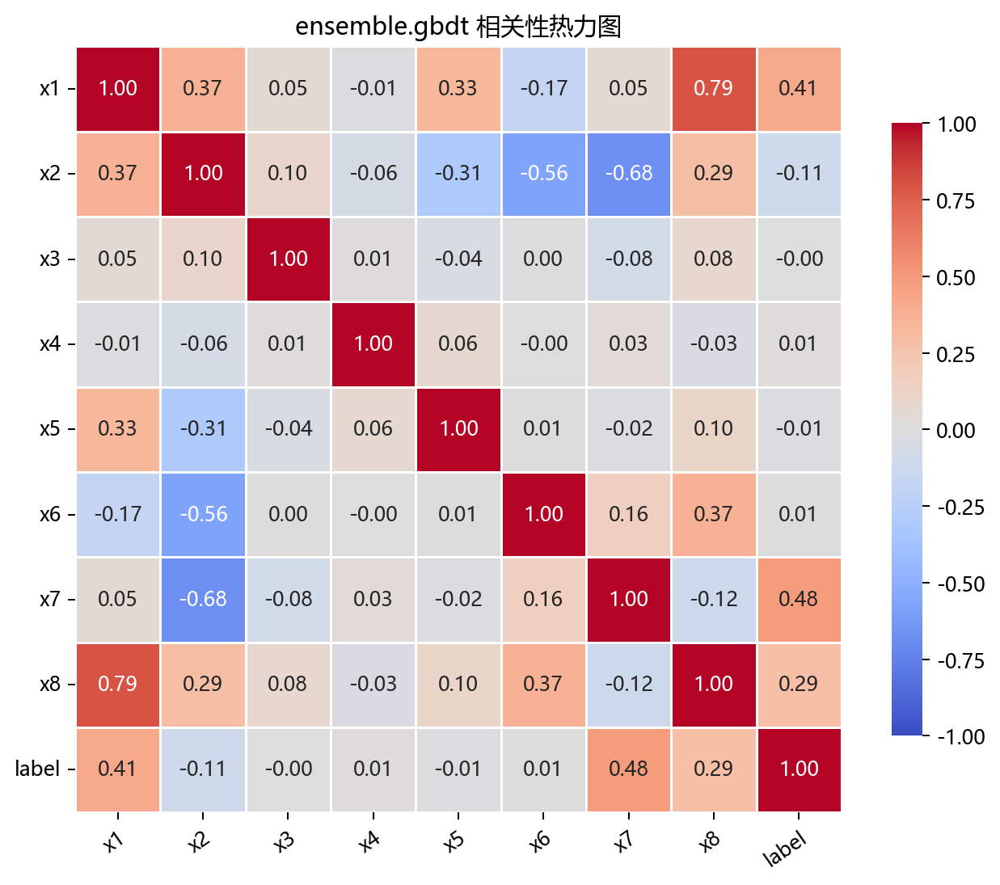

# 数据构成

## 本章目标

1. 明确本仓库 GBDT 数据来自 `EnsembleData.gbdt()` 构造的多类别分类数据。
2. 理解为什么选择 8 特征 × 3 类别的数据——中等复杂度，充分展示 GBDT 串行纠错的偏差缩减能力。
3. 明确当前流程中的训练/测试切分（分层抽样）和标准化顺序。

## 重点方法与概念速览

| 名称 | 类型 | 作用 |
|---|---|---|
| `EnsembleData.gbdt()` | 方法 | 生成 GBDT 使用的多类别分类数据 |
| `make_classification(...)` | 函数 | scikit-learn 提供的合成分类数据生成器 |
| `gbdt_data` | 变量 | 在 `data_generation/__init__.py` 中导出的 DataFrame |
| `gbdt_n_informative` | 参数 | 有效特征数 `4`——8 个特征中 4 个携带分类信号 |
| `gbdt_n_redundant` | 参数 | 冗余特征数 `2`——通过线性组合从有效特征生成 |
| `StandardScaler` | 类 | 对特征做 Z-score 标准化——训练集拟合、测试集变换 |

## 1. 数据生成：`EnsembleData.gbdt()`

当前 GBDT 数据来自 `EnsembleData.gbdt()`，底层调用 `sklearn.datasets.make_classification()`。

### 参数速览

适用函数：`make_classification(n_samples=500, n_features=8, n_informative=4, n_redundant=2, n_classes=3, class_sep=0.7, random_state=42)`

| 参数名 | 类型 | 说明 | 示例取值 |
|---|---|---|---|
| `n_samples` | `int` | 总样本数。默认 `500`——适中规模，200 个 GBDT 弱学习器可在秒级完成串行训练 | `500`、`1000` |
| `n_features` | `int` | 总特征数。`8`——中等维度，提供足够的特征空间让 GBDT 展示特征选择能力 | `8`、`20` |
| `n_informative` | `int` | 有效特征数。`4`——只有一半特征携带真正的分类信号 | `4`、`8` |
| `n_redundant` | `int` | 冗余特征数。`2`——通过有效特征的线性组合生成 | `2`、`5` |
| `n_classes` | `int` | 类别数。`3`——多分类场景，比二分类更能展示 GBDT 的拟合能力 | `2`、`3`、`4` |
| `class_sep` | `float` | 类别间隔。`0.7`——中等难度，不是完全分离也不是严重重叠 | `0.5`、`0.7`、`1.0` |
| `random_state` | `int` | 随机种子，保证数据可复现。默认 `42` | `42` |
| 返回值 | `(ndarray, ndarray)` | `(X, y)` 元组，$X$ 形状 $(500, 8)$，$y$ 取值 $\{0, 1, 2\}$ | — |

### 示例代码

```python
X, y = make_classification(
    n_samples=500,
    n_features=8,
    n_informative=4,
    n_redundant=2,
    n_classes=3,
    class_sep=0.7,
    random_state=42,
)
data = DataFrame(X, columns=[f"x{i+1}" for i in range(8)])
data["label"] = y
```

### 理解重点

- 8 个特征中只有 4 个（`x1`~`x4`）携带真正的分类信号——剩余 4 个（`x5`~`x8`）是冗余或噪声特征。这为 GBDT 的特征重要性评估提供了有意义的测试场景。
- `class_sep=0.7` 是中等难度——类别有一定重叠但并非不可分。GBDT 的串行纠错能力在这种"中等混沌"中优势明显。
- 与 Bagging 的 `make_moons(noise=0.35)` 对比：Bagging 用 2 特征二分类高噪声数据展示降方差，GBDT 用 8 特征三分类中等难度数据展示降偏差。

## 2. 特征列与标签列

### 参数速览

| 参数名 | 类型 | 说明 | 示例取值 |
|---|---|---|---|
| `X` | `DataFrame`，形状 $(500, 8)$ | 含 8 个连续特征的特征矩阵，列名 `x1`~`x8` | `data.drop(columns=["label"])` |
| `y` | `Series`，形状 $(500,)$ | 三分类标签 $\{0, 1, 2\}$——参与 GBDT 训练和评估 | `data["label"]` |

### 特征一览

| 列名 | 特征类型 | 说明 |
|---|---|---|
| `x1`~`x4` | 有效特征（informative） | 携带分类信号——GBDT 特征重要性应对这 4 列给出较高值 |
| `x5`~`x6` | 冗余特征（redundant） | 由有效特征线性组合生成——重要性应低于 `x1`~`x4` |
| `x7`~`x8` | 噪声特征（noise） | 纯随机噪声——重要性应接近零 |
| `label` | 标签列 | 取值 $\{0, 1, 2\}$，三分类监督信号 |

### 示例代码

```python
X = data.drop(columns=["label"])
y = data["label"]
feature_names = list(X.columns)  # ['x1', 'x2', 'x3', 'x4', 'x5', 'x6', 'x7', 'x8']
```

### 理解重点

- `label` 是三分类监督标签——取值 $\{0, 1, 2\}$，参与 `model.fit()`、`model.predict()` 和混淆矩阵/ROC 评估。
- `feature_names` 在 GBDT 流水线中被显式提取——用于后续特征重要性图表的 x 轴标注。这是 Bagging 流水线中没有的步骤。
- 有效/冗余/噪声的三层特征结构是教学设计的亮点——它让特征重要性图表的解读有了"正确答案"做参照。

## 3. 训练/测试切分与标准化

### 参数速览

适用 API：`train_test_split(X, y, test_size=0.2, random_state=42, stratify=y)`

| 参数名 | 类型 | 说明 | 示例取值 |
|---|---|---|---|
| `X` | `DataFrame`，形状 $(500, 8)$ | 全量特征矩阵 | `X` |
| `y` | `Series`，形状 $(500,)$ | 全量标签 $\{0, 1, 2\}$ | `y` |
| `test_size` | `float` | 测试集比例。默认 `0.2` | `0.2`、`0.3` |
| `stratify` | `array_like` | 分层抽样依据——确保训练/测试集中三个类别的比例一致 | `y` |
| `random_state` | `int` | 随机种子。默认 `42` | `42` |
| 返回值 | `(DataFrame, DataFrame, Series, Series)` | `X_train`（400 样本）、`X_test`（100 样本）及对应标签 | — |

### 示例代码

```python
X_train, X_test, y_train, y_test = train_test_split(
    X, y, test_size=0.2, random_state=42, stratify=y
)

scaler = StandardScaler()
X_train_s = scaler.fit_transform(X_train)
X_test_s = scaler.transform(X_test)
```

### 理解重点

- `stratify=y` 确保三个类别在训练/测试集中比例一致——对于三分类数据，这避免了某个类别在测试集中完全缺失。
- 标准化采用监督学习的标准做法：`fit_transform` 在训练集上计算 $\mu$ 和 $\sigma$，`transform` 在测试集上使用相同统计量——防止测试集信息泄露。
- 与 Bagging 的差异：GBDT 有 8 个特征（而非 2 个），标准化对 GBDT 来说也非必需（决策树不受尺度影响），但保留是为了流水线一致性。

## 数据可视化





## 常见坑

1. 把 GBDT 的多分类数据当成"越复杂越好"——3 分类 + 中等间隔是教学平衡选择，过高的复杂度会掩盖算法特性。
2. 忽略特征的三层结构（有效/冗余/噪声）——这是理解特征重要性图表的"标准答案"。
3. 在测试集上 `fit_transform` 而非 `transform`——这是数据泄露的典型错误。
4. 认为 GBDT 不需要 `stratify=y`——多分类比二分类更容易出现类别不平衡问题，分层抽样更重要。

## 小结

- 当前 GBDT 数据来自 `make_classification(n_samples=500, n_features=8, n_informative=4, n_classes=3)`：8 个连续特征（4 有效 + 2 冗余 + 2 噪声）、三分类、中等难度。
- 数据流为：`make_classification` → DataFrame（`x1`~`x8` + `label`）→ 分层训练/测试切分 → 训练集拟合标准化器 / 测试集变换。
- 特征的三层结构（有效/冗余/噪声）为 GBDT 独有的特征重要性评估提供了"有标准答案"的验证场景。
