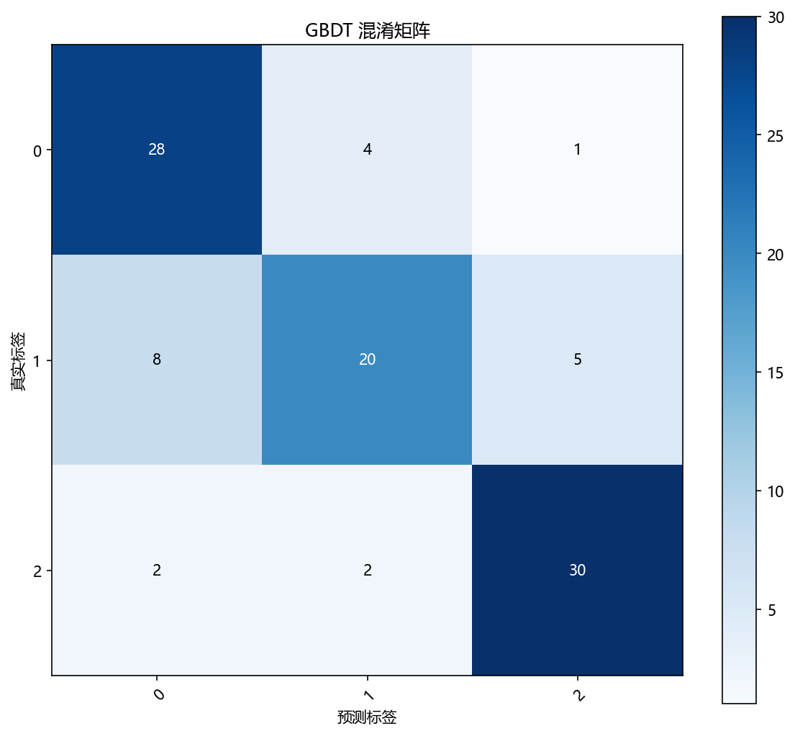
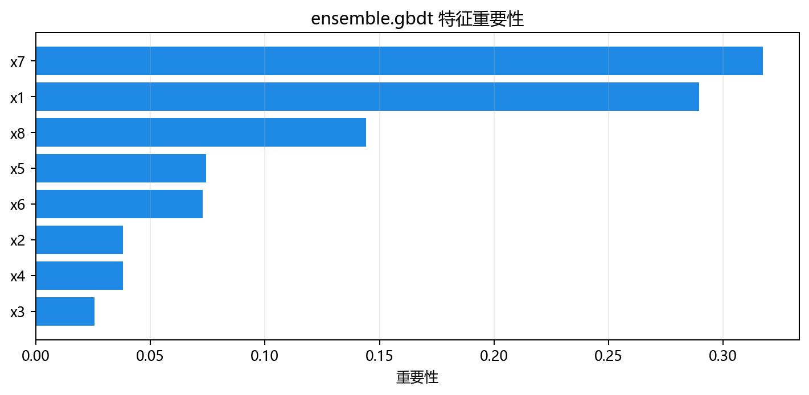

# 思路与直觉

## 本章目标

1. 用直观方式理解 GBDT 的核心思路——"每个新成员专注于修正前人犯的错误"。
2. 理解为什么 GBDT 选择浅层决策树作为基学习器——弱学习器才有偏差可降。
3. 通过与 Bagging 和单棵决策树的对比，建立 GBDT 在集成学习谱系中的定位。

## 重点方法与概念速览

| 名称 | 类型 | 作用 |
|---|---|---|
| 串行纠错 | 训练方式 | 第 $m$ 棵树不看原始标签——它看的是前 $m-1$ 棵树"还剩多少没学好" |
| 梯度下降在函数空间 | 核心直觉 | 每棵树朝着损失下降最快的方向迈一小步——学习率控制步长 |
| 弱学习器 | 基学习器选择 | `max_depth=3` 的浅层树——单棵很弱，但串行累加后变强 |
| 偏差缩减 | 核心收益 | 每棵新树修正前序集成犯的错——步步逼近真实函数 |
| 学习率收缩 | 正则化直觉 | 每次只修正一点点——宁可慢，不可过 |
| 特征重要性 | 附加收益 | 基于分裂增益自动排序——知道哪些特征"说了算" |

## 1. 为什么需要 GBDT

单棵浅层决策树（`max_depth=3`）有一个天生缺陷：**太粗糙**。只分裂 3 次，最多 8 个叶子节点——复杂边界根本拟合不出来。这是高偏差。

直接加深树（`max_depth=None`）可以降低偏差——但方差会急剧上升（对数据微小变化极其敏感）。

GBDT 的思路很优雅：

> 既然一棵浅树太笨，那就让一群浅树接力。第一棵树粗糙拟合，第二棵树专修第一棵树的错误，第三棵树再修前两棵的错误——每棵树只学一点点，200 棵树累加起来，粗糙变精细。

### 理解重点

- 这就像用粗砂纸 → 中砂纸 → 细砂纸逐步打磨——每一遍只磨掉一点，最终表面极其光滑。
- GBDT 不降低方差（浅层树本身方差就不高），它只降低偏差——让粗糙的浅层树串行累加成精细的强模型。
- 因此 GBDT 的前提是：（1）基学习器偏差高但方差低（浅层树）；（2）串行训练每步只修正一点点（学习率控制步长）。

## 2. 用"接力打磨"理解 GBDT

GBDT 的工作方式可以想象成：

1. **第一个人粗略画轮廓**——第一棵树 `fit(X, y)`，只分裂 3 次，得到一个粗糙的分界面
2. **第二个人看残差**——第二棵树不看原始标签，而是看"第一个人哪里画得不够好"（残差 = 真实标签 - 当前预测概率）
3. **只修正一点点**——学习率 `0.1` 意味着只修正残差的 10%，避免修正过头
4. **重复 200 次**——200 棵树串行累加，最初的粗糙轮廓逐渐精确

### 理解重点

- 第一个人（第一棵树）可能只对了 60%——非常粗糙。
- 第二个人针对第一人犯的错修正——可能提高 5%。
- 第三个人再修正前两人遗留的错——可能提高 3%。
- 边际收益递减——第 200 棵树的贡献远小于第 2 棵。但累加起来，精度显著提升。
- 这就是偏差缩减的直觉：**粗糙轮廓 + 逐步精细化 = 最终精确边界**。

## 3. 为什么选择浅层决策树

GBDT 对基学习器的要求与 Bagging 相反：

- `max_depth=None`（完全生长）：**低偏差高方差**——单棵已经很好，串行累加无偏差可降，还可能过拟合
- `max_depth=3`（浅层树）：**高偏差低方差**——单棵很粗糙，但每次只修正一点点，200 次累加后极为精细
- `max_depth=1`（决策树桩）：偏差更高——需要更多树才能达到同等精度

### 理解重点

- GBDT 只能降偏差，不能降方差——因此必须从高偏差的基学习器出发。
- 浅层树对数据不敏感——两个不同子集产出的树结构相似，单个树方差很低。这正是 GBDT 需要的——方差不需要再降。
- 当前源码 `max_depth=3`——每一项参数都在鼓励树"浅尝辄止"，以高偏差换取低方差。

## 4. 学习率收缩的直觉：小步快跑

学习率 $\nu = 0.1$ 意味着每棵树只贡献其完整输出的 10%。

- $\nu = 1.0$：每棵树全力修正——容易修正过头（过拟合）
- $\nu = 0.1$：每棵树只修正 10%——需要更多树，但泛化更好
- $\nu = 0.01$：每棵树只修正 1%——需要大量树，训练更慢但可能泛化更好

### 理解重点

- 学习率是 GBDT 最重要的正则化手段——它控制"每一步迈多大"。
- `n_estimators=200` + `learning_rate=0.1` 是经典组合——总共 200 步，每步迈 0.1，总修正量可控。
- 这就像下坡——大步可能迈过头摔跤（过拟合），小步虽然慢但稳（泛化好）。

## 5. 与 Bagging 的直觉对比

| 维度 | Bagging | GBDT |
|---|---|---|
| 核心问题 | 如何让一群"太敏感"的专家冷静下来？ | 如何让一群"太迟钝"的新手变得聪明？ |
| 训练方式 | 平行——各学各的，最后投票 | 串行——后面的人补前面的人犯的错 |
| 基学习器 | 强学习器（完全生长树——偏差低方差高） | 弱学习器（浅层树 `max_depth=3`——偏差高方差低） |
| 核心收益 | 降方差——投票平滑了过拟合的锯齿 | 降偏差——接力修正了欠拟合的粗糙 |
| 过拟合风险 | 低——并行平均天然正则化 | 较高——串行纠错可能过度追逐噪声 |
| 并行能力 | 天然可并行——各树独立训练 | 必须串行——每棵树依赖前序结果 |
| 诊断工具 | OOB 得分（免费泛化估计） | 特征重要性 + 学习曲线 |
| 理想场景 | 高噪声数据 + 复杂基学习器 | 中等复杂度数据 + 简单基学习器 |

### 理解重点

- Bagging 和 GBDT 不是"谁更强"——Bagging 是针对"过敏感"的方差药方，GBDT 是针对"过迟钝"的偏差药方。
- 当前多类别中等难度数据（8 特征 × 3 类）+ 浅层树 `max_depth=3`，恰好是 GBDT 最理想、Bagging 难以发挥的场景（Bagging 需要完全生长树做基学习器）。

## 6. 特征重要性的直觉：谁在真正做决策

GBDT 训练完成后，`feature_importances_` 自动计算每个特征的重要性。

- 重要性的计算基于**分裂增益**——一个特征在 200 棵树中被用作分裂点的次数越多、每次分裂带来的损失降低越大，特征越重要。
- 当前数据有 4 个有效特征（`x1`~`x4`）、2 个冗余特征（`x5`~`x6`）、2 个噪声特征（`x7`~`x8`）。

### 理解重点

- 一个好的 GBDT 模型，`x1`~`x4` 的特征重要性应该显著高于 `x5`~`x8`。
- 特征重要性是 GBDT 的"自动特征选择"能力——不需要手动筛选特征，直接看重要性柱状图。
- Bagging 也有 `feature_importances_`（如果基学习器支持），但通常不如 GBDT 的稳定——因为 GBDT 的特征重要性来自 200 次有序选择，而非 80 次随机采样。

## 可视化

## 常见坑

1. 把 GBDT 当成"万能增强器"——它只对高偏差基学习器有效，对已低偏差的模型收效甚微。
2. 以为 `n_estimators` 越多越好——学习率固定时过多树会过拟合，应配合学习曲线判断。
3. 忽略 GBDT 与 Bagging 在基学习器选择上的本质差异——GBDT 用弱学习器（`max_depth=3`），Bagging 用强学习器（`max_depth=None`）。
4. 把学习率设得过大（$\nu = 1.0$）——失去了收缩正则化效果。

## 小结

- GBDT 的直觉核心是串行集成降偏差：浅层树粗糙拟合 → 计算残差（负梯度） → 下一棵树拟合残差 → 学习率控制修正幅度 → 200 次接力后粗糙变精细。
- 当前 8 特征三分类数据 + 浅层树 `max_depth=3` + `n_estimators=200` + `learning_rate=0.1` 是展示 GBDT 偏差缩减能力的最佳教学组合。
- GBDT 与 Bagging 在直觉上截然相反：一个靠串行接力把粗糙变精细（降偏差），一个靠并行投票把敏感变稳定（降方差）——选哪个取决于基学习器是"过于迟钝"还是"过于敏感"。
