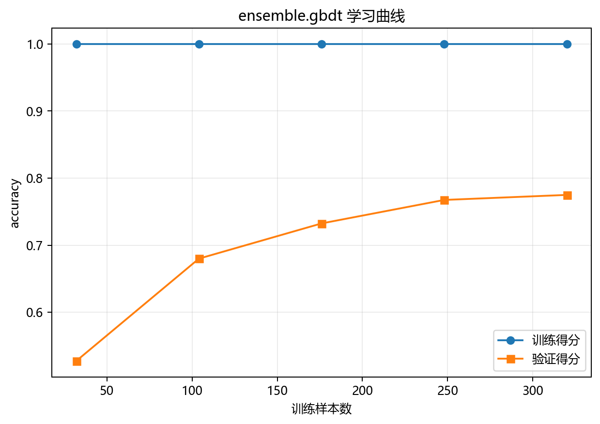

# 训练与预测

> 对应代码：`pipelines/ensemble/gbdt.py`、`model_training/ensemble/gbdt.py`
>  
> 运行方式：`python -m pipelines.ensemble.gbdt`

## 本章目标

1. 明确当前流水线从取数到生成四类图像的完整执行顺序。
2. 理解训练阶段、预测阶段、概率输出和四类可视化分别由哪个函数负责。
3. 明确当前 GBDT 实现包含分层切分、标准化和学习曲线。

## 重点方法与概念速览

| 名称 | 类型 | 作用 |
|---|---|---|
| `run()` | 函数 | GBDT 端到端流水线入口 |
| `train_test_split(..., stratify=y)` | 函数 | 拆分训练集与测试集并保持类别比例 |
| `StandardScaler` | 类 | 对训练和测试特征做一致标准化 |
| `train_model(...)` | 函数 | 训练 GBDT 分类模型 |
| `model.predict(X_test_s)` | 方法 | 输出预测类别 |
| `model.predict_proba(X_test_s)` | 方法 | 输出分类概率 |

## 1. 端到端入口 `run()`

### 参数速览（本节）

适用函数：`run()`

| 项目 | 当前实现 |
|---|---|
| 数据源 | `gbdt_data.copy()` |
| 标签列 | `label` |
| 切分方式 | `test_size=0.2, random_state=42, stratify=y` |
| 训练入口 | `train_model(X_train_s, y_train)` |
| 预测入口 | `model.predict(X_test_s)` |
| 概率入口 | `model.predict_proba(X_test_s)` |
| 可视化入口 | 混淆矩阵、ROC 曲线、特征重要性图、学习曲线 |

### 示例代码

```python
def run():
    data = gbdt_data.copy()
    X = data.drop(columns=["label"])
    y = data["label"]
    feature_names = list(X.columns)
```

### 理解重点

- 整个分册的运行入口就是 `pipelines/ensemble/gbdt.py` 里的 `run()`。
- 这个函数不负责实现 boosting 本身，而是把取数、标准化、训练、预测和画图串成一条流程。
- `feature_names` 会在这里提前保存下来，后续供特征重要性图使用。

## 2. 训练前的数据准备顺序

### 参数速览（本节）

适用 API（分项）：

1. `train_test_split(X, y, test_size=0.2, random_state=42, stratify=y)`
2. `StandardScaler().fit_transform(X_train)`
3. `StandardScaler().transform(X_test)`

| 参数名 | 本例取值 | 说明 |
|---|---|---|
| `test_size` | `0.2` | 测试集占比 |
| `random_state` | `42` | 保证可复现划分 |
| `stratify` | `y` | 保持训练集和测试集类别比例一致 |
| `X_train_s` | 标准化训练特征 | 供 GBDT 训练使用 |
| `X_test_s` | 标准化测试特征 | 供 GBDT 预测使用 |

### 示例代码

```python
X_train, X_test, y_train, y_test = train_test_split(
    X, y, test_size=0.2, random_state=42, stratify=y
)
scaler = StandardScaler()
X_train_s = scaler.fit_transform(X_train)
X_test_s = scaler.transform(X_test)
```

### 理解重点

- 当前 GBDT 流水线真实包含标准化步骤，这一点必须和 XGBoost 分册区分开。
- `stratify=y` 对多分类任务很关键，它能让测试集类别比例更稳定。
- 当前文档中的 `X_train_s`、`X_test_s` 都是源码里真实使用的变量名。

## 3. 训练阶段：调用 `train_model(...)`

### 参数速览（本节）

适用函数：`train_model(X_train_s, y_train)`

| 参数名 | 本例取值 | 说明 |
|---|---|---|
| `X_train_s` | 标准化后的训练特征 | 当前直接传入 GBDT 训练函数 |
| `y_train` | 训练标签 | 多分类目标 |
| 返回值 | `model` | 已训练好的 `GradientBoostingClassifier` 模型 |

### 示例代码

```python
model = train_model(X_train_s, y_train)
```

### 理解重点

- 当前实现没有把训练和预测揉成同一个函数，而是先得到训练好的模型，再单独调用 `predict(...)` 和 `predict_proba(...)`。
- 训练阶段最重要的副产物，不只是 `model` 对象，还有控制台里打印出的 boosting 配置日志。
- 这些日志帮助你确认当前串行残差拟合过程使用了什么参数设定。

## 4. 预测阶段：类别输出与概率输出

### 参数速览（本节）

适用流程（分项）：

1. `y_pred = model.predict(X_test_s)`
2. `y_scores = model.predict_proba(X_test_s)`

| 参数名 | 本例取值 | 说明 |
|---|---|---|
| `y_pred` | 预测类别数组 | 用于混淆矩阵 |
| `y_scores` | 预测概率矩阵 | 用于多分类 ROC 曲线 |
| `X_test_s` | 标准化后的测试特征 | 与训练时保持一致预处理 |

### 示例代码

```python
y_pred = model.predict(X_test_s)
y_scores = model.predict_proba(X_test_s)
```

### 理解重点

- `predict(...)` 给出最终类别判断，用来观察分类结果是否正确。
- `predict_proba(...)` 给出每个类别的概率，用来画 ROC 曲线。
- 这说明当前分册的评估既看硬分类结果，也看概率排序能力。

## 5. 预测后的四类图像输出

### 参数速览（本节）

适用函数（分项）：

1. `plot_confusion_matrix(...)`
2. `plot_roc_curve(...)`
3. `plot_feature_importance(...)`
4. `plot_learning_curve(...)`

| 函数 | 当前作用 |
|---|---|
| `plot_confusion_matrix(...)` | 看类别预测混淆情况 |
| `plot_roc_curve(...)` | 看多分类概率区分能力 |
| `plot_feature_importance(...)` | 看模型主要依赖哪些特征 |
| `plot_learning_curve(...)` | 看训练样本规模变化下的训练/验证走势 |

### 理解重点

- 当前 GBDT 分册的结果输出比普通分类示例更完整，不只看类别结果，也看概率和训练趋势。
- 混淆矩阵负责看“分错了哪些类”，ROC 曲线负责看“概率排序是否有区分力”，特征重要性图负责看“模型主要看什么”，学习曲线负责看“样本量与泛化走势”。
- 这四类输出合起来，才构成当前分册完整的评估视角。

## 6. 学习曲线为什么单独重新构造模型

### 参数速览（本节）

适用函数：`plot_learning_curve(GradientBoostingClassifier(n_estimators=100, random_state=42), X_train_s, y_train, ...)`

| 参数名 | 本例取值 | 说明 |
|---|---|---|
| `model` | `GradientBoostingClassifier(n_estimators=100, random_state=42)` | 用于学习曲线的独立模型实例 |
| `X` | `X_train_s` | 使用训练集标准化特征 |
| `y` | `y_train` | 使用训练标签 |

### 示例代码

```python
plot_learning_curve(
    GradientBoostingClassifier(n_estimators=100, random_state=42),
    X_train_s,
    y_train,
    title="GBDT 学习曲线",
    dataset_name=DATASET,
    model_name=MODEL,
)
```

### 理解重点

- 学习曲线不是直接复用已经训练好的 `model`，而是重新传入一个新的分类器实例。
- 这里还要特别注意：学习曲线使用的 `n_estimators=100`，与主训练函数默认的 `200` 并不完全一致。
- 文档必须如实说明这一点，不能写成“完全复用同一训练配置”。

## 7. 用伪代码看完整流程

### 示例代码

```python
data = gbdt_data.copy()
X = data.drop(columns=["label"])
y = data["label"]
feature_names = list(X.columns)

X_train, X_test, y_train, y_test = train_test_split(..., stratify=y)
X_train_s = scaler.fit_transform(X_train)
X_test_s = scaler.transform(X_test)

model = train_model(X_train_s, y_train)
y_pred = model.predict(X_test_s)
y_scores = model.predict_proba(X_test_s)

plot_confusion_matrix(...)
plot_roc_curve(...)
plot_feature_importance(...)
plot_learning_curve(...)
```

### 理解重点

- 当前 GBDT 流水线的主线非常清楚：取数、分层切分、标准化、训练、预测类别、预测概率、画四类图。
- 这条链路里最关键的中间变量是 `feature_names`、训练后的 `model`、`y_pred` 和 `y_scores`。
- 只要把这条流程走清楚，整个 gbdt 分册的工程部分就基本读懂了。

## 训练诊断可视化



## 常见坑

1. 把 GBDT 当前流程误写成回归任务流程，忽略它其实是多分类任务。
2. 只看 `predict(...)`，忽略 `predict_proba(...)` 才是 ROC 曲线输入的关键。
3. 把学习曲线误写成与主训练完全同配置，忽略当前源码其实单独构造了 `n_estimators=100` 的模型。

## 小结

- 当前流水线把数据准备、单模型训练、类别预测、概率预测和四类可视化输出串成了一条完整路径。
- 训练函数负责“得到 GBDT 分类模型”，流水线函数负责“组织执行和产出结果”。
- 把这一层执行顺序读清楚，后续看评估与工程实现章节就会更顺。
