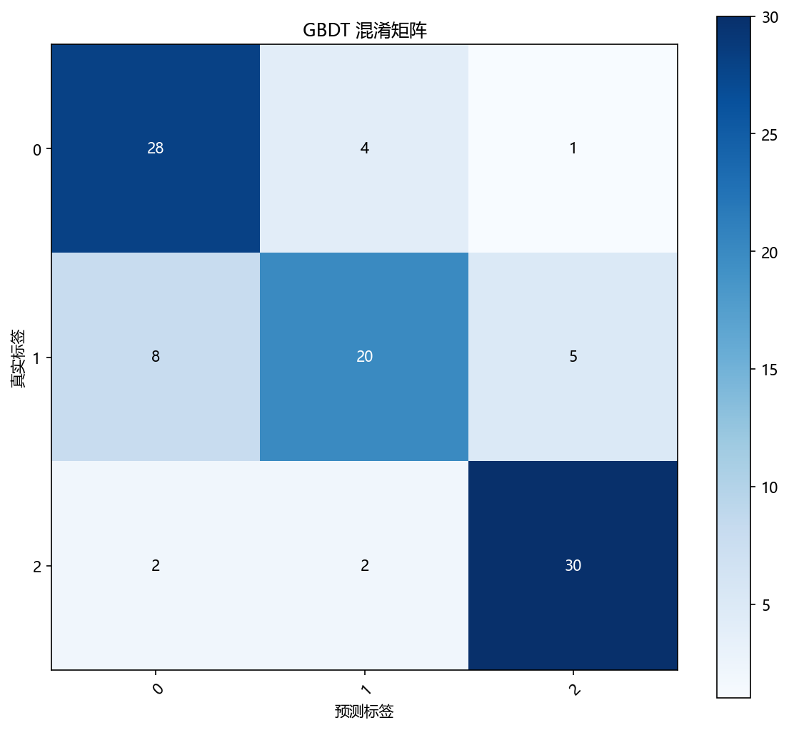
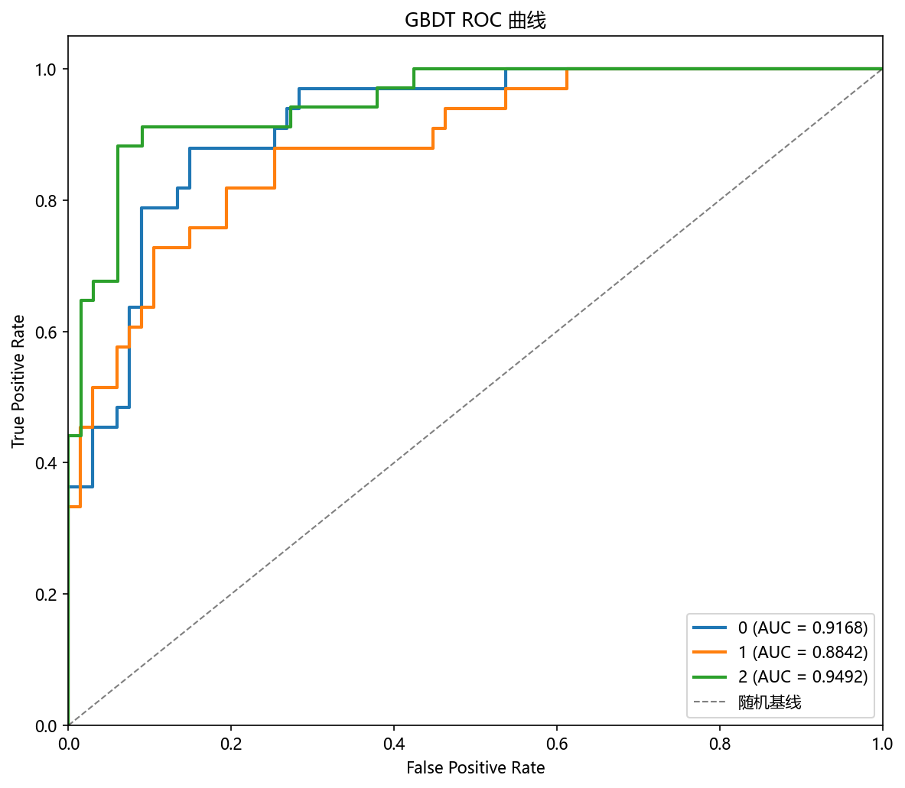
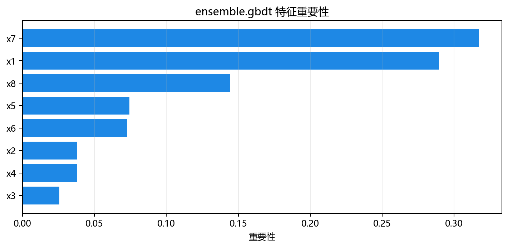

# 评估与诊断

> 对应代码：`pipelines/ensemble/gbdt.py`、`result_visualization/confusion_matrix.py`、`result_visualization/roc_curve.py`、`result_visualization/feature_importance.py`、`result_visualization/learning_curve.py`
>  
> 相关对象：`plot_confusion_matrix(...)`、`plot_roc_curve(...)`、`plot_feature_importance(...)`、`plot_learning_curve(...)`

## 本章目标

1. 明确当前仓库实际使用了哪些评估手段，而不是泛泛讨论所有分类指标。
2. 理解混淆矩阵、ROC 曲线、特征重要性图和学习曲线分别能帮助我们诊断什么。
3. 明确当前实现没有做哪些数值指标输出，以免误读源码能力边界。

## 重点方法与概念速览

| 名称 | 类型 | 作用 |
|---|---|---|
| `plot_confusion_matrix(...)` | 函数 | 生成分类混淆矩阵图 |
| `plot_roc_curve(...)` | 函数 | 生成 ROC 曲线图 |
| `plot_feature_importance(...)` | 函数 | 生成特征重要性柱状图 |
| `plot_learning_curve(...)` | 函数 | 生成训练/验证得分曲线 |
| `y_pred` / `y_scores` | 预测输出 | 当前 GBDT 的类别和概率结果 |

## 1. 当前实现真正做了什么评估

### 参数速览（本节）

适用评估手段（本节）：

1. 混淆矩阵
2. ROC 曲线
3. 特征重要性图
4. 学习曲线

| 评估方式 | 来源 | 用途 |
|---|---|---|
| 混淆矩阵 | `plot_confusion_matrix(...)` | 观察各类别之间的混淆情况 |
| ROC 曲线 | `plot_roc_curve(...)` | 观察模型概率区分能力 |
| 特征重要性图 | `plot_feature_importance(...)` | 观察哪些特征更重要 |
| 学习曲线 | `plot_learning_curve(...)` | 观察训练样本数变化时训练/验证走势 |

### 理解重点

- 当前 GBDT 流水线没有显式打印 accuracy、precision、recall、F1、AUC 等数值指标。
- 这并不表示这些指标不重要，而是说明本仓库当前实现更强调图像化诊断。
- 因此阅读这一分册时，不能把“指标表格”想成已经在源码里实现的内容。

## 2. 混淆矩阵是怎么生成的

### 参数速览（本节）

适用函数：`plot_confusion_matrix(y_true, y_pred, title=..., dataset_name=..., model_name=...)`

| 参数名 | 本例取值 | 说明 |
|---|---|---|
| `y_true` | `y_test` | 测试集真实类别 |
| `y_pred` | 预测类别 | 模型对测试集的离散输出 |
| `dataset_name` | `"gbdt"` | 输出目录名 |
| `model_name` | `"gbdt"` | 输出文件名前缀 |

### 示例代码

```python
plot_confusion_matrix(
    y_test,
    y_pred,
    title="GBDT 混淆矩阵",
    dataset_name=DATASET,
    model_name=MODEL,
)
```

### 理解重点

- 混淆矩阵最适合看“哪些类和哪些类容易混在一起”。
- 对当前 3 分类任务来说，它比单个准确率更容易暴露具体错误结构。
- 这也是为什么当前分册把它作为第一类评估图输出。

## 3. ROC 曲线是怎么生成的

### 参数速览（本节）

适用函数：`plot_roc_curve(y_true, y_scores, title=..., dataset_name=..., model_name=...)`

| 参数名 | 本例取值 | 说明 |
|---|---|---|
| `y_true` | `y_test` | 测试集真实类别 |
| `y_scores` | `model.predict_proba(X_test_s)` | 每个类别的预测概率 |
| `dataset_name` | `"gbdt"` | 输出目录名 |
| `model_name` | `"gbdt"` | 输出文件名前缀 |

### 示例代码

```python
y_scores = model.predict_proba(X_test_s)
plot_roc_curve(
    y_test,
    y_scores,
    title="GBDT ROC 曲线",
    dataset_name=DATASET,
    model_name=MODEL,
)
```

### 理解重点

- ROC 曲线依赖的是概率输出，而不是离散类别预测。
- 这也是为什么当前流水线要额外调用 `predict_proba(...)`。
- 它帮助你观察模型在不同阈值下的区分能力，而不只是最后给出的硬分类结果。

## 4. 特征重要性图是怎么生成的

### 参数速览（本节）

适用函数：`plot_feature_importance(model, feature_names=None, top_n=None, title='特征重要性', dataset_name='default', model_name='model', figsize=(10, 7))`

| 参数名 | 本例取值 | 说明 |
|---|---|---|
| `model` | 训练好的 GBDT 模型 | 提供特征重要性来源 |
| `feature_names` | `list(X.columns)` | 为每个重要性值提供真实列名 |
| `top_n` | `None` | 当前实现展示全部特征 |

### 示例代码

```python
plot_feature_importance(
    model,
    feature_names=feature_names,
    title="GBDT 特征重要性",
    dataset_name=DATASET,
    model_name=MODEL,
)
```

### 理解重点

- 特征重要性图帮助你理解模型主要依赖哪些特征做分类判断。
- 对当前包含有效特征与冗余特征的数据来说，这一步尤其有意义。
- 但它依然不能替代分类结果分析，因为“重要性高”不等于“分类一定好”。

## 5. 学习曲线是怎么生成的

### 参数速览（本节）

适用函数：`plot_learning_curve(model, X, y, cv=5, scoring='accuracy', train_sizes=None, ...)`

| 参数名 | 本例取值 | 说明 |
|---|---|---|
| `model` | `GradientBoostingClassifier(n_estimators=100, random_state=42)` | 一个新的未训练模型实例 |
| `X` | `X_train_s` | 使用训练集标准化特征 |
| `y` | `y_train` | 使用训练标签 |
| `scoring` | 默认值 | 当前源码未显式覆盖 |

### 示例代码

```python
plot_learning_curve(
    GradientBoostingClassifier(n_estimators=100, random_state=42),
    X_train_s,
    y_train,
    title="GBDT 学习曲线",
    dataset_name=DATASET,
    model_name=MODEL,
)
```

### 理解重点

- 学习曲线内部会在不同训练样本规模下重复训练和验证，不是直接复用已训练好的主模型。
- 当前这里使用的模型配置与主训练配置并不完全一致，这一点必须如实理解。
- 它更适合帮助你观察样本量变化下的训练/验证走势，而不是单次测试结果。

## 6. 看四类图时重点观察什么

### 参数速览（本节）

适用观察点（本节）：

1. 类别混淆结构
2. 概率区分能力
3. 重要性是否集中
4. 训练/验证走势是否分裂

| 图像 | 重点观察什么 |
|---|---|
| 混淆矩阵 | 哪些类别最容易混淆 |
| ROC 曲线 | 模型对不同类别的概率区分能力 |
| 特征重要性图 | 主要依赖哪些特征 |
| 学习曲线 | 是否过拟合、欠拟合或样本量不足 |

### 理解重点

- 混淆矩阵帮助你理解“分错在哪里”。
- ROC 曲线帮助你理解“概率输出有没有区分力”。
- 特征重要性图帮助你理解“模型主要看什么”。
- 学习曲线帮助你理解“当前 boosting 配置与样本量是否匹配”。

## 7. 当前实现没有做什么

### 参数速览（本节）

当前源码未包含的内容：

1. 显式数值指标打印
2. 交叉验证结果表格
3. 早停训练

| 未实现项 | 当前状态 |
|---|---|
| accuracy / precision / recall / F1 / AUC 打印 | 未在流水线中出现 |
| 交叉验证明细表 | 未在流水线中出现 |
| 早停逻辑 | 当前训练封装未使用 |

### 理解重点

- 评估章节必须以源码为准，不能把“GBDT 常见训练技巧”写成“当前仓库已经实现”。
- 当前实现的评估重点是四类图像，而不是数值指标面板。
- 如果后续扩展这部分，最自然的方向是补指标打印或更一致的学习曲线配置说明。

## 评估图表





## 常见坑

1. 只看 ROC 曲线，不看混淆矩阵，错过具体类别混淆情况。
2. 只看特征重要性图，不看学习曲线和分类结果，误把“重要性高”当成“分类一定好”。
3. 误以为当前流水线已经输出了 accuracy / AUC 指标表，实际源码并没有这些步骤。

## 小结

- 当前 GBDT 的评估主线由四部分组成：混淆矩阵、ROC 曲线、特征重要性图和学习曲线。
- 它们分别从类别错误结构、概率区分能力、特征贡献和训练趋势四个角度解释模型表现。
- 只有把这四条线索一起看，才能更完整地理解当前实现的表现。
