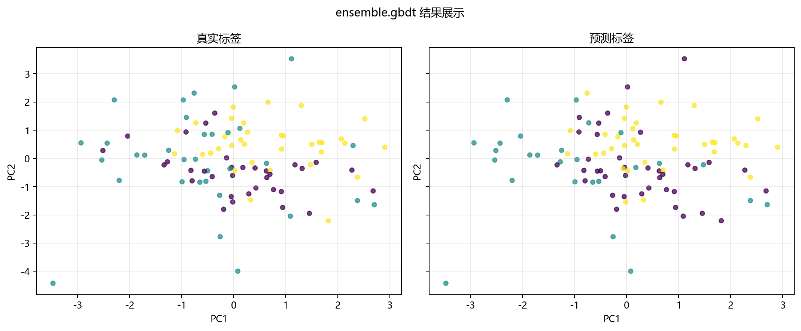

# 工程实现

> 对应代码：`data_generation/ensemble.py`、`model_training/ensemble/gbdt.py`、`pipelines/ensemble/gbdt.py`、`result_visualization/confusion_matrix.py`、`result_visualization/roc_curve.py`、`result_visualization/feature_importance.py`、`result_visualization/learning_curve.py`
>  
> 运行方式：`python -m pipelines.ensemble.gbdt`

## 本章目标

1. 看清当前 GBDT 分册在仓库中的模块分层与调用关系。
2. 理解从命令行入口到四类结果图落盘，中间依次发生了什么。
3. 明确哪些逻辑属于数据层、训练层、流水线层和可视化层。

## 对应代码速览

| 组件 | 路径 | 说明 |
|---|---|---|
| 数据生成层 | `data_generation/ensemble.py` | `EnsembleData.gbdt()` 生成数据 |
| 数据导出层 | `data_generation/__init__.py` | 提供 `gbdt_data` 给外部导入 |
| 训练层 | `model_training/ensemble/gbdt.py` | 定义 `train_model(...)` 并训练 GBDT 模型 |
| 流水线层 | `pipelines/ensemble/gbdt.py` | 负责切分、标准化、训练、预测、画图 |
| 混淆矩阵层 | `result_visualization/confusion_matrix.py` | 负责混淆矩阵绘制与保存 |
| ROC 曲线层 | `result_visualization/roc_curve.py` | 负责 ROC 曲线绘制与保存 |
| 特征重要性层 | `result_visualization/feature_importance.py` | 负责特征重要性图绘制与保存 |
| 学习曲线层 | `result_visualization/learning_curve.py` | 负责学习曲线绘制与保存 |

## 1. 入口命令如何触发整条链路

### 示例代码

```bash
python -m pipelines.ensemble.gbdt
```

### 理解重点

- 这个命令会执行 `pipelines/ensemble/gbdt.py` 中的 `run()`。
- `run()` 是真正的工程入口，其他模块都被它按顺序调用。
- 所以理解工程实现时，最清晰的方式也是先从入口脚本往下追踪。

## 2. 模块之间的调用关系

### 示例代码

```python
from data_generation import gbdt_data
from model_training.ensemble.gbdt import train_model
from result_visualization.confusion_matrix import plot_confusion_matrix
from result_visualization.roc_curve import plot_roc_curve
from result_visualization.feature_importance import plot_feature_importance
from result_visualization.learning_curve import plot_learning_curve
```

### 理解重点

- `pipelines` 层不自己造数据、不自己实现模型，也不自己画图，而是扮演调度者角色。
- 这种分层使每个文件职责单一：数据文件只关心数据，训练文件只关心模型，画图文件只关心结果展示。
- 当前 GBDT 分册比一般分类示例多了学习曲线，因此结果层既包含分类结果，也包含训练趋势分析。

## 3. 流水线层真正负责什么

### 参数速览（本节）

适用逻辑（分项）：

1. 复制数据
2. 拆分特征与标签
3. 保存 `feature_names`
4. 分层切分训练/测试集
5. 标准化
6. 调用训练函数
7. 预测类别与概率
8. 输出四类图像

| 步骤 | 所在文件 | 当前职责 |
|---|---|---|
| 读取 `gbdt_data` | `pipelines/ensemble/gbdt.py` | 拿到统一数据入口 |
| `X` / `y` 拆分 | `pipelines/ensemble/gbdt.py` | 明确特征与标签 |
| 保存 `feature_names` | `pipelines/ensemble/gbdt.py` | 供重要性图使用 |
| 分层切分 | `pipelines/ensemble/gbdt.py` | 保持类别比例稳定 |
| 标准化 | `pipelines/ensemble/gbdt.py` | 生成训练和测试输入 |
| 调用 `train_model(...)` | `pipelines/ensemble/gbdt.py` | 获得训练好的 GBDT 模型 |
| `predict(...)` / `predict_proba(...)` + 画图函数 | `pipelines/ensemble/gbdt.py` | 完成结果输出 |

### 理解重点

- 当前仓库没有使用 `Pipeline` 类，也没有显式验证集和早停流程。
- 这种显式写法更适合教学，因为每一步都能直接看到变量名和执行顺序。
- GBDT 分册最容易被误读的地方，是把“当前真实流程”和“更高级 boosting 工具的工程能力”混为一谈，因此这里要特别明确当前实现边界。

## 4. 训练层真正负责什么

### 参数速览（本节）

适用函数：`train_model(...)`

| 输出项 | 作用 |
|---|---|
| `model` | 返回已训练好的 `GradientBoostingClassifier` 模型 |
| 控制台日志 | 打印关键 boosting 超参数和训练耗时 |

### 理解重点

- 训练层并不负责切分数据，也不负责绘制混淆矩阵、ROC 曲线、特征重要性图或学习曲线。
- 它的核心任务是构建 GBDT 模型、拟合训练数据，并回显当前超参数配置。
- 和 LightGBM、XGBoost 相比，这里超参数更少，也更适合强调 boosting 基础结构本身。

## 5. 为什么这里同时需要 `predict(...)` 和 `predict_proba(...)`

### 示例代码

```python
y_pred = model.predict(X_test_s)
y_scores = model.predict_proba(X_test_s)
```

### 理解重点

- `predict(...)` 输出离散类别，用于混淆矩阵。
- `predict_proba(...)` 输出每个类别的概率，用于 ROC 曲线。
- 这说明当前 GBDT 分册的评估不仅看最终分类结果，还看概率排序能力。

## 6. 为什么学习曲线单独重新构造模型

### 示例代码

```python
plot_learning_curve(
    GradientBoostingClassifier(n_estimators=100, random_state=42),
    X_train_s,
    y_train,
    title="GBDT 学习曲线",
    dataset_name=DATASET,
    model_name=MODEL,
)
```

### 理解重点

- 学习曲线不是直接复用已经训练好的 `model`，而是重新传入一个新的分类器实例。
- 这里还要特别注意：学习曲线使用的 `n_estimators=100`，与主训练函数默认的 `200` 并不完全一致。
- 这说明当前学习曲线更多是一个辅助教学视角，而不是主训练过程的完全镜像。

## 7. 常量 `DATASET` 和 `MODEL` 的作用

### 参数速览（本节）

适用常量：

1. `DATASET = "gbdt"`
2. `MODEL = "gbdt"`

| 常量 | 当前作用 |
|---|---|
| `DATASET` | 决定图片输出的上层目录 |
| `MODEL` | 决定图片文件名前缀 |

### 理解重点

- 这两个常量的作用，不是影响模型训练，而是统一结果文件的命名和归档。
- 这样当前 GBDT 分册生成的图像会被稳定保存到固定位置。
- 这也是为什么当前工程结构适合后续继续扩展更多分类评估图表。

## 8. 从命令到结果图的执行链

### 示例代码

```python
python -m pipelines.ensemble.gbdt
    -> run()
    -> gbdt_data.copy()
    -> train_test_split(..., stratify=y)
    -> StandardScaler().fit_transform(...)
    -> train_model(...)
    -> model.predict(...)
    -> model.predict_proba(...)
    -> plot_confusion_matrix(...)
    -> plot_roc_curve(...)
    -> plot_feature_importance(...)
    -> plot_learning_curve(...)
    -> savefig(...)
```

### 理解重点

- 这条链里最关键的中间产物有四个：`feature_names`、训练后的 `model`、预测类别 `y_pred`、预测概率 `y_scores`。
- 一旦这些中间变量理解清楚，整个 gbdt 分册的代码结构就基本串起来了。
- 文档中的各章节，其实就是在拆解这条执行链上的不同环节。



## 常见坑

1. 把 `pipelines` 层和 `model_training` 层职责混在一起，误以为训练函数负责全部工程流程。
2. 不理解为什么当前分册需要概率输出，从而误读 ROC 曲线的输入来源。
3. 忽略 `feature_names`、`DATASET` 和 `MODEL` 的作用，看不懂四类图像和输出目录为什么能稳定生成。

## 小结

- 当前 GBDT 实现采用了清晰的分层结构：数据层、训练层、流水线层、可视化层各司其职。
- 入口脚本负责调度，训练模块负责模型，画图模块负责结果呈现。
- 这种结构既方便阅读，也方便后续继续补数值指标、验证集或更一致的学习曲线实验。
