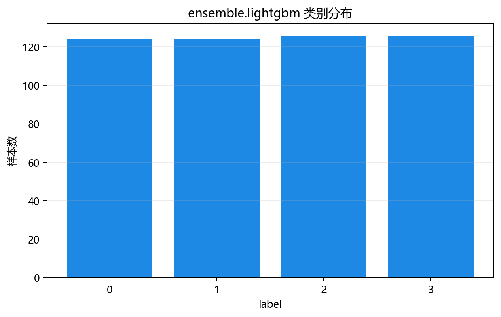
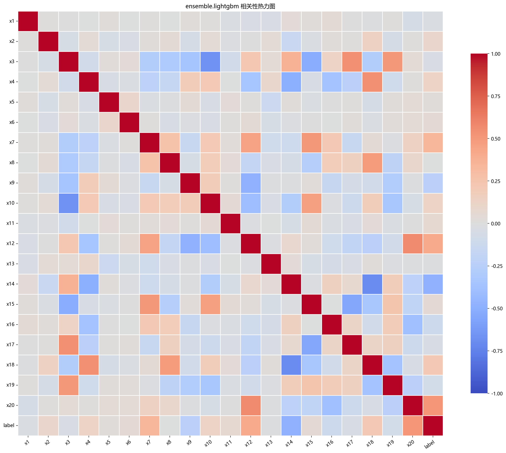
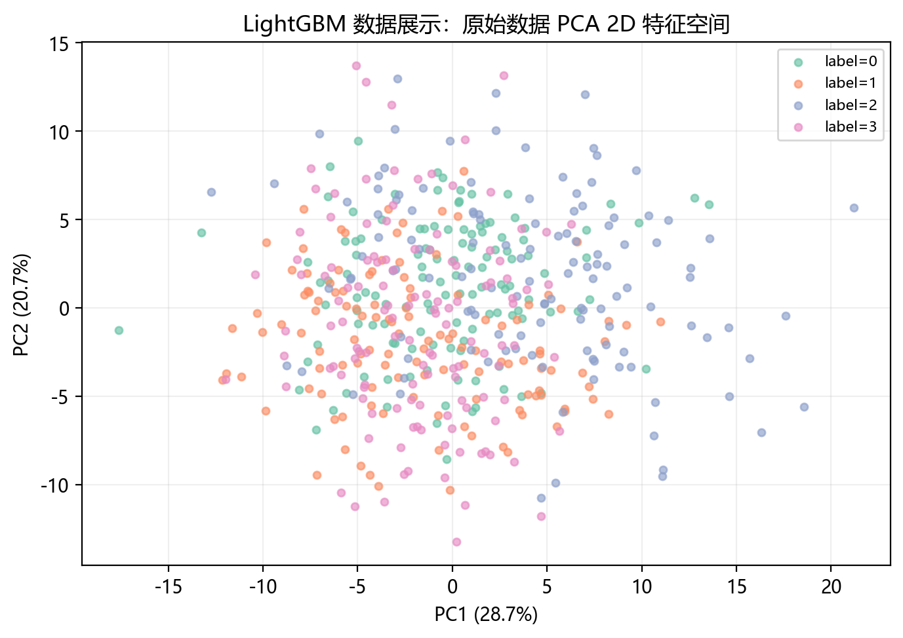

# 数据构成

> 对应代码：`data_generation/ensemble.py`、`data_generation/__init__.py`、`pipelines/ensemble/lightgbm.py`
>  
> 相关对象：`EnsembleData.lightgbm()`、`lightgbm_data`

## 本章目标

1. 明确本仓库 LightGBM 数据来自 `EnsembleData.lightgbm()` 的高维多分类构造逻辑。
2. 明确特征列、标签列以及有效特征、冗余特征、噪声特征的整体结构。
3. 明确分层切分与标准化的顺序和边界。

## 重点方法与概念速览

| 名称 | 类型 | 作用 |
|---|---|---|
| `EnsembleData.lightgbm()` | 方法 | 生成 LightGBM 分类使用的高维多分类数据 |
| `make_classification(...)` | 函数 | scikit-learn 提供的分类数据生成器 |
| `lightgbm_data` | 变量 | 在 `data_generation/__init__.py` 中导出的数据对象 |
| `label` | 列名 | 当前流水线中的分类目标列 |

## 1. 本仓库数据入口

- 数据变量：`data_generation/__init__.py` 中导出的 `lightgbm_data`
- 生成来源：`data_generation/ensemble.py` 中的 `EnsembleData.lightgbm()`
- 流水线使用：`pipelines/ensemble/lightgbm.py` 中的 `data = lightgbm_data.copy()`

### 理解重点

- `lightgbm_data` 在导入时就已经生成完成，因此流水线里直接 `.copy()` 使用即可。
- 使用 `.copy()` 的目的，是避免后续切分或调试过程意外修改原始数据对象。

## 2. 数据生成函数 `EnsembleData.lightgbm()`

### 参数速览（本节）

适用 API（分项）：

1. `EnsembleData.lightgbm()`
2. `make_classification(...)`

| 参数名 | 本例取值 | 说明 |
|---|---|---|
| `n_samples` | `500` | 样本总数 |
| `n_features` | `20` | 特征总数 |
| `n_informative` | `8` | 有效特征数 |
| `n_redundant` | `5` | 冗余特征数 |
| `n_classes` | `4` | 类别数量 |
| `class_sep` | `0.6` | 类别间隔，越小越难分 |
| `random_state` | `42` | 随机种子，保证可复现 |
| 返回值 | `DataFrame` | 含 `x1` ~ `x20` 与 `label` 的数据表 |

### 示例代码

```python
X, y = make_classification(
    n_samples=self.n_samples,
    n_features=self.lgbm_n_features,
    n_informative=self.lgbm_n_informative,
    n_redundant=self.lgbm_n_redundant,
    n_repeated=0,
    n_classes=self.lgbm_n_classes,
    n_clusters_per_class=1,
    class_sep=self.lgbm_class_sep,
    random_state=self.random_state,
)
```

### 理解重点

- 当前数据不是回归数据，而是一个高维多分类任务。
- 设计这份数据的目的，是突出 LightGBM 对高维结构化分类问题的处理能力。
- 文档中需要特别区分它和 XGBoost 分册当前使用的 California Housing 回归数据。

## 3. 特征列与标签列

当前数据表结构如下：

- 特征列：`x1` ~ `x20`
- 标签列：`label`

### 参数速览（本节）

适用列组（本节）：

1. 有效特征
2. 冗余特征
3. 其余噪声特征
4. 标签列

| 列组 | 当前含义 | 作用 |
|---|---|---|
| 有效特征 | 前 8 个主要信息来源 | 提供最核心分类信号 |
| 冗余特征 | 5 个冗余特征 | 增加相关性和识别难度 |
| 其余特征 | 其余噪声或弱信息特征 | 增加高维复杂度 |
| 标签列 | `label` | 4 分类目标 |

### 示例代码

```python
X = data.drop(columns=["label"])
y = data["label"]
feature_names = list(X.columns)
```

### 理解重点

- 当前流水线先把 `feature_names` 提前保存下来，是为了后续绘制特征重要性图时使用。
- LightGBM 不会像线性模型那样输出系数，因此列名与重要性值的对应关系很重要。
- 这份高维数据也为 LightGBM 的 Leaf-wise 与高效特征处理直觉提供了更合适的背景。

## 4. 分层切分与标准化

### 参数速览（本节）

适用 API（分项）：

1. `train_test_split(X, y, test_size=0.2, random_state=42, stratify=y)`
2. `StandardScaler().fit_transform(X_train)`
3. `StandardScaler().transform(X_test)`

| 参数名 | 本例取值 | 说明 |
|---|---|---|
| `test_size` | `0.2` | 测试集占比 |
| `random_state` | `42` | 保证可复现划分 |
| `stratify` | `y` | 保持训练集和测试集类别比例一致 |
| `X_train_s` | 标准化训练特征 | 供 LightGBM 训练使用 |
| `X_test_s` | 标准化测试特征 | 供 LightGBM 预测使用 |

### 示例代码

```python
X_train, X_test, y_train, y_test = train_test_split(
    X, y, test_size=0.2, random_state=42, stratify=y
)
scaler = StandardScaler()
X_train_s = scaler.fit_transform(X_train)
X_test_s = scaler.transform(X_test)
```

### 理解重点

- 当前 LightGBM 流水线真实包含标准化步骤，文档不能像 XGBoost 分册那样写成“无标准化”。
- `stratify=y` 对多分类任务很重要，它能让训练集和测试集的类别分布更稳定。
- 当前文档中的 `X_train_s`、`X_test_s` 都是源码里真实使用的变量名。

## 数据可视化





## 常见坑

1. 把当前 LightGBM 数据误写成回归数据，忽略它其实是 4 分类任务。
2. 忽略 `stratify=y`，把当前多分类切分流程写成普通随机切分。
3. 把 XGBoost 分册里的“无标准化”惯性套到当前 LightGBM 流程上。

## 小结

- 当前 LightGBM 数据来自 `EnsembleData.lightgbm()`，底层使用的是 `make_classification(...)`。
- 数据表由 20 个特征和标签列 `label` 组成，其中包含有效、冗余和噪声特征。
- 读懂数据结构、分层切分和标准化顺序，是理解后续 LightGBM 训练与分类评估的前提。
