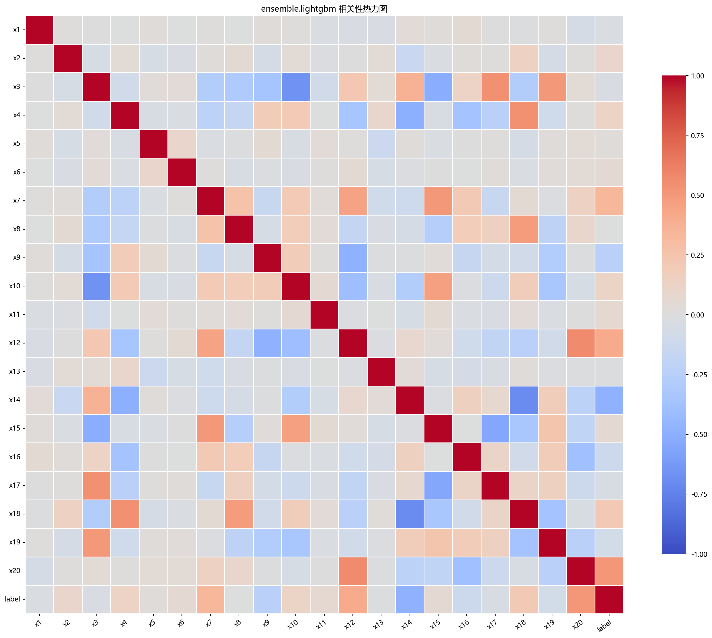

# 数据构成

## 本章目标

1. 明确本仓库 LightGBM 数据来自 `EnsembleData.lightgbm()` 构造的高维多类别分类数据。
2. 理解为什么选择高维数据——`n_features=20`（含 7 个纯噪声特征）充分展示 LightGBM 的直方图加速和 GOSS 采样优势。
3. 明确当前流程中的训练/测试切分（分层抽样）和标准化顺序。

## 重点方法与概念速览

| 名称 | 类型 | 作用 |
|---|---|---|
| `EnsembleData.lightgbm()` | 方法 | 生成 LightGBM 使用的高维多类别分类数据 |
| `make_classification(...)` | 函数 | scikit-learn 提供的合成分类数据生成器 |
| `lightgbm_data` | 变量 | 在 `data_generation/__init__.py` 中导出的全局 DataFrame |
| `lgbm_class_sep` | 参数 | 类别间隔 `0.6`——较小的间隔提高分类难度，体现 Boosting 的偏差缩减能力 |
| `StandardScaler` | 类 | 对特征做 Z-score 标准化——训练集拟合、测试集变换 |

## 1. 数据生成：`EnsembleData.lightgbm()`

当前 LightGBM 数据来自 `EnsembleData.lightgbm()`，底层调用 `sklearn.datasets.make_classification()`。

### 参数速览

适用函数：`make_classification(n_samples=1000, n_features=20, n_informative=8, n_redundant=5, n_classes=4, n_clusters_per_class=1, class_sep=0.6, random_state=42)`

| 参数名 | 类型 | 说明 | 示例取值 |
|---|---|---|---|
| `n_samples` | `int` | 总样本数。`1000`——比 GBDT 多一倍，提供更充足的训练信号，同时展示 LightGBM 的直方图加速优势 | `500`、`1000`、`2000` |
| `n_features` | `int` | 总特征数。`20`——高维设置，体现 LightGBM 处理大规模特征的能力 | `8`、`20`、`50` |
| `n_informative` | `int` | 有效特征数。`8`——与类标签真正相关的独立信号 | `4`、`8` |
| `n_redundant` | `int` | 冗余特征数。`5`——由有效特征线性组合生成 | `2`、`5` |
| `n_classes` | `int` | 类别数。`4`——多分类 $\{0, 1, 2, 3\}$ | `3`、`4` |
| `n_clusters_per_class` | `int` | 每类的簇数。`1`——每类一个高斯簇 | `1`、`2` |
| `class_sep` | `float` | 类别间隔。`0.6`——较小的间隔使类别重叠较多，分类难度较高 | `0.3`、`0.6`、`1.5` |
| `random_state` | `int` | 随机种子，保证数据可复现。`42` | `42` |
| 返回值 | `(ndarray, ndarray)` | `(X, y)` 元组，$X$ 形状 $(1000, 20)$，$y$ 取值 $\{0, 1, 2, 3\}$ | — |

### 示例代码

```python
X, y = make_classification(
    n_samples=1000,
    n_features=20,
    n_informative=8,
    n_redundant=5,
    n_repeated=0,
    n_classes=4,
    n_clusters_per_class=1,
    class_sep=0.6,
    random_state=42,
)
columns = [f"x{i + 1}" for i in range(20)]
data = DataFrame(X, columns=columns)
data["label"] = y
```

### 理解重点

- `n_features=20` 是 LightGBM 独有设计——比 GBDT 的 8 维高 2.5 倍。含 8 个有效特征 + 5 个冗余特征 + 7 个纯噪声特征（$20 - 8 - 5 = 7$）。
- `class_sep=0.6` 低于 GBDT 的 `0.7`——类别间隔更小意味着更高的分类难度和更模糊的类别边界。
- `n_samples=1000` 是 GBDT 的两倍——更大数据量使 LightGBM 的直方图加速优势更加显著。

## 2. 特征列与标签列

### 参数速览

| 参数名 | 类型 | 说明 | 示例取值 |
|---|---|---|---|
| `X` | `DataFrame`，形状 $(1000, 20)$ | 含 20 个连续特征的特征矩阵，列名 `x1`~`x20` | `data.drop(columns=["label"])` |
| `y` | `Series`，形状 $(1000,)$ | 四分类标签 $\{0, 1, 2, 3\}$——参与 LightGBM 训练和评估 | `data["label"]` |

### 特征构成

| 特征范围 | 数量 | 类型 | 说明 |
|---|---|---|---|
| `x1` ~ `x8` | 8 | 有效特征 | 由 `make_classification` 生成的独立信号——与标签直接相关 |
| `x9` ~ `x13` | 5 | 冗余特征 | 由 `x1`~`x8` 线性组合生成——提供重复信息 |
| `x14` ~ `x20` | 7 | 噪声特征 | 随机生成——与标签无任何关联 |

### 理解重点

- 特征重要性的期望排序：`x1`~`x8` > `x9`~`x13` > `x14`~`x20`——这是验证 LightGBM 特征选择能力的关键诊断。
- `label` 是四分类监督标签——与 GBDT 的三分类和 Bagging 的二分类形成难度梯度。
- 与 GBDT 的数据对比：类别多 1 个（4 vs 3），特征多 12 个（20 vs 8），样本多 500 个（1000 vs 500）。

## 3. 训练/测试切分与标准化

### 参数速览

适用 API：`train_test_split(X, y, test_size=0.2, random_state=42, stratify=y)`

| 参数名 | 类型 | 说明 | 示例取值 |
|---|---|---|---|
| `X` | `DataFrame`，形状 $(1000, 20)$ | 全量特征矩阵 | `X` |
| `y` | `Series`，形状 $(1000,)$ | 全量标签 | `y` |
| `test_size` | `float` | 测试集比例。`0.2` | `0.2`、`0.3` |
| `stratify` | `array_like` | 分层抽样依据——确保训练/测试集中类别比例一致 | `y` |
| `random_state` | `int` | 随机种子。`42` | `42` |
| 返回值 | `(DataFrame, DataFrame, Series, Series)` | `X_train`（800 样本）、`X_test`（200 样本）及对应标签 | — |

### 示例代码

```python
X_train, X_test, y_train, y_test = train_test_split(
    X, y, test_size=0.2, random_state=42, stratify=y
)

scaler = StandardScaler()
X_train_s = scaler.fit_transform(X_train)
X_test_s = scaler.transform(X_test)
```

### 理解重点

- 当前流水线**有**训练/测试切分——与集成分类系列（Bagging/GBDT）一致。
- `stratify=y` 确保 200 个测试样本中 4 个类别的分布比例与原始数据一致——在多分类场景下尤其重要。
- 标准化采用监督学习标准做法：`fit_transform` 在训练集上计算 $\mu$ 和 $\sigma$，`transform` 在测试集上使用相同统计量。

## 4. 数据设计意图：与 GBDT 的对比

| 数据维度 | GBDT | LightGBM | 设计意图 |
|---|---|---|---|
| 样本数 | 500 | **1000** | 更大数据量——展示直方图加速优势 |
| 特征维度 | 8 (4+2+2) | **20 (8+5+7)** | 更高维——展示 EFB 和列采样的价值 |
| 类别数 | 3 | **4** | 更多类别——提高多分类复杂度 |
| 类别间隔 | 0.7 | **0.6** | 更难分类——展示偏差缩减的必要性 |
| 噪声特征数 | 2 | **7** | 更多噪声——展示特征重要性筛选能力 |

### 理解重点

- LightGBM 的数据设计在所有维度上都比 GBDT"更大更难"——这是有意为之，因为 LightGBM 的工程优化使其在高维数据上仍有显著的训练速度优势。
- 20 维中 12 个非独立有效信号——特征重要性图表天然区分有效特征与冗余/噪声特征。

## 数据可视化



## 常见坑

1. 把 `class_sep=0.6` 当成数据缺陷——低间隔是有意设计，分类难度过低无法体现偏差缩减的价值。
2. 忽略 `stratify=y` 的重要性——四分类数据上不设分层抽样可能导致测试集中某类别过少。
3. 在测试集上 `fit_transform` 而非 `transform`——标准信息泄露。
4. 忘记 `lightgbm_data` 是模块级全局变量——直接修改会污染其他模块。

## 小结

- 当前 LightGBM 数据来自 `make_classification(n_samples=1000, n_features=20, n_informative=8, n_classes=4, class_sep=0.6)`：20 个连续特征、四分类、高维较高难度。
- 数据流为：`make_classification` → DataFrame（`x1`~`x20` + `label`）→ 分层训练/测试切分 → 训练集拟合标准化器 / 测试集变换。
- `n_features=20` 和 `class_sep=0.6` 的设计意图是充分展示 LightGBM 在高维中等难度数据上的直方图加速速度和特征筛选能力。
