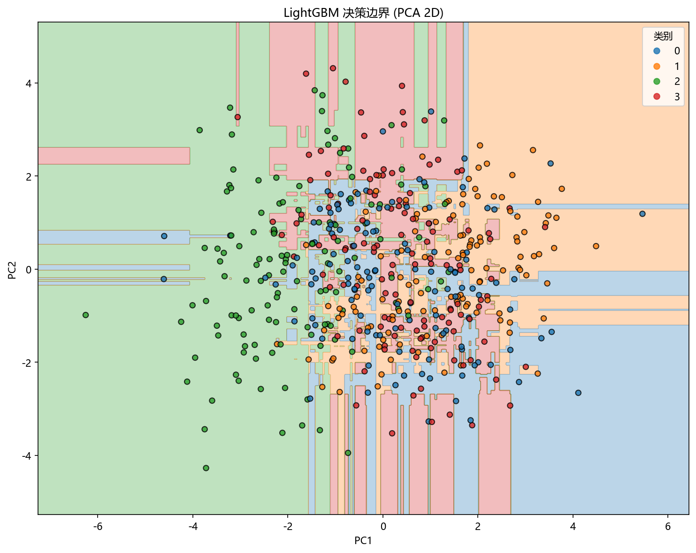

# 思路与直觉

> 对应代码：`data_generation/ensemble.py`、`model_training/ensemble/lightgbm.py`
>  
> 相关对象：`EnsembleData.lightgbm()`、`train_model(...)`

## 本章目标

1. 理解 LightGBM 为什么依然属于 boosting，但更强调训练效率和大规模数据处理。
2. 理解 Leaf-wise、生长策略、GOSS 和 EFB 为什么让它与普通树模型和 XGBoost 不同。
3. 把这些直觉和当前仓库的高维多分类数据对应起来。

## 重点方法与概念速览

| 名称 | 类型 | 作用 |
|---|---|---|
| Boosting | 集成思想 | 逐轮叠加弱学习器修正当前错误 |
| Leaf-wise | 树生长策略 | 每次优先分裂收益最大的叶子 |
| GOSS | 采样策略 | 优先保留梯度大的样本 |
| EFB | 特征压缩策略 | 合并互斥特征，提升高维训练效率 |

## 1. LightGBM 想做什么

LightGBM 的核心目标，不只是训练一个准确的 boosting 模型，还要让这个过程在高维、大规模表格数据上更快、更省内存。

### 参数速览（本节）

适用过程（本节）：

1. 逐轮加树
2. 高效分裂搜索
3. 压缩计算成本

| 阶段 | 直观含义 |
|---|---|
| boosting | 一轮一轮纠错 |
| 高效搜索 | 不在原始连续特征上做昂贵遍历 |
| 结构压缩 | 尽量减少不必要的样本和特征开销 |

### 理解重点

- 如果只看模型形式，LightGBM 和 XGBoost 都属于 boosting 树模型。
- 但 LightGBM 的突出点在于，它把很多注意力放在“怎么更高效地训练”上。
- 当前分册的数学章节正是围绕这些高效机制展开的。

## 2. 为什么 Leaf-wise 生长很关键

### 参数速览（本节）

适用对比对象（本节）：

1. Level-wise
2. Leaf-wise

| 生长方式 | 直观含义 |
|---|---|
| Level-wise | 每层整体一起扩展 |
| Leaf-wise | 每次只优先分裂收益最大的叶子 |

### 理解重点

- Level-wise 更像“整层整层往下长”。
- Leaf-wise 更像“哪里最值得切，就先切哪里”，因此通常能用更少叶子换来更强拟合能力。
- 代价是它也更激进，如果不加约束，更容易过拟合。

## 3. 为什么 GOSS 和 EFB 适合高维数据

### 参数速览（本节）

适用机制（本节）：

1. GOSS
2. EFB

| 机制 | 直观意义 |
|---|---|
| GOSS | 重点保留“更难学”的样本 |
| EFB | 合并互斥特征，减少维度压力 |

### 理解重点

- 当前数据有 20 个特征，其中只有一部分真正有效，其余包含冗余和噪声。
- 这种高维结构正适合说明为什么 LightGBM 要尽可能减少无效计算。
- 数学页里讲的 GOSS 和 EFB，在这个数据背景下比在低维小数据上更容易理解其价值。

## 4. 为什么当前数据特别适合讲 LightGBM

### 参数速览（本节）

适用数据特点（本节）：

1. 高维
2. 多分类
3. 类间间隔较小
4. 含冗余与噪声特征

| 数据特点 | 对 LightGBM 的意义 |
|---|---|
| 20 维特征 | 更适合展示高效树模型优势 |
| 4 分类任务 | 更适合展示 `predict_proba(...)` 与 ROC 曲线 |
| 类间间隔小 | 让分类任务更有挑战 |
| 冗余与噪声特征 | 更适合观察重要性分布与模型选择 |

### 理解重点

- 如果数据维度很低、类别又很容易分开，LightGBM 的效率优势不一定明显。
- 当前数据是故意设计成“高维 + 多分类 + 中等难度”的结构，适合展示 LightGBM 的工程特点。
- 这也是为什么当前分册会同时输出混淆矩阵、ROC 曲线和特征重要性图。

## 5. 与 XGBoost 和单棵树相比，LightGBM 的优势和边界

### 参数速览（本节）

适用对比对象（本节）：

1. 单棵决策树
2. XGBoost
3. LightGBM

| 维度 | 单棵树 | XGBoost | LightGBM |
|---|---|---|---|
| 模型形式 | 单树 | boosting 多树 | boosting 多树 |
| 生长策略 | 普通树结构 | 多为 level-wise 风格 | 典型 leaf-wise |
| 高维效率 | 一般 | 较强 | 更强调效率优化 |
| 过拟合风险 | 树太深时上升 | 可通过正则化控制 | Leaf-wise 更需约束 |

### 理解重点

- LightGBM 和 XGBoost 都很强，但 LightGBM 更强调在高维、大规模场景下的效率优势。
- 相比单棵树，它依然是多轮集成模型，因此不能按“单棵树逻辑”去理解它。
- 当前分册因此既要讲 boosting，也要讲 LightGBM 独有的高效机制。

## 6. 直觉如何映射到当前训练日志和输出

### 参数速览（本节）

适用输出项（分项）：

1. `n_estimators`
2. `learning_rate`
3. `num_leaves`
4. `max_depth`
5. `subsample`
6. `colsample_bytree`

| 日志项 | 可以帮助判断什么 |
|---|---|
| `n_estimators`、`learning_rate` | boosting 强度和步长 |
| `num_leaves`、`max_depth` | Leaf-wise 生长的复杂度边界 |
| `subsample`、`colsample_bytree` | 样本和特征采样强度 |

### 理解重点

- 当前训练日志最关键的输出，不是像线性模型那样的系数，而是一组影响 boosting 与树结构的超参数。
- 其中 `num_leaves` 是 LightGBM 分册非常有代表性的参数，因为它直接体现了 Leaf-wise 生长的控制方式。
- 这也是为什么后续模型构建章节会重点解释它和 `max_depth` 的关系。

## 可视化

## 常见坑

1. 把 LightGBM 误解成“更快一点的 XGBoost”，忽略 Leaf-wise、GOSS、EFB 这些核心差异。
2. 只看 ROC 曲线，不看混淆矩阵，容易错过具体类别混淆情况。
3. 只看特征重要性，不看分类结果，误把“重要性高”当成“分类一定更好”。

## 小结

- LightGBM 的核心直觉，是在 boosting 框架下更激进地长树，并尽可能高效地处理高维数据。
- Leaf-wise、GOSS 和 EFB 是它区别于普通 boosting 树模型的重要特点。
- 当前高维多分类数据正是为了把这种“高效 + 强表达力”的特性展示出来。
