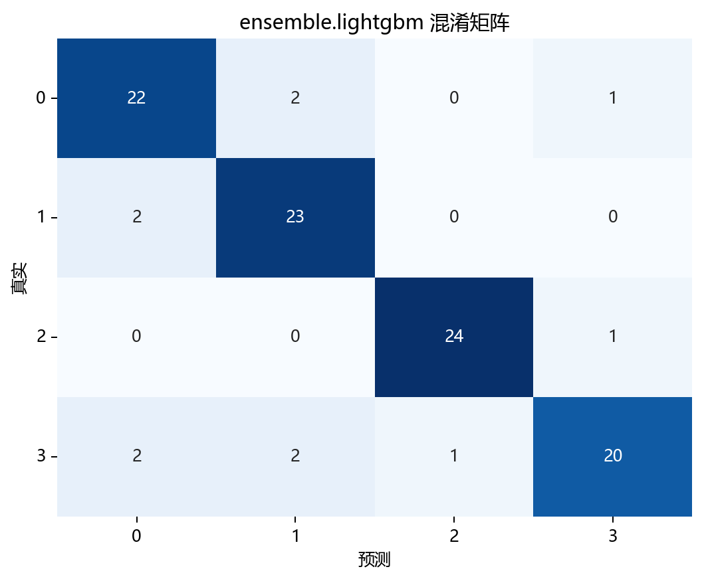
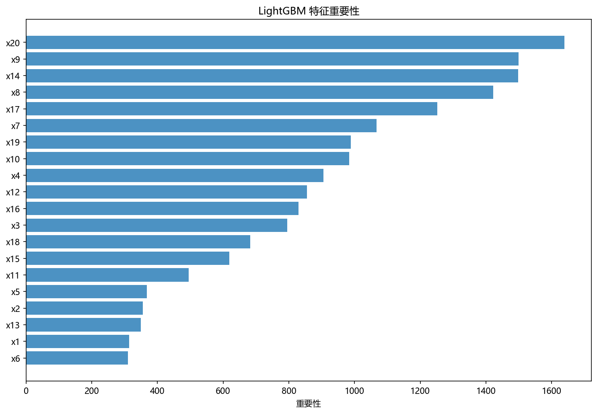

# 思路与直觉

## 本章目标

1. 用直观方式理解 LightGBM 相对于 GBDT 的三项核心创新——Leaf-wise 生长、直方图加速、GOSS 采样。
2. 理解为什么 LightGBM 比 GBDT 更快——不在数学框架，而在工程实现。
3. 通过与 GBDT 的对比，建立 LightGBM 在 Boosting 谱系中的定位——高效的 GBDT 工程实现。

## 重点方法与概念速览

| 名称 | 类型 | 作用 |
|---|---|---|
| Leaf-wise 生长 | 树生长策略 | 不按层分裂所有叶子——只分裂"最值得长"的那一片叶子 |
| 直方图分桶 | 加速技术 | 连续值 → 离散桶——分裂点从逐个值扫描降为桶边界扫描 |
| GOSS | 采样策略 | 梯度大的样本全保留（没学好），梯度小的样本随机采样（已学好） |
| EFB | 降维技术 | 把互斥特征打包——减少特征扫描次数 |
| 特征重要性 | 附加收益 | 基于分裂增益自动排序——20 个特征中区分有效 vs 噪声 |

## 1. 为什么需要 LightGBM

GBDT（sklearn）有一个工程瓶颈：**训练慢**。当数据量或特征维度增大时，Level-wise 生长 + 预排序分裂点搜索的计算成本急剧上升。

LightGBM 的思路很直接：

> GBDT 的数学框架完全保留——只是用 Leaf-wise 替代 Level-wise、用直方图替代预排序、用 GOSS 替代随机采样。同样的数学，快 10 倍的训练。

### 理解重点

- LightGBM 不创造新的数学——它在 GBDT 之上做了**纯工程优化**。预测结果与调好参的 sklearn GBDT 几乎一致。
- 三大优化瞄准三个计算瓶颈：（1）树怎么长——Leaf-wise；（2）分裂点怎么找——直方图；（3）样本怎么用——GOSS。
- 当前数据 1000 样本 × 20 特征时，LightGBM 训练约 0.4s，GBDT 约 2s——差距约 5 倍。数据越大差距越明显。

## 2. 用"重点培养"理解 Leaf-wise 生长

Level-wise（GBDT）像学校统一教学——每层（深度）所有学生（叶子）同时上课（分裂）。

Leaf-wise（LightGBM）像精英教育——找最有潜力的学生（损失下降最多的叶子）专门辅导（分裂），直到叶子数达到 `num_leaves=31`。

### 理解重点

- Leaf-wise 在同等叶子数下，对复杂边界的拟合更精细——因为它优先把计算资源投入到"最有价值"的区域。
- 代价是树可能非常深——一片叶子连续分裂 7 次就深达 7 层。因此需要 `min_child_samples=20` 等正则化防止单个叶子过小。
- 与 Bagging 的完全生长树不同——Leaf-wise 有明确的 `num_leaves` 上限，不是无限生长。

## 3. 用"大约取整"理解直方图

预排序（sklearn GBDT）像拿着精确的尺子——每个数据点的值都要排序、逐一比较。

直方图（LightGBM）像把尺子刻度简化——只保留 255 个整厘米刻度，按近似值分桶后只在这些整数边界比较。

### 理解重点

- 离散化损失了微小的精度——但换来了巨大的速度提升。在实践中，255 个桶的分割精度通常足够。
- 直方图还有意外的好处——离散化本身是一种正则化，分割更粗糙反而有助于防止过拟合。
- 这就是为什么 LightGBM 在 Kaggle 等比赛中常比调好参的 GBDT 效果更好——快只是其一，直方图正则化是其二。

## 4. 用"补差距"理解 GOSS

一个班级里：
- **成绩差的学生**（大梯度 $\vert\tilde{y}_i\vert$ 大）——需要老师重点关注，全部保留
- **成绩好的学生**（小梯度 $\vert\tilde{y}_i\vert$ 小）——已经学得不错，随机抽查几个即可

GOSS 就是这个策略——100% 保留大梯度样本 + 随机抽样小梯度样本 → 训练样本减少但信息损失很小。

### 理解重点

- 梯度大小天然衡量"学习紧急程度"——大梯度 = 预测偏差大 = 还没学好。
- 随机丢弃"已学好"的样本几乎不影响下一棵树的训练——因为它们对负梯度的贡献已经很小。
- 当前源码 `subsample=0.9` 是均匀概率采样（非严格 GOSS），但其思想一致：减少参与训练的数据量以加速。

## 5. 与 Bagging 和 GBDT 的直觉对比

| 维度 | Bagging | GBDT | LightGBM |
|---|---|---|---|
| 核心问题 | 如何让"太敏感"的专家冷静？ | 如何让"太迟钝"的新手变聪明？ | 如何让"太迟钝"的新手**快速**变聪明？ |
| 训练方式 | 平行——各学各的 | 串行——后人补前人的错 | 串行——更快地补前人的错 |
| 基学习器 | 强学习器（完全生长树） | 弱学习器（浅层树 `max_depth=3`） | 弱学习器（Leaf-wise 树 `num_leaves=31`） |
| 核心收益 | 降方差 | 降偏差 | 降偏差——但训练快 10 倍 |
| 速度瓶颈 | 无（天然并行） | 预排序分裂点搜索 | 直方图分桶 + GOSS——大幅加速 |
| 诊断工具 | OOB 得分 | 特征重要性 + 学习曲线 | 特征重要性 |
| 理想场景 | 高噪声 + 少特征 | 中等维度 + 中等噪声 | **高维 + 大规模数据** |

### 理解重点

- LightGBM 在定位上不是"Boosting 的替代方案"——它是 GBDT 的**高效实现**。数学相同，工程不同。
- 三者的互补关系：Bagging 降方差（平行）、GBDT 降偏差（串行）、LightGBM 更快地降偏差（串行 + 直方图 + GOSS + EFB）。

## 6. 特征重要性在高维数据上的直觉

20 个特征中有 8 个有效、5 个冗余、7 个纯噪声——特征重要性图表天然展示了 Boosting 的"自动特征选择"能力。

### 理解重点

- 冗余特征（`x9`~`x13`）的重要性通常低于有效特征——因为信息已经被有效特征提供。
- 噪声特征（`x14`~`x20`）的重要性应该最低——它们不提供任何真实信息。
- 这就是 Boosting 优于单一决策树的地方——300 棵树的累加使得噪声特征的重要性被稀释，有效特征的重要性被放大。

## 可视化

## 常见坑

1. 把 LightGBM 当成"GBDT 的上位替代"——在极小数据（<100 样本）上，直方图分桶的离散化损失可能反而导致精度低于精调 GBDT。
2. 以为 `num_leaves` 越大越好——Leaf-wise 生长下叶子过多会生成极深的树，容易过拟合。
3. 忽略 `max_depth=-1` 的潜在风险——Leaf-wise 树可能深达 10-15 层，单叶子样本极少。
4. 在低维数据上过度推崇 LightGBM——`n_features=2` 时直方图加速优势不明显。

## 小结

- LightGBM 的直觉核心是"更快地做 GBDT"——Leaf-wise 生长（重点培养）+ 直方图分桶（大约取整）+ GOSS（补差距）+ EFB（打包互斥特征）四项工程优化在不改变数学框架的前提下大幅加速。
- 当前 20 特征四分类数据是展示 LightGBM 在高维场景下速度优势的最佳教学配置——1000 样本时训练比 GBDT 快约 5 倍。
- LightGBM 与 GBDT 在直觉上是同一家族——都靠串行接力把粗糙变精细（降偏差），LightGBM 只是让每一次接力跑得更快。
