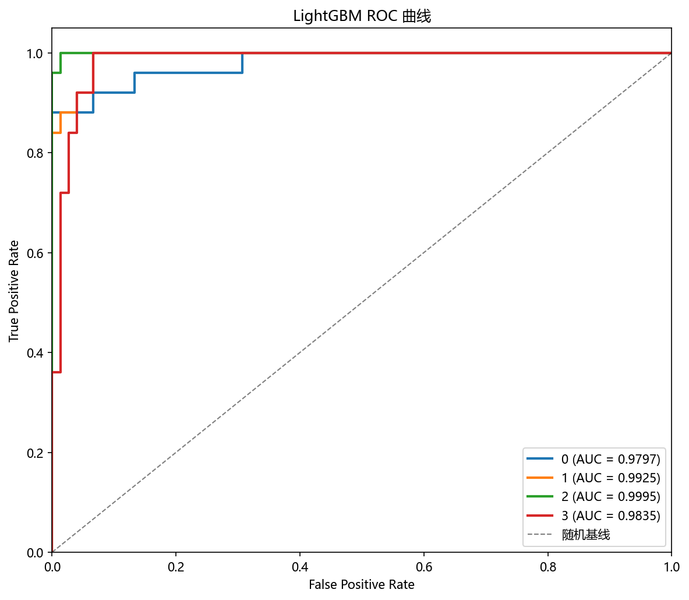

# 评估与诊断

## 本章目标

1. 理解当前 LightGBM 流水线的三项评估输出——混淆矩阵、ROC 曲线、特征重要性。
2. 理解每项评估背后的诊断意图和观察重点。
3. 明确当前流水线**已实现**和**未实现**的评估项——以及未实现的原因。

## 重点方法与概念速览

| 名称 | 类型 | 作用 |
|---|---|---|
| 混淆矩阵 | 图表 | 4×4 热力图——显示每个真实类别被预测为各个类别的样本数，对角线为正确预测 |
| ROC 曲线 | 图表 | one-vs-rest 多分类 ROC——4 个类别各一条曲线 + macro/micro 平均 |
| 特征重要性 | 图表 | 20 个特征按分裂增益排序——区分有效特征（x1~x8）与冗余/噪声特征 |
| 终端日志 | 文本 | 训练完成时打印超参数和训练耗时——无准确率等汇总指标 |

## 1. 混淆矩阵

`plot_confusion_matrix(y_test, y_pred, title="LightGBM 混淆矩阵", ...)` 绘制测试集混淆矩阵。

### 参数速览

| 参数名 | 类型 | 说明 | 示例取值 |
|---|---|---|---|
| `y_test` | `Series`，形状 `(200,)` | 测试集真实标签 $\{0, 1, 2, 3\}$ | 来自 `train_test_split` |
| `y_pred` | `ndarray`，形状 `(200,)` | 模型预测标签——300 棵树加权累加后 argmax | `model.predict(X_test_s)` |
| `title` | `str` | 图表标题 | `"LightGBM 混淆矩阵"` |
| `dataset_name` | `str` | 数据集名称——决定输出路径 | `"lightgbm"` |
| `model_name` | `str` | 模型名称——决定输出路径 | `"lightgbm"` |

### 示例代码

```python
y_pred = model.predict(X_test_s)
plot_confusion_matrix(
    y_test, y_pred,
    title="LightGBM 混淆矩阵",
    dataset_name="lightgbm",
    model_name="lightgbm",
)
```

### 输出


### 理解重点

- 这是一个 4×4 的矩阵（四分类）——对角线越亮、非对角越暗，模型越好。
- 对于 `class_sep=0.6` 的数据，对角线通常有明显集中趋势——但非对角会有一定分散，因为类别间隔较小。
- 与 Bagging（2×2）和 GBDT（3×3）对比——LightGBM 的 4×4 矩阵反映更高维度的分类复杂度。

## 2. ROC 曲线

`plot_roc_curve(y_test, y_scores, ...)` 绘制多分类 ROC 曲线。

### 参数速览

| 参数名 | 类型 | 说明 | 示例取值 |
|---|---|---|---|
| `y_test` | `Series`，形状 `(200,)` | 测试集真实标签 $\{0, 1, 2, 3\}$ | 来自 `train_test_split` |
| `y_scores` | `ndarray`，形状 `(200, 4)` | 4 列概率输出——每列对应一个类别的 softmax 概率 | `model.predict_proba(X_test_s)` |
| `title` | `str` | 图表标题 | `"LightGBM ROC 曲线"` |
| `dataset_name` | `str` | 数据集名称 | `"lightgbm"` |
| `model_name` | `str` | 模型名称 | `"lightgbm"` |

### 示例代码

```python
y_scores = model.predict_proba(X_test_s)
plot_roc_curve(
    y_test, y_scores,
    title="LightGBM ROC 曲线",
    dataset_name="lightgbm",
    model_name="lightgbm",
)
```

### 输出



### 理解重点

- 多分类 ROC 使用 one-vs-rest 策略——每个类别作为"正类"，其余三类作为"负类"，分别画一条 ROC 曲线。
- 同时绘制 macro-average（各曲线等权平均）和 micro-average（全局 TP/FP 累加）。
- LightGBM 的 `predict_proba()` 与 sklearn 接口完全兼容——无需 `hasattr` 条件检查。

## 3. 特征重要性

`plot_feature_importance(model, feature_names=feature_names, ...)` 绘制特征重要性柱状图。

### 参数速览

| 参数名 | 类型 | 说明 | 示例取值 |
|---|---|---|---|
| `model` | `LGBMClassifier` | 已训练的 LightGBM 模型——含 `feature_importances_` 属性 | `model` |
| `feature_names` | `list[str]` | 特征名列表 | `["x1", "x2", ..., "x20"]` |
| `title` | `str` | 图表标题 | `"LightGBM 特征重要性"` |
| `top_n` | `int` | 显示前 N 个重要特征。默认全部 | `10`、`20` |

### 示例代码

```python
feature_names = list(X.columns)
plot_feature_importance(
    model,
    feature_names=feature_names,
    title="LightGBM 特征重要性",
    dataset_name="lightgbm",
    model_name="lightgbm",
)
```

### 输出


### 理解重点

- LightGBM 的特征重要性基于**分裂增益**（`gain`）——每次树分裂时该特征带来的损失下降量累加。
- 预期观察：有效特征（`x1`~`x8`）的重要性显著高于冗余特征（`x9`~`x13`）和噪声特征（`x14`~`x20`）。
- 与 GBDT 的对比意义——在更高维度（20 vs 8）下，LightGBM 的特征重要性排序更稳定，因为列采样减少了单特征的过拟合倾向。

## 4. 已实现 vs 未实现的评估

### 参数速览

| 评估项 | 状态 | 原因 |
|---|---|---|
| 混淆矩阵 | 已实现 | 分类评估的基础指标——4×4 多分类热力图 |
| ROC 曲线 | 已实现 | LightGBM 始终支持 `predict_proba`——无需条件检查 |
| 特征重要性 | 已实现 | LightGBM 的 `feature_importances_` 属性——训练后自动可用 |
| 准确率/精确率/召回率/F1 打印 | **未实现** | 可从混淆矩阵直接计算——图表更直观 |
| 学习曲线 | **未实现** | GBDT 分册已展示该评估——LightGBM 不做重复诊断 |
| 决策边界可视化 | **未实现** | 数据为 20 维——无法在二维平面上直接绘制 |
| LightGBM vs GBDT 训练耗时对比 | **未实现** | 可在练习中手动对比——流水线保持简洁 |
| 交叉验证 | **未实现** | 当前专注于单次 split 的评估——留出法在教学场景下足够 |

### 理解重点

- LightGBM 的评估集比 GBDT 少一项（学习曲线），比 Bagging 多一项（特征重要性）。
- 决策边界无法绘制（20 维）——与 Bagging 的 2 维双月牙形成有趣的对比。
- 评估设计遵循"够用且不冗余"原则——已通过 GBDT 展示过的诊断手段不再重复。

## 5. LightGBM vs GBDT vs Bagging 评估对比

| 评估维度 | Bagging | GBDT | LightGBM | 差异原因 |
|---|---|---|---|---|
| 混淆矩阵 | 2×2（二分类） | 3×3（三分类） | 4×4（四分类） | 数据类别数递增 |
| ROC 曲线 | 条件可用 | 始终可用 | 始终可用 | `predict_proba` 支持情况 |
| 特征重要性 | 无 | 8 特征排序 | 20 特征排序 | LightGBM 维度最高 |
| 学习曲线 | 无 | 有 | 无 | LightGBM 教学精简 |
| OOB 得分 | 有 | 无 | 无 | 仅 Bagging 有 Bootstrap |
| 训练耗时日志 | 有 | 有 | 有 | 三者一致 |

## 常见坑

1. 期待 4×4 混淆矩阵像二分类一样简洁——多分类混淆矩阵有 16 个单元格，需逐类对比。
2. 把特征重要性排序当成"因果关系的证明"——重要性仅反映特征在模型中被使用的程度，不等于因果影响。
3. 忽略 4 个类别之间的结构性混淆——某些类别间的混淆可能是数据固有的。
4. 认为评估项越多越好——教学场景下冗余评估反而分散注意力。

## 小结

- LightGBM 当前有三项评估输出：混淆矩阵（4×4 多分类热力图）、ROC 曲线（one-vs-rest 4 类）、特征重要性（20 特征按增益排序）。
- 与 GBDT 对比：少一项学习曲线（教学精简），多 4 个分类维度和 12 个特征维度的评估挑战。
- 未实现的评估项（学习曲线、准确率打印、决策边界、交叉验证）有明确的教学设计考量——保持流水线聚焦 LightGBM 独有价值的诊断。
