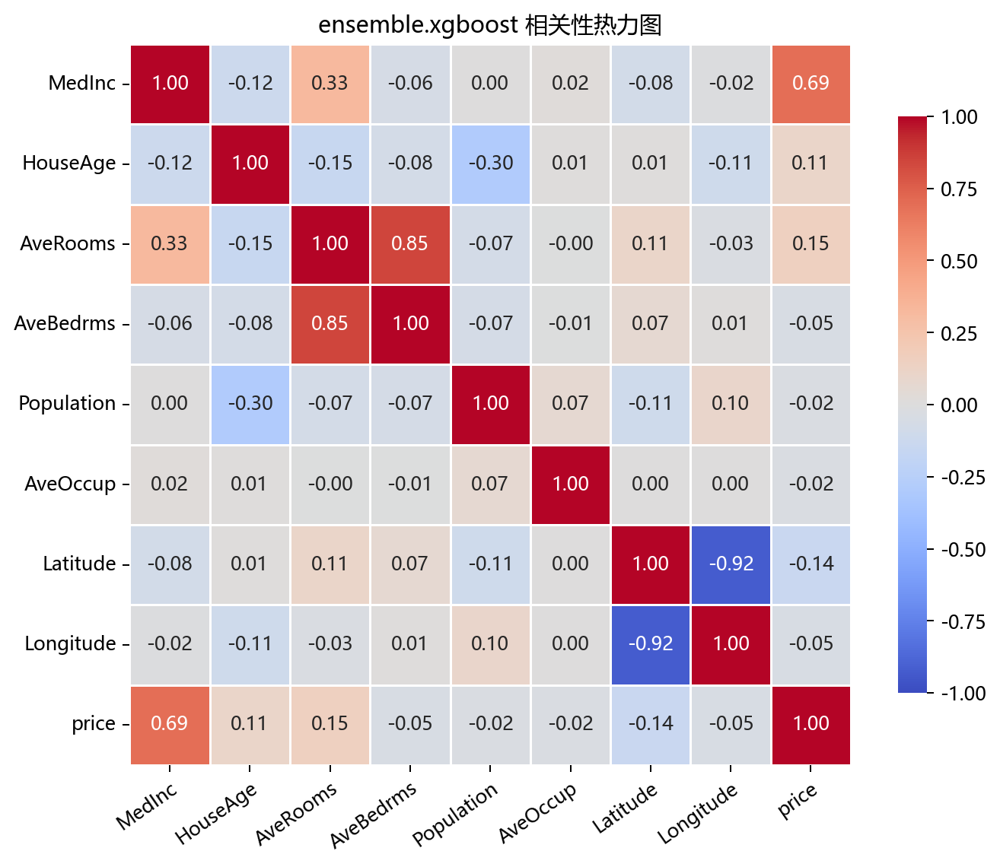

# 数据构成

## 本章目标

1. 明确本仓库 XGBoost 数据来自 `EnsembleData.xgboost()` 返回的加州房价真实数据集。
2. 理解为什么选择真实回归数据——20640 条记录充分展示 XGBoost 的工程实力和正则化优势。
3. 明确当前流程中的训练/测试切分——注意无标准化（树模型天然尺度不敏感），无分层抽样（回归无类别）。

## 重点方法与概念速览

| 名称 | 类型 | 作用 |
|---|---|---|
| `EnsembleData.xgboost()` | 静态方法 | 返回加州房价真实数据集 |
| `fetch_california_housing(...)` | 函数 | scikit-learn 提供的真实世界加州房价数据集加载器 |
| `xgboost_data` | 变量 | 在 `data_generation/__init__.py` 中导出的全局 DataFrame（20640 × 9） |
| `price` | 目标列 | 连续值回归目标——加州地区房屋中位价（单位：10 万美元） |
| `train_test_split` | 函数 | 训练/测试切分——无 `stratify` 参数（回归任务） |

## 1. 数据生成：`EnsembleData.xgboost()`

### 参数速览

| 参数名 | 类型 | 说明 | 示例取值 |
|---|---|---|---|
| `as_frame` | `bool` | `True`——返回 Pandas DataFrame，含特征名和目标列 | `True`、`False` |
| 返回值 | `Bunch` | sklearn Bunch 对象——`.frame` 属性为 DataFrame，目标列名 `MedHouseVal` | — |

### 特征列表

| 特征名 | 全称 | 类型 | 说明 |
|---|---|---|---|
| `MedInc` | Median Income | 连续 | 街区收入中位数（万美元） |
| `HouseAge` | House Age | 连续 | 房屋年龄中位数（年） |
| `AveRooms` | Average Rooms | 连续 | 每户平均房间数 |
| `AveBedrms` | Average Bedrooms | 连续 | 每户平均卧室数 |
| `Population` | Population | 连续 | 街区人口 |
| `AveOccup` | Average Occupancy | 连续 | 每户平均居住人数 |
| `Latitude` | Latitude | 连续 | 纬度 |
| `Longitude` | Longitude | 连续 | 经度 |

### 目标列

| 目标名 | 全称 | 类型 | 取值范围 |
|---|---|---|---|
| `price` | Median House Value | 连续 | 约 $[0.15, 5.0]$（单位：10 万美元） |

### 示例代码

```python
from sklearn.datasets import fetch_california_housing

data = fetch_california_housing(as_frame=True)
df = data.frame.rename(columns={"MedHouseVal": "price"})
# df.shape = (20640, 9)  # 8 特征 + 1 目标 price
```

### 理解重点

- 这是本仓库集成学习分册中唯一的**真实数据集**——非合成生成，含 20640 条记录，8 个特征各有现实含义。
- 目标 `price` 是**连续值**——这是回归任务，不是分类。与 Bagging/GBDT/LightGBM 的离散标签形成根本区别。
- `n_samples` 参数对此方法无效——真实数据集的行数固定为 20640。
- 与所有其他集成模型的数据设计意图不同：这里不追求"展示方差缩减"或"偏差缩减"，而是展示 XGBoost 在真实工业表格数据上的综合表现。

## 2. 特征列与目标列

### 参数速览

| 参数名 | 类型 | 说明 | 示例取值 |
|---|---|---|---|
| `X` | `DataFrame`，形状 `(20640, 8)` | 含 8 个连续特征的特征矩阵 | `data.drop(columns=["price"])` |
| `y` | `Series`，形状 `(20640,)` | 连续回归目标——房屋中位价 | `data["price"]` |

### 理解重点

- `price` 是回归监督目标——参与 `model.fit()` 和残差分析评估。
- 特征全为连续值——无类别变量，无需独热编码。
- 与 Bagging/GBDT/LightGBM 的标签列不同：这里没有 `stratify`，没有 `predict_proba`，没有混淆矩阵。

## 3. 训练/测试切分

### 参数速览

适用 API：`train_test_split(X, y, test_size=0.2, random_state=42)`

| 参数名 | 类型 | 说明 | 示例取值 |
|---|---|---|---|
| `X` | `DataFrame`，形状 `(20640, 8)` | 全量特征矩阵 | `X` |
| `y` | `Series`，形状 `(20640,)` | 全量目标 | `y` |
| `test_size` | `float` | 测试集比例。`0.2`——4128 个测试样本 | `0.2`、`0.3` |
| `random_state` | `int` | 随机种子。`42` | `42` |
| 返回值 | `(DataFrame, DataFrame, Series, Series)` | `X_train`（16512 样本）、`X_test`（4128 样本）及对应目标 | — |

### 示例代码

```python
X_train, X_test, y_train, y_test = train_test_split(
    X, y, test_size=0.2, random_state=42
)
```

### 理解重点

- 当前流水线**有**训练/测试切分——与所有集成模型一致。
- **无** `stratify` 参数——回归任务没有类别概念，目标值连续分布。
- **无** `StandardScaler`——树模型基于分裂点比较（$x_j < \text{threshold}$），对特征的线性缩放不敏感。这是与 Bagging/GBDT/LightGBM 流水线的关键差异。

## 4. 数据设计意图：与其他集成模型的对比

| 数据维度 | Bagging | GBDT | LightGBM | XGBoost |
|---|---|---|---|---|
| 数据类型 | 合成 | 合成 | 合成 | **真实** |
| 任务 | 二分类 | 三分类 | 四分类 | **回归** |
| 样本数 | 500 | 500 | 1000 | **20640** |
| 特征维度 | 2 | 8 | 20 | **8** |
| 标签类型 | $\{0,1\}$ | $\{0,1,2\}$ | $\{0,1,2,3\}$ | **连续 $\mathbb{R}$** |
| 标准化 | 有 | 有 | 有 | **无** |
| 分层抽样 | 有 | 有 | 有 | **无** |

### 理解重点

- XGBoost 是四个集成模型中唯一使用真实数据、唯一做回归任务的——这使得它在本仓库集成学习分册中具有独特地位。
- 20640 个样本远超其他集成模型——XGBoost 的列块并行和加权分位数草图在此规模上开始发挥优势。
- 无标准化的设计意味着流水线少了一个步骤——体现了树模型"免预处理"的工程便利。

## 数据可视化



## 常见坑

1. 在回归数据上使用 `stratify`——只有分类任务才有分层抽样的概念，回归目标连续分布。
2. 对树模型做 `StandardScaler`——非必需操作，不会提升模型性能（树分裂只依赖相对顺序）。
3. 修改 `EnsembleData.n_samples` 期望影响数据量——`xgboost()` 使用真实数据集，`n_samples` 对其无效。
4. 混淆目标列名——原始名为 `MedHouseVal`，在 `EnsembleData.xgboost()` 中被重命名为 `price`。

## 小结

- 当前 XGBoost 数据来自 `fetch_california_housing(as_frame=True)`：加州真实房价数据，20640 样本 × 8 特征，目标为连续房价。
- 数据流为：`fetch_california_housing` → 重命名目标列 → 训练/测试切分（无标准化、无分层）。
- 真实数据 + 回归任务的设计意图是展示 XGBoost 在工业表格回归场景下的工程成熟度——正则化、大规模数据、缺失值稀疏感知。
