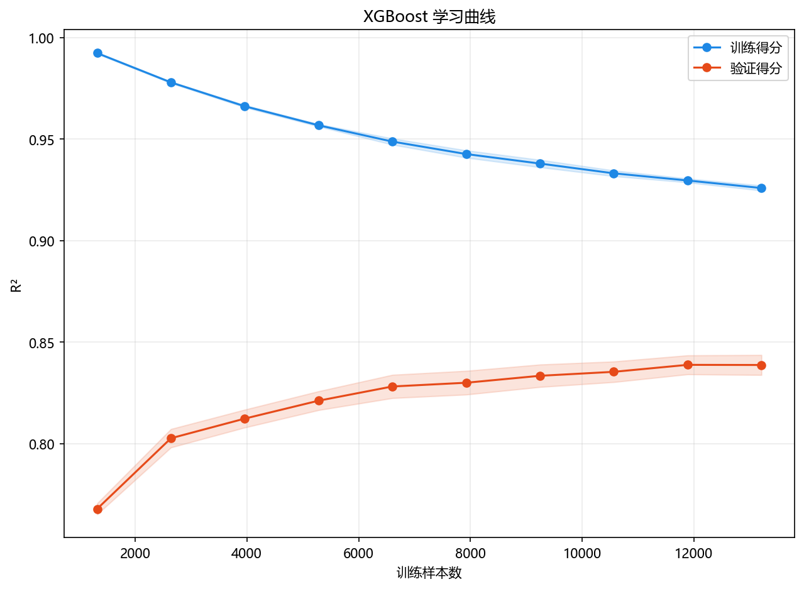

# 训练与预测

> 对应代码：`pipelines/ensemble/xgboost.py`、`model_training/ensemble/xgboost.py`
>  
> 运行方式：`python -m pipelines.ensemble.xgboost`

## 本章目标

1. 明确当前流水线从取数到生成两类图像的完整执行顺序。
2. 理解训练阶段、预测阶段、残差图和特征重要性图分别由哪个函数负责。
3. 明确当前 XGBoost 实现没有标准化步骤，也没有学习曲线。

## 重点方法与概念速览

| 名称 | 类型 | 作用 |
|---|---|---|
| `run()` | 函数 | XGBoost 端到端流水线入口 |
| `train_test_split(...)` | 函数 | 拆分训练集与测试集 |
| `train_model(...)` | 函数 | 训练 XGBoost 回归模型 |
| `model.predict(X_test)` | 方法 | 对测试集做回归预测 |
| `plot_residuals(...)` | 函数 | 绘制残差分析图 |
| `plot_feature_importance(...)` | 函数 | 绘制特征重要性图 |

## 1. 端到端入口 `run()`

### 参数速览（本节）

适用函数：`run()`

| 项目 | 当前实现 |
|---|---|
| 数据源 | `xgboost_data.copy()` |
| 标签列 | `price` |
| 切分方式 | `test_size=0.2, random_state=42` |
| 训练入口 | `train_model(X_train, y_train)` |
| 预测入口 | `model.predict(X_test)` |
| 可视化入口 | `plot_residuals(...)`、`plot_feature_importance(...)` |

### 示例代码

```python
def run():
    data = xgboost_data.copy()
    X = data.drop(columns=["price"])
    y = data["price"]
    feature_names = list(X.columns)
```

### 理解重点

- 整个分册的运行入口就是 `pipelines/ensemble/xgboost.py` 里的 `run()`。
- 这个函数不负责实现 boosting 本身，而是把取数、训练、预测和评估图输出串成一条流程。
- `feature_names` 会在这里提前保存下来，后续供特征重要性图使用。

## 2. 训练前的数据准备顺序

### 参数速览（本节）

适用 API（分项）：

1. `train_test_split(X, y, test_size=0.2, random_state=42)`

| 参数名 | 本例取值 | 说明 |
|---|---|---|
| `test_size` | `0.2` | 测试集占比 |
| `random_state` | `42` | 保证可复现划分 |
| 返回值 | `X_train`、`X_test`、`y_train`、`y_test` | 训练/测试集拆分结果 |

### 示例代码

```python
X_train, X_test, y_train, y_test = train_test_split(
    X, y, test_size=0.2, random_state=42
)
```

### 理解重点

- 当前流水线在数据切分后直接进入训练，没有额外的标准化步骤。
- 这一点和 `svr`、`regularization` 分册不同，文档里必须明确区分。
- 当前实现更强调树模型在原始表格特征上的拟合流程。

## 3. 训练阶段：调用 `train_model(...)`

### 参数速览（本节）

适用函数：`train_model(X_train, y_train)`

| 参数名 | 本例取值 | 说明 |
|---|---|---|
| `X_train` | 训练特征 | 当前直接传入原始训练特征 |
| `y_train` | 训练标签 | 连续值目标 |
| 返回值 | `model` | 已训练好的 `XGBRegressor` 模型 |

### 示例代码

```python
model = train_model(X_train, y_train)
```

### 理解重点

- 当前实现没有把训练和预测揉成同一个函数，而是先得到训练好的模型，再单独调用 `predict(...)`。
- 训练阶段最重要的副产物，不只是 `model` 对象，还有控制台中打印出来的超参数信息。
- 这些日志帮助你确认当前 boosting 配置到底是什么。

## 4. 预测阶段：直接调用 `predict(...)`

### 参数速览（本节）

适用流程（分项）：

1. `y_pred = model.predict(X_test)`

| 参数名 | 本例取值 | 说明 |
|---|---|---|
| `model` | 已训练完成模型 | 来自 `train_model(...)` 返回值 |
| `X_test` | 测试特征 | 当前直接传入未标准化测试集 |
| `y_pred` | 预测值数组 | 用于残差分析 |

### 示例代码

```python
y_pred = model.predict(X_test)
```

### 理解重点

- 当前仓库没有额外封装 `predict_model(...)`，而是直接使用 XGBoost 回归器统一的 `predict(...)` 接口。
- 由于本分册没有标准化步骤，所以预测阶段也直接使用原始测试特征。
- 这让训练和预测流程与当前源码保持完全一致。

## 5. 预测后的残差图与特征重要性图输出

### 参数速览（本节）

适用函数（分项）：

1. `plot_residuals(...)`
2. `plot_feature_importance(...)`

| 参数名 | 本例取值 | 说明 |
|---|---|---|
| `title`（残差图） | `"XGBoost 残差分析"` | 图标题 |
| `title`（重要性图） | `"XGBoost 特征重要性"` | 图标题 |
| `dataset_name` | `"xgboost"` | 输出目录名 |
| `model_name` | `"xgboost"` | 输出文件名前缀 |
| `feature_names` | `list(X.columns)` | 给特征重要性图提供真实列名 |

### 示例代码

```python
plot_residuals(
    y_test,
    y_pred,
    title="XGBoost 残差分析",
    dataset_name=DATASET,
    model_name=MODEL,
)

plot_feature_importance(
    model,
    feature_names=feature_names,
    title="XGBoost 特征重要性",
    dataset_name=DATASET,
    model_name=MODEL,
)
```

### 理解重点

- 残差图负责观察预测误差分布。
- 特征重要性图负责观察 boosting 模型更依赖哪些特征。
- 当前分册之所以提前保存 `feature_names`，就是为了把重要性值和真实列名对应起来。

## 6. 用伪代码看完整流程

### 示例代码

```python
data = xgboost_data.copy()
X = data.drop(columns=["price"])
y = data["price"]
feature_names = list(X.columns)

X_train, X_test, y_train, y_test = train_test_split(...)

model = train_model(X_train, y_train)
y_pred = model.predict(X_test)

plot_residuals(...)
plot_feature_importance(model, feature_names=feature_names, ...)
```

### 理解重点

- 当前 XGBoost 流水线的主线非常清楚：取数、切分、训练、预测、画残差图、画特征重要性图。
- 这条链路里最关键的中间变量是 `feature_names`、训练后的 `model` 和预测结果 `y_pred`。
- 只要把这条流程走清楚，整个 xgboost 分册的工程部分就基本读懂了。

## 训练诊断可视化



## 常见坑

1. 把其他分册里的标准化流程误套到当前 XGBoost 实现上。
2. 误以为当前流水线还有学习曲线或数值指标打印，实际源码并没有这些步骤。
3. 只看模型训练成功，没有继续看残差图和特征重要性图这两类输出。

## 小结

- 当前流水线把数据准备、单模型训练、测试集预测和两种可视化输出串成了一条完整路径。
- 训练函数负责“得到 XGBoost 模型”，流水线函数负责“组织执行和产出结果”。
- 把这一层执行顺序读清楚，后续看评估与工程实现章节就会更顺。
