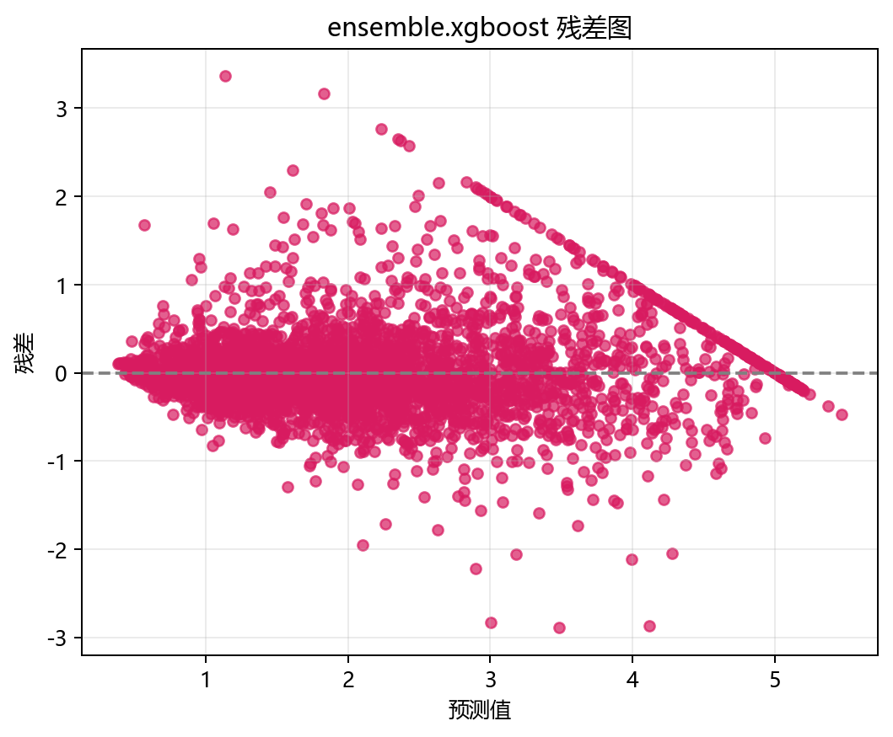
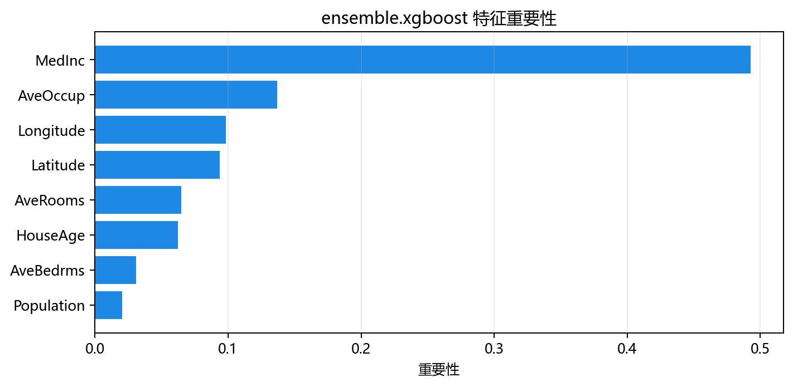

# 评估与诊断

## 本章目标

1. 理解当前 XGBoost 流水线的两项评估输出——残差分析图和特征重要性。
2. 理解残差分析在回归任务中的诊断价值——比混淆矩阵更直接地反映预测误差。
3. 明确当前流水线**已实现**和**未实现**的评估项——以及回归评估与分类评估的根本差异。

## 重点方法与概念速览

| 名称 | 类型 | 作用 |
|---|---|---|
| 残差分析图 | 图表 | 残差散点图（y_true vs y_pred）+ 残差分布直方图——检验预测是否存在系统偏差 |
| 特征重要性 | 图表 | 8 个特征按分裂增益排序——揭示房价的核心驱动因素 |
| 终端日志 | 文本 | 训练完成时打印 9 项超参数和训练耗时 |

## 1. 残差分析图

`plot_residuals(y_test, y_pred, title="XGBoost 残差分析", ...)` 绘制残差诊断图。

### 参数速览

| 参数名 | 类型 | 说明 | 示例取值 |
|---|---|---|---|
| `y_test` | `Series`，形状 `(4128,)` | 测试集真实房价 | 来自 `train_test_split` |
| `y_pred` | `ndarray`，形状 `(4128,)` | 模型预测房价——300 棵树加权累加 | `model.predict(X_test)` |
| `title` | `str` | 图表标题 | `"XGBoost 残差分析"` |
| `dataset_name` | `str` | 数据集名称——决定输出路径 | `"xgboost"` |
| `model_name` | `str` | 模型名称——决定输出路径 | `"xgboost"` |

### 示例代码

```python
y_pred = model.predict(X_test)
plot_residuals(
    y_test, y_pred,
    title="XGBoost 残差分析",
    dataset_name="xgboost",
    model_name="xgboost",
)
```

### 输出



### 理解重点

- 残差 = $y_{\text{true}} - y_{\text{pred}}$——正值表示模型低估了房价，负值表示高估。
- 残差分析图通常包含两个子图：
  - **残差散点图**：横轴为预测值，纵轴为残差——理想情况下残差随机分布在零线上下且无明显模式
  - **残差分布直方图**：残差的分布——理想情况下接近正态分布、中心在 0
- 常见异常模式：残差随预测值增大而增大（异方差性——对高房价区间预测不准确）、残差在某些区域系统偏高或偏低（模型欠拟合）。
- 与分类混淆矩阵的对比：混淆矩阵看"错分了多少"，残差图看"偏差有多大及其分布模式"。

## 2. 特征重要性

`plot_feature_importance(model, feature_names=feature_names, ...)` 绘制特征重要性柱状图。

### 参数速览

| 参数名 | 类型 | 说明 | 示例取值 |
|---|---|---|---|
| `model` | `XGBRegressor` | 已训练的 XGBoost 模型——含 `feature_importances_` 属性 | `model` |
| `feature_names` | `list[str]` | 特征名列表 | `["MedInc", "HouseAge", ...]` |
| `title` | `str` | 图表标题 | `"XGBoost 特征重要性"` |
| `dataset_name` | `str` | 数据集名称 | `"xgboost"` |
| `model_name` | `str` | 模型名称 | `"xgboost"` |

### 示例代码

```python
feature_names = list(X.columns)
plot_feature_importance(
    model,
    feature_names=feature_names,
    title="XGBoost 特征重要性",
    dataset_name="xgboost",
    model_name="xgboost",
)
```

### 输出



### 理解重点

- XGBoost 的特征重要性基于**分裂增益**（`gain`）——每次分裂带来的损失下降量，按特征累计。
- 在加州房价数据上，`MedInc`（收入中位数）通常是最重要的特征——收入是房价的核心驱动因素，符合经济学直觉。
- `Latitude` 和 `Longitude`（地理位置）通常也具有高重要性——房价与地理位置强相关。
- 与 GBDT/LightGBM 的特征重要性含义相同——但 XGBoost 使用二阶增益公式计算。

## 3. 已实现 vs 未实现的评估

### 参数速览

| 评估项 | 状态 | 原因 |
|---|---|---|
| 残差分析图 | 已实现 | 回归评估的核心诊断工具 |
| 特征重要性 | 已实现 | XGBoost 的 `feature_importances_`——训练后自动可用 |
| 混淆矩阵 | **不适用** | 回归任务——无类别可混淆 |
| ROC 曲线 | **不适用** | 回归模型无 `predict_proba`，无 one-vs-rest 概念 |
| 学习曲线 | **未实现** | GBDT 分册已展示——XGBoost 不重复相同诊断 |
| $R^2$ / MAE / MSE 打印 | **未实现** | 可从残差图直接估计——图表比单个标量数值更具诊断价值 |
| 交叉验证 | **未实现** | 当前专注于单次切分评估——留出法在教学场景下足够 |

### 理解重点

- XGBoost 的评估体系与其他集成模型有根本差异——回归 vs 分类导致评估工具完全不同。
- 残差分析图是回归评估的"混淆矩阵等价物"——它回答"预测哪里错了、为什么错"，而非简单统计错分数量。
- 不打印 $R^2$ 等标量指标是有意设计——教学场景下残差分布的视觉诊断比单个数值更能揭示问题。

## 4. XGBoost vs 其他集成模型评估对比

| 评估维度 | Bagging | GBDT | LightGBM | XGBoost |
|---|---|---|---|---|
| 任务类型 | 分类 | 分类 | 分类 | **回归** |
| 混淆矩阵 | 2×2 | 3×3 | 4×4 | **不适用** |
| ROC 曲线 | 条件可用 | 始终可用 | 始终可用 | **不适用** |
| 残差分析 | 无 | 无 | 无 | **有** |
| 特征重要性 | 无 | 8 特征排序 | 20 特征排序 | **8 特征排序** |
| 学习曲线 | 无 | 有 | 无 | 无 |
| OOB 得分 | 有 | 无 | 无 | 无 |

### 理解重点

- 残差图 vs 混淆矩阵代表了回归评估与分类评估的本质差异——前者分析误差的幅度和模式，后者分析错分的类型和数量。
- 特征重要性在四个模型中的含义一致（分裂增益），但 XGBoost 使用其二阶增益公式计算。

## 5. 残差图的诊断重点

### 健康的残差图

- 残差随机散布在零线上下，无明显趋势
- 残差主要集中在 ±0.5（半个价格单位）以内
- 没有明显的异方差性（高预测区残差显著增大）

### 需要关注的异常信号

- **漏斗形**：残差随预测值增大而扩大——模型对高房价区间的预测不稳定
- **U 形分布**：残差在中等预测区偏大——模型过度平滑了边界
- **偏移分布**：残差均值显著偏离 0——模型存在系统性高估或低估

## 常见坑

1. 用分类评估指标来评判回归模型——回归没有 accuracy/precision/recall 概念。
2. 仅看残差均值而忽略分布模式——均值接近 0 也可能存在结构性错误（高估低价房、低估高价房）。
3. 把特征重要性当成因果推断——`MedInc` 重要说明它与房价相关，但"涨工资"不一定直接"推高房价"。
4. 在回归数据上期待 ROC 曲线——回归模型没有 `predict_proba`。

## 小结

- XGBoost 当前有两项评估输出：残差分析图（回归诊断核心）和特征重要性（8 特征增益排序）。
- 残差图是回归评估的标准工具——它直接显示预测误差的大小、分布和模式，比单指标更信息丰富。
- 与分类集成模型的评估差异源于任务本质：回归分析误差幅度和模式，分类统计错分的类型和频次。
