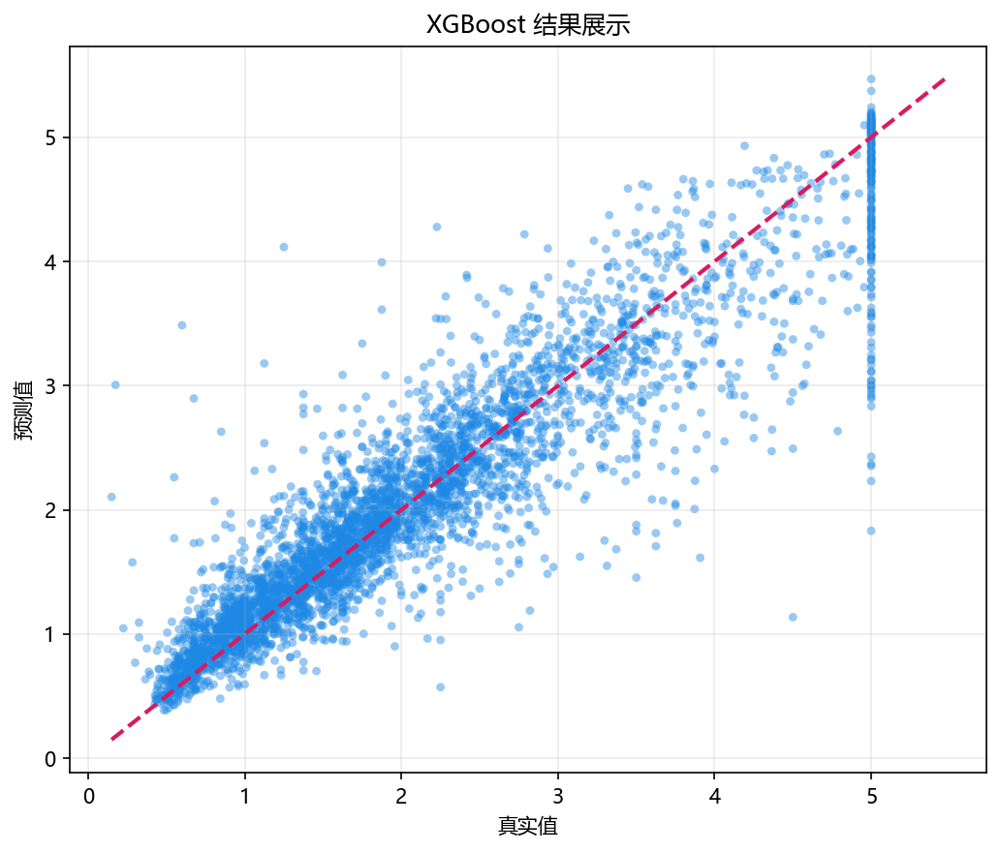

# 工程实现

> 对应代码：`data_generation/ensemble.py`、`model_training/ensemble/xgboost.py`、`pipelines/ensemble/xgboost.py`、`result_visualization/residual_plot.py`、`result_visualization/feature_importance.py`
>  
> 运行方式：`python -m pipelines.ensemble.xgboost`

## 本章目标

1. 看清当前 XGBoost 分册在仓库中的模块分层与调用关系。
2. 理解从命令行入口到两类结果图落盘，中间依次发生了什么。
3. 明确哪些逻辑属于数据层、训练层、流水线层和可视化层。

## 对应代码速览

| 组件 | 路径 | 说明 |
|---|---|---|
| 数据生成层 | `data_generation/ensemble.py` | `EnsembleData.xgboost()` 加载数据 |
| 数据导出层 | `data_generation/__init__.py` | 提供 `xgboost_data` 给外部导入 |
| 训练层 | `model_training/ensemble/xgboost.py` | 定义 `train_model(...)` 并训练 XGBoost 模型 |
| 流水线层 | `pipelines/ensemble/xgboost.py` | 负责切分、训练、预测、画图 |
| 残差可视化层 | `result_visualization/residual_plot.py` | 负责残差图绘制与保存 |
| 特征重要性层 | `result_visualization/feature_importance.py` | 负责特征重要性图绘制与保存 |

## 1. 入口命令如何触发整条链路

### 示例代码

```bash
python -m pipelines.ensemble.xgboost
```

### 理解重点

- 这个命令会执行 `pipelines/ensemble/xgboost.py` 中的 `run()`。
- `run()` 是真正的工程入口，其他模块都被它按顺序调用。
- 所以理解工程实现时，最清晰的方式也是先从入口脚本往下追踪。

## 2. 模块之间的调用关系

### 示例代码

```python
from data_generation import xgboost_data
from model_training.ensemble.xgboost import train_model
from result_visualization.residual_plot import plot_residuals
from result_visualization.feature_importance import plot_feature_importance
```

### 理解重点

- `pipelines` 层不自己造数据、不自己实现模型，也不自己画图，而是扮演调度者角色。
- 这种分层使每个文件职责单一：数据文件只关心数据，训练文件只关心模型，画图文件只关心结果展示。
- 当前 XGBoost 分册虽然没有学习曲线，但整体工程分层依然很清楚。

## 3. 流水线层真正负责什么

### 参数速览（本节）

适用逻辑（分项）：

1. 复制数据
2. 拆分特征与标签
3. 保存 `feature_names`
4. 切分训练/测试集
5. 调用训练函数
6. 预测测试集
7. 输出残差图与特征重要性图

| 步骤 | 所在文件 | 当前职责 |
|---|---|---|
| 读取 `xgboost_data` | `pipelines/ensemble/xgboost.py` | 拿到统一数据入口 |
| `X` / `y` 拆分 | `pipelines/ensemble/xgboost.py` | 明确特征与标签 |
| 保存 `feature_names` | `pipelines/ensemble/xgboost.py` | 供重要性图使用 |
| 训练/测试切分 | `pipelines/ensemble/xgboost.py` | 生成训练和评估输入 |
| 调用 `train_model(...)` | `pipelines/ensemble/xgboost.py` | 获得训练好的 XGBoost 模型 |
| `predict(...)` + 两种画图函数 | `pipelines/ensemble/xgboost.py` | 完成结果输出 |

### 理解重点

- 当前仓库没有使用 `Pipeline` 类，也没有显式验证集和早停流程。
- 这种显式写法更适合教学，因为每一步都能直接看到变量名和执行顺序。
- XGBoost 分册最容易被误读的地方，是把“真实存在的训练流程”和“理论上常见的高级工程技巧”混为一谈，因此这里要特别明确当前实现边界。

## 4. 训练层真正负责什么

### 参数速览（本节）

适用函数：`train_model(...)`

| 输出项 | 作用 |
|---|---|
| `model` | 返回已训练好的 `XGBRegressor` 模型 |
| 控制台日志 | 打印关键 boosting 超参数和训练耗时 |

### 理解重点

- 训练层并不负责切分数据，也不负责绘制残差图或特征重要性图。
- 它的核心任务是构建 XGBoost 模型、拟合训练数据，并回显当前超参数配置。
- 和线性回归、决策树相比，这里日志的重点是超参数集合而不是单个结构性指标。

## 5. 可视化层真正负责什么

### 参数速览（本节）

适用函数（分项）：

1. `plot_residuals(...)`
2. `plot_feature_importance(...)`

| 函数 | 当前作用 |
|---|---|
| `plot_residuals(...)` | 看预测误差分布 |
| `plot_feature_importance(...)` | 看特征贡献分布 |

### 理解重点

- 残差图函数只关心真实值和预测值。
- 特征重要性函数只关心模型的重要性属性与特征名映射。
- 这种分层让当前 XGBoost 分册的训练逻辑与结果展示逻辑保持清晰分离。

## 6. 常量 `DATASET` 和 `MODEL` 的作用

### 参数速览（本节）

适用常量：

1. `DATASET = "xgboost"`
2. `MODEL = "xgboost"`

| 常量 | 当前作用 |
|---|---|
| `DATASET` | 决定图片输出的上层目录 |
| `MODEL` | 决定图片文件名前缀 |

### 理解重点

- 这两个常量的作用，不是影响模型训练，而是统一结果文件的命名和归档。
- 这样当前 XGBoost 分册生成的图像会被稳定保存到固定位置。
- 这也是为什么当前工程结构适合后续继续扩展更多评估图表。

## 7. 缺少 `xgboost` 依赖时会发生什么

### 理解重点

- 当前训练模块会先尝试导入 `XGBRegressor`。
- 如果导入失败，`train_model(...)` 会抛出明确的 `ImportError`，提醒当前环境缺少 `xgboost` 依赖。
- 这说明当前工程实现已经考虑到了外部依赖边界，但没有在流水线中内置自动安装逻辑。

## 8. 从命令到结果图的执行链

### 示例代码

```python
python -m pipelines.ensemble.xgboost
    -> run()
    -> xgboost_data.copy()
    -> train_test_split(...)
    -> train_model(...)
    -> model.predict(...)
    -> plot_residuals(...)
    -> plot_feature_importance(...)
    -> savefig(...)
```

### 理解重点

- 这条链里最关键的中间产物有三个：`feature_names`、训练后的 `model`、测试集预测 `y_pred`。
- 一旦这些中间变量理解清楚，整个 xgboost 分册的代码结构就基本串起来了。
- 文档中的各章节，其实就是在拆解这条执行链上的不同环节。



## 常见坑

1. 把 `pipelines` 层和 `model_training` 层职责混在一起，误以为训练函数负责全部工程流程。
2. 不理解为什么当前分册没有学习曲线或早停流程，从而误读当前实现能力边界。
3. 忽略 `feature_names`、`DATASET` 和 `MODEL` 的作用，看不懂特征重要性图和输出目录为什么能稳定生成。

## 小结

- 当前 XGBoost 实现采用了清晰的分层结构：数据层、训练层、流水线层、可视化层各司其职。
- 入口脚本负责调度，训练模块负责模型，画图模块负责结果呈现。
- 这种结构既方便阅读，也方便后续继续补指标打印、学习曲线、验证集或早停实验。
