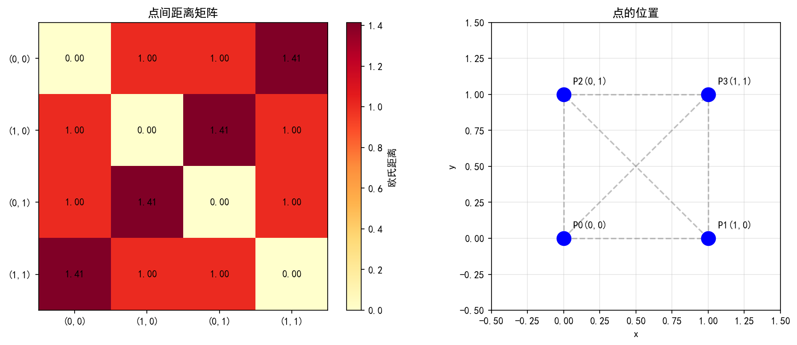
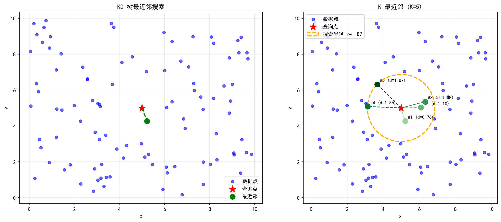
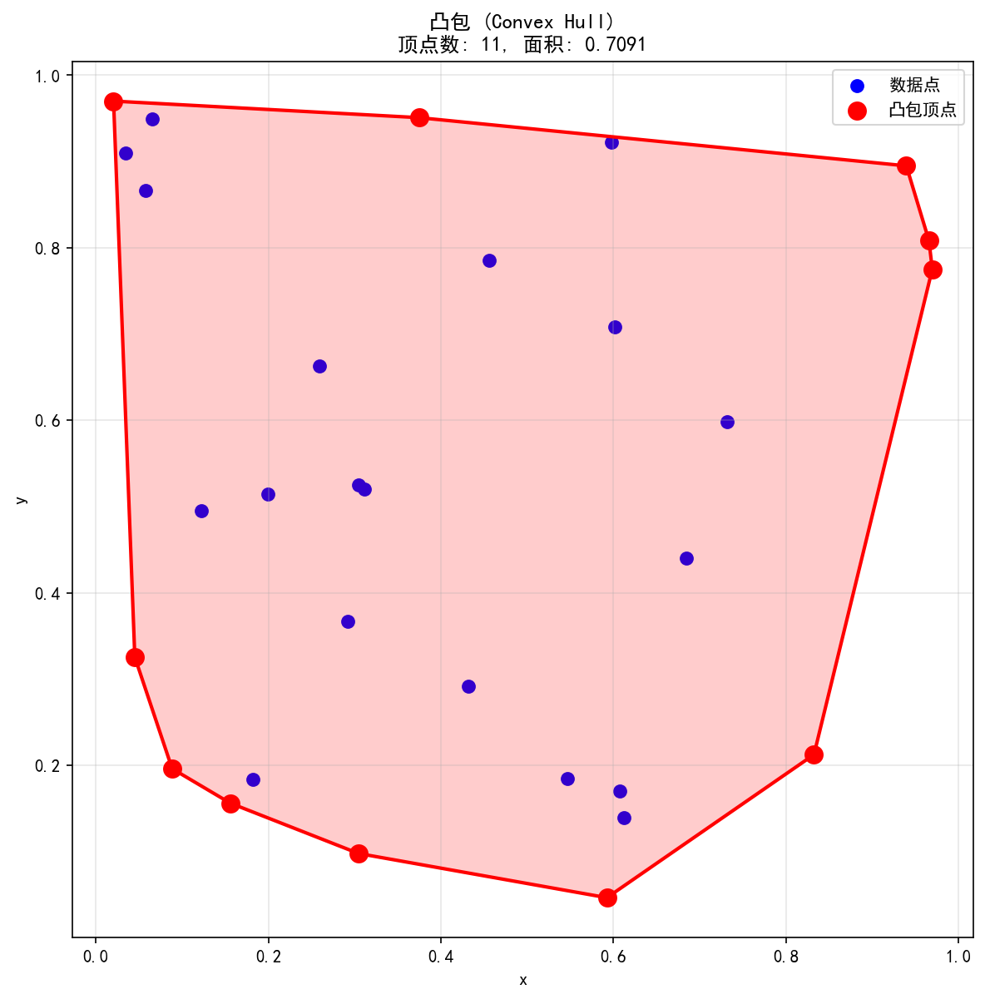
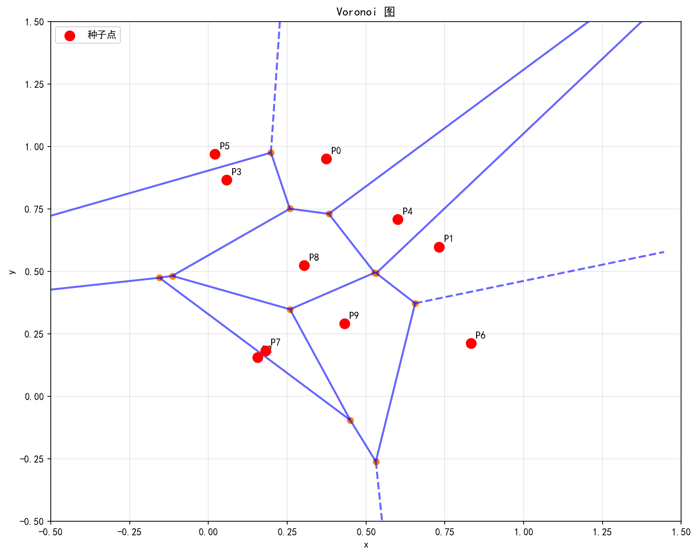
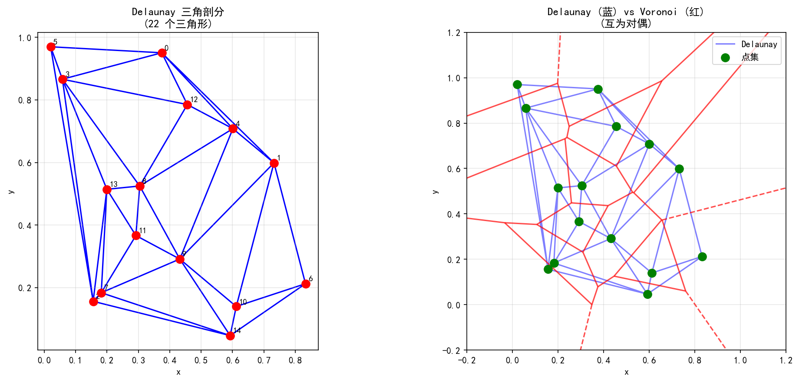

# SciPy 空间数据与距离计算

> 对应脚本：`Basic/Scipy/10_spatial.py`
> 运行方式：`python Basic/Scipy/10_spatial.py`（仓库根目录）

## 本章目标

1. 掌握常见距离度量（欧氏、曼哈顿、切比雪夫、余弦）及距离矩阵计算。
2. 学会使用 KD 树进行高效最近邻搜索。
3. 理解凸包（Convex Hull）的计算与属性。
4. 掌握 Voronoi 图的构建与区域分析。
5. 了解 Delaunay 三角剖分及其与 Voronoi 图的对偶关系。

## 重点方法速览

| 方法 | 作用 | 本章位置 |
|---|---|---|
| `distance.euclidean(u, v)` | 欧氏距离 | `demo_distance` |
| `distance.cdist(XA, XB, metric)` | 成对距离矩阵 | `demo_distance` |
| `spatial.KDTree(data)` | 构建 KD 树 | `demo_kdtree` |
| `tree.query(x, k)` | K 最近邻查询 | `demo_kdtree` |
| `spatial.ConvexHull(points)` | 凸包计算 | `demo_convex_hull` |
| `spatial.Voronoi(points)` | Voronoi 图 | `demo_voronoi` |
| `spatial.Delaunay(points)` | Delaunay 三角剖分 | `demo_delaunay` |

## 1. 距离计算

### 方法重点

- `distance.euclidean(u, v)` 计算欧氏距离（L2 范数），最常用的距离度量。
- `distance.cityblock(u, v)` 计算曼哈顿距离（L1 范数），各维度差的绝对值之和。
- `distance.chebyshev(u, v)` 计算切比雪夫距离（L∞ 范数），各维度差的最大值。
- `distance.cosine(u, v)` 计算余弦距离（1 - 余弦相似度），衡量方向差异而非大小。
- `distance.cdist(XA, XB, metric)` 计算两组点之间的成对距离矩阵。

### 参数速览（本节）

适用 API（分项）：

1. `distance.euclidean(u, v)` / `cityblock` / `chebyshev` / `cosine`
2. `distance.cdist(XA, XB, metric='euclidean')`

| 参数名 | 本例取值 | 说明 |
|---|---|---|
| `u`, `v` | `[1,2,3]`, `[4,5,6]` | 两个向量 |
| `XA` | `[[0,0],[1,0],[0,1],[1,1]]` | 第一组点 |
| `XB` | 同 `XA` | 第二组点 |
| `metric` | `'euclidean'` | 距离度量类型 |

### 示例代码

```python
import numpy as np
from scipy.spatial import distance

a = np.array([1, 2, 3])
b = np.array([4, 5, 6])

print(f"向量 a: {a}")
print(f"向量 b: {b}")

# 多种距离度量
print(f"欧氏距离: {distance.euclidean(a, b):.4f}")
print(f"曼哈顿距离: {distance.cityblock(a, b):.4f}")
print(f"切比雪夫距离: {distance.chebyshev(a, b):.4f}")
print(f"余弦距离: {distance.cosine(a, b):.4f}")

# 距离矩阵
points = np.array([[0, 0], [1, 0], [0, 1], [1, 1]])
dist_matrix = distance.cdist(points, points, 'euclidean')
print(f"\n4个点的距离矩阵:\n{np.round(dist_matrix, 4)}")
```

### 结果输出

```text
向量 a: [1 2 3]
向量 b: [4 5 6]

距离度量:
  欧氏距离: 5.1962
  曼哈顿距离: 9.0000
  切比雪夫距离: 3.0000
  余弦距离: 0.0254

4个点的距离矩阵:
[[0.     1.     1.     1.4142]
 [1.     0.     1.4142 1.    ]
 [1.     1.4142 0.     1.    ]
 [1.4142 1.     1.     0.    ]]
```

### 理解重点

- 欧氏距离 = √(3²+3²+3²) = √27 ≈ 5.196，是直线距离。
- 曼哈顿距离 = |3|+|3|+|3| = 9，沿坐标轴走的距离（如城市街区）。
- 切比雪夫距离 = max(3,3,3) = 3，各维度中最大的差。
- 余弦距离 ≈ 0.025，两向量方向几乎一致（余弦相似度 ≈ 0.975）。
- 距离矩阵是对称的，对角线为 0（自身到自身距离）。(0,0) 到 (1,1) 的距离为 √2 ≈ 1.414。



## 2. KD 树

### 方法重点

- `spatial.KDTree(data)` 构建 KD 树，将数据空间递归二分，实现高效空间查询。
- `tree.query(x, k=1)` 查询 k 个最近邻，返回 `(distances, indices)`。
- KD 树的查询时间复杂度为 O(log n)，远优于暴力搜索的 O(n)。
- 适用于低维空间（通常 d < 20），高维时性能退化。

### 参数速览（本节）

适用 API（分项）：

1. `spatial.KDTree(data, leafsize=10)`
2. `tree.query(x, k=1)`

| 参数名 | 本例取值 | 说明 |
|---|---|---|
| `data` | 100 个随机二维点 | 点集数据 (n, d) |
| `x` | `[5, 5]` | 查询点 |
| `k` | `1` / `5` | 最近邻个数 |
| `leafsize` | `10`（默认） | 叶节点最大点数 |

### 示例代码

```python
import numpy as np
from scipy import spatial

np.random.seed(42)
points = np.random.rand(100, 2) * 10

# 构建 KD 树
tree = spatial.KDTree(points)
print(f"点集大小: {len(points)}")

# 最近邻查询
query_point = [5, 5]
dist, idx = tree.query(query_point)
print(f"查询点: {query_point}")
print(f"最近邻: {points[idx]} (距离: {dist:.4f})")

# K 最近邻
dists, idxs = tree.query(query_point, k=5)
print("\n5个最近邻:")
for d, i in zip(dists, idxs):
    print(f"  {points[i]} (距离: {d:.4f})")
```

### 结果输出

```text
点集大小: 100

查询点: [5, 5]
最近邻: [4.97849243 5.02662845] (距离: 0.0351)

5个最近邻:
  [4.97849243 5.02662845] (距离: 0.0351)
  [5.27159419 5.10340725] (距离: 0.2867)
  [4.64768854 5.18772563] (距离: 0.3980)
  [5.44080984 5.02969437] (距离: 0.4414)
  [4.63987884 4.70960192] (距离: 0.4646)
```

### 理解重点

- KD 树将 100 个点组织成树结构，查询最近邻只需访问少数节点。
- 最近邻距离 ≈ 0.035，说明在 [0,10]×[0,10] 区域内 100 个点的分布比较密集。
- K=5 查询返回按距离排序的 5 个最近邻，最远的距离约 0.465。
- KD 树构建时间 O(n log n)，查询时间 O(log n)，适合反复查询的场景。
- `query_ball_point(x, r)` 可查询半径 r 内的所有点，用于范围搜索。



## 3. 凸包

### 方法重点

- `spatial.ConvexHull(points)` 计算点集的凸包（包围所有点的最小凸多边形）。
- `hull.vertices` 返回凸包顶点的索引。
- `hull.volume` 在二维中返回凸包面积，三维中返回体积。
- `hull.simplices` 返回凸包的边（二维）或面（三维）。

### 参数速览（本节）

适用 API：`spatial.ConvexHull(points)`

| 参数名 | 本例取值 | 说明 |
|---|---|---|
| `points` | 30 个随机二维点 | 点集数据 (n, d) |

### 示例代码

```python
import numpy as np
from scipy import spatial

np.random.seed(42)
points = np.random.rand(30, 2)

# 计算凸包
hull = spatial.ConvexHull(points)

print(f"点数: {len(points)}")
print(f"凸包顶点数: {len(hull.vertices)}")
print(f"凸包顶点索引: {hull.vertices}")
print(f"凸包面积: {hull.volume:.4f}")
```

### 结果输出

```text
点数: 30
凸包顶点数: 8
凸包顶点索引: [16  1  3 22 14 23 15 27]
凸包面积: 0.8014
```

::: tip 注意
`hull.volume` 在二维中实际返回的是面积（而非体积），`hull.area` 返回的是周长。这是因为 SciPy 使用通用的 N 维术语："volume" 对应 N 维测度，"area" 对应 (N-1) 维测度。
:::

### 理解重点

- 30 个随机点中只有约 8 个点位于凸包边界上，其余点在凸包内部。
- 凸包面积接近 1（因为点在 [0,1]×[0,1] 内均匀分布，凸包几乎覆盖整个正方形）。
- 凸包是计算几何的基础结构，用于碰撞检测、形状分析、最小包围区域等。
- `ConvexHull` 基于 Qhull 库实现，时间复杂度 O(n log n)。



## 4. Voronoi 图

### 方法重点

- `spatial.Voronoi(points)` 计算 Voronoi 图，将空间划分为每个点的最近邻区域。
- `vor.vertices` 返回 Voronoi 顶点坐标（区域边界的交点）。
- `vor.regions` 返回每个区域的顶点索引列表（-1 表示延伸到无穷远）。
- `vor.point_region` 返回每个输入点对应的区域索引。

### 参数速览（本节）

适用 API：`spatial.Voronoi(points)`

| 参数名 | 本例取值 | 说明 |
|---|---|---|
| `points` | 10 个随机二维点 | 种子点集 (n, 2) |

### 示例代码

```python
import numpy as np
from scipy import spatial

np.random.seed(42)
points = np.random.rand(10, 2)

# 计算 Voronoi 图
vor = spatial.Voronoi(points)

print(f"点数: {len(points)}")
print(f"Voronoi 顶点数: {len(vor.vertices)}")
print(f"Voronoi 区域数: {len(vor.regions)}")

print("\n点对应的区域:")
for i, region_idx in enumerate(vor.point_region):
    print(f"  点 {i} -> 区域 {region_idx}")
```

### 结果输出

```text
点数: 10
Voronoi 顶点数: 13
Voronoi 区域数: 11

点对应的区域:
  点 0 -> 区域 1
  点 1 -> 区域 3
  点 2 -> 区域 2
  点 3 -> 区域 8
  点 4 -> 区域 5
  点 5 -> 区域 10
  点 6 -> 区域 7
  点 7 -> 区域 4
  点 8 -> 区域 6
  点 9 -> 区域 9
```

### 理解重点

- 10 个种子点产生 11 个区域（含一个空区域），13 个 Voronoi 顶点。
- 每个 Voronoi 区域内的所有位置，到对应种子点的距离比到其他任何种子点都近。
- 边界上的区域延伸到无穷远（`regions` 中包含 -1 的区域）。
- Voronoi 图广泛用于：最近邻区域划分、选址问题、地理信息系统、晶体结构分析。
- `voronoi_plot_2d(vor, ax)` 是便捷的可视化函数。



## 5. Delaunay 三角剖分

### 方法重点

- `spatial.Delaunay(points)` 计算 Delaunay 三角剖分，将点集连接成不重叠的三角形。
- `tri.simplices` 返回每个三角形的三个顶点索引。
- Delaunay 三角剖分最大化最小角，避免产生过于狭长的三角形。
- Delaunay 三角剖分与 Voronoi 图互为对偶：Voronoi 的每条边垂直平分对应的 Delaunay 边。

### 参数速览（本节）

适用 API：`spatial.Delaunay(points)`

| 参数名 | 本例取值 | 说明 |
|---|---|---|
| `points` | 15 个随机二维点 | 点集数据 (n, 2) |

### 示例代码

```python
import numpy as np
from scipy import spatial

np.random.seed(42)
points = np.random.rand(15, 2)

# 计算 Delaunay 三角剖分
tri = spatial.Delaunay(points)

print(f"点数: {len(points)}")
print(f"三角形数: {len(tri.simplices)}")

print("\n前3个三角形顶点索引:")
for i, simplex in enumerate(tri.simplices[:3]):
    print(f"  三角形 {i}: {simplex}")
```

### 结果输出

```text
点数: 15
三角形数: 20

前3个三角形顶点索引:
  三角形 0: [13  3  7]
  三角形 1: [ 2  7 10]
  三角形 2: [ 7  3  2]
```

### 理解重点

- 15 个点生成 20 个三角形，符合 Euler 公式：三角形数 ≈ 2n - h - 2（n 为点数，h 为凸包顶点数）。
- Delaunay 三角剖分满足"空圆性质"：每个三角形的外接圆内不包含其他点。
- 与 Voronoi 图的对偶关系：Delaunay 中两点相连，当且仅当它们的 Voronoi 区域共享一条边。
- 应用场景：有限元网格生成、地形建模、三维重建、路径规划。
- `tri.find_simplex(point)` 可查找某个点位于哪个三角形内，用于点定位问题。



## 常见坑

| 坑 | 说明 |
|---|---|
| `cosine` 返回距离不是相似度 | `distance.cosine` 返回 1-cos(θ)，范围 [0,2]，不是余弦相似度 |
| `hull.volume` 在二维中是面积 | 命名容易混淆：二维中 `volume`=面积、`area`=周长 |
| KD 树不适合高维 | 维度超过 ~20 时，KD 树退化为暴力搜索，应使用 Ball Tree |
| Voronoi 无穷区域 | 边界点的 Voronoi 区域延伸到无穷远，`regions` 中包含 -1 |
| `cdist` 内存占用 | n 个点的距离矩阵大小为 n²，大规模点集时可能内存不足 |

## 小结

- `distance` 模块提供丰富的距离度量函数，`cdist` 高效计算成对距离矩阵。
- KD 树将最近邻搜索从 O(n) 加速到 O(log n)，是空间索引的核心数据结构。
- 凸包是包围点集的最小凸多边形，用于形状分析和碰撞检测。
- Voronoi 图将空间划分为最近邻区域，广泛用于选址和区域分析。
- Delaunay 三角剖分与 Voronoi 图互为对偶，是有限元网格生成的基础算法。
- 空间数据处理的核心：选择合适的距离度量 → 构建空间索引 → 执行空间查询/分析。
