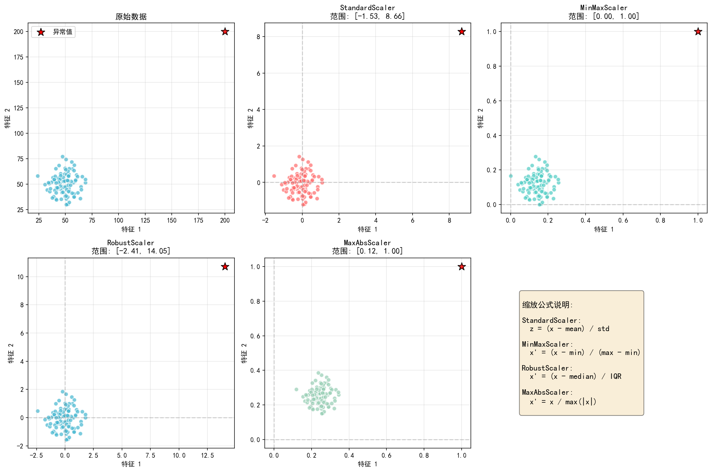
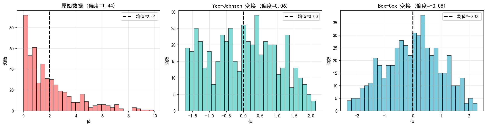
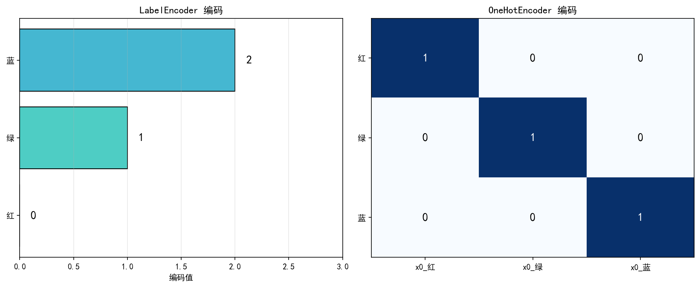

# 预处理

> 对应脚本：`Basic/ScikitLearn/02_preprocessing.py`
> 运行方式：`python Basic/ScikitLearn/02_preprocessing.py`（仓库根目录）

## 本章目标

1. 理解四种常见缩放器在异常值场景下的行为差异。
2. 掌握 `StandardScaler` 与 `MinMaxScaler` 的核心参数与逆变换。
3. 理解 `PowerTransformer` 处理偏态分布的作用与限制。
4. 学会区分 `LabelEncoder` 与 `OneHotEncoder` 的适用场景。
5. 掌握缺失值填充与 `ColumnTransformer` 组合预处理流程。

## 重点方法速览

| 方法 | 作用 | 本章位置 |
|---|---|---|
| `StandardScaler()` | 标准化到均值 0、方差 1 | `demo_scalers` / `demo_standard_scaler` |
| `MinMaxScaler(feature_range)` | 线性缩放到指定区间 | `demo_scalers` / `demo_minmax_scaler` |
| `RobustScaler()` | 使用中位数与 IQR，抗异常值 | `demo_scalers` |
| `MaxAbsScaler()` | 按绝对值最大值缩放 | `demo_scalers` |
| `PowerTransformer(method)` | 幂变换改善偏态分布 | `demo_power_transformer` |
| `LabelEncoder()` | 一维标签编码 | `demo_encoders` |
| `OneHotEncoder(...)` | 类别特征独热编码 | `demo_encoders` |
| `SimpleImputer(strategy)` | 统计量或常量填充缺失值 | `demo_imputers` |
| `KNNImputer(n_neighbors)` | 基于近邻估计缺失值 | `demo_imputers` |
| `ColumnTransformer(...)` | 按列类型组合预处理 | `demo_column_transformer` |

## 1. 缩放器对比

### 方法重点

- 同一组数据在不同缩放器下的分布会明显不同，尤其是存在异常值时。
- `StandardScaler` 与 `MinMaxScaler` 对异常值更敏感，`RobustScaler` 更稳健。
- `MaxAbsScaler` 不平移数据中心，适合保持稀疏结构或符号信息。

### 参数速览（本节）

1. `StandardScaler(copy=True, with_mean=True, with_std=True)`

| 参数名 | 本例取值 | 说明 |
|---|---|---|
| `copy` | `True` | 是否复制输入数据 |
| `with_mean` | `True` | 对特征做中心化 |
| `with_std` | `True` | 按标准差缩放 |
| 返回值（`fit_transform`） | `ndarray` | 缩放后的特征矩阵，形状与输入一致 |

2. `MinMaxScaler(feature_range=(0, 1), copy=True, clip=False)`

| 参数名 | 本例取值 | 说明 |
|---|---|---|
| `feature_range` | `(0, 1)` | 目标缩放区间 |
| `copy` | `True` | 是否复制输入数据 |
| `clip` | `False` | 推理阶段是否截断超范围值 |
| 返回值（`fit_transform`） | `ndarray` | 缩放后的特征矩阵 |

3. `RobustScaler(with_centering=True, with_scaling=True, quantile_range=(25.0, 75.0))`

| 参数名 | 本例取值 | 说明 |
|---|---|---|
| `with_centering` | `True` | 使用中位数做中心化 |
| `with_scaling` | `True` | 按分位间距缩放 |
| `quantile_range` | `(25.0, 75.0)` | IQR 分位区间 |
| 返回值（`fit_transform`） | `ndarray` | 缩放后的特征矩阵 |

4. `MaxAbsScaler(copy=True)`

| 参数名 | 本例取值 | 说明 |
|---|---|---|
| `copy` | `True` | 是否复制输入数据 |
| 返回值（`fit_transform`） | `ndarray` | 按绝对值最大值缩放后的矩阵 |

### 示例代码

```python
import numpy as np
from sklearn.preprocessing import StandardScaler, MinMaxScaler, RobustScaler, MaxAbsScaler

np.random.seed(42)
X = np.random.randn(100, 2) * 10 + 50
X[0] = [200, 200]  # 异常值

scalers = {
		"StandardScaler": StandardScaler(),
		"MinMaxScaler": MinMaxScaler(),
		"RobustScaler": RobustScaler(),
		"MaxAbsScaler": MaxAbsScaler(),
}

for name, scaler in scalers.items():
		X_scaled = scaler.fit_transform(X)
		print(f"{name}: 范围=[{X_scaled.min():.2f}, {X_scaled.max():.2f}]")
```

### 结果输出（示例）

```text
StandardScaler:
	范围: [-1.76, 9.59]
	均值: -0.0000, 标准差: 1.0000
----------------
MinMaxScaler:
	范围: [0.00, 1.00]
	均值: 0.1276, 标准差: 0.0913
----------------
RobustScaler:
	范围: [-2.57, 11.58]
	均值: 0.3384, 标准差: 1.2460
----------------
MaxAbsScaler:
	范围: [0.17, 1.00]
	均值: 0.3006, 标准差: 0.1098
```

### 理解重点

- 若后续模型依赖距离（如 KNN、SVM），缩放通常是必要步骤。
- 存在强异常值时，优先比较 `RobustScaler` 与其他方案。
- 缩放器选择本质是分布假设选择，不是固定套路。



## 2. StandardScaler 详解

### 方法重点

- `StandardScaler` 学习训练集的 `mean_` 与 `scale_`，再用于后续变换。
- `fit_transform` 用于训练阶段，测试集应使用 `transform`。
- `inverse_transform` 可将标准化结果还原到原始尺度。

### 参数速览（本节）

1. `StandardScaler(copy=True, with_mean=True, with_std=True)`

| 参数名 | 本例取值 | 说明 |
|---|---|---|
| `copy` | `True` | 原数据保持不变，返回新数组 |
| `with_mean` | `True` | 对每列减去均值 |
| `with_std` | `True` | 对每列除以标准差 |

2. `fit_transform(X)`

| 参数名 | 本例取值 | 说明 |
|---|---|---|
| `X` | 二维数组 | 输入特征矩阵 |
| 返回值 | `ndarray` | 标准化后的特征矩阵 |

3. `inverse_transform(X_scaled)`

| 参数名 | 本例取值 | 说明 |
|---|---|---|
| `X_scaled` | 标准化结果 | 标准化空间中的特征矩阵 |
| 返回值 | `ndarray` | 从标准化空间还原到原始空间 |

训练后属性（`fit` 后）：

| 属性名 | 说明 |
|---|---|
| `mean_` | 每列均值 |
| `scale_` | 每列标准差 |

### 示例代码

```python
import numpy as np
from sklearn.preprocessing import StandardScaler

X = np.array([[1, 10], [2, 20], [3, 30], [4, 40], [5, 50]])
scaler = StandardScaler(copy=True, with_mean=True, with_std=True)

X_scaled = scaler.fit_transform(X)
X_back = scaler.inverse_transform(X_scaled)

print(scaler.mean_)
print(scaler.scale_)
print(X_back)
```

### 结果输出（示例）

```text
学到的均值 (mean_): [ 3. 30.]
----------------
学到的标准差 (scale_): [ 1.41421356 14.14213562]
----------------
逆变换后:
[[ 1. 10.]
 [ 2. 20.]
 [ 3. 30.]
 [ 4. 40.]
 [ 5. 50.]]
```

### 理解重点

- 标准化参数必须来自训练集，避免数据泄露。
- `mean_` 和 `scale_` 也是可解释信息，可用于排查异常列。
- 若输入为稀疏矩阵，通常要谨慎使用中心化参数。

## 3. MinMaxScaler 详解

### 方法重点

- `MinMaxScaler` 将每列做线性映射，保持原始排序关系。
- 区间可以自定义，常见为 `(0, 1)` 或 `(-1, 1)`。
- 对异常值敏感，极端值会压缩其余样本的有效分辨率。

### 参数速览（本节）

1. `MinMaxScaler(feature_range=(0, 1), copy=True, clip=False)`

| 参数名 | 本例取值 | 说明 |
|---|---|---|
| `feature_range` | `(0, 1)`、`(-1, 1)` | 目标区间，决定缩放后数值范围 |
| `copy` | `True` | 是否复制输入数组 |
| `clip` | `False` | 推理阶段是否截断超范围值 |

2. `fit_transform(X)`

| 参数名 | 本例取值 | 说明 |
|---|---|---|
| `X` | 二维数组 | 输入特征矩阵 |
| 返回值 | `ndarray` | 缩放后的二维数组 |

### 示例代码

```python
import numpy as np
from sklearn.preprocessing import MinMaxScaler

X = np.array([[1, 10], [2, 20], [3, 30], [4, 40], [5, 50]])

scaler1 = MinMaxScaler(feature_range=(0, 1))
scaler2 = MinMaxScaler(feature_range=(-1, 1))

print(scaler1.fit_transform(X))
print(scaler2.fit_transform(X))
```

### 结果输出（示例）

```text
feature_range=(0,1):
[[0.   0.  ]
 [0.25 0.25]
 [0.5  0.5 ]
 [0.75 0.75]
 [1.   1.  ]]
----------------
feature_range=(-1,1):
[[-1.  -1. ]
 [-0.5 -0.5]
 [ 0.   0. ]
 [ 0.5  0.5]
 [ 1.   1. ]]
```

### 理解重点

- 区间缩放不会让分布接近正态，仅改变取值区间。
- 对树模型通常不是必须，但对基于距离或梯度的模型常常有帮助。
- 当特征天然有上下界时，MinMax 缩放更直观。

## 4. PowerTransformer 幂变换

### 方法重点

- 幂变换用于缓解偏态分布，使数据更接近对称分布。
- `yeo-johnson` 可处理非正数，`box-cox` 仅支持严格正数。
- 变换后通常更利于线性模型和基于方差假设的方法。

### 参数速览（本节）

1. `PowerTransformer(method='yeo-johnson', standardize=True)`

| 参数名 | 本例取值 | 说明 |
|---|---|---|
| `method` | `'yeo-johnson'` | 可处理非正数 |
| `standardize` | `True` | 变换后再做标准化 |
| 返回属性 `lambdas_` | 训练后自动生成 | 变换参数，反映分布拉伸程度 |
| 返回值（`fit_transform`） | `ndarray` | 变换后的数据矩阵 |

2. `PowerTransformer(method='box-cox', standardize=True)`

| 参数名 | 本例取值 | 说明 |
|---|---|---|
| `method` | `'box-cox'` | 仅支持严格正数输入 |
| `standardize` | `True` | 变换后再做标准化 |
| 返回属性 `lambdas_` | 训练后自动生成 | 变换参数，反映分布拉伸程度 |
| 返回值（`fit_transform`） | `ndarray` | 变换后的数据矩阵 |

### 示例代码

```python
import numpy as np
from sklearn.preprocessing import PowerTransformer

np.random.seed(42)
X_skewed = np.random.exponential(scale=2, size=(500, 1))

pt_yj = PowerTransformer(method="yeo-johnson")
pt_bc = PowerTransformer(method="box-cox")

X_yj = pt_yj.fit_transform(X_skewed)
X_bc = pt_bc.fit_transform(X_skewed)

print(pt_yj.lambdas_)
print(pt_bc.lambdas_)
```

### 结果输出（示例）

```text
原始数据: 均值=2.01, 标准差=1.95
----------------
Yeo-Johnson后: 均值=0.0000, 标准差=1.0000
----------------
Yeo-Johnson lambda: [-0.412]
----------------
Box-Cox lambda: [0.264]
```

### 理解重点

- 偏态修正不等于信息增强，目标是改善建模假设匹配度。
- 若数据含 0 或负值，优先使用 Yeo-Johnson。
- 文本中的偏度改善建议配合可视化直方图一起判断。



## 5. 类别编码

### 方法重点

- `LabelEncoder` 适合目标标签编码，不建议直接用于普通类别特征。
- `OneHotEncoder` 将类别映射为哑变量，更适合线性模型与距离模型。
- 处理线上未知类别时，`handle_unknown='ignore'` 更稳妥。

### 参数速览（本节）

1. `LabelEncoder()`

| 参数名 | 本例取值 | 说明 |
|---|---|---|
| 返回值（`fit_transform`） | `ndarray` | 一维整数编码结果 |
| 返回属性 `classes_` | 训练后自动生成 | 类别顺序 |

2. `OneHotEncoder(sparse_output=False, handle_unknown='ignore')`

| 参数名 | 本例取值 | 说明 |
|---|---|---|
| `sparse_output` | `False` | 返回稠密数组，便于展示 |
| `handle_unknown` | `'ignore'` | 遇到未见类别时不抛错 |
| 返回值（`fit_transform`） | `ndarray` | 编码后的特征矩阵 |

3. `get_feature_names_out()`

| 参数名 | 本例取值 | 说明 |
|---|---|---|
| 返回值 | `ndarray[str]` | 编码后列名 |

### 示例代码

```python
import numpy as np
from sklearn.preprocessing import LabelEncoder, OneHotEncoder

colors = np.array([["红"], ["绿"], ["蓝"], ["红"], ["绿"]])

le = LabelEncoder()
colors_le = le.fit_transform(colors.ravel())

ohe = OneHotEncoder(sparse_output=False, handle_unknown="ignore")
colors_ohe = ohe.fit_transform(colors)

print(le.classes_)
print(colors_le)
print(ohe.get_feature_names_out())
print(colors_ohe)
```

### 结果输出（示例）

```text
LabelEncoder:
	输入: ['红' '绿' '蓝' '红' '绿']
	编码: [2 1 0 2 1]
	类别: ['蓝' '绿' '红']
----------------
OneHotEncoder:
	特征名: ['x0_红' 'x0_绿' 'x0_蓝']
	编码:
[[1. 0. 0.]
 [0. 1. 0.]
 [0. 0. 1.]
 [1. 0. 0.]
 [0. 1. 0.]]
```

### 理解重点

- `LabelEncoder` 产生整数顺序，可能引入虚假大小关系。
- `OneHotEncoder` 会增加维度，需关注稀疏性与内存开销。
- 面向生产环境时，未知类别处理策略必须提前设计。



## 6. 缺失值处理

### 方法重点

- `SimpleImputer` 提供均值、中位数、常量等规则化填充。
- `KNNImputer` 利用样本相似性推断缺失值，通常更平滑但更耗时。
- 填充策略应与特征分布和业务语义一致。

### 参数速览（本节）

1. `SimpleImputer(strategy='mean'|'median'|'constant', fill_value=None)`

| 参数名 | 本例取值 | 说明 |
|---|---|---|
| `strategy` | `'mean'`、`'median'`、`'constant'` | 填充策略 |
| `fill_value` | `0` | `strategy='constant'` 时使用 |
| 返回值（`fit_transform`） | `ndarray` | 填充后的数据矩阵 |

2. `KNNImputer(n_neighbors=2, weights='uniform')`

| 参数名 | 本例取值 | 说明 |
|---|---|---|
| `n_neighbors` | `2` | 参考邻居数量 |
| `weights` | `'uniform'` | 邻居权重策略 |
| 返回值（`fit_transform`） | `ndarray` | 填充后的数据矩阵 |

### 示例代码

```python
import numpy as np
from sklearn.impute import SimpleImputer, KNNImputer

X = np.array([[1, 2, np.nan], [3, np.nan, 6], [7, 8, 9], [np.nan, 5, 3]])

print(SimpleImputer(strategy="mean").fit_transform(X))
print(SimpleImputer(strategy="median").fit_transform(X))
print(SimpleImputer(strategy="constant", fill_value=0).fit_transform(X))
print(KNNImputer(n_neighbors=2).fit_transform(X))
```

### 结果输出（示例）

```text
mean填充:
[[1.   2.   6.  ]
 [3.   5.   6.  ]
 [7.   8.   9.  ]
 [3.67 5.   3.  ]]
----------------
median填充:
[[1. 2. 6.]
 [3. 5. 6.]
 [7. 8. 9.]
 [3. 5. 3.]]
----------------
constant=0填充:
[[1. 2. 0.]
 [3. 0. 6.]
 [7. 8. 9.]
 [0. 5. 3.]]
----------------
KNN填充:
[[1.  2.  6. ]
 [3.  5.  6. ]
 [7.  8.  9. ]
 [4.  5.  3. ]]
```

### 理解重点

- 均值/中位数填充简单稳定，是多数任务的首选基线。
- KNN 填充更依赖特征尺度，通常应先做合理缩放。
- 缺失值机制（随机缺失或系统缺失）会影响填充有效性。

## 7. ColumnTransformer 组合预处理

### 方法重点

- 混合类型数据应采用分列处理：数值列与类别列使用不同流水线。
- `ColumnTransformer` 将多条子流水线拼接为统一特征空间。
- 这是生产级预处理的核心模式，后续可直接接入分类器。

### 参数速览（本节）

1. `ColumnTransformer(transformers=[...], remainder='drop')`

| 参数名 | 本例取值 | 说明 |
|---|---|---|
| `transformers` | `[("num", ...), ("cat", ...)]` | 指定列分组与对应处理器 |
| `remainder` | `'drop'` | 未指定列默认丢弃 |
| 返回值（`fit_transform`） | `ndarray` | 组合后特征矩阵 |
| 返回值（`get_feature_names_out`） | `ndarray[str]` | 组合后全部特征名 |

2. `make_column_selector(dtype_include='number'|'object')`

| 参数名 | 本例取值 | 说明 |
|---|---|---|
| `dtype_include` | `'number'`、`'object'` | 按类型自动选择列 |
| 返回值 | `callable` | 可传入 `ColumnTransformer` 的列选择器 |

3. `Pipeline(steps=[...])`

| 参数名 | 本例取值 | 说明 |
|---|---|---|
| `steps` | 预处理步骤列表 | 顺序执行多个处理器 |
| 返回值 | `Pipeline` | 组合后的流水线对象 |

### 示例代码

```python
import numpy as np
import pandas as pd
from sklearn.compose import ColumnTransformer, make_column_selector as selector
from sklearn.impute import SimpleImputer
from sklearn.pipeline import Pipeline
from sklearn.preprocessing import OneHotEncoder, StandardScaler

df = pd.DataFrame({
		"年龄": [25, 30, np.nan, 40, 35],
		"收入": [50000, 60000, 55000, np.nan, 70000],
		"性别": ["男", "女", "男", "女", "男"],
		"城市": ["北京", "上海", "北京", "广州", "上海"],
})

numeric_transformer = Pipeline([
		("imputer", SimpleImputer(strategy="median")),
		("scaler", StandardScaler()),
])

categorical_transformer = Pipeline([
		("imputer", SimpleImputer(strategy="most_frequent")),
		("onehot", OneHotEncoder(sparse_output=False, handle_unknown="ignore")),
])

preprocessor = ColumnTransformer([
		("num", numeric_transformer, selector(dtype_include="number")),
		("cat", categorical_transformer, selector(dtype_include="object")),
])

X_processed = preprocessor.fit_transform(df)
print(X_processed.shape)
print(preprocessor.get_feature_names_out())
```

### 结果输出（示例）

```text
处理后形状: (5, 7)
----------------
特征名称:
['num__年龄' 'num__收入' 'cat__性别_女' 'cat__性别_男' 'cat__城市_上海' 'cat__城市_北京' 'cat__城市_广州']
```

### 理解重点

- 列级流水线能把预处理逻辑完全纳入模型训练过程，减少线上线下不一致。
- 该模式可直接嵌入 [Pipeline](/foundations/sklearn/04-pipeline) 做联合调参与部署。
- 当类别空间较大时，应关注 One-Hot 维度膨胀问题。

## 常见坑

1. 在训练前先对全量数据 `fit` 缩放器或填充器，导致数据泄露。
2. 直接把 `LabelEncoder` 用在普通类别特征上，引入错误顺序关系。
3. 在 `ColumnTransformer` 中忘记统一缺失值策略，导致推理阶段报错。

## 小结

- 预处理不是独立步骤，而是模型流程的一部分。
- 推荐将缩放、编码、填充封装进流水线并与模型共同训练。
- 先建立稳定可复现的预处理基线，再做策略替换和调优。
