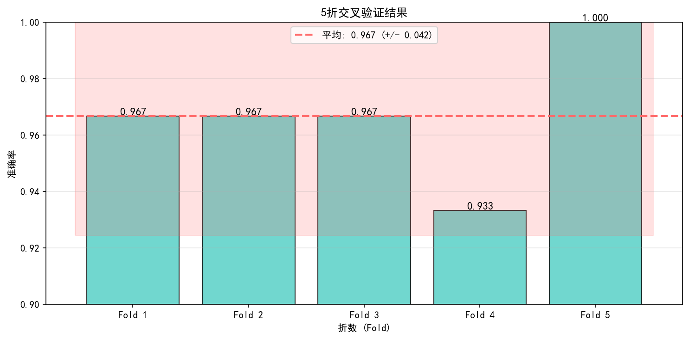
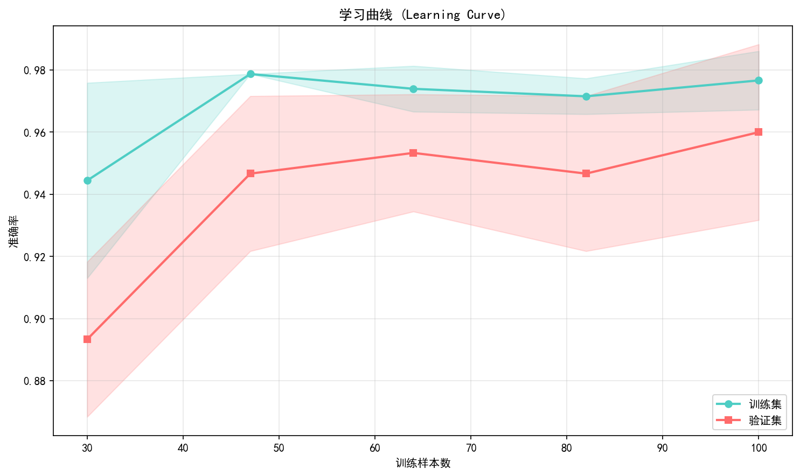
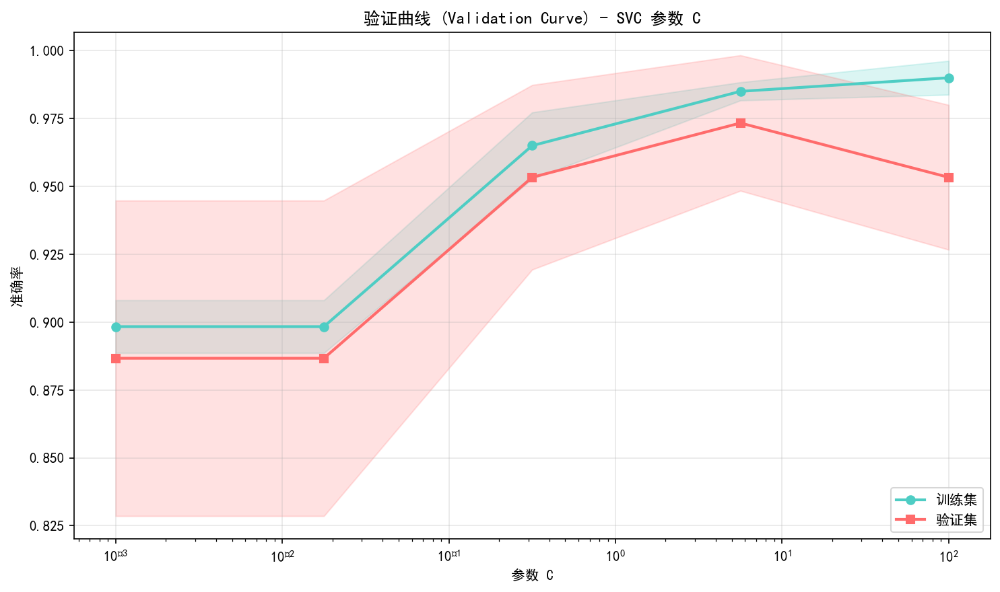

# 模型选择

> 对应脚本：`Basic/ScikitLearn/05_model_selection.py`
> 运行方式：`python Basic/ScikitLearn/05_model_selection.py`（仓库根目录）

## 本章目标

1. 理解交叉验证分数的统计意义与波动范围。
2. 掌握 `cross_val_score` 与 `cross_validate` 的使用边界。
3. 学会选择合适的划分器（KFold、StratifiedKFold、TimeSeriesSplit）。
4. 掌握网格搜索与随机搜索的参数设计思路。
5. 能用学习曲线与验证曲线诊断欠拟合和过拟合。

## 重点方法速览

| 方法 | 作用 | 本章位置 |
|---|---|---|
| `cross_val_score(...)` | 单指标交叉验证 | `demo_cross_val_score` |
| `cross_validate(...)` | 多指标交叉验证并返回训练分数 | `demo_cross_validate` |
| `KFold(...)` | 基础 K 折划分 | `demo_cv_splitters` |
| `StratifiedKFold(...)` | 分层 K 折划分 | `demo_cv_splitters` |
| `TimeSeriesSplit(...)` | 时间序列逐步扩窗划分 | `demo_cv_splitters` |
| `GridSearchCV(...)` | 穷举参数组合 | `demo_grid_search` |
| `RandomizedSearchCV(...)` | 随机采样参数组合 | `demo_random_search` |
| `learning_curve(...)` | 训练集规模-性能曲线 | `demo_learning_curve` |
| `validation_curve(...)` | 单参数-性能曲线 | `demo_validation_curve` |

## 1. cross_val_score

### 方法重点

- `cross_val_score` 返回每折分数数组，适合快速评估模型稳定性。
- 分数均值反映整体性能，标准差反映稳定性。
- 推荐将分数与模型复杂度一起解读。

### 参数速览（本节）

1. `cross_val_score(estimator, X, y, cv=5, scoring='accuracy')`

| 参数名 | 本例取值 | 说明 |
|---|---|---|
| `estimator` | `make_pipeline(StandardScaler(), SVC())` | 待评估模型 |
| `cv` | `5` | 五折交叉验证 |
| `scoring` | `'accuracy'` | 指标为准确率 |
| 返回值 | `ndarray` | 每折分数数组 |

### 示例代码

```python
from sklearn import datasets
from sklearn.model_selection import cross_val_score
from sklearn.pipeline import make_pipeline
from sklearn.preprocessing import StandardScaler
from sklearn.svm import SVC

iris = datasets.load_iris()
model = make_pipeline(StandardScaler(), SVC())
scores = cross_val_score(model, iris.data, iris.target, cv=5, scoring="accuracy")

print(scores)
print(scores.mean(), scores.std() * 2)
```

### 结果输出（示例）

```text
各折得分: [0.9667 1.0000 0.9333 0.9667 1.0000]
----------------
平均: 0.9733 (+/- 0.0499)
```

### 理解重点

- 单次 train/test 切分容易偶然偏高或偏低，交叉验证更稳健。
- 平均值高但方差大时，模型泛化稳定性仍需警惕。
- 不同指标会改变结论，应与任务目标对齐。



## 2. cross_validate（多指标）

### 方法重点

- `cross_validate` 能同时返回多指标结果与训练分数。
- 训练分数与测试分数差距可辅助判断过拟合。
- 返回字典结构便于后续可视化和日志记录。

### 参数速览（本节）

1. `cross_validate(estimator, X, y, cv=5, scoring=['accuracy', 'f1_macro'], return_train_score=True)`

| 参数名 | 本例取值 | 说明 |
|---|---|---|
| `scoring` | `['accuracy', 'f1_macro']` | 同时评估准确率与宏平均 F1 |
| `return_train_score` | `True` | 返回训练集分数 |
| `cv` | `5` | 五折交叉验证 |
| 返回值 | `dict` | 包含 `train_*` 与 `test_*` 字段 |

### 示例代码

```python
from sklearn import datasets
from sklearn.model_selection import cross_validate
from sklearn.pipeline import make_pipeline
from sklearn.preprocessing import StandardScaler
from sklearn.svm import SVC

iris = datasets.load_iris()
model = make_pipeline(StandardScaler(), SVC())

cv_results = cross_validate(
	model,
	iris.data,
	iris.target,
	cv=5,
	scoring=["accuracy", "f1_macro"],
	return_train_score=True,
)

print(cv_results.keys())
print(cv_results["test_accuracy"].mean())
print(cv_results["train_accuracy"].mean())
```

### 结果输出（示例）

```text
返回的键: dict_keys(['fit_time', 'score_time', 'test_accuracy', 'train_accuracy', 'test_f1_macro', 'train_f1_macro'])
----------------
测试准确率: 0.9733
----------------
训练准确率: 0.9833
----------------
测试F1: 0.9730
```

### 理解重点

- 多指标结果能避免“单指标最优但业务不优”的问题。
- 训练分数显著高于测试分数时，优先检查过拟合。
- 这类结果适合沉淀到实验追踪系统。

## 3. 划分策略对比

### 方法重点

- 划分器选择必须匹配数据分布与任务类型。
- 分类任务默认优先 `StratifiedKFold` 保持类别比例。
- 时间序列不能随机打乱，需使用 `TimeSeriesSplit`。

### 参数速览（本节）

1. `KFold(n_splits=3, shuffle=True, random_state=42)`

| 参数名 | 本例取值 | 说明 |
|---|---|---|
| `n_splits` | `3` | 划分折数 |
| `shuffle` | `True` | 划分前打乱样本 |
| `random_state` | `42` | 控制可复现 |
| 返回值（`split`） | 迭代器 | 产出训练索引与测试索引 |

2. `StratifiedKFold(n_splits=3, shuffle=True, random_state=42)`

| 参数名 | 本例取值 | 说明 |
|---|---|---|
| `n_splits` | `3` | 划分折数 |
| `shuffle` | `True` | 划分前打乱样本 |
| `random_state` | `42` | 控制可复现 |
| 返回值（`split`） | 迭代器 | 保持类别比例地产出训练/测试索引 |

3. `TimeSeriesSplit(n_splits=3)`

| 参数名 | 本例取值 | 说明 |
|---|---|---|
| `n_splits` | `3` | 划分折数 |
| 返回值（`split`） | 迭代器 | 按时间顺序产出训练/测试索引 |

### 示例代码

```python
import numpy as np
from sklearn.model_selection import KFold, StratifiedKFold, TimeSeriesSplit

X = np.arange(10).reshape(-1, 1)
y = np.array([0, 0, 0, 0, 0, 1, 1, 1, 1, 1])

for tr, te in KFold(3, shuffle=True, random_state=42).split(X):
	print(tr, te)

for tr, te in StratifiedKFold(3, shuffle=True, random_state=42).split(X, y):
	print(np.bincount(y[tr]), np.bincount(y[te]))

for tr, te in TimeSeriesSplit(3).split(X):
	print(tr, te)
```

### 结果输出（示例）

```text
KFold(3, shuffle=True):
  Fold 1: train=[2, 3, 4, 6, 7, 9], test=[0, 1, 5, 8]
----------------
StratifiedKFold(3):
  Fold 1: train类别分布=[3 3], test类别分布=[2 2]
----------------
TimeSeriesSplit(3):
  Fold 1: train=[0, 1, 2, 3], test=[4, 5]
```

### 理解重点

- 错误划分策略会比模型选择本身造成更大偏差。
- 时间序列任务应严格遵守时间先后关系。
- 类别不平衡时不分层会导致评估结果波动异常。

## 4. GridSearchCV

### 方法重点

- 网格搜索会遍历所有参数组合，结果稳定但计算成本高。
- 参数空间应先由经验收敛，否则会出现组合爆炸。
- 常与 Pipeline 结合以统一预处理与调参。

### 参数速览（本节）

1. `GridSearchCV(estimator, param_grid, cv=5, scoring='accuracy', n_jobs=-1, verbose=1)`

| 参数名 | 本例取值 | 说明 |
|---|---|---|
| `param_grid` | `{'svc__C': [0.1, 1, 10], 'svc__kernel': ['linear', 'rbf']}` | 网格参数 |
| `cv` | `5` | 五折交叉验证 |
| `scoring` | `'accuracy'` | 评估指标 |
| `n_jobs` | `-1` | 使用全部 CPU 核心 |
| `verbose` | `1` | 输出搜索过程日志 |

### 示例代码

```python
from sklearn import datasets
from sklearn.model_selection import GridSearchCV
from sklearn.pipeline import make_pipeline
from sklearn.preprocessing import StandardScaler
from sklearn.svm import SVC

iris = datasets.load_iris()
model = make_pipeline(StandardScaler(), SVC())

param_grid = {
	"svc__C": [0.1, 1, 10],
	"svc__kernel": ["linear", "rbf"],
}

grid = GridSearchCV(model, param_grid, cv=5, scoring="accuracy", n_jobs=-1, verbose=1)
grid.fit(iris.data, iris.target)
print(grid.best_params_)
print(grid.best_score_)
```

### 结果输出（示例）

```text
Fitting 5 folds for each of 6 candidates, totalling 30 fits
----------------
最佳参数: {'svc__C': 1, 'svc__kernel': 'linear'}
----------------
最佳得分: 0.9733
```

### 理解重点

- GridSearchCV 更像“精细扫描”，前提是搜索区间合理。
- 参数边界选择不当会浪费大量算力且结果无效。
- 大规模任务可先随机搜索粗定位，再网格精调。

## 5. RandomizedSearchCV

### 方法重点

- 随机搜索通过概率分布采样参数，成本可控。
- 在高维参数空间里，常比小网格更高效。
- 常与 `loguniform` 分布配合搜索正实数超参数。

### 参数速览（本节）

1. `RandomizedSearchCV(estimator, param_distributions, n_iter=20, cv=5, scoring='accuracy', random_state=42, n_jobs=-1)`

| 参数名 | 本例取值 | 说明 |
|---|---|---|
| `param_distributions` | `C/gamma` 用 `loguniform`，`kernel` 用离散集合 | 随机采样空间 |
| `n_iter` | `20` | 采样次数 |
| `cv` | `5` | 五折交叉验证 |
| `random_state` | `42` | 采样可复现 |
| 返回属性 `best_params_` | 训练后自动生成 | 最优参数样本 |

2. `loguniform(0.01, 100)`

| 参数名 | 本例取值 | 说明 |
|---|---|---|
| `0.01` / `100` | 下界 / 上界 | 对数均匀分布采样区间 |
| 返回值 | 分布对象 | 供 `RandomizedSearchCV` 在连续空间采样 |

### 示例代码

```python
from scipy.stats import loguniform
from sklearn import datasets
from sklearn.model_selection import RandomizedSearchCV
from sklearn.pipeline import make_pipeline
from sklearn.preprocessing import StandardScaler
from sklearn.svm import SVC

iris = datasets.load_iris()
model = make_pipeline(StandardScaler(), SVC())

param_dist = {
	"svc__C": loguniform(0.01, 100),
	"svc__gamma": loguniform(0.001, 10),
	"svc__kernel": ["rbf", "linear"],
}

search = RandomizedSearchCV(model, param_dist, n_iter=20, cv=5, scoring="accuracy", random_state=42, n_jobs=-1)
search.fit(iris.data, iris.target)
print(search.best_params_)
print(search.best_score_)
```

### 结果输出（示例）

```text
最佳参数: {'svc__C': 2.73, 'svc__gamma': 0.014, 'svc__kernel': 'rbf'}
----------------
最佳得分: 0.9800
```

### 理解重点

- 采样分布比搜索算法本身更关键，应根据参数尺度设计。
- `n_iter` 不是越大越好，应与预算和收益平衡。
- 随机搜索结果可作为网格搜索的初始范围参考。

## 6. learning_curve

### 方法重点

- 学习曲线观察训练样本量变化对性能的影响。
- 训练分数高、验证分数低通常提示过拟合。
- 两条曲线都低且接近，通常提示欠拟合或特征不足。

### 参数速览（本节）

1. `learning_curve(estimator, X, y, cv=cv, train_sizes=np.linspace(0.3, 1.0, 5), scoring='accuracy', shuffle=True, random_state=42)`

| 参数名 | 本例取值 | 说明 |
|---|---|---|
| `train_sizes` | `np.linspace(0.3, 1.0, 5)` | 训练样本比例序列 |
| `cv` | `StratifiedKFold(3, shuffle=True, random_state=42)` | 分层三折 |
| `scoring` | `'accuracy'` | 评估指标 |
| `shuffle` | `True` | 训练子集采样打乱 |
| 返回值 | `train_sizes, train_scores, test_scores` | 曲线数据 |

### 示例代码

```python
import numpy as np
from sklearn import datasets
from sklearn.model_selection import StratifiedKFold, learning_curve
from sklearn.pipeline import make_pipeline
from sklearn.preprocessing import StandardScaler
from sklearn.svm import SVC

iris = datasets.load_iris()
model = make_pipeline(StandardScaler(), SVC())
cv = StratifiedKFold(n_splits=3, shuffle=True, random_state=42)

train_sizes, train_scores, test_scores = learning_curve(
	model,
	iris.data,
	iris.target,
	cv=cv,
	train_sizes=np.linspace(0.3, 1.0, 5),
	scoring="accuracy",
	shuffle=True,
	random_state=42,
)

print(train_sizes)
print(train_scores.mean(axis=1))
print(test_scores.mean(axis=1))
```

### 结果输出（示例）

```text
训练集大小: [30 48 66 84 102]
----------------
训练得分: [1.    0.979 0.970 0.968 0.967]
----------------
测试得分: [0.920 0.953 0.960 0.967 0.967]
```

### 理解重点

- 随样本量增加，训练分数略降、验证分数上升是常见健康趋势。
- 若两条曲线始终有大间隙，优先考虑正则化与特征简化。
- 学习曲线是判定”继续收集数据是否有价值”的重要依据。



## 7. validation_curve

### 方法重点

- 验证曲线用于观察单个超参数变化对性能的影响。
- 常用于确定参数大致有效区间，再进入细化搜索。
- 训练曲线和验证曲线同时看，能识别过拟合拐点。

### 参数速览（本节）

1. `validation_curve(estimator, X, y, param_name='svc__C', param_range=np.logspace(-3, 2, 5), cv=5, scoring='accuracy')`

| 参数名 | 本例取值 | 说明 |
|---|---|---|
| `param_name` | `'svc__C'` | 要扫描的参数名 |
| `param_range` | `np.logspace(-3, 2, 5)` | 参数候选序列 |
| `cv` | `5` | 五折交叉验证 |
| `scoring` | `'accuracy'` | 评估指标 |
| 返回值 | `train_scores, test_scores` | 不同参数下的训练/验证分数 |

### 示例代码

```python
import numpy as np
from sklearn import datasets
from sklearn.model_selection import validation_curve
from sklearn.pipeline import make_pipeline
from sklearn.preprocessing import StandardScaler
from sklearn.svm import SVC

iris = datasets.load_iris()
param_range = np.logspace(-3, 2, 5)

train_scores, test_scores = validation_curve(
	make_pipeline(StandardScaler(), SVC()),
	iris.data,
	iris.target,
	param_name="svc__C",
	param_range=param_range,
	cv=5,
	scoring="accuracy",
)

print(param_range)
print(test_scores.mean(axis=1))
```

### 结果输出（示例）

```text
C 值: [1.000e-03 1.778e-02 3.162e-01 5.623e+00 1.000e+02]
----------------
测试得分: [0.320 0.847 0.953 0.973 0.967]
```

### 理解重点

- 参数过小通常欠拟合，参数过大可能过拟合。
- 验证曲线能帮你发现“性能平台区”，降低调参敏感性。
- 与网格搜索相比，验证曲线更偏诊断与解释。



## 常见坑

1. 把时间序列数据用随机 K 折，导致评估严重乐观。
2. 在极大参数空间直接网格搜索，计算成本不可控。
3. 只看平均分不看标准差，忽略模型稳定性风险。

## 小结

- 模型选择的核心不是“找到最高分”，而是“找到稳定可部署的方案”。
- 推荐流程：先交叉验证基线，再随机搜索粗调，最后网格精调。
- 评估指标的业务解释可进一步参考 [指标](/foundations/sklearn/06-metrics) 章节。
