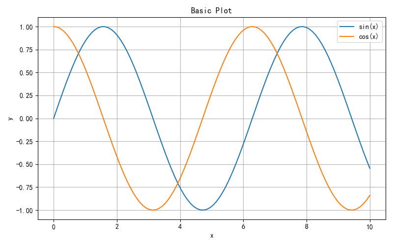
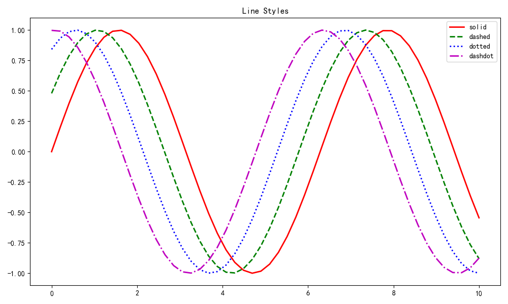
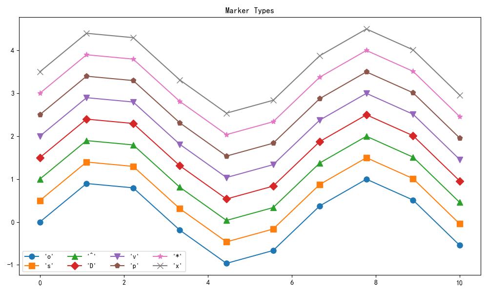
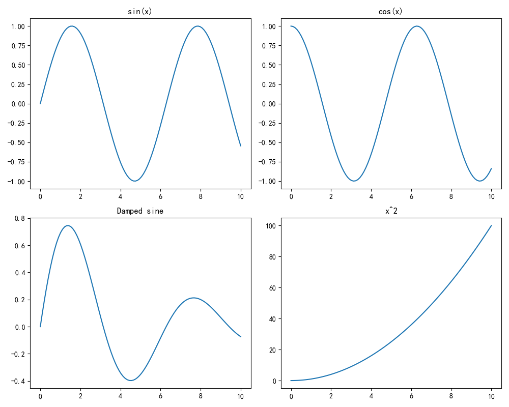

# Matplotlib 基础

## 本章目标

1. 理解 Figure、Axes、Axis 三层对象结构以及创建方式
2. 掌握 `plot` 的线型、标记、颜色等高频可视化参数
3. 学会使用 `subplots` 快速构建多图布局并保存输出

## 重点方法与概念速览

| 名称 | 类型 | 作用 |
|---|---|---|
| `plt.subplots(nrows, ncols)` | 函数 | 创建 Figure 与 Axes 容器 |
| `ax.plot(x, y)` | 方法 | 绘制折线并配置线型、颜色、标记 |
| `ax.set_xlabel / set_ylabel / set_title` | 方法 | 设置轴标签、标题 |
| `ax.legend()` | 方法 | 管理图例展示 |
| `ax.grid(True)` | 方法 | 显示网格线 |
| `fig.savefig(path)` | 方法 | 将图表写入文件 |
| `plt.tight_layout()` | 函数 | 自动调整子图间距 |

## 1. Figure 和 Axes

### `plt.subplots` / `ax.plot`

#### 作用

`plt.subplots` 返回 `(fig, ax)`，其中 `fig` 是画布，`ax` 是绘图区域。多条曲线可在同一个 `Axes` 上叠加，配合图例便于对比。轴标签、标题、网格属于最基础的读图语义信息，应显式设置。

#### 重点方法

```python
plt.subplots(nrows=1, ncols=1, *, figsize=None)
ax.plot(*args, label=None, color=None, linestyle='-')
ax.set_xlabel(xlabel) / ax.set_ylabel(ylabel) / ax.set_title(label)
ax.legend() / ax.grid(visible=True)
```

#### 参数

| 参数名 | 类型 | 说明 | 示例取值 |
|---|---|---|---|
| `nrows` | `int` | 子图行数，默认为 `1` | `1` |
| `ncols` | `int` | 子图列数，默认为 `1` | `1` |
| `figsize` | `tuple[float, float]` | 画布尺寸（英寸） | `(8, 5)` |
| `x` / `y` | `array_like` | 横/纵轴数据序列 | `np.linspace(0, 10, 100)`, `np.sin(x)` |
| `label` | `str` | 图例名称 | `"sin(x)"` |
| `color` | `str` | 线条颜色 | `"red"` |
| `linestyle` | `str` | 线条样式：`"-"` / `"--"` / `":"` / `"-."` | `"--"` |

#### 示例代码

```python
import numpy as np
import matplotlib.pyplot as plt

x = np.linspace(0, 10, 100)
fig, ax = plt.subplots(figsize=(8, 5))
ax.plot(x, np.sin(x), label="sin(x)")
ax.plot(x, np.cos(x), label="cos(x)")
ax.set_xlabel("x")
ax.set_ylabel("y")
ax.set_title("Basic Plot")
ax.legend()
ax.grid(True)
```

#### 输出

```text
控制台提示: 图表已保存到 outputs/visualization/01_basic.png
```



#### 理解重点

- 把 `Figure` 理解为"画布"，`Axes` 理解为"具体图表区域"
- 任何复杂布局都可以拆解成多个 `Axes` 的组合
- `ax.plot` 返回 `Line2D` 列表，可用于后续修改

## 2. 线条样式

### `ax.plot` 的线型参数

#### 作用

`plot` 支持通过格式字符串快速指定颜色和线型（如 `"r-"`、`"g--"`）。`linewidth` 可以显著改善可读性，建议在对比图中统一设置。线型差异是彩色和灰阶打印都可区分的重要编码方式。

#### 重点方法

```python
ax.plot(x, y, fmt, *, linewidth=1.5, label=None)
```

#### 参数

| 参数名 | 类型 | 说明 | 示例取值 |
|---|---|---|---|
| `fmt` | `str` | 颜色与线型快捷写法：`"r-"` `"g--"` `"b:"` `"m-."` | `"r-"` |
| `linewidth` | `float` | 线宽 | `2` |
| `label` | `str` | 图例名称 | `"solid"` |

#### 示例代码

```python
import numpy as np
import matplotlib.pyplot as plt

x = np.linspace(0, 10, 50)
fig, ax = plt.subplots(figsize=(10, 6))
ax.plot(x, np.sin(x), "r-", linewidth=2, label="solid")
ax.plot(x, np.sin(x + 0.5), "g--", linewidth=2, label="dashed")
ax.plot(x, np.sin(x + 1.0), "b:", linewidth=2, label="dotted")
ax.plot(x, np.sin(x + 1.5), "m-.", linewidth=2, label="dashdot")
ax.legend()
ax.set_title("Line Styles")
plt.close()
```

#### 输出

```text
控制台提示: 图表已保存到 outputs/visualization/01_line_styles.png
常用线型: - / -- / : / -.
```



#### 理解重点

- 线型应优先用于"系列区分"，颜色用于"语义强调"
- 同时设置 `label` 与 `legend` 是对比图最小闭环
- 格式字符串第一个字符为颜色，第二个字符为线型

## 3. 标记符号

### `ax.plot` 的 marker 参数

#### 作用

标记（marker）可以突出离散采样点，适合小样本展示。`markersize` 决定视觉密度，过大容易遮挡趋势。多序列情况下，图例列数可通过 `legend(ncol=...)` 控制紧凑布局。

#### 重点方法

```python
ax.plot(x, y, *, marker=None, markersize=None, label=None)
ax.legend(*, ncol=1)
```

#### 参数

| 参数名 | 类型 | 说明 | 示例取值 |
|---|---|---|---|
| `marker` | `str` | 标记符号：`"o"` `"s"` `"^"` `"D"` `"v"` `"p"` `"*"` `"x"` | `"o"` |
| `markersize` | `float` | 标记大小 | `8` |
| `ncol` | `int` | 图例列数，默认为 `1` | `4` |

#### 示例代码

```python
import numpy as np
import matplotlib.pyplot as plt

x = np.linspace(0, 10, 10)
markers = ["o", "s", "^", "D", "v", "p", "*", "x"]

fig, ax = plt.subplots(figsize=(10, 6))
for i, m in enumerate(markers):
    ax.plot(x, np.sin(x) + i * 0.5, marker=m, label=f"'{m}'", markersize=8)
ax.legend(ncol=4)
ax.set_title("Marker Symbols")
plt.close()
```

#### 输出

```text
控制台提示: 图表已保存到 outputs/visualization/01_markers.png
```



#### 理解重点

- 标记是离散信息编码，不应替代颜色和线型的主语义
- 数据点很多时建议降低 `alpha` 或减少 marker 使用
- 标记符号的可见性取决于 `markersize` 和数据密度

## 4. 颜色设置

### 颜色指定方式

#### 作用

Matplotlib 支持单字符、颜色名、十六进制、RGB 元组与 colormap 多种写法。在团队协作中建议固定调色板，避免每张图配色风格漂移。

#### 重点方法

```python
ax.plot(x, y, color=None)           # 单字符 / 颜色名 / hex / RGB
plt.cm.get_cmap(name)               # 获取 colormap 对象
```

#### 参数

| 参数名 | 类型 | 说明 | 示例取值 |
|---|---|---|---|
| `color` | `str` 或 `tuple` | 颜色指定：单字符 / 名称 / `#RRGGBB` / `(r,g,b)` | `"red"` `"#FF5733"` `(0.1,0.2,0.5)` |
| `name` | `str` | colormap 名称：`"viridis"` `"coolwarm"` `"Set1"` 等 | `"viridis"` |

#### 示例代码

```python
import matplotlib.pyplot as plt

print("单字符: r, g, b, c, m, y, k, w")
print("颜色名: red, green, blue, steelblue, coral")
print("十六进制: #FF5733")
print("RGB 元组: (0.1, 0.2, 0.5)")
print(f"Colormap 示例: {plt.cm.viridis}")
```

#### 输出

```text
单字符: r, g, b, c, m, y, k, w
颜色名: red, green, blue, steelblue, coral
十六进制: #FF5733
RGB 元组: (0.1, 0.2, 0.5)
Colormap 示例: <matplotlib.colors.LinearSegmentedColormap object>
```

#### 理解重点

- 颜色不是装饰，而是编码变量和强调信息的工具
- 在深浅背景切换时，优先验证颜色对比度是否足够
- 连续数据用顺序色图（viridis），发散数据用 diverging（coolwarm），类别用定性色图（Set1）

## 5. 子图布局

### `plt.subplots` 多图网格

#### 作用

`subplots(2, 2)` 可一次性创建网格布局，适合多指标对照。`axes[i, j]` 访问单个子图，配置方式与普通 `ax` 完全一致。保存前调用 `tight_layout` 可以避免标题和坐标标签重叠。

#### 重点方法

```python
plt.subplots(nrows=1, ncols=1, *, figsize=None)
plt.tight_layout()
fig.savefig(fname, dpi=None)
```

#### 参数

| 参数名 | 类型 | 说明 | 示例取值 |
|---|---|---|---|
| `nrows` | `int` | 子图行数，默认为 `1` | `2` |
| `ncols` | `int` | 子图列数，默认为 `1` | `2` |
| `figsize` | `tuple[float, float]` | 画布尺寸 | `(10, 8)` |
| `fname` | `str` | 保存路径 | `"output.png"` |
| `dpi` | `int` | 分辨率，默认为 `None` | `150` |

#### 示例代码

```python
import numpy as np
import matplotlib.pyplot as plt

x = np.linspace(0, 10, 100)
fig, axes = plt.subplots(2, 2, figsize=(10, 8))
axes[0, 0].plot(x, np.sin(x)); axes[0, 0].set_title("sin(x)")
axes[0, 1].plot(x, np.cos(x)); axes[0, 1].set_title("cos(x)")
axes[1, 0].plot(x, np.exp(-x / 5) * np.sin(x)); axes[1, 0].set_title("Damped")
axes[1, 1].plot(x, x ** 2); axes[1, 1].set_title("x²")
plt.tight_layout()
plt.close()
```

#### 输出

```text
控制台提示: 图表已保存到 outputs/visualization/01_subplots.png
```



#### 理解重点

- 子图布局是"同一视图比较"最有效的表达方式
- 建议保持统一配色和字体，避免多图布局视觉噪音
- `tight_layout` 在标题/标签较长时尤为重要

## 常见坑

1. 忘记调用 `plt.tight_layout()` 导致标题被截断
2. 坐标轴刻度标签与数据精度不匹配
3. 中文显示为方块——需配置中文字体

## 小结

- Matplotlib 采用 Figure → Axes → Axis 三层结构——先理解对象层级再绘图
- `subplots` 是创建画布的统一入口——单图和多图都用它
- 线型、标记、颜色三要素各自承载不同信息维度——避免混用
- 子图布局 + 统一样式是专业报告图的基础
