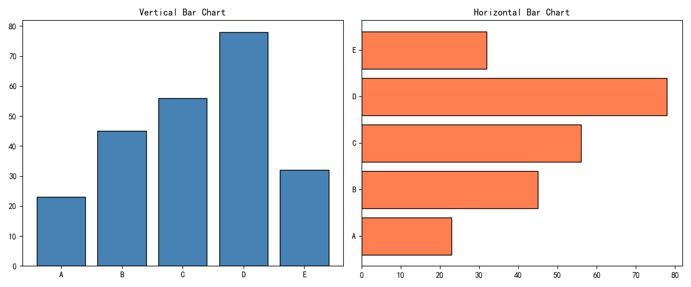
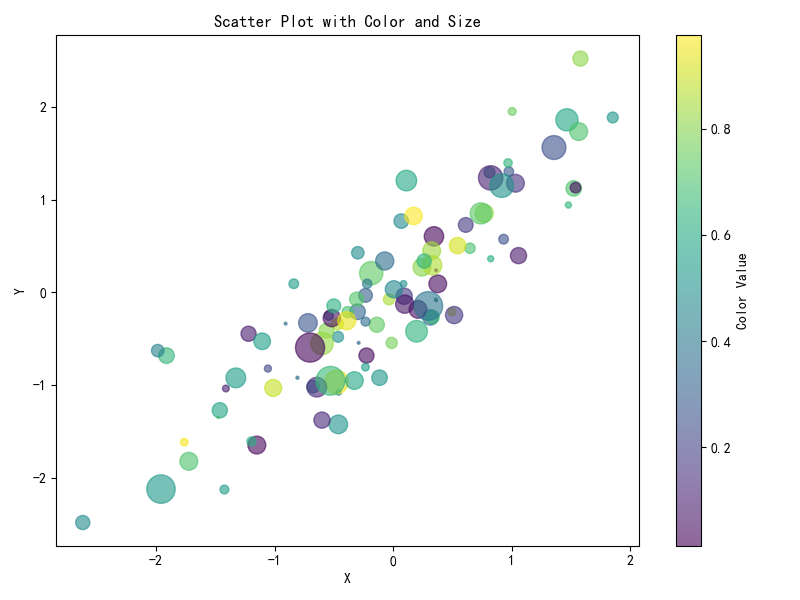
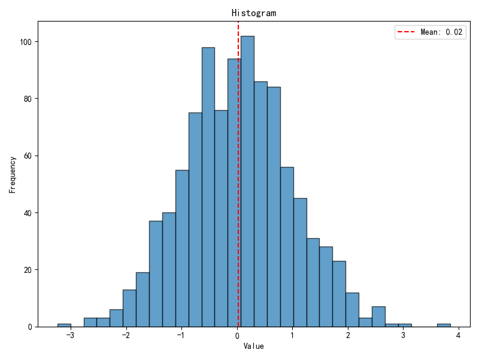
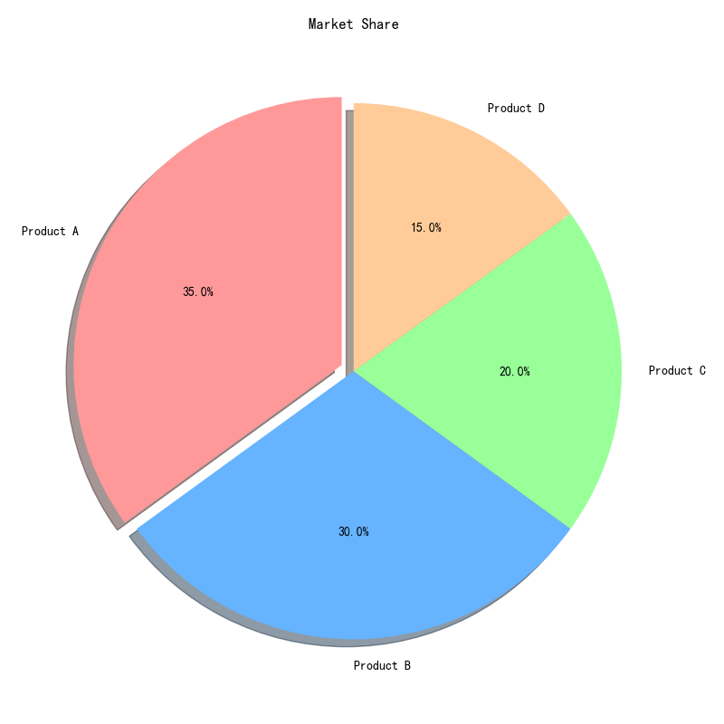
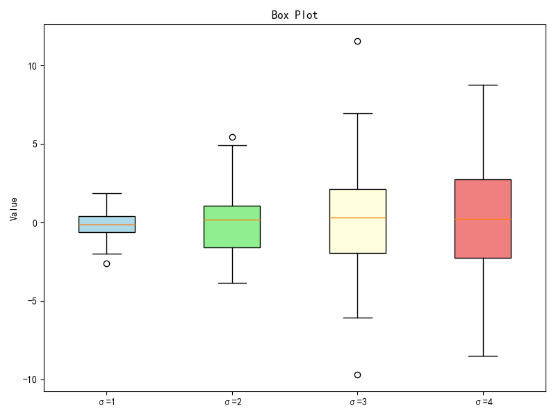

# Matplotlib 图表类型

## 本章目标

1. 掌握柱状图、散点图、直方图、饼图、箱线图的典型绘制流程
2. 学会针对不同图表类型配置关键参数以提升可读性
3. 理解统计分布与类别对比场景下的图表选型逻辑

## 重点方法与概念速览

| 名称 | 类型 | 作用 |
|---|---|---|
| `ax.bar(x, height)` / `ax.barh(y, width)` | 方法 | 展示类别间数值对比 |
| `ax.scatter(x, y)` | 方法 | 展示变量关系与离散分布 |
| `ax.hist(x)` | 方法 | 展示数据频率分布 |
| `ax.pie(x)` | 方法 | 展示整体组成比例 |
| `ax.boxplot(x)` | 方法 | 展示中位数、分位区间和异常值 |

## 1. 柱状图

### `ax.bar` / `ax.barh`

#### 作用

`bar` 适合"类别-数值"比较，`barh` 适合类别标签较长的场景。为柱子添加边框（`edgecolor`）可提升打印和投影场景可读性。

#### 重点方法

```python
ax.bar(x, height, *, color=None, edgecolor=None)
ax.barh(y, width, *, color=None, edgecolor=None)
```

#### 参数

| 参数名 | 类型 | 说明 | 示例取值 |
|---|---|---|---|
| `x` / `y` | `array_like` | 类别标签 | `["A", "B", "C", "D", "E"]` |
| `height` / `width` | `array_like` | 柱高/柱长度 | `[23, 45, 56, 78, 32]` |
| `color` | `str` | 填充颜色 | `"steelblue"` |
| `edgecolor` | `str` | 边框颜色 | `"black"` |

#### 示例代码

```python
import matplotlib.pyplot as plt

categories = ["A", "B", "C", "D", "E"]
values = [23, 45, 56, 78, 32]

fig, axes = plt.subplots(1, 2, figsize=(12, 5))
axes[0].bar(categories, values, color="steelblue", edgecolor="black")
axes[0].set_title("Vertical Bar")
axes[1].barh(categories, values, color="coral", edgecolor="black")
axes[1].set_title("Horizontal Bar")
plt.close()
```

#### 输出

```text
控制台提示: 图表已保存到 outputs/visualization/02_bar.png
左图为垂直柱状图，右图为水平柱状图
```



#### 理解重点

- 类别比较优先柱状图，趋势比较优先折线图
- 横向柱状图对长文本标签更友好
- 柱子数量超过 ~15 个时考虑改用水平排列

## 2. 散点图

### `ax.scatter`

#### 作用

散点图可同时编码位置、颜色、大小三个维度信息。`alpha` 可降低点重叠遮挡，适合高密度数据。配合 colorbar 能把颜色映射转化为可解释变量。

#### 重点方法

```python
ax.scatter(x, y, *, c=None, s=None, alpha=None, cmap=None)
plt.colorbar(mappable, *, ax=None, label=None)
```

#### 参数

| 参数名 | 类型 | 说明 | 示例取值 |
|---|---|---|---|
| `x` / `y` | `array_like` | 横/纵轴数据 | `np.random.randn(100)` |
| `c` | `array_like` | 颜色映射值 | `np.random.rand(100)` |
| `s` | `float` 或 `array_like` | 点大小 | `200` |
| `alpha` | `float` | 透明度，`0`~`1` | `0.6` |
| `cmap` | `str` | colormap 名称 | `"viridis"` |
| `label` | `str` | colorbar 标题 | `"Color Value"` |

#### 示例代码

```python
import numpy as np
import matplotlib.pyplot as plt

np.random.seed(42)
x = np.random.randn(100)
y = x + np.random.randn(100) * 0.5
colors = np.random.rand(100)
sizes = np.abs(np.random.randn(100)) * 200

fig, ax = plt.subplots(figsize=(8, 6))
sc = ax.scatter(x, y, c=colors, s=sizes, alpha=0.6, cmap="viridis")
plt.colorbar(sc, ax=ax, label="Color Value")
ax.set_xlabel("x")
ax.set_ylabel("y")
plt.close()
```

#### 输出

```text
控制台提示: 图表已保存到 outputs/visualization/02_scatter.png
点的颜色和大小分别编码额外变量
```



#### 理解重点

- 当点重叠严重时，`alpha` 与采样策略要一起调整
- 不同变量的编码优先级建议固定，避免读图歧义
- `c` 和 `cmap` 配合 colorbar 是最常见的三元关系可视化模式

## 3. 直方图

### `ax.hist`

#### 作用

直方图用于观察分布形态、偏度和离散程度。`bins` 影响分辨率，过小会丢失细节，过大则噪声明显。叠加均值线可快速定位中心位置。

#### 重点方法

```python
ax.hist(x, *, bins=None, edgecolor=None, alpha=None)
ax.axvline(x, *, color=None, linestyle=None, label=None)
```

#### 参数

| 参数名 | 类型 | 说明 | 示例取值 |
|---|---|---|---|
| `x` | `array_like` | 输入样本 | `np.random.randn(1000)` |
| `bins` | `int` | 直方图箱数，默认为 `None`（自动选择） | `30` |
| `edgecolor` | `str` | 箱体边框颜色 | `"black"` |
| `alpha` | `float` | 透明度 | `0.7` |
| `x`（axvline） | `float` | 竖线 x 坐标 | `data.mean()` |

#### 示例代码

```python
import numpy as np
import matplotlib.pyplot as plt

np.random.seed(42)
data = np.random.randn(1000)

fig, ax = plt.subplots(figsize=(8, 6))
ax.hist(data, bins=30, edgecolor="black", alpha=0.7)
ax.axvline(data.mean(), color="red", linestyle="--",
           label=f"Mean: {data.mean():.2f}")
ax.axvline(np.median(data), color="green", linestyle="--",
           label=f"Median: {np.median(data):.2f}")
ax.set_xlabel("Value")
ax.set_ylabel("Frequency")
ax.legend()
plt.close()
```

#### 输出

```text
控制台提示: 图表已保存到 outputs/visualization/02_histogram.png
正态近似分布并标注均值和中位数位置
```



#### 理解重点

- 直方图不是概率密度，除非额外进行归一化（`density=True`）
- 结合均值、中位数线可更好判断偏态与异常值影响
- `bins` 的经验公式：`int(np.sqrt(len(data)))` 可作为起点

## 4. 饼图

### `ax.pie`

#### 作用

饼图适合少类别的占比表达，不适合精确比较接近比例。`explode` 可强调关键类别。`autopct` 能直接显示百分比，提升报告阅读效率。

#### 重点方法

```python
ax.pie(x, *, labels=None, explode=None, autopct=None, startangle=None,
       colors=None)
```

#### 参数

| 参数名 | 类型 | 说明 | 示例取值 |
|---|---|---|---|
| `x` | `array_like` | 各类别占比 | `[35, 30, 20, 15]` |
| `labels` | `list[str]` | 类别标签 | `["Product A", "Product B", "Product C", "Product D"]` |
| `explode` | `tuple[float]` | 扇区偏移距离 | `(0.05, 0, 0, 0)` |
| `autopct` | `str` 或 `callable` | 百分比格式字符串 | `"%1.1f%%"` |
| `startangle` | `float` | 起始角度，0=右侧3点方向 | `90` |
| `colors` | `list[str]` | 扇区颜色列表 | `["gold", "silver"]` |

#### 示例代码

```python
import matplotlib.pyplot as plt

labels = ["Product A", "Product B", "Product C", "Product D"]
sizes = [35, 30, 20, 15]
explode = (0.05, 0, 0, 0)

fig, ax = plt.subplots(figsize=(8, 8))
ax.pie(sizes, labels=labels, explode=explode, autopct="%1.1f%%",
       startangle=90)
ax.set_title("Market Share")
plt.close()
```

#### 输出

```text
控制台提示: 图表已保存到 outputs/visualization/02_pie.png
Product A 扇区被突出显示
```



#### 理解重点

- 类别超过 5~6 个时建议改用条形图
- 比例对比不明显时应避免仅依赖角度感知
- `startangle=90` 让最大扇区从顶部开始——视觉效果最佳

## 5. 箱线图

### `ax.boxplot`

#### 作用

箱线图直接展示中位数、四分位区间与异常值。多组箱线图适合比较组间波动差异。`patch_artist=True` 后可对箱体填色，增强分组辨识度。

#### 重点方法

```python
ax.boxplot(x, *, patch_artist=False, labels=None)
```

#### 参数

| 参数名 | 类型 | 说明 | 示例取值 |
|---|---|---|---|
| `x` | `array_like` 或 `list[array_like]` | 单组或多组样本 | `[np.random.normal(0, std, 100) for std in range(1, 5)]` |
| `patch_artist` | `bool` | 是否允许箱体填充颜色，默认为 `False` | `True` |
| `labels` | `list[str]` | 组标签 | `["σ=1", "σ=2", "σ=3", "σ=4"]` |

#### 示例代码

```python
import numpy as np
import matplotlib.pyplot as plt

np.random.seed(42)
data = [np.random.normal(0, std, 100) for std in range(1, 5)]

fig, ax = plt.subplots(figsize=(8, 6))
bp = ax.boxplot(data, patch_artist=True, labels=["σ=1", "σ=2", "σ=3", "σ=4"])
colors = ["lightblue", "lightgreen", "lightyellow", "lightcoral"]
for patch, color in zip(bp["boxes"], colors):
    patch.set_facecolor(color)
ax.set_xlabel("Group")
ax.set_ylabel("Value")
ax.set_title("Boxplot: Different Standard Deviations")
plt.close()
```

#### 输出

```text
控制台提示: 图表已保存到 outputs/visualization/02_boxplot.png
四组不同标准差分布的中位数和离散度对比
```



#### 理解重点

- 箱线图适合稳健比较，不依赖分布假设
- 与直方图结合使用可同时获得整体形态与统计摘要
- 箱体边为 Q1/Q3，中间线为中位数，须线为 1.5*IQR 范围

## 常见坑

1. 饼图类别过多导致扇区不可辨识
2. 散点图数据量大时不做透明度导致 overplotting
3. 直方图 bins 选择不当导致分布形态误判

## 小结

- 柱状图看比较，散点图看关系，直方图看分布——先确定问题的图类型
- 饼图只适合 ≤5 类别的占比展示
- 箱线图是统计摘要最可靠的方式——搭配直方图使用效果更好
