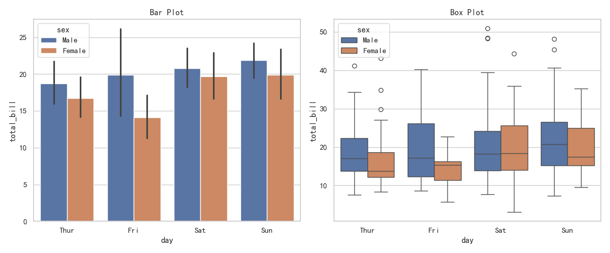
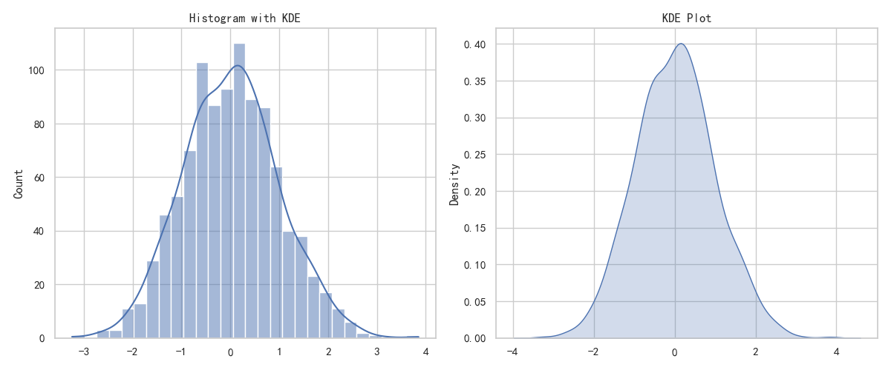
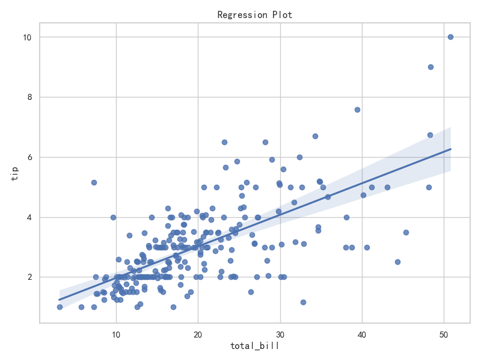
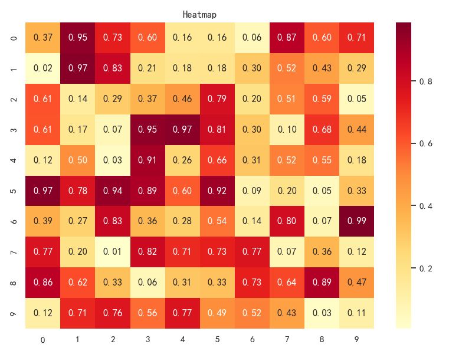
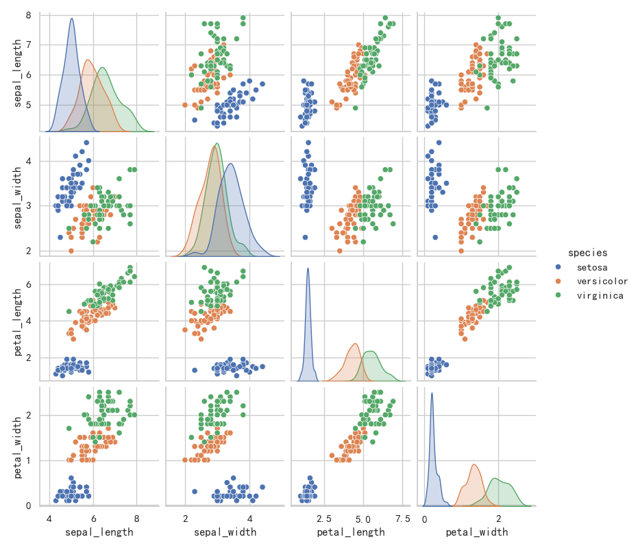

# Seaborn

> 对应脚本：`Basic/Visualization/03_seaborn.py`
> 运行方式：`python -m Basic.Visualization.03_seaborn`（仓库根目录）

## 导航

- [库生态总览](/foundations/overview)

## 本章目标

1. 掌握 Seaborn 在分类、分布、回归和相关性分析中的高效绘图方式。
2. 理解 Seaborn 与 Matplotlib 的关系，以及 `ax` 级 API 的组合方式。
3. 学会使用内置数据集快速搭建分析原型图。

## 重点方法速览

| 方法 | 作用 | 本章位置 |
|---|---|---|
| `sns.set_theme(...)` | 统一绘图主题样式 | 全章节 |
| `sns.barplot(...)` / `sns.boxplot(...)` | 分类变量对比与分布 | `demo_catplot` |
| `sns.histplot(...)` / `sns.kdeplot(...)` | 单变量分布与密度估计 | `demo_distplot` |
| `sns.regplot(...)` | 回归关系可视化 | `demo_regplot` |
| `sns.heatmap(...)` | 矩阵与相关性热力图 | `demo_heatmap` |
| `sns.pairplot(...)` | 多变量成对关系探索 | `demo_pairplot` |

## 1. 分类图

### 方法重点

- `barplot` 更强调均值等聚合统计，`boxplot` 更强调分布与异常值。
- `hue` 维度可在同一类别下继续拆分比较。
- 统一主题样式后，多图报告视觉会更一致。

### 参数速览（本节）

1. `seaborn.barplot(data=None, x=None, y=None, hue=None, ax=None)`

| 参数名 | 本例取值 | 说明 |
|---|---|---|
| `data` | `tips` | 输入 DataFrame |
| `x` | `'day'` | 分类轴 |
| `y` | `'total_bill'` | 数值轴 |
| `hue` | `'sex'` | 组内分组变量 |
| `ax` | `axes[0]` | 目标坐标轴 |
| 返回值 | `Axes` | 绘图坐标轴对象 |

2. `seaborn.boxplot(data=None, x=None, y=None, hue=None, ax=None)`

| 参数名 | 本例取值 | 说明 |
|---|---|---|
| `data` | `tips` | 输入 DataFrame |
| `x` | `'day'` | 分类轴 |
| `y` | `'total_bill'` | 数值轴 |
| `hue` | `'sex'` | 分组变量 |
| `ax` | `axes[1]` | 目标坐标轴 |
| 返回值 | `Axes` | 绘图坐标轴对象 |

### 示例代码

```python
import matplotlib.pyplot as plt
import seaborn as sns

sns.set_theme(style="whitegrid")
tips = sns.load_dataset("tips")

fig, axes = plt.subplots(1, 2, figsize=(12, 5))
sns.barplot(x="day", y="total_bill", hue="sex", data=tips, ax=axes[0])
sns.boxplot(x="day", y="total_bill", hue="sex", data=tips, ax=axes[1])
```

### 结果输出（示例）

```text
控制台提示: 图表已保存到 outputs/visualization/03_catplot.png
----------------
左图展示各天平均账单对比，右图展示分布与离散程度
```



### 理解重点

- 均值对比和分布对比通常应配对展示，避免单一视角误读。
- `hue` 分类过多时建议控制图例数量。

## 2. 分布图

### 方法重点

- `histplot` 强调频率分布，`kdeplot` 强调平滑密度曲线。
- 样本量较小时，KDE 形状可能不稳定，需要谨慎解释。
- 分布图是异常值检查和特征变换决策的前置步骤。

### 参数速览（本节）

1. `seaborn.histplot(data=None, kde=False, bins='auto', ax=None)`

| 参数名 | 本例取值 | 说明 |
|---|---|---|
| `data` | `normal(0, 1, 1000)` | 输入样本 |
| `kde` | `True` | 同时绘制 KDE 曲线 |
| `ax` | `axes[0]` | 目标坐标轴 |
| 返回值 | `Axes` | 绘图坐标轴对象 |

2. `seaborn.kdeplot(data=None, fill=False, ax=None)`

| 参数名 | 本例取值 | 说明 |
|---|---|---|
| `data` | `normal(0, 1, 1000)` | 输入样本 |
| `fill` | `True` | 是否填充曲线下方区域 |
| `ax` | `axes[1]` | 目标坐标轴 |
| 返回值 | `Axes` | 绘图坐标轴对象 |

### 示例代码

```python
import numpy as np
import matplotlib.pyplot as plt
import seaborn as sns

np.random.seed(42)
data = np.random.normal(0, 1, 1000)

fig, axes = plt.subplots(1, 2, figsize=(12, 5))
sns.histplot(data, kde=True, ax=axes[0])
sns.kdeplot(data, fill=True, ax=axes[1])
```

### 结果输出（示例）

```text
控制台提示: 图表已保存到 outputs/visualization/03_distplot.png
----------------
左图为直方图+KDE，右图为独立 KDE 曲线
```



### 理解重点

- `bins` 与平滑程度共同影响“分布形态”判断。
- 使用 KDE 时应与原始频数图交叉验证。

## 3. 回归图

### 方法重点

- `regplot` 可同时展示散点与拟合趋势线。
- 在探索阶段可以快速判断线性关系方向与强弱。
- 对高噪声数据，拟合线应作为趋势参考而非因果结论。

### 参数速览（本节）

1. `seaborn.regplot(data=None, x=None, y=None, ax=None)`

| 参数名 | 本例取值 | 说明 |
|---|---|---|
| `data` | `tips` | 输入 DataFrame |
| `x` | `'total_bill'` | 自变量 |
| `y` | `'tip'` | 因变量 |
| `ax` | `ax` | 目标坐标轴 |
| 返回值 | `Axes` | 绘图坐标轴对象 |

### 示例代码

```python
import matplotlib.pyplot as plt
import seaborn as sns

tips = sns.load_dataset("tips")

fig, ax = plt.subplots(figsize=(8, 6))
sns.regplot(x="total_bill", y="tip", data=tips, ax=ax)
```

### 结果输出（示例）

```text
控制台提示: 图表已保存到 outputs/visualization/03_regplot.png
----------------
图像内容: 消费总额与小费呈正相关趋势
```



### 理解重点

- 回归线是趋势摘要，不代表模型最终效果。
- 观察残差和分组差异可进一步验证关系稳定性。

## 4. 热力图

### 方法重点

- 热力图适合显示矩阵强度，常用于相关系数和注意力矩阵。
- `annot=True` 可直接写入数值，适合教学与报告。
- `center` 与 `cmap` 联动决定颜色语义，应统一标准。

### 参数速览（本节）

1. `seaborn.heatmap(data, annot=None, fmt='.2g', cmap=None, ax=None)`

| 参数名 | 本例取值 | 说明 |
|---|---|---|
| `data` | `np.random.rand(10, 10)` | 输入二维矩阵 |
| `annot` | `True` | 是否标注格子数值 |
| `fmt` | `'.2f'` | 数值显示格式 |
| `cmap` | `'YlOrRd'` | 颜色映射 |
| `ax` | `ax` | 目标坐标轴 |
| 返回值 | `Axes` | 绘图坐标轴对象 |

### 示例代码

```python
import numpy as np
import matplotlib.pyplot as plt
import seaborn as sns

np.random.seed(42)
data = np.random.rand(10, 10)

fig, ax = plt.subplots(figsize=(8, 6))
sns.heatmap(data, annot=True, fmt=".2f", cmap="YlOrRd", ax=ax)
```

### 结果输出（示例）

```text
控制台提示: 图表已保存到 outputs/visualization/03_heatmap.png
----------------
图像内容: 10x10 数值矩阵被映射为颜色强度
```



### 理解重点

- 颜色深浅应与数值大小保持单调关系。
- 强调比较时建议固定统一的 `vmin/vmax`。

## 5. 配对图

### 方法重点

- `pairplot` 可以一次查看多变量两两关系与单变量分布。
- `hue` 可以在同一图中区分类别，有助于发现可分性。
- 对高维数据应先选特征子集，避免图过于拥挤。

### 参数速览（本节）

1. `seaborn.pairplot(data, hue=None, height=2.5, diag_kind='auto')`

| 参数名 | 本例取值 | 说明 |
|---|---|---|
| `data` | `iris` | 输入 DataFrame |
| `hue` | `'species'` | 分类上色字段 |
| `height` | `2` | 每个子图边长（英寸） |
| `diag_kind` | 默认 | 对角线图类型（直方/密度） |
| 返回值 | `PairGrid` | 网格对象 |

### 示例代码

```python
import matplotlib.pyplot as plt
import seaborn as sns

iris = sns.load_dataset("iris")
g = sns.pairplot(iris, hue="species", height=2)
g.fig.suptitle("Pair Plot", y=1.02)
```

### 结果输出（示例）

```text
控制台提示: 图表已保存到 outputs/visualization/03_pairplot.png
----------------
图像内容: 多特征成对散点图与对角分布图
```



### 理解重点

- `pairplot` 常用于建模前特征筛查与类别可分性判断。
- 高维场景建议先做降维或特征筛选后再绘制。

