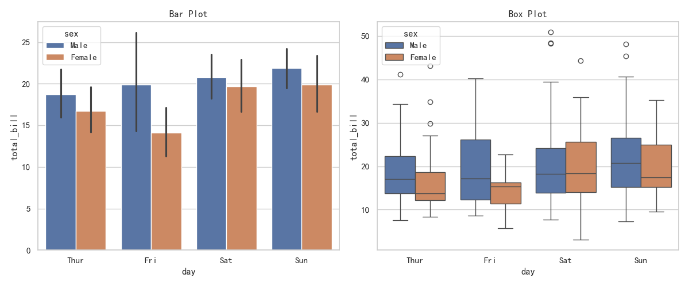
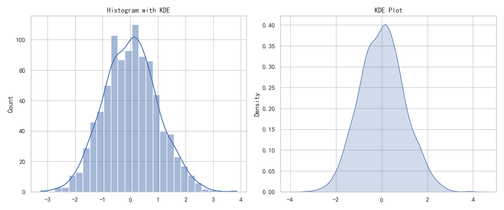
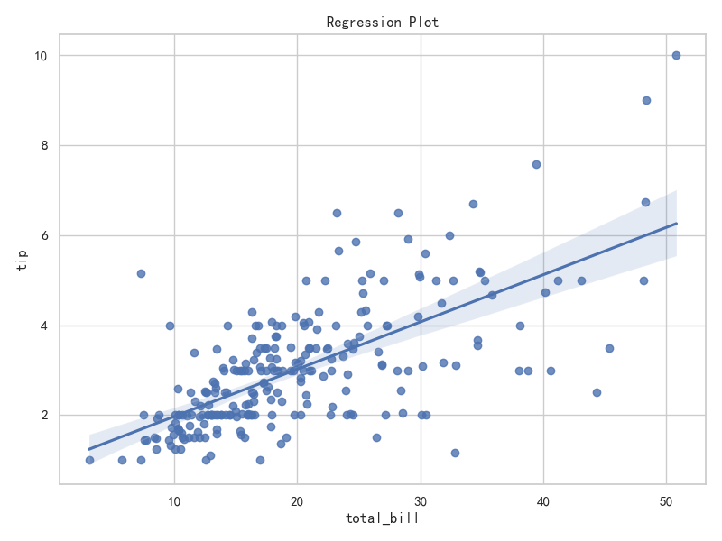
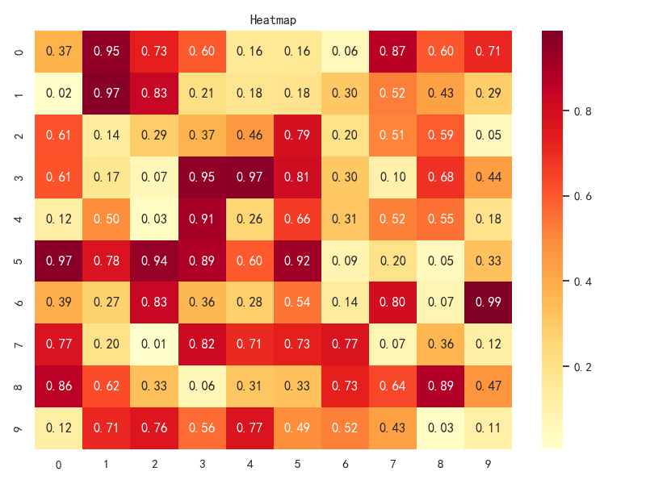
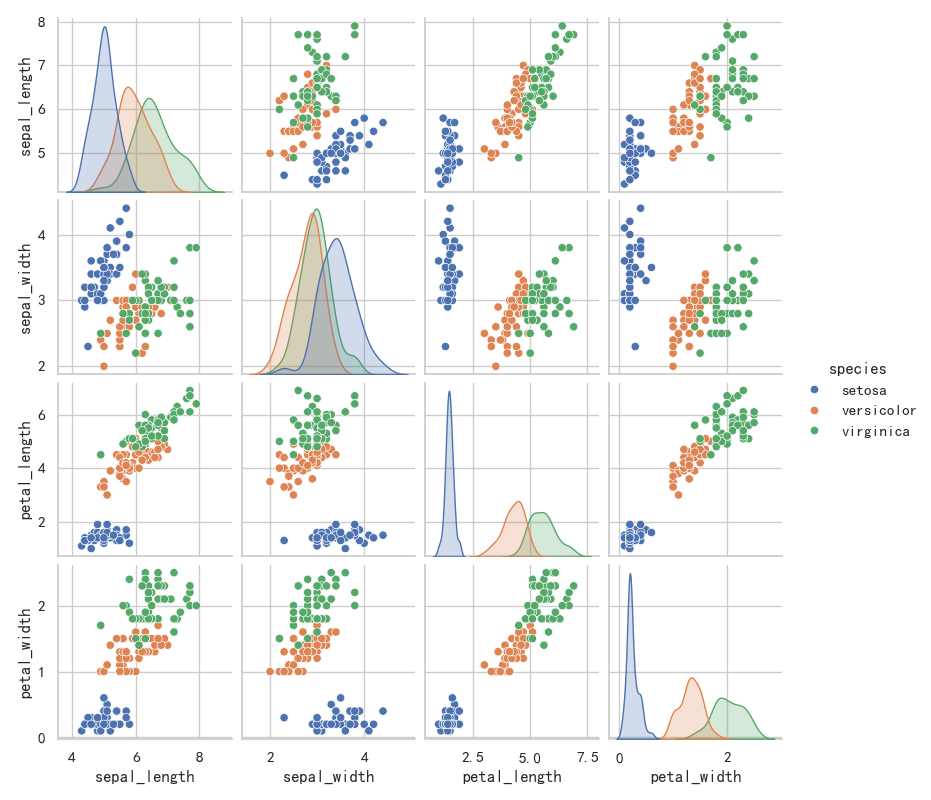

# Seaborn 统计可视化

## 本章目标

1. 掌握 Seaborn 在分类、分布、回归和相关性分析中的高效绘图方式
2. 理解 Seaborn 与 Matplotlib 的关系，以及 `ax` 级 API 的组合方式
3. 学会使用内置数据集快速搭建分析原型图

## 重点方法与概念速览

| 名称 | 类型 | 作用 |
|---|---|---|
| `sns.set_theme(style)` | 函数 | 统一绘图主题样式 |
| `sns.barplot(data, x, y)` | 函数 | 分类均值对比柱状图 |
| `sns.boxplot(data, x, y)` | 函数 | 分类分布箱线图 |
| `sns.histplot(data)` | 函数 | 直方图与 KDE 叠加 |
| `sns.kdeplot(data)` | 函数 | 核密度估计曲线 |
| `sns.regplot(data, x, y)` | 函数 | 回归散点图与拟合线 |
| `sns.heatmap(data)` | 函数 | 矩阵与相关性热力图 |
| `sns.pairplot(data)` | 函数 | 多变量成对关系探索 |

## 1. 分类图

### `sns.barplot` / `sns.boxplot`

#### 作用

`barplot` 更强调均值等聚合统计，`boxplot` 更强调分布与异常值。`hue` 维度可在同一类别下继续拆分比较。统一主题样式后，多图报告视觉会更一致。

#### 重点方法

```python
sns.barplot(data=None, *, x=None, y=None, hue=None, ax=None)
sns.boxplot(data=None, *, x=None, y=None, hue=None, ax=None)
```

#### 参数

| 参数名 | 类型 | 说明 | 示例取值 |
|---|---|---|---|
| `data` | `DataFrame` | 输入数据 | `sns.load_dataset("tips")` |
| `x` | `str` | 分类轴字段 | `"day"` |
| `y` | `str` | 数值轴字段 | `"total_bill"` |
| `hue` | `str` | 组内分组变量 | `"sex"` |
| `ax` | `Axes` | 目标坐标轴，默认为当前 | `axes[0]` |

#### 示例代码

```python
import matplotlib.pyplot as plt
import seaborn as sns

sns.set_theme(style="whitegrid")
tips = sns.load_dataset("tips")

fig, axes = plt.subplots(1, 2, figsize=(12, 5))
sns.barplot(data=tips, x="day", y="total_bill", hue="sex", ax=axes[0])
axes[0].set_title("Bar Plot: Mean Total Bill by Day")
sns.boxplot(data=tips, x="day", y="total_bill", hue="sex", ax=axes[1])
axes[1].set_title("Box Plot: Distribution by Day")
plt.close()
```

#### 输出

```text
控制台提示: 图表已保存到 outputs/visualization/03_catplot.png
左图展示各天平均账单对比，右图展示分布与离散程度
```



#### 理解重点

- 均值对比和分布对比通常应配对展示，避免单一视角误读
- `hue` 分类过多时建议控制图例数量
- Seaborn 的 `hue` 参数自动处理色板——比手动 Matplotlib 更方便

## 2. 分布图

### `sns.histplot` / `sns.kdeplot`

#### 作用

`histplot` 强调频率分布，`kdeplot` 强调平滑密度曲线。样本量较小时，KDE 形状可能不稳定，需要谨慎解释。分布图是异常值检查和特征变换决策的前置步骤。

#### 重点方法

```python
sns.histplot(data=None, *, kde=False, bins='auto', ax=None)
sns.kdeplot(data=None, *, fill=False, ax=None)
```

#### 参数

| 参数名 | 类型 | 说明 | 示例取值 |
|---|---|---|---|
| `data` | `array_like` 或 `DataFrame` | 输入样本 | `np.random.normal(0, 1, 1000)` |
| `kde` | `bool` | histplot：是否叠加 KDE 曲线，默认为 `False` | `True` |
| `bins` | `int` 或 `str` | histplot：分箱数，`"auto"` 自动，默认为 `"auto"` | `30` |
| `fill` | `bool` | kdeplot：是否填充曲线下方，默认为 `False` | `True` |
| `ax` | `Axes` | 目标坐标轴 | `axes[0]` |

#### 示例代码

```python
import numpy as np
import matplotlib.pyplot as plt
import seaborn as sns

np.random.seed(42)
data = np.random.normal(0, 1, 1000)

fig, axes = plt.subplots(1, 2, figsize=(12, 5))
sns.histplot(data, kde=True, ax=axes[0])
axes[0].set_title("Histogram + KDE")
sns.kdeplot(data, fill=True, ax=axes[1])
axes[1].set_title("KDE Only")
plt.close()
```

#### 输出

```text
控制台提示: 图表已保存到 outputs/visualization/03_distplot.png
左图为直方图+KDE，右图为独立 KDE 曲线
```



#### 理解重点

- `bins` 与平滑程度共同影响"分布形态"判断
- 使用 KDE 时应与原始频数图交叉验证
- KDE 的带宽（bandwidth）影响曲线平滑度——过小噪声大，过大丢失细节

## 3. 回归图

### `sns.regplot`

#### 作用

`regplot` 可同时展示散点与拟合趋势线。在探索阶段可以快速判断线性关系方向与强弱。对高噪声数据，拟合线应作为趋势参考而非因果结论。

#### 重点方法

```python
sns.regplot(data=None, *, x=None, y=None, ax=None)
```

#### 参数

| 参数名 | 类型 | 说明 | 示例取值 |
|---|---|---|---|
| `data` | `DataFrame` | 输入数据 | `sns.load_dataset("tips")` |
| `x` | `str` | 自变量字段 | `"total_bill"` |
| `y` | `str` | 因变量字段 | `"tip"` |
| `ax` | `Axes` | 目标坐标轴 | `ax` |

#### 示例代码

```python
import matplotlib.pyplot as plt
import seaborn as sns

tips = sns.load_dataset("tips")

fig, ax = plt.subplots(figsize=(8, 6))
sns.regplot(data=tips, x="total_bill", y="tip", ax=ax)
ax.set_title("Regression: Total Bill vs Tip")
plt.close()
```

#### 输出

```text
控制台提示: 图表已保存到 outputs/visualization/03_regplot.png
消费总额与小费呈正相关趋势
```



#### 理解重点

- 回归线是趋势摘要，不代表模型最终效果
- 观察残差和分组差异可进一步验证关系稳定性
- `regplot` 默认画散点 + 回归线 + 置信区间——适合单变量探索

## 4. 热力图

### `sns.heatmap`

#### 作用

热力图适合显示矩阵强度，常用于相关系数和注意力矩阵。`annot=True` 可直接写入数值，适合教学与报告。`center` 与 `cmap` 联动决定颜色语义，应统一标准。

#### 重点方法

```python
sns.heatmap(data, *, annot=None, fmt='.2g', cmap=None, center=None,
            vmin=None, vmax=None, ax=None)
```

#### 参数

| 参数名 | 类型 | 说明 | 示例取值 |
|---|---|---|---|
| `data` | `array_like` | 输入二维矩阵 | `np.random.rand(10, 10)` |
| `annot` | `bool` | 是否标注格子数值，默认为 `None` | `True` |
| `fmt` | `str` | 数值显示格式，默认为 `".2g"` | `".2f"` |
| `cmap` | `str` | 颜色映射 | `"YlOrRd"` |
| `center` | `float` | 颜色中心值——发散色图用 | `0` |
| `vmin` / `vmax` | `float` | 颜色范围上下限 | `0`, `1` |
| `ax` | `Axes` | 目标坐标轴 | `ax` |

#### 示例代码

```python
import numpy as np
import matplotlib.pyplot as plt
import seaborn as sns

np.random.seed(42)
data = np.random.rand(10, 10)

fig, ax = plt.subplots(figsize=(8, 6))
sns.heatmap(data, annot=True, fmt=".2f", cmap="YlOrRd", ax=ax)
ax.set_title("Heatmap")
plt.close()
```

#### 输出

```text
控制台提示: 图表已保存到 outputs/visualization/03_heatmap.png
10x10 数值矩阵被映射为颜色强度
```



#### 理解重点

- 颜色深浅应与数值大小保持单调关系
- 强调比较时建议固定统一的 `vmin` / `vmax`
- 相关性矩阵用 `center=0` 的发散色图（如 `coolwarm`）更合适

## 5. 配对图

### `sns.pairplot`

#### 作用

`pairplot` 可以一次查看多变量两两关系与单变量分布。`hue` 可以在同一图中区分类别，有助于发现可分性。对高维数据应先选特征子集，避免图过于拥挤。

#### 重点方法

```python
sns.pairplot(data, *, hue=None, vars=None, height=2.5, diag_kind='auto')
```

#### 参数

| 参数名 | 类型 | 说明 | 示例取值 |
|---|---|---|---|
| `data` | `DataFrame` | 输入数据 | `sns.load_dataset("iris")` |
| `hue` | `str` | 分类上色字段 | `"species"` |
| `vars` | `list[str]` | 指定要展示的列子集 | `["sepal_length", "petal_length"]` |
| `height` | `float` | 每个子图边长（英寸），默认为 `2.5` | `2` |
| `diag_kind` | `str` | 对角图类型：`"auto"` / `"hist"` / `"kde"` | `"auto"` |

#### 示例代码

```python
import matplotlib.pyplot as plt
import seaborn as sns

iris = sns.load_dataset("iris")
g = sns.pairplot(iris, hue="species", height=2)
g.fig.suptitle("Pair Plot of Iris", y=1.02)

# pairplot 返回 PairGrid，需特殊处理保存
import matplotlib.pyplot as plt
plt.close()
```

#### 输出

```text
控制台提示: 图表已保存到 outputs/visualization/03_pairplot.png
多特征成对散点图与对角分布图
```



#### 理解重点

- `pairplot` 常用于建模前特征筛查与类别可分性判断
- 高维场景建议先做降维或特征筛选后再绘制
- 对角线上为单变量分布（直方图或 KDE），非对角为两两散点图

## 常见坑

1. 未设置 `sns.set_theme` 导致默认样式不一致
2. `pairplot` 在高维数据上生成过多子图——先用 `vars` 筛选
3. 热力图 `fmt` 与数据精度不匹配导致标注重叠

## 小结

- Seaborn 是 Matplotlib 的高级封装——先 seaborn 快速出图，再 matplotlib 精调
- 分类图用 `barplot`+`boxplot` 配对，分布图用 `histplot`+`kdeplot` 配对
- `pairplot` 是特征探索利器——能在一张图中看到所有两两关系
- 热力图最适合展示矩阵结构——尤其是相关矩阵和混淆矩阵
