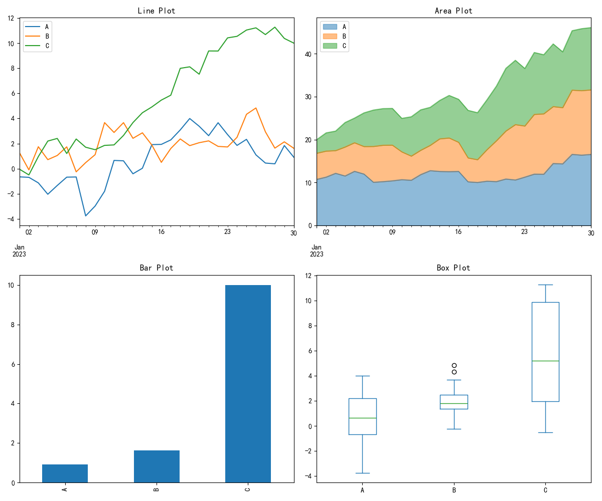
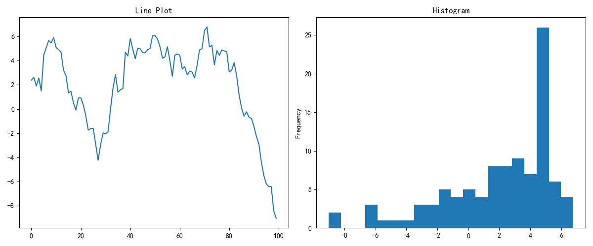
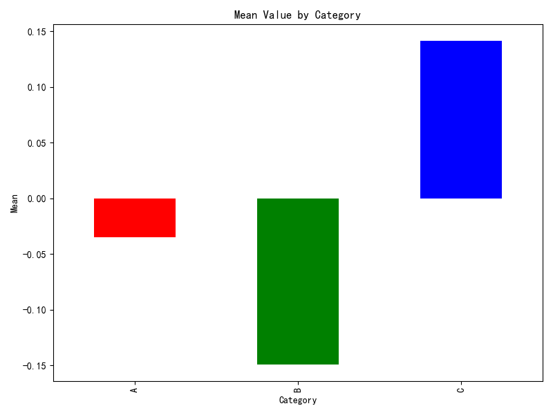

# Pandas 内置可视化

## 本章目标

1. 掌握 `DataFrame.plot` 与 `Series.plot` 的常见图形类型与参数
2. 理解 Pandas 绘图与 Matplotlib `Axes` 之间的协作关系
3. 学会通过分组聚合结果快速绘制业务对比图

## 重点方法与概念速览

| 名称 | 类型 | 作用 |
|---|---|---|
| `DataFrame.plot(*, kind, ax)` | 方法 | 对多列数据快速绘图 |
| `Series.plot(*, kind, ax)` | 方法 | 对单变量序列快速绘图 |
| `DataFrame.groupby(by)` | 方法 | 分组聚合后绘图 |
| `plt.subplots(nrows, ncols)` | 函数 | 组织多图布局 |

## 1. DataFrame.plot()

### `DataFrame.plot`

#### 作用

Pandas 绘图默认基于 Matplotlib，适合快速原型分析。同一个 DataFrame 可用 `kind` 参数切换线图、面积图、箱线图等。复杂布局建议先用 `plt.subplots` 创建 `Axes`，再把图绑定到指定子图。

#### 重点方法

```python
DataFrame.plot(*, kind='line', ax=None, title=None, alpha=None, figsize=None)
```

#### 参数

| 参数名 | 类型 | 说明 | 示例取值 |
|---|---|---|---|
| `kind` | `str` | 图类型：`"line"` / `"bar"` / `"barh"` / `"hist"` / `"box"` / `"kde"` / `"density"` / `"area"` / `"pie"` / `"scatter"`，默认为 `"line"` | `"box"` |
| `ax` | `Axes` 或 `None` | 目标坐标轴，`None` 创建新图 | `axes[0, 0]` |
| `title` | `str` | 图标题 | `"Line Plot"` |
| `alpha` | `float` | 透明度 | `0.7` |
| `figsize` | `tuple[float, float]` | 画布尺寸 | `(10, 6)` |

#### 示例代码

```python
import numpy as np
import pandas as pd
import matplotlib.pyplot as plt

np.random.seed(42)
dates = pd.date_range("2023-01-01", periods=30, freq="D")
df = pd.DataFrame({
    "A": np.cumsum(np.random.randn(30)),
    "B": np.cumsum(np.random.randn(30)),
    "C": np.cumsum(np.random.randn(30)),
}, index=dates)

fig, axes = plt.subplots(2, 2, figsize=(12, 10))
df.plot(ax=axes[0, 0], title="Line Plot")
df.plot(kind="area", alpha=0.5, ax=axes[0, 1], title="Area Plot")
df.plot(kind="bar", ax=axes[1, 0], title="Bar Plot")
df.plot(kind="box", ax=axes[1, 1], title="Box Plot")
plt.tight_layout()
plt.close()
```

#### 输出

```text
控制台提示: 图表已保存到 outputs/visualization/04_df_plot.png
线图、面积图、条形图、箱线图四宫格对比
```



#### 理解重点

- `DataFrame.plot` 适合快速探索，不必每次手写 Matplotlib 底层语句
- 当图形语义复杂时，可以混合使用 Pandas 与 Matplotlib API
- 时间索引的 DataFrame 用 `kind='line'` 最直观

## 2. Series.plot()

### `Series.plot`

#### 作用

`Series.plot` 是单变量分析最便捷入口。通过 `kind='hist'` 可快速切换到分布视角。同一序列可并行展示趋势图与分布图，互相校验。

#### 重点方法

```python
Series.plot(*, kind='line', ax=None, title=None, bins=None)
```

#### 参数

| 参数名 | 类型 | 说明 | 示例取值 |
|---|---|---|---|
| `kind` | `str` | 图类型：`"line"` / `"hist"` / `"bar"` / `"kde"` 等，默认为 `"line"` | `"hist"` |
| `ax` | `Axes` 或 `None` | 目标坐标轴 | `axes[0]` |
| `title` | `str` | 图标题 | `"Line Plot"` |
| `bins` | `int` | 直方图分箱数（kind='hist' 时） | `20` |

#### 示例代码

```python
import numpy as np
import pandas as pd
import matplotlib.pyplot as plt

np.random.seed(42)
s = pd.Series(np.random.randn(100).cumsum())

fig, axes = plt.subplots(1, 2, figsize=(12, 5))
s.plot(ax=axes[0], title="Line Plot")
s.plot(kind="hist", bins=20, ax=axes[1], title="Histogram")
plt.close()
```

#### 输出

```text
控制台提示: 图表已保存到 outputs/visualization/04_series_plot.png
左图展示累计走势，右图展示取值分布
```



#### 理解重点

- 趋势图回答"怎么变化"，直方图回答"分布在哪里"
- 单变量分析阶段建议两个视角同时保留
- `Series.plot` 返回 `Axes` 对象——可继续用 Matplotlib API 修改

## 3. GroupBy 绘图

### `groupby` + `plot`

#### 作用

分组聚合是业务分析中最常见的数据预处理步骤。先 `groupby` 再 `mean` 可压缩噪声，强调组间差异。聚合结果是 Series，可直接使用 `plot(kind='bar')` 绘制。

#### 重点方法

```python
DataFrame.groupby(by)
SeriesGroupBy.mean()
Series.plot(*, kind='bar', ax=None, color=None)
```

#### 示例代码

```python
import numpy as np
import pandas as pd
import matplotlib.pyplot as plt

np.random.seed(42)
df = pd.DataFrame({
    "Category": np.repeat(["A", "B", "C"], 20),
    "Value": np.random.randn(60),
})

fig, ax = plt.subplots(figsize=(8, 6))
(df.groupby("Category")["Value"].mean()
   .plot(kind="bar", ax=ax, color=["red", "green", "blue"]))
ax.set_xlabel("Category")
ax.set_ylabel("Mean Value")
ax.set_title("Group Mean Comparison")
plt.close()
```

#### 输出

```text
控制台提示: 图表已保存到 outputs/visualization/04_groupby.png
A/B/C 三个类别的均值对比柱状图
```



#### 理解重点

- 先聚合后绘图能显著降低噪音干扰
- 分组统计应同时配合样本量信息，避免均值误导
- `groupby` 后可链式调用 `.mean().plot()` ——代码紧凑但需注意可读性

## 常见坑

1. Pandas 绘图 x 轴标签自动旋转可能与数据不匹配
2. `kind='box'` 只适合单列或多列的整体分布——不区分分组
3. 时间序列绘图前未设置 datetime index 导致 x 轴刻度混乱

## 小结

- Pandas `plot()` 是探索阶段最快的出图方式——比 Matplotlib 少写大量样板代码
- 先 Pandas 快速出图 → 再用 Matplotlib API 精调细节
- DataFrame 多列绘图天然适合比较型图表
- GroupBy + plot 是业务分析的标准闭环——分而治之，一目了然
