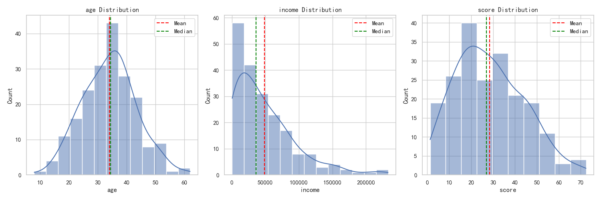
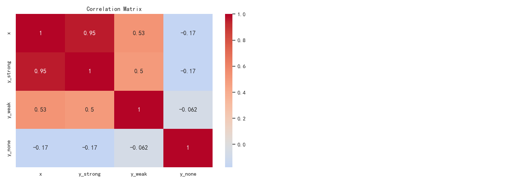
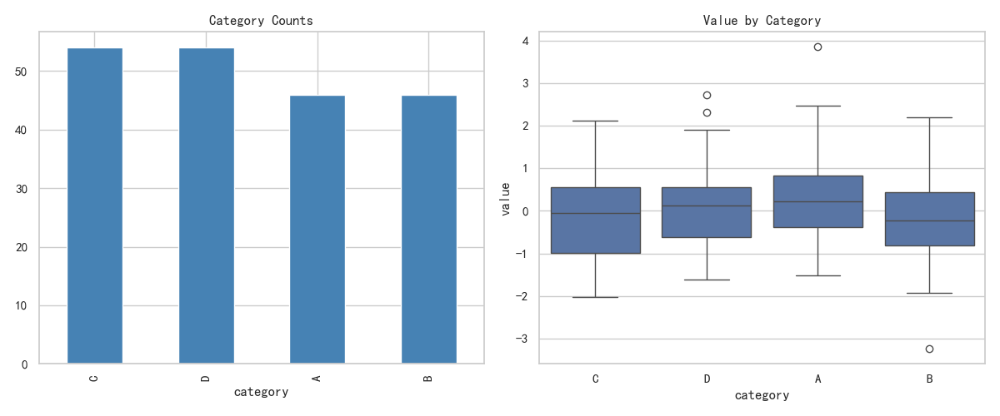

# EDA 探索性数据分析

## 本章目标

1. 掌握连续变量分布、相关关系和分类变量分析的可视化套路
2. 学会在 EDA 中组合 Seaborn 与 Pandas API 完成快速验证
3. 建立"先分布、再相关、后分组"的分析顺序意识

## 重点方法与概念速览

| 名称 | 类型 | 作用 |
|---|---|---|
| `sns.histplot(data)` | 函数 | 查看连续变量频率分布 |
| `ax.axvline(x)` | 方法 | 在分布图中标注统计线 |
| `DataFrame.corr()` | 方法 | 计算变量相关系数矩阵 |
| `sns.heatmap(data)` | 函数 | 可视化相关矩阵 |
| `Series.value_counts()` | 方法 | 统计类别频次 |
| `sns.boxplot(data, x, y)` | 函数 | 比较分类变量下的数值分布 |

## 1. 分布分析

### `sns.histplot` + 统计线标注

#### 作用

分布图用于观察偏态、离群和集中趋势。同时标注均值和中位数有助于识别偏态分布——两者差距大通常意味着偏态或异常值影响。EDA 第一张图建议优先看分布，而不是直接建模。

#### 重点方法

```python
sns.histplot(data=None, *, kde=False, ax=None)
ax.axvline(x, *, color=None, linestyle='--', label=None)
```

#### 参数

| 参数名 | 类型 | 说明 | 示例取值 |
|---|---|---|---|
| `data` | `array_like` | 某列的数值数据 | `df["age"]` |
| `kde` | `bool` | 是否叠加核密度曲线，默认为 `False` | `True` |
| `ax` | `Axes` | 目标坐标轴 | `axes[0]` |
| `x` | `float` | 竖线 x 坐标 | `df["age"].mean()` |
| `color` | `str` | 竖线颜色 | `"red"` |
| `linestyle` | `str` | 竖线样式：`"--"` / `":"` / `"-."` | `"--"` |
| `label` | `str` | 图例名称 | `"Mean"` |

#### 示例代码

```python
import numpy as np
import pandas as pd
import matplotlib.pyplot as plt
import seaborn as sns

np.random.seed(42)
df = pd.DataFrame({
    "age": np.random.normal(35, 10, 200).astype(int),
    "income": np.random.exponential(50000, 200),
    "score": np.random.beta(2, 5, 200) * 100,
})

fig, axes = plt.subplots(1, 3, figsize=(15, 5))
for ax, col in zip(axes, df.columns):
    sns.histplot(df[col], kde=True, ax=ax)
    ax.axvline(df[col].mean(), color="red", linestyle="--", label="Mean")
    ax.axvline(df[col].median(), color="green", linestyle="--", label="Median")
    ax.set_title(col)
    ax.legend()
plt.tight_layout()
plt.close()
```

#### 输出

```text
控制台提示: 图表已保存到 outputs/visualization/05_distribution.png
age、income、score 三个变量的分布与均值/中位数标记
```



#### 理解重点

- 均值和中位数差距较大通常意味着偏态或异常值影响
- 先看分布形态（偏态、峰度、多峰），再考虑建模策略
- 偏态变量可能需要幂变换后才适合线性模型

## 2. 相关性分析

### `DataFrame.corr` + `sns.heatmap`

#### 作用

相关矩阵可快速定位强相关与弱相关变量。热力图适合表达相关强度与方向（正负相关）。相关不等于因果，仍需结合业务逻辑验证。

#### 重点方法

```python
DataFrame.corr(method='pearson', numeric_only=False)   # → DataFrame
sns.heatmap(data, *, annot=None, cmap=None, center=None, ax=None)
```

#### 参数

| 参数名 | 类型 | 说明 | 示例取值 |
|---|---|---|---|
| `method` | `str` | 相关系数：`"pearson"` / `"spearman"` / `"kendall"`，默认为 `"pearson"` | `"pearson"` |
| `annot` | `bool` | 是否显示数值标签 | `True` |
| `cmap` | `str` | 颜色映射——建议发散色图 | `"coolwarm"` |
| `center` | `float` | 颜色中心值，相关矩阵用 `0` | `0` |
| `ax` | `Axes` | 目标坐标轴 | `ax` |

#### 示例代码

```python
import numpy as np
import pandas as pd
import matplotlib.pyplot as plt
import seaborn as sns

np.random.seed(42)
n = 100
x = np.random.randn(n)
df = pd.DataFrame({
    "x": x,
    "y_strong": x + np.random.randn(n) * 0.3,
    "y_weak": x + np.random.randn(n) * 2,
    "y_none": np.random.randn(n),
})

corr = df.corr()
fig, ax = plt.subplots(figsize=(7, 5))
sns.heatmap(corr, annot=True, cmap="coolwarm", center=0, vmin=-1, vmax=1, ax=ax)
ax.set_title("Correlation Matrix")
plt.close()
```

#### 输出

```text
控制台提示: 图表已保存到 outputs/visualization/05_correlation.png
x 与 y_strong 相关性最高（~0.96），x 与 y_none 接近无关
```



#### 理解重点

- 强相关特征在建模前应考虑共线性处理策略
- 分析相关性时要同步关注样本规模与异常值敏感性
- `spearman` 适合非线性单调关系，`pearson` 只捕捉线性关系

## 3. 分类变量分析

### `value_counts` + `sns.boxplot`

#### 作用

类别频数图回答"每类有多少"，箱线图回答"每类分布如何"。两者组合可以兼顾规模与质量两个维度。分类变量分析是异常组识别和分层建模的重要入口。

#### 重点方法

```python
Series.value_counts(normalize=False, dropna=True)    # → Series
sns.boxplot(data=None, *, x=None, y=None, ax=None)
```

#### 参数

| 参数名 | 类型 | 说明 | 示例取值 |
|---|---|---|---|
| `normalize` | `bool` | value_counts：是否返回比例，默认为 `False` | `False` |
| `dropna` | `bool` | value_counts：是否忽略缺失值，默认为 `True` | `True` |
| `data` | `DataFrame` | boxplot：输入数据 | `df` |
| `x` | `str` | 分类字段 | `"category"` |
| `y` | `str` | 数值字段 | `"value"` |
| `ax` | `Axes` | 目标坐标轴 | `axes[1]` |

#### 示例代码

```python
import numpy as np
import pandas as pd
import matplotlib.pyplot as plt
import seaborn as sns

np.random.seed(42)
df = pd.DataFrame({
    "category": np.random.choice(["A", "B", "C", "D"], 200),
    "value": np.random.randn(200),
})

fig, axes = plt.subplots(1, 2, figsize=(12, 5))
df["category"].value_counts().plot(kind="bar", ax=axes[0], color="steelblue")
axes[0].set_title("Category Frequencies")
sns.boxplot(data=df, x="category", y="value", ax=axes[1])
axes[1].set_title("Value Distribution by Category")
plt.close()
```

#### 输出

```text
控制台提示: 图表已保存到 outputs/visualization/05_categorical.png
左图展示类别频数，右图展示各类别数值分布与离群点
```



#### 理解重点

- 类别不平衡会直接影响模型评估，需在 EDA 阶段尽早识别
- 同一类别中离散度明显更大时，建议追查数据来源和采样口径
- 频数图 + 箱线图是分类变量的黄金组合——兼顾样本量与分布

## 常见坑

1. EDA 跳过分布分析直接建模——错过异常值和偏态等关键信号
2. 只看相关性数值不看散点图——可能被 Anscombe's quartet 类数据误导
3. 分类变量分析只关注频数不看分布——忽略组间质量差异

## 小结

- EDA 推荐"先分布、再相关、后分组"的标准分析顺序
- 分布图 + 统计线（均值/中位数）是判断偏态最快的方法
- 相关矩阵 + 热力图是定位多变量关系的标准工具
- 分类变量的频数 + 箱线图组合能兼顾规模和分布的完整视图
