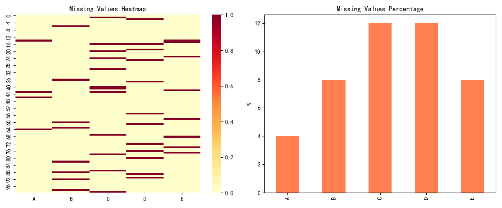
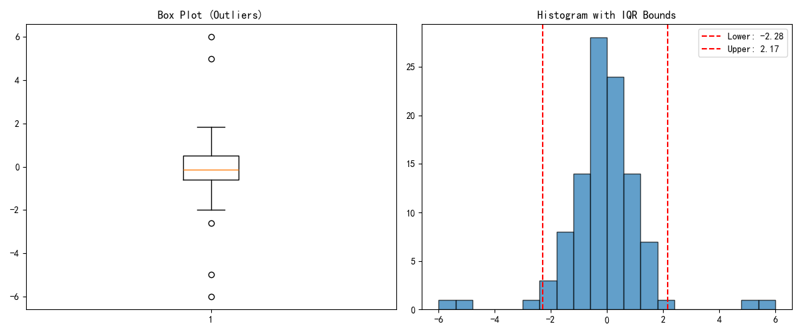
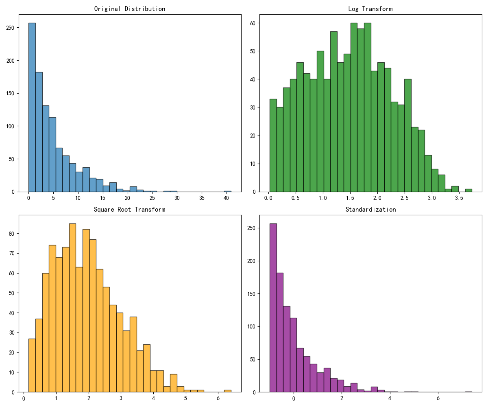

# 预处理可视化

## 本章目标

1. 学会可视化缺失值分布、比例与列间差异
2. 掌握异常值识别中箱线图与 IQR 边界的组合表达
3. 对比常见数值变换对分布形态的影响并形成直觉

## 重点方法与概念速览

| 名称 | 类型 | 作用 |
|---|---|---|
| `df.isnull()` | 方法 | 生成缺失值布尔矩阵 |
| `sns.heatmap(data)` | 函数 | 可视化缺失值模式 |
| `ax.boxplot(x)` | 方法 | 发现异常值和四分位范围 |
| `np.percentile(a, q)` | 函数 | 计算 IQR 阈值 |
| `np.log1p(x)` / `np.sqrt(x)` | 函数 | 变换偏态分布 |

## 1. 缺失值可视化

### `isnull` + `sns.heatmap`

#### 作用

缺失值热力图可以快速定位"哪几列、哪些样本段"缺失集中。缺失比例柱状图可用于排序优先级，决定填补或删除策略。缺失分析应在建模前完成，避免隐式数据泄露和偏差。

#### 重点方法

```python
DataFrame.isnull()           # → DataFrame[bool]
sns.heatmap(data, *, cbar=True, cmap=None, ax=None)
```

#### 参数

| 参数名 | 类型 | 说明 | 示例取值 |
|---|---|---|---|
| `data` | `DataFrame` | sns.heatmap 输入——通常是 `df.isnull()` | `df.isnull()` |
| `cbar` | `bool` | 是否显示颜色条，默认为 `True` | `True` |
| `cmap` | `str` | 颜色映射 | `"YlOrRd"` |
| `ax` | `Axes` | 目标坐标轴 | `axes[0]` |

#### 示例代码

```python
import numpy as np
import pandas as pd
import matplotlib.pyplot as plt
import seaborn as sns

np.random.seed(42)
df = pd.DataFrame(np.random.randn(100, 5), columns=["A", "B", "C", "D", "E"])
for col in df.columns:
    mask = np.random.rand(len(df)) < 0.1
    df.loc[mask, col] = np.nan

fig, axes = plt.subplots(1, 2, figsize=(12, 5))
sns.heatmap(df.isnull(), cbar=True, ax=axes[0], cmap="YlOrRd")
axes[0].set_title("Missing Value Pattern")
(df.isnull().mean() * 100).plot(kind="bar", ax=axes[1], color="coral")
axes[1].set_title("Missing Percentage per Column")
axes[1].set_ylabel("%")
plt.close()
```

#### 输出

```text
控制台提示: 图表已保存到 outputs/visualization/06_missing.png
左图展示缺失位置，右图展示各列缺失百分比
```



#### 理解重点

- 缺失模式随机与否会决定后续填补方法选择
- 某一列缺失比例过高时应优先评估业务可用性
- 热力图能看到"哪些样本同时缺多个特征"——这是比例图看不到的

## 2. 异常值可视化

### `ax.boxplot` + IQR 边界

#### 作用

箱线图是异常值检测最常用的统计图形。IQR 阈值线可直观标注"正常区间"边界。异常值处理前建议先可视化再决策，避免误删有效样本。

#### 重点方法

```python
ax.boxplot(x, *, patch_artist=False)
np.percentile(a, q)       # 计算分位数，如 [25, 75]
ax.axvline(x, *, color=None, linestyle='--')
```

#### 参数

| 参数名 | 类型 | 说明 | 示例取值 |
|---|---|---|---|
| `x` | `array_like` | boxplot 输入 | `data` |
| `patch_artist` | `bool` | 是否启用箱体填色，默认为 `False` | `False` |
| `a` | `array_like` | percentile 输入 | `data` |
| `q` | `array_like` | 目标分位点 | `[25, 75]` |

#### 示例代码

```python
import numpy as np
import matplotlib.pyplot as plt

np.random.seed(42)
data = np.random.randn(100)
data = np.append(data, [5, -5, 6, -6])

q1, q3 = np.percentile(data, [25, 75])
iqr = q3 - q1
lower = q1 - 1.5 * iqr
upper = q3 + 1.5 * iqr

fig, axes = plt.subplots(1, 2, figsize=(12, 5))
axes[0].boxplot(data)
axes[0].set_title("Box Plot with IQR")
axes[1].hist(data, bins=20, edgecolor="black", alpha=0.7)
axes[1].axvline(lower, color="red", linestyle="--", label=f"Lower={lower:.2f}")
axes[1].axvline(upper, color="red", linestyle="--", label=f"Upper={upper:.2f}")
axes[1].legend()
plt.close()
```

#### 输出

```text
控制台提示: 图表已保存到 outputs/visualization/06_outlier.png
箱线图显示离群点，直方图标出 IQR 上下界
```



#### 理解重点

- IQR 规则稳健但并非适用于所有分布——指数分布可能标记过多"异常"
- 异常值处理需结合业务含义，不宜机械截断
- 箱线图须线外的点未必是错误——它们是需要独立分析的样本

## 3. 特征变换可视化

### 变换前后分布对比

#### 作用

同一变量在不同变换下的分布形态可显著变化。对数变换适合右偏分布，平方根变换更温和，标准化适合尺度统一。变换选择应以模型需求与解释性目标共同决定。

#### 重点方法

```python
np.log1p(x)       # log(1 + x)，适合含 0 的正值数据
np.sqrt(x)        # 平方根变换
(x - x.mean()) / x.std()   # Z-score 标准化
```

#### 示例代码

```python
import numpy as np
import matplotlib.pyplot as plt

np.random.seed(42)
data = np.random.exponential(5, 1000)
transforms = {
    "Original": data,
    "Log (log1p)": np.log1p(data),
    "Sqrt": np.sqrt(data),
    "Standardized": (data - data.mean()) / data.std(),
}

fig, axes = plt.subplots(2, 2, figsize=(12, 10))
for ax, (name, arr) in zip(axes.flat, transforms.items()):
    ax.hist(arr, bins=30, edgecolor="black", alpha=0.7)
    ax.set_title(name)
plt.tight_layout()
plt.close()
```

#### 输出

```text
控制台提示: 图表已保存到 outputs/visualization/06_transform.png
四宫格对比原始偏态分布与三种变换后的分布形态
```



#### 理解重点

- 变换不是为了"好看"，而是为了改善建模稳定性
- 变换后应重新评估可解释性与业务阈值含义
- 对数变换不能处理 0 或负值——此时用 `yeo-johnson` 变换替代

## 常见坑

1. 缺失值热力图只看颜色不看比例——掩盖真实缺失严重程度
2. 对非正态分布盲目用 IQR 标记异常值——导致正常样本被误删
3. 变换后不检查分布就建模——改善可能有限甚至反向

## 小结

- 缺失值分析先看整体比例，再看行/列模式——热力图 + 柱状图组合
- 箱线图 + IQR 边界是异常值检测的稳健起点——但需结合业务
- 对数变换是右偏数据的首选——若效果不足再尝试 Box-Cox
- 所有预处理决策都应可视化验证后再进入建模阶段
