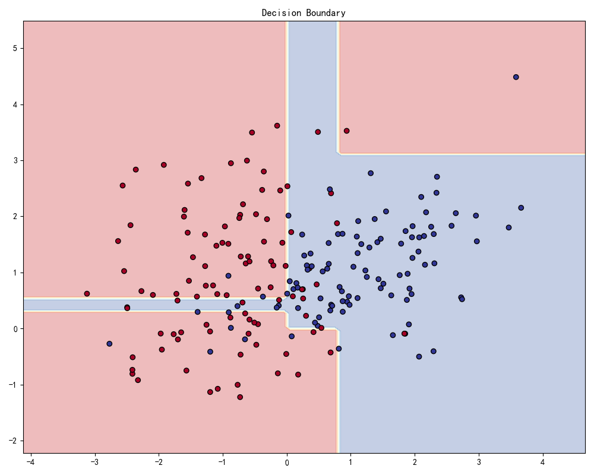
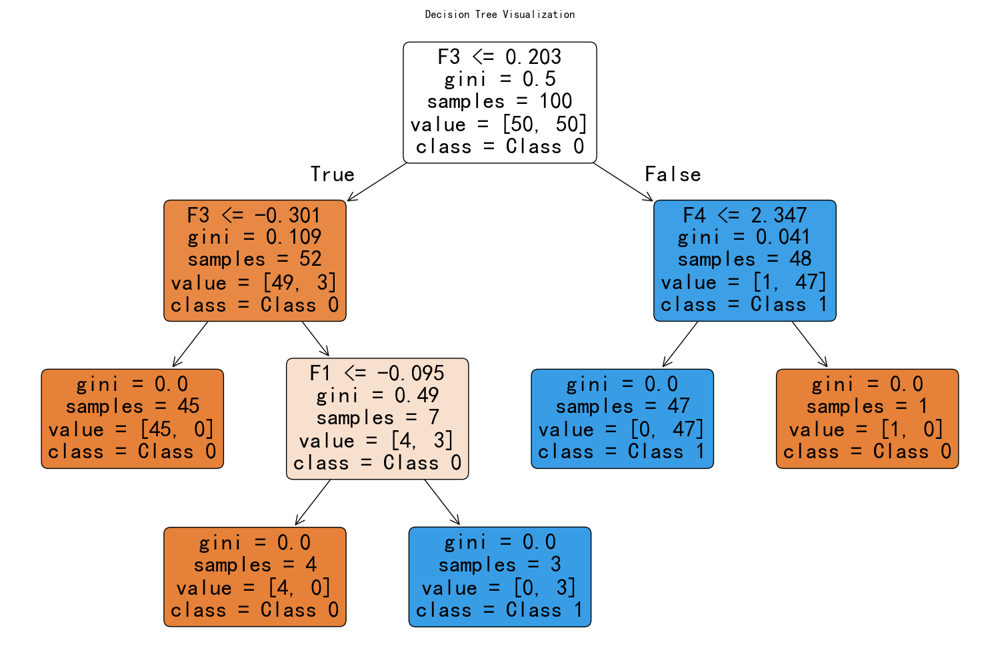
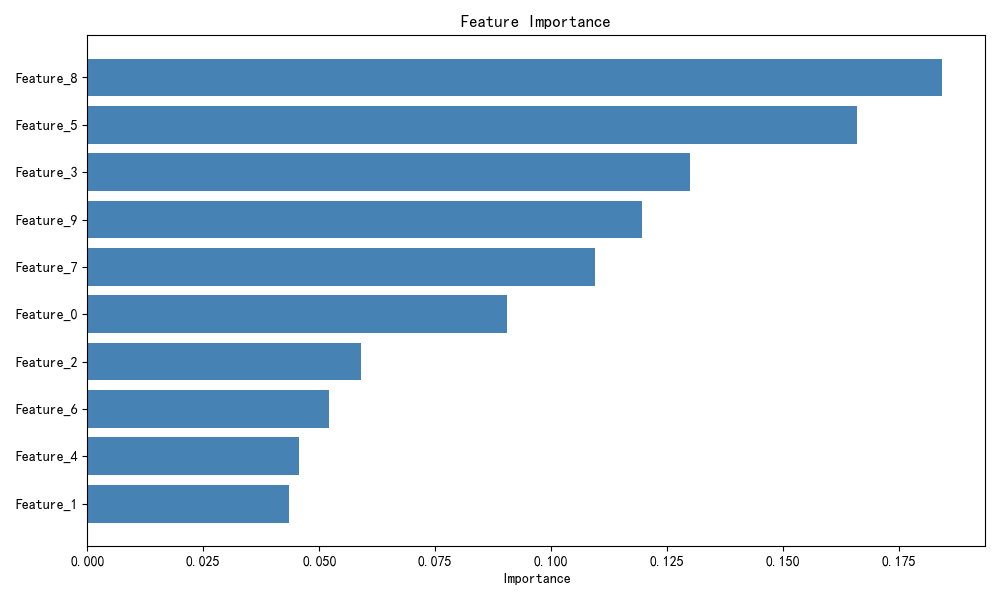

# 决策可视化

> 对应脚本：`Basic/Visualization/07_model_decision.py`
> 运行方式：`python -m Basic.Visualization.07_model_decision`（仓库根目录）

## 导航

- [库生态总览](/foundations/overview)

## 本章目标

1. 理解二维分类任务中决策边界的可视化构建方法。
2. 掌握决策树结构图与特征重要性图的解释方式。
3. 学会用可视化连接“模型行为”与“特征贡献”。

## 重点方法速览

| 方法 | 作用 | 本章位置 |
|---|---|---|
| `make_classification(...)` | 构造可控分类数据 | 全章节 |
| `DecisionTreeClassifier(...)` | 训练树模型并生成边界/结构 | `demo_decision_boundary` / `demo_tree_viz` |
| `ax.contourf(...)` | 绘制二维决策区域 | `demo_decision_boundary` |
| `sklearn.tree.plot_tree(...)` | 绘制决策树结构 | `demo_tree_viz` |
| `RandomForestClassifier(...)` | 计算特征重要性 | `demo_feature_importance` |

## 1. 决策边界

### 方法重点

- 决策边界图把分类器在特征空间中的划分区域可视化。
- 网格预测是边界绘制核心：先生成网格，再对每个网格点预测。
- 真实样本散点叠加在边界图上，可直观看到误分类风险区域。

### 参数速览（本节）

1. `sklearn.datasets.make_classification(n_samples=100, n_features=20, n_informative=2, n_redundant=2, n_clusters_per_class=2)`

| 参数名 | 本例取值 | 说明 |
|---|---|---|
| `n_samples` | `200` | 样本数 |
| `n_features` | `2` | 特征数（便于可视化） |
| `n_informative` | `2` | 有效特征数 |
| `n_redundant` | `0` | 冗余特征数 |
| `n_clusters_per_class` | `1` | 每类簇数量 |
| 返回值 | `(X, y)` | 特征矩阵与标签向量 |

2. `sklearn.tree.DecisionTreeClassifier(max_depth=None, random_state=None)`

| 参数名 | 本例取值 | 说明 |
|---|---|---|
| `max_depth` | `3` | 树最大深度 |
| `random_state` | 默认 | 随机种子 |
| 返回值（`fit`） | `DecisionTreeClassifier` | 训练后的分类器 |

3. `matplotlib.axes.Axes.contourf(X, Y, Z, alpha=None, cmap=None)`

| 参数名 | 本例取值 | 说明 |
|---|---|---|
| `X, Y` | `xx, yy` 网格 | 网格坐标矩阵 |
| `Z` | `clf.predict(grid)` 重塑结果 | 每个网格点预测类别 |
| `alpha` | `0.3` | 填充透明度 |
| `cmap` | `'RdYlBu'` | 区域色板 |
| 返回值 | `QuadContourSet` | 等值填充对象 |

### 示例代码

```python
import numpy as np
import matplotlib.pyplot as plt
from sklearn.datasets import make_classification
from sklearn.tree import DecisionTreeClassifier

X, y = make_classification(n_samples=200, n_features=2, n_redundant=0, n_informative=2, n_clusters_per_class=1)
clf = DecisionTreeClassifier(max_depth=3).fit(X, y)

xx, yy = np.meshgrid(np.linspace(X[:, 0].min()-1, X[:, 0].max()+1, 100),
					 np.linspace(X[:, 1].min()-1, X[:, 1].max()+1, 100))
Z = clf.predict(np.c_[xx.ravel(), yy.ravel()]).reshape(xx.shape)

fig, ax = plt.subplots(figsize=(10, 8))
ax.contourf(xx, yy, Z, alpha=0.3, cmap="RdYlBu")
ax.scatter(X[:, 0], X[:, 1], c=y, cmap="RdYlBu", edgecolors="black")
```

### 结果输出（示例）

```text
控制台提示: 图表已保存到 outputs/visualization/07_boundary.png
----------------
图像内容: 背景为模型分类区域，散点为真实样本标签
```



### 理解重点

- 边界越曲折通常表示模型复杂度越高，过拟合风险也更高。
- 该图仅适用于低维特征，真实高维问题需结合降维或局部解释。

## 2. 决策树可视化

### 方法重点

- `plot_tree` 能直观展示每个节点的分裂规则和类别分布。
- `filled=True` 会用颜色突出节点主要类别，方便快速解读。
- 树图适合教学与解释，但复杂树需限制深度保证可读性。

### 参数速览（本节）

1. `sklearn.tree.plot_tree(decision_tree, max_depth=None, feature_names=None, class_names=None, filled=False, rounded=False, ax=None)`

| 参数名 | 本例取值 | 说明 |
|---|---|---|
| `decision_tree` | `clf` | 已训练树模型 |
| `feature_names` | `['F1', 'F2', 'F3', 'F4']` | 特征名称 |
| `class_names` | `['Class 0', 'Class 1']` | 类别名称 |
| `filled` | `True` | 节点背景按类别着色 |
| `rounded` | `True` | 节点边框圆角 |
| `ax` | `ax` | 目标坐标轴 |
| 返回值 | `list[Annotation]` | 树节点文本对象列表 |

2. `sklearn.tree.DecisionTreeClassifier(max_depth=None, random_state=None)`

| 参数名 | 本例取值 | 说明 |
|---|---|---|
| `max_depth` | `3` | 控制树深度，提升可读性 |
| 返回值（`fit`） | `DecisionTreeClassifier` | 训练后的树模型 |

### 示例代码

```python
import matplotlib.pyplot as plt
from sklearn.datasets import make_classification
from sklearn.tree import DecisionTreeClassifier, plot_tree

X, y = make_classification(n_samples=100, n_features=4, n_redundant=0, random_state=42)
clf = DecisionTreeClassifier(max_depth=3).fit(X, y)

fig, ax = plt.subplots(figsize=(15, 10))
plot_tree(clf, ax=ax, filled=True, rounded=True,
		  feature_names=["F1", "F2", "F3", "F4"],
		  class_names=["Class 0", "Class 1"])
```

### 结果输出（示例）

```text
控制台提示: 图表已保存到 outputs/visualization/07_tree.png
----------------
图像内容: 每个节点展示分裂条件、样本数和类别分布
```



### 理解重点

- 树模型的可解释性优势来自节点规则的可读表达。
- 若节点过多，可通过调小 `max_depth` 或增大 `min_samples_leaf` 简化。

## 3. 特征重要性

### 方法重点

- 集成树模型可输出每个特征对整体预测的相对贡献。
- 重要性排序有助于特征筛选与业务解释。
- 重要性不代表因果关系，需要与领域知识结合。

### 参数速览（本节）

1. `sklearn.ensemble.RandomForestClassifier(n_estimators=100, random_state=None)`

| 参数名 | 本例取值 | 说明 |
|---|---|---|
| `n_estimators` | `100` | 树数量 |
| `random_state` | `42` | 随机种子 |
| 返回值（`fit`） | `RandomForestClassifier` | 训练后的随机森林模型 |

2. `RandomForestClassifier.feature_importances_`

| 参数名 | 本例取值 | 说明 |
|---|---|---|
| 返回值 | `ndarray[float]` | 各特征重要性得分（和为 1） |

3. `matplotlib.axes.Axes.barh(y, width, color=None)`

| 参数名 | 本例取值 | 说明 |
|---|---|---|
| `y` | `range(len(importances))` | 横向柱位置 |
| `width` | `importances[indices]` | 重要性值 |
| `color` | `'steelblue'` | 柱颜色 |
| 返回值 | `BarContainer` | 柱对象容器 |

### 示例代码

```python
import numpy as np
import matplotlib.pyplot as plt
from sklearn.datasets import make_classification
from sklearn.ensemble import RandomForestClassifier

X, y = make_classification(n_samples=200, n_features=10, n_redundant=3, n_informative=5, random_state=42)
feature_names = [f"Feature_{i}" for i in range(10)]

clf = RandomForestClassifier(n_estimators=100, random_state=42).fit(X, y)
importances = clf.feature_importances_
indices = np.argsort(importances)[::-1]

fig, ax = plt.subplots(figsize=(10, 6))
ax.barh(range(len(importances)), importances[indices], color="steelblue")
ax.set_yticks(range(len(importances)))
ax.set_yticklabels([feature_names[i] for i in indices])
```

### 结果输出（示例）

```text
控制台提示: 图表已保存到 outputs/visualization/07_importance.png
----------------
图像内容: 特征按重要性从高到低排序展示
```



### 理解重点

- 重要性图可用于快速筛选，但不应替代交叉验证评估。
- 不同模型的“重要性定义”不同，跨模型比较需谨慎。

