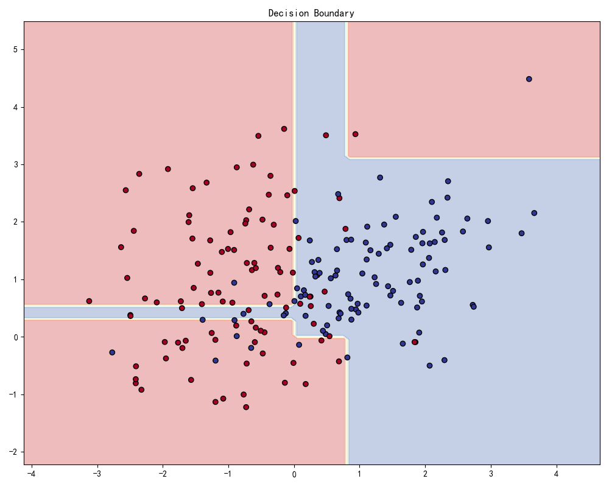
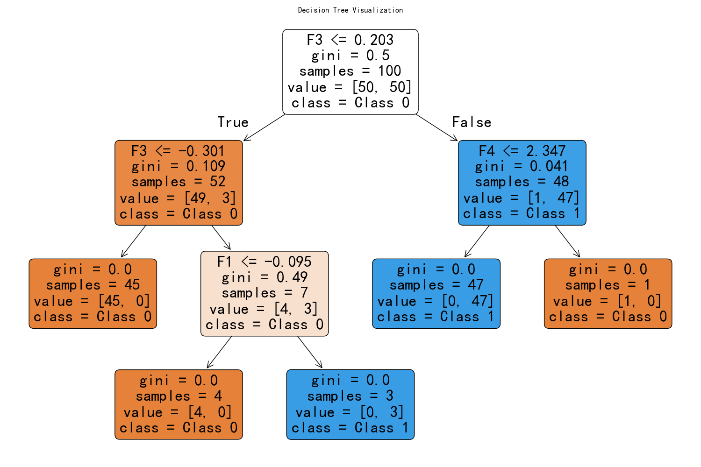
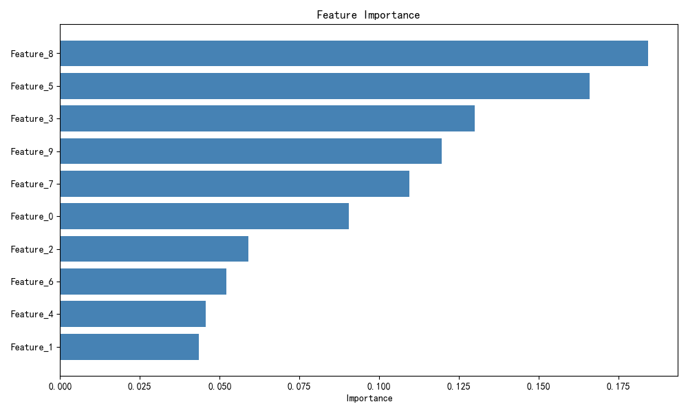

# 模型决策可视化

## 本章目标

1. 理解二维分类任务中决策边界的可视化构建方法
2. 掌握决策树结构图与特征重要性图的解释方式
3. 学会用可视化连接"模型行为"与"特征贡献"

## 重点方法与概念速览

| 名称 | 类型 | 作用 |
|---|---|---|
| `sklearn.tree.DecisionTreeClassifier()` | 构造器 | 训练树模型并生成边界/结构 |
| `ax.contourf(X, Y, Z)` | 方法 | 绘制二维决策区域填充 |
| `sklearn.tree.plot_tree(tree)` | 函数 | 绘制决策树节点结构 |
| `RandomForestClassifier.feature_importances_` | 属性 | 获取特征重要性得分 |

## 1. 决策边界

### `ax.contourf` + 网格预测

#### 作用

决策边界图把分类器在特征空间中的划分区域可视化。网格预测是边界绘制核心：先生成网格，再对每个网格点预测。真实样本散点叠加在边界图上，可直观看到误分类风险区域。

#### 重点方法

```python
np.meshgrid(x, y)        # 生成二维网格
clf.predict(grid)        # 对网格点预测类别
ax.contourf(X, Y, Z, *, alpha=None, cmap=None)
ax.scatter(x, y, *, c=None, cmap=None, edgecolors=None)
```

#### 参数

| 参数名 | 类型 | 说明 | 示例取值 |
|---|---|---|---|
| `X, Y` | `ndarray` | meshgrid 生成的网格坐标矩阵 | `xx`, `yy` |
| `Z` | `ndarray` | 每个网格点预测类别（需 reshape） | `Z.reshape(xx.shape)` |
| `alpha` | `float` | 填充透明度 | `0.3` |
| `cmap` | `str` | 区域与散点色板 | `"RdYlBu"` |
| `edgecolors` | `str` | 散点边框颜色 | `"black"` |

#### 示例代码

```python
import numpy as np
import matplotlib.pyplot as plt
from sklearn.datasets import make_classification
from sklearn.tree import DecisionTreeClassifier

np.random.seed(42)
X, y = make_classification(n_samples=200, n_features=2, n_redundant=0,
                           n_informative=2, n_clusters_per_class=1,
                           random_state=42)
clf = DecisionTreeClassifier(max_depth=3, random_state=42).fit(X, y)

xx, yy = np.meshgrid(
    np.linspace(X[:, 0].min() - 1, X[:, 0].max() + 1, 100),
    np.linspace(X[:, 1].min() - 1, X[:, 1].max() + 1, 100),
)
Z = clf.predict(np.c_[xx.ravel(), yy.ravel()]).reshape(xx.shape)

fig, ax = plt.subplots(figsize=(10, 8))
ax.contourf(xx, yy, Z, alpha=0.3, cmap="RdYlBu")
ax.scatter(X[:, 0], X[:, 1], c=y, cmap="RdYlBu", edgecolors="black")
ax.set_xlabel("Feature 1")
ax.set_ylabel("Feature 2")
ax.set_title(f"Decision Boundary (max_depth={clf.max_depth})")
plt.close()
```

#### 输出

```text
控制台提示: 图表已保存到 outputs/visualization/07_boundary.png
背景为模型分类区域，散点为真实样本标签
```



#### 理解重点

- 边界越曲折通常表示模型复杂度越高，过拟合风险也更高
- 该图仅适用于低维特征——真实高维问题需结合降维或局部解释
- `contourf` 的网格密度决定边界的视觉精度

## 2. 决策树可视化

### `sklearn.tree.plot_tree`

#### 作用

`plot_tree` 能直观展示每个节点的分裂规则和类别分布。`filled=True` 会用颜色突出节点主要类别，方便快速解读。树图适合教学与解释，但复杂树需限制深度保证可读性。

#### 重点方法

```python
sklearn.tree.plot_tree(decision_tree, *, max_depth=None, feature_names=None,
                       class_names=None, filled=False, rounded=False, ax=None)
```

#### 参数

| 参数名 | 类型 | 说明 | 示例取值 |
|---|---|---|---|
| `decision_tree` | `DecisionTreeClassifier` | 已训练树模型 | `clf` |
| `max_depth` | `int` 或 `None` | 显示的最大深度 | `3` |
| `feature_names` | `list[str]` | 特征名称 | `["F1", "F2", "F3", "F4"]` |
| `class_names` | `list[str]` | 类别名称 | `["Class 0", "Class 1"]` |
| `filled` | `bool` | 节点背景按类别着色，默认为 `False` | `True` |
| `rounded` | `bool` | 节点边框圆角，默认为 `False` | `True` |
| `ax` | `Axes` | 目标坐标轴 | `ax` |

#### 示例代码

```python
import matplotlib.pyplot as plt
from sklearn.datasets import make_classification
from sklearn.tree import DecisionTreeClassifier, plot_tree

X, y = make_classification(n_samples=100, n_features=4, n_redundant=0,
                           random_state=42)
clf = DecisionTreeClassifier(max_depth=3, random_state=42).fit(X, y)

fig, ax = plt.subplots(figsize=(15, 10))
plot_tree(clf, ax=ax, filled=True, rounded=True,
          feature_names=["F1", "F2", "F3", "F4"],
          class_names=["Class 0", "Class 1"])
ax.set_title("Decision Tree Structure")
plt.close()
```

#### 输出

```text
控制台提示: 图表已保存到 outputs/visualization/07_tree.png
每个节点展示分裂条件、样本数和类别分布
```



#### 理解重点

- 树模型的可解释性优势来自节点规则的可读表达
- 若节点过多，可通过调小 `max_depth` 或增大 `min_samples_leaf` 简化
- `gini` 值越小的节点纯度越高——颜色越深

## 3. 特征重要性

### `feature_importances_` + 水平柱状图

#### 作用

集成树模型可输出每个特征对整体预测的相对贡献。重要性排序有助于特征筛选与业务解释。重要性不代表因果关系，需要与领域知识结合。

#### 重点方法

```python
RandomForestClassifier.feature_importances_     # → ndarray，和为 1
ax.barh(y, width, *, color=None)
```

#### 示例代码

```python
import numpy as np
import matplotlib.pyplot as plt
from sklearn.datasets import make_classification
from sklearn.ensemble import RandomForestClassifier

X, y = make_classification(n_samples=200, n_features=10, n_redundant=3,
                           n_informative=5, random_state=42)
featureNames = [f"Feature_{i}" for i in range(10)]

clf = RandomForestClassifier(n_estimators=100, random_state=42).fit(X, y)
importances = clf.feature_importances_
indices = np.argsort(importances)[::-1]

fig, ax = plt.subplots(figsize=(10, 6))
ax.barh(range(len(importances)), importances[indices], color="steelblue")
ax.set_yticks(range(len(importances)))
ax.set_yticklabels([featureNames[i] for i in indices])
ax.set_xlabel("Importance")
ax.set_title("Feature Importance (RandomForest)")
ax.invert_yaxis()
plt.close()
```

#### 输出

```text
控制台提示: 图表已保存到 outputs/visualization/07_importance.png
特征按重要性从高到低排序展示，顶部为最相关特征
```



#### 理解重点

- 重要性图可用于快速筛选，但不应替代交叉验证评估
- 不同模型的"重要性定义"不同——跨模型比较需谨慎
- 重要性之和为 1，既可用于排序也可用于设定累积阈值

## 常见坑

1. 决策边界图在高维数据上毫无意义——只能在 ≤3 维使用
2. `plot_tree` 对深树输出不可读——务必限制 max_depth
3. 特征重要性只反映"对模型预测的贡献"，不是因果关系

## 小结

- 决策边界图是理解模型行为的直观工具——仅限低维场景
- `plot_tree` 让树模型的白盒优势可视化——配以节点颜色和规则文本
- 特征重要性排序是特征筛选的快速起点——但需结合领域知识
