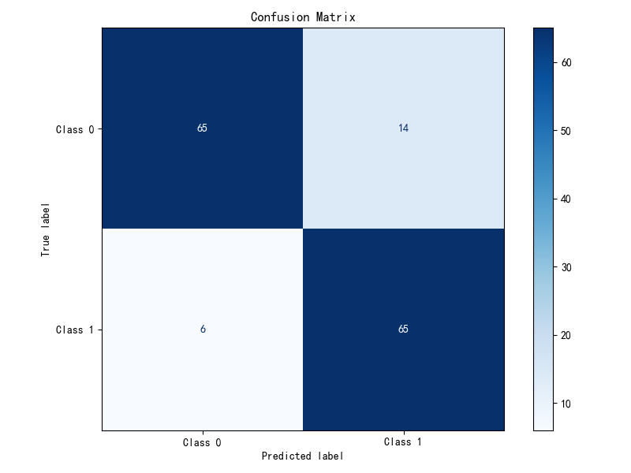
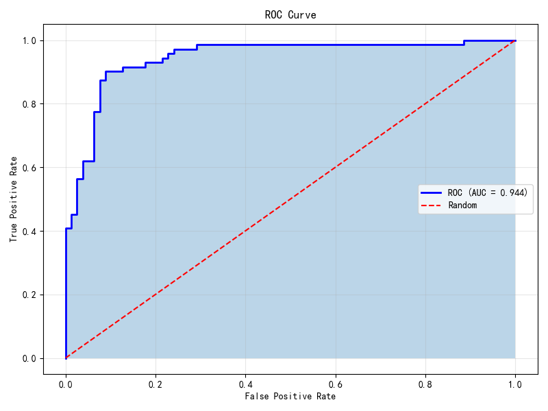
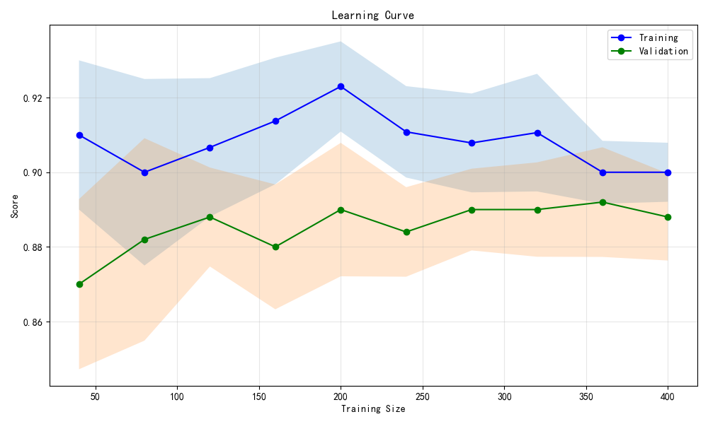

# 评估图

> 对应脚本：`Basic/Visualization/08_model_evaluation.py`
> 运行方式：`python -m Basic.Visualization.08_model_evaluation`（仓库根目录）

## 导航

- [库生态总览](/foundations/overview)

## 本章目标

1. 掌握分类任务中混淆矩阵、ROC 曲线和学习曲线的可视化流程。
2. 理解概率输出、阈值变化与分类性能之间的关系。
3. 学会通过学习曲线判断欠拟合与过拟合趋势。

## 重点方法速览

| 方法 | 作用 | 本章位置 |
|---|---|---|
| `confusion_matrix(...)` | 计算预测与真实标签的混淆矩阵 | `demo_confusion_matrix` |
| `ConfusionMatrixDisplay(...)` | 标准化展示混淆矩阵图 | `demo_confusion_matrix` |
| `roc_curve(...)` + `auc(...)` | 计算 ROC 曲线与 AUC 指标 | `demo_roc_curve` |
| `learning_curve(...)` | 评估样本规模与泛化性能关系 | `demo_learning_curve` |

## 1. 混淆矩阵

### 方法重点

- 混淆矩阵直接展示 TP、TN、FP、FN 组成，是分类诊断基础。
- `ConfusionMatrixDisplay` 能快速绘制规范图形并附带标签。
- 在类别不平衡任务中，混淆矩阵比单一准确率更有解释力。

### 参数速览（本节）

1. `sklearn.metrics.confusion_matrix(y_true, y_pred, labels=None, normalize=None)`

| 参数名 | 本例取值 | 说明 |
|---|---|---|
| `y_true` | `y_test` | 真实标签 |
| `y_pred` | `clf.predict(X_test)` | 预测标签 |
| `labels` | 默认 | 标签顺序 |
| `normalize` | 默认 `None` | 是否归一化 |
| 返回值 | `ndarray` | 混淆矩阵 |

2. `sklearn.metrics.ConfusionMatrixDisplay(confusion_matrix, display_labels=None)`

| 参数名 | 本例取值 | 说明 |
|---|---|---|
| `confusion_matrix` | `cm` | 由 `confusion_matrix` 生成 |
| `display_labels` | `['Class 0', 'Class 1']` | 显示标签 |
| 返回值 | `ConfusionMatrixDisplay` | 展示对象 |

3. `ConfusionMatrixDisplay.plot(ax=None, cmap=None, colorbar=True)`

| 参数名 | 本例取值 | 说明 |
|---|---|---|
| `ax` | `ax` | 绘图坐标轴 |
| `cmap` | `'Blues'` | 颜色映射 |
| `colorbar` | 默认 `True` | 是否显示颜色条 |
| 返回值 | `ConfusionMatrixDisplay` | 已绘制对象 |

### 示例代码

```python
import matplotlib.pyplot as plt
from sklearn.datasets import make_classification
from sklearn.model_selection import train_test_split
from sklearn.linear_model import LogisticRegression
from sklearn.metrics import confusion_matrix, ConfusionMatrixDisplay

X, y = make_classification(n_samples=500, n_features=10, random_state=42)
X_train, X_test, y_train, y_test = train_test_split(X, y, test_size=0.3)

clf = LogisticRegression(random_state=42).fit(X_train, y_train)
cm = confusion_matrix(y_test, clf.predict(X_test))

fig, ax = plt.subplots(figsize=(8, 6))
disp = ConfusionMatrixDisplay(cm, display_labels=["Class 0", "Class 1"])
disp.plot(ax=ax, cmap="Blues")
```

### 结果输出（示例）

```text
控制台提示: 图表已保存到 outputs/visualization/08_confusion.png
----------------
图像内容: 2x2 混淆矩阵展示每类预测正确与错误数量
```



### 理解重点

- 误报和漏报的业务代价不同，混淆矩阵是阈值调优依据。
- 报告时建议同时给出 precision、recall 与混淆矩阵。

## 2. ROC 曲线

### 方法重点

- ROC 曲线反映不同阈值下的 TPR 与 FPR 权衡。
- AUC 越大通常表示排序能力越强。
- ROC 图可用于比较多个模型的判别性能。

### 参数速览（本节）

1. `sklearn.metrics.roc_curve(y_true, y_score, pos_label=None)`

| 参数名 | 本例取值 | 说明 |
|---|---|---|
| `y_true` | `y_test` | 真实标签 |
| `y_score` | `y_proba` | 正类概率得分 |
| `pos_label` | 默认 | 正类标签 |
| 返回值 | `fpr, tpr, thresholds` | FPR、TPR、阈值数组 |

2. `sklearn.metrics.auc(x, y)`

| 参数名 | 本例取值 | 说明 |
|---|---|---|
| `x` | `fpr` | 横轴序列 |
| `y` | `tpr` | 纵轴序列 |
| 返回值 | `float` | 曲线下面积 |

3. `sklearn.linear_model.LogisticRegression.predict_proba(X)`

| 参数名 | 本例取值 | 说明 |
|---|---|---|
| `X` | `X_test` | 测试特征 |
| 返回值 | `ndarray` | 每类预测概率矩阵 |

### 示例代码

```python
import matplotlib.pyplot as plt
from sklearn.datasets import make_classification
from sklearn.model_selection import train_test_split
from sklearn.linear_model import LogisticRegression
from sklearn.metrics import roc_curve, auc

X, y = make_classification(n_samples=500, n_features=10, random_state=42)
X_train, X_test, y_train, y_test = train_test_split(X, y, test_size=0.3)

clf = LogisticRegression(random_state=42).fit(X_train, y_train)
y_proba = clf.predict_proba(X_test)[:, 1]
fpr, tpr, _ = roc_curve(y_test, y_proba)
roc_auc = auc(fpr, tpr)

fig, ax = plt.subplots(figsize=(8, 6))
ax.plot(fpr, tpr, label=f"ROC (AUC={roc_auc:.3f})")
ax.plot([0, 1], [0, 1], "r--", label="Random")
```

### 结果输出（示例）

```text
控制台提示: 图表已保存到 outputs/visualization/08_roc.png
----------------
图像内容: 模型 ROC 曲线位于随机基线之上并给出 AUC
```



### 理解重点

- ROC 关注排序能力，不直接反映阈值下的精确率。
- 正负样本极不平衡时建议同时观察 PR 曲线。

## 3. 学习曲线

### 方法重点

- 学习曲线描述训练样本量变化对训练分数与验证分数的影响。
- 训练分数高而验证分数低通常提示过拟合。
- 两条曲线都偏低通常提示欠拟合或特征不足。

### 参数速览（本节）

1. `sklearn.model_selection.learning_curve(estimator, X, y, train_sizes=None, cv=None, scoring=None)`

| 参数名 | 本例取值 | 说明 |
|---|---|---|
| `estimator` | `LogisticRegression(...)` | 待评估模型 |
| `X, y` | 全量样本 | 特征与标签 |
| `train_sizes` | `np.linspace(0.1, 1.0, 10)` | 训练集比例序列 |
| `cv` | `5` | 交叉验证折数 |
| `scoring` | 默认 | 评分方式 |
| 返回值 | `train_sizes, train_scores, test_scores` | 曲线所需统计结果 |

2. `numpy.ndarray.mean(axis=None)`

| 参数名 | 本例取值 | 说明 |
|---|---|---|
| `axis` | `1` | 按每个训练规模求均值 |
| 返回值 | `ndarray` | 每个训练规模的均值序列 |

### 示例代码

```python
import numpy as np
import matplotlib.pyplot as plt
from sklearn.datasets import make_classification
from sklearn.linear_model import LogisticRegression
from sklearn.model_selection import learning_curve

X, y = make_classification(n_samples=500, n_features=10, random_state=42)
clf = LogisticRegression(random_state=42)

train_sizes, train_scores, test_scores = learning_curve(
	clf, X, y, cv=5, train_sizes=np.linspace(0.1, 1.0, 10)
)
train_mean = train_scores.mean(axis=1)
test_mean = test_scores.mean(axis=1)

fig, ax = plt.subplots(figsize=(10, 6))
ax.plot(train_sizes, train_mean, "o-", label="Training")
ax.plot(train_sizes, test_mean, "o-", label="Validation")
```

### 结果输出（示例）

```text
控制台提示: 图表已保存到 outputs/visualization/08_learning.png
----------------
图像内容: 训练曲线与验证曲线随样本增加逐步收敛
```



### 理解重点

- 学习曲线是判断“继续加数据是否有收益”的核心依据。
- 曲线分析应与模型复杂度和特征工程一起综合判断。

