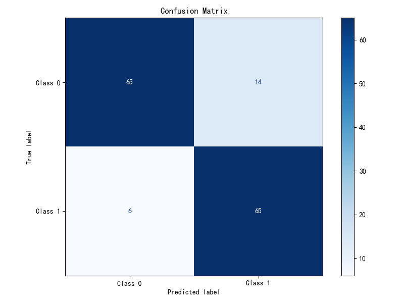
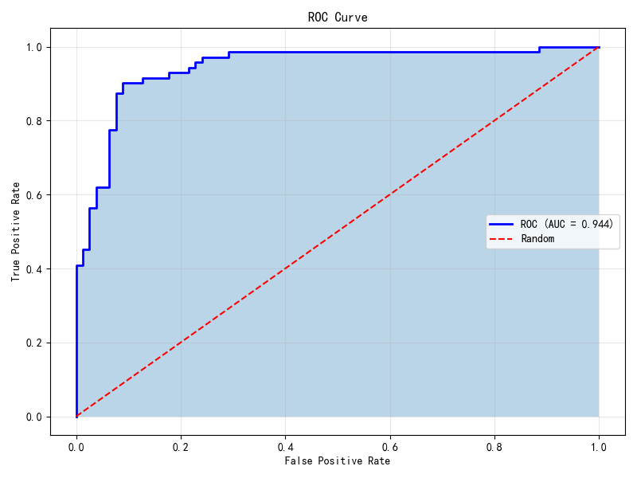
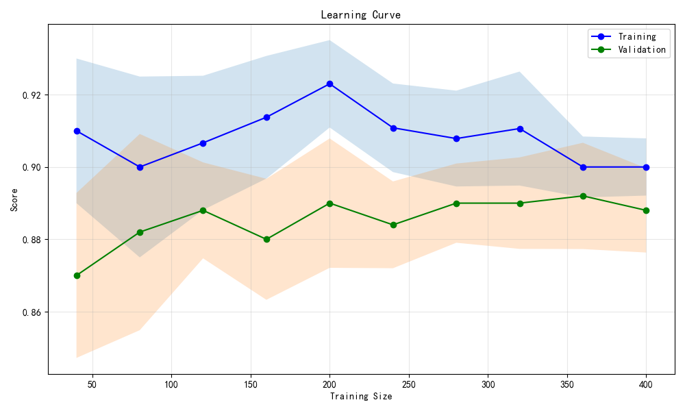

# 模型评估可视化

## 本章目标

1. 掌握分类任务中混淆矩阵、ROC 曲线和学习曲线的可视化流程
2. 理解概率输出、阈值变化与分类性能之间的关系
3. 学会通过学习曲线判断欠拟合与过拟合趋势

## 重点方法与概念速览

| 名称 | 类型 | 作用 |
|---|---|---|
| `confusion_matrix(y_true, y_pred)` | 函数 | 计算预测与真实标签的混淆矩阵 |
| `ConfusionMatrixDisplay(cm)` | 构造器 | 标准化展示混淆矩阵图 |
| `roc_curve(y_true, y_score)` | 函数 | 计算 ROC 曲线坐标 |
| `auc(x, y)` | 函数 | 计算曲线下面积 |
| `learning_curve(estimator, X, y)` | 函数 | 评估样本规模与泛化性能关系 |

## 1. 混淆矩阵

### `confusion_matrix` + `ConfusionMatrixDisplay`

#### 作用

混淆矩阵直接展示 TP、TN、FP、FN 组成，是分类诊断基础。`ConfusionMatrixDisplay` 能快速绘制规范图形并附带标签。在类别不平衡任务中，混淆矩阵比单一准确率更有解释力。

#### 重点方法

```python
confusion_matrix(y_true, y_pred, *, labels=None, normalize=None)
ConfusionMatrixDisplay(confusion_matrix, *, display_labels=None)
ConfusionMatrixDisplay.plot(*, ax=None, cmap=None, colorbar=True)
```

#### 参数

| 参数名 | 类型 | 说明 | 示例取值 |
|---|---|---|---|
| `y_true` | `array_like` | 真实标签 | `y_test` |
| `y_pred` | `array_like` | 预测标签 | `clf.predict(X_test)` |
| `normalize` | `str` | 归一化：`"true"` / `"pred"` / `"all"` | `"true"` |
| `display_labels` | `list[str]` | 显示标签 | `["Class 0", "Class 1"]` |
| `cmap` | `str` | 颜色映射 | `"Blues"` |

#### 示例代码

```python
import matplotlib.pyplot as plt
from sklearn.datasets import make_classification
from sklearn.model_selection import train_test_split
from sklearn.linear_model import LogisticRegression
from sklearn.metrics import confusion_matrix, ConfusionMatrixDisplay

X, y = make_classification(n_samples=500, n_features=10, random_state=42)
X_train, X_test, y_train, y_test = train_test_split(
    X, y, test_size=0.3, random_state=42
)

clf = LogisticRegression(random_state=42).fit(X_train, y_train)
cm = confusion_matrix(y_test, clf.predict(X_test))

fig, ax = plt.subplots(figsize=(8, 6))
disp = ConfusionMatrixDisplay(cm, display_labels=["Class 0", "Class 1"])
disp.plot(ax=ax, cmap="Blues")
ax.set_title("Confusion Matrix")
plt.close()
```

#### 输出

```text
控制台提示: 图表已保存到 outputs/visualization/08_confusion.png
2x2 混淆矩阵展示每类预测正确与错误数量
```



#### 理解重点

- 误报和漏报的业务代价不同——混淆矩阵是阈值调优依据
- 报告时建议同时给出 precision、recall 与混淆矩阵
- `normalize='true'` 可将数值转为行百分比——适合类别不平衡场景

## 2. ROC 曲线

### `roc_curve` + `auc`

#### 作用

ROC 曲线反映不同阈值下的 TPR 与 FPR 权衡。AUC 越大通常表示排序能力越强。ROC 图可用于比较多个模型的判别性能。完美分类器 AUC=1，随机猜测 AUC=0.5。

#### 重点方法

```python
roc_curve(y_true, y_score, *, pos_label=None)
auc(x, y)
```

#### 参数

| 参数名 | 类型 | 说明 | 示例取值 |
|---|---|---|---|
| `y_true` | `array_like` | 真实标签 | `y_test` |
| `y_score` | `array_like` | 正类概率得分 | `clf.predict_proba(X_test)[:, 1]` |
| `pos_label` | `int` 或 `str` | 正类标签，默认为 `None`（自动判断） | `1` |

#### 示例代码

```python
import matplotlib.pyplot as plt
from sklearn.datasets import make_classification
from sklearn.model_selection import train_test_split
from sklearn.linear_model import LogisticRegression
from sklearn.metrics import roc_curve, auc

X, y = make_classification(n_samples=500, n_features=10, random_state=42)
X_train, X_test, y_train, y_test = train_test_split(
    X, y, test_size=0.3, random_state=42
)

clf = LogisticRegression(random_state=42).fit(X_train, y_train)
yProba = clf.predict_proba(X_test)[:, 1]
fpr, tpr, _ = roc_curve(y_test, yProba)
rocAuc = auc(fpr, tpr)

fig, ax = plt.subplots(figsize=(8, 6))
ax.plot(fpr, tpr, linewidth=2, label=f"ROC (AUC = {rocAuc:.3f})")
ax.plot([0, 1], [0, 1], "r--", linewidth=1, label="Random")
ax.set_xlabel("False Positive Rate")
ax.set_ylabel("True Positive Rate")
ax.set_title("ROC Curve")
ax.legend()
plt.close()
```

#### 输出

```text
控制台提示: 图表已保存到 outputs/visualization/08_roc.png
模型 ROC 曲线位于随机基线之上并给出 AUC
```



#### 理解重点

- ROC 关注排序能力，不直接反映阈值下的精确率
- 正负样本极不平衡时建议同时观察 PR 曲线
- 随机基线（对角线）是最低参照——任何模型应在此之上

## 3. 学习曲线

### `learning_curve`

#### 作用

学习曲线描述训练样本量变化对训练分数与验证分数的影响。训练分数高而验证分数低通常提示过拟合。两条曲线都偏低通常提示欠拟合或特征不足。

#### 重点方法

```python
learning_curve(estimator, X, y, *, train_sizes=None, cv=None, scoring=None)
```

#### 参数

| 参数名 | 类型 | 说明 | 示例取值 |
|---|---|---|---|
| `estimator` | `estimator` | 待评估模型 | `LogisticRegression(random_state=42)` |
| `X, y` | `array_like` | 全量特征与标签 | `X, y` |
| `train_sizes` | `array_like` | 训练集比例序列 | `np.linspace(0.1, 1.0, 10)` |
| `cv` | `int` | 交叉验证折数 | `5` |
| `scoring` | `str` | 评分方式，默认为 `None` | `"accuracy"` |

#### 示例代码

```python
import numpy as np
import matplotlib.pyplot as plt
from sklearn.datasets import make_classification
from sklearn.linear_model import LogisticRegression
from sklearn.model_selection import learning_curve

X, y = make_classification(n_samples=500, n_features=10, random_state=42)
clf = LogisticRegression(random_state=42)

trainSizes, trainScores, testScores = learning_curve(
    clf, X, y, cv=5, train_sizes=np.linspace(0.1, 1.0, 10)
)
trainMean = trainScores.mean(axis=1)
testMean = testScores.mean(axis=1)

fig, ax = plt.subplots(figsize=(10, 6))
ax.plot(trainSizes, trainMean, "o-", label="Training Score")
ax.plot(trainSizes, testMean, "o-", label="Validation Score")
ax.fill_between(trainSizes,
                testMean - testScores.std(axis=1),
                testMean + testScores.std(axis=1), alpha=0.2)
ax.set_xlabel("Training Set Size")
ax.set_ylabel("Accuracy")
ax.set_title("Learning Curve")
ax.legend()
plt.close()
```

#### 输出

```text
控制台提示: 图表已保存到 outputs/visualization/08_learning.png
训练曲线与验证曲线随样本增加逐步收敛
```



#### 理解重点

- 学习曲线是判断"继续加数据是否有收益"的核心依据
- 高方差（大间隙）= 过拟合，高偏差（低分平缓）= 欠拟合
- 曲线分析应与模型复杂度和特征工程一起综合判断

## 常见坑

1. 混淆矩阵只看数字不看比例——类别不平衡时归一化更清晰
2. ROC 曲线用类别预测而非概率——曲线退化为单点失去意义
3. 学习曲线的标准差带过宽——暗示数据划分或模型不稳定

## 小结

- 混淆矩阵是分类评估的基石——先看矩阵，再看指标
- ROC 曲线反映模型排序能力——AUC 是快速对比工具
- 学习曲线诊断过拟合/欠拟合——调参前先确认方向
- 评估可视化核心三件套：混淆矩阵 + ROC 曲线 + 学习曲线
