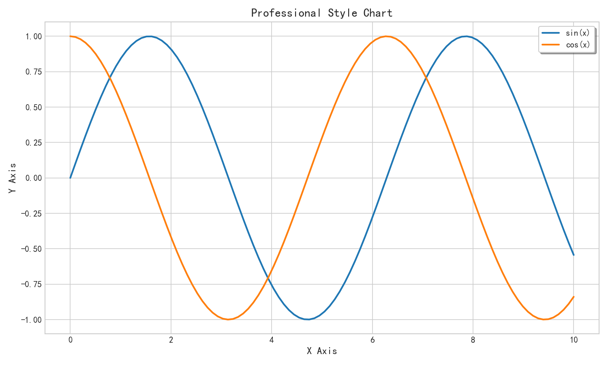
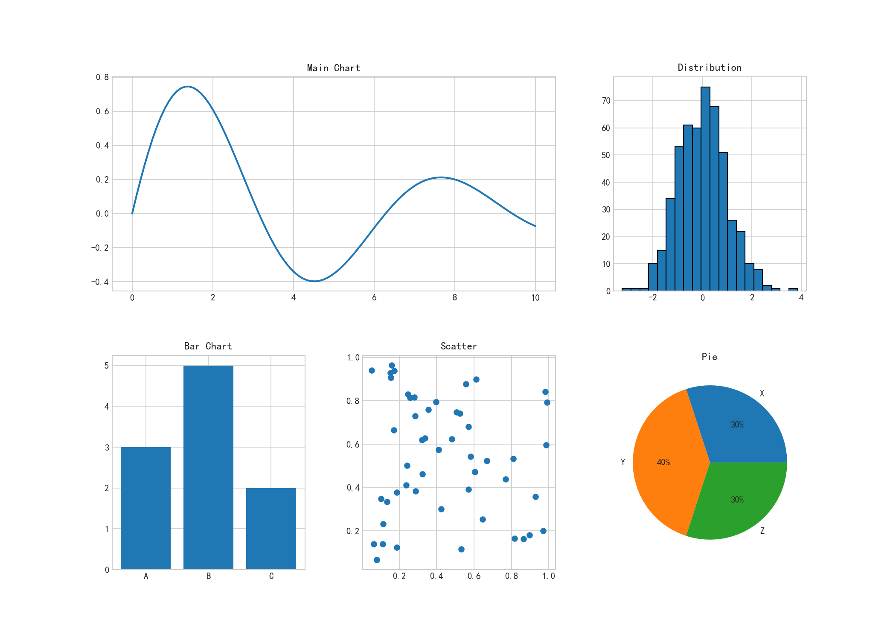

# 图表报告与交付

## 本章目标

1. 掌握专业报告图的样式统一、布局设计和输出规范
2. 学会使用 GridSpec 构建复杂多面板可视化版式
3. 理解导出参数与配色体系对交付质量的影响

## 重点方法与概念速览

| 名称 | 类型 | 作用 |
|---|---|---|
| `plt.style.use(style)` | 函数 | 统一图表风格模板 |
| `fig.add_gridspec(nrows, ncols)` | 方法 | 创建复杂网格布局 |
| `fig.add_subplot(gs[...])` | 方法 | 在布局中添加子图 |
| `plt.savefig(fname, dpi)` | 函数 | 导出高分辨率图像 |
| `plt.cm.get_cmap(name)` | 函数 | 使用内置色图管理配色 |

## 1. 专业样式设置

### `plt.style.use` + 标题层级

#### 作用

报告图首要目标是可读性一致，而非单图视觉炫技。`style.use` 可统一网格线、字体、背景等全局风格。标题、轴标签、图例应形成固定层级规范。

#### 重点方法

```python
plt.style.use(style)                              # 设置全局样式
ax.set_title(label, *, fontsize=None, fontweight=None)
fig.savefig(fname, *, dpi=None, bbox_inches=None)
```

#### 参数

| 参数名 | 类型 | 说明 | 示例取值 |
|---|---|---|---|
| `style` | `str` | 全局样式模板：`"seaborn-v0_8-whitegrid"` / `"ggplot"` / `"fivethirtyeight"` 等 | `"seaborn-v0_8-whitegrid"` |
| `label` | `str` | 标题文本 | `"Professional Style Chart"` |
| `fontsize` | `int` | 标题字号 | `14` |
| `fontweight` | `str` | 标题字重：`"normal"` / `"bold"` | `"bold"` |
| `fname` | `str` | 输出文件路径 | `"output.png"` |
| `dpi` | `int` | 分辨率，默认为 `None` | `150` |
| `bbox_inches` | `str` | 边界控制：`"tight"` 紧凑裁切，默认为 `None` | `"tight"` |

#### 示例代码

```python
import numpy as np
import matplotlib.pyplot as plt

plt.style.use("seaborn-v0_8-whitegrid")
x = np.linspace(0, 10, 100)

fig, ax = plt.subplots(figsize=(10, 6))
ax.plot(x, np.sin(x), linewidth=2, label="sin(x)")
ax.plot(x, np.cos(x), linewidth=2, label="cos(x)")
ax.set_title("Professional Style Chart", fontsize=14, fontweight="bold")
ax.set_xlabel("x")
ax.set_ylabel("y")
ax.legend(frameon=True, fancybox=True, shadow=True)
plt.close()
```

#### 输出

```text
控制台提示: 图表已保存到 outputs/visualization/10_professional.png
统一网格风格、标题层级和图例外观
```



#### 理解重点

- 风格一致性比单图复杂度更能提升报告专业感
- 建议把常用样式配置固化为团队模板
- `plt.style.available` 可查看所有内置样式名称

## 2. 多面板布局

### `GridSpec` 不规则布局

#### 作用

GridSpec 支持不规则布局，适合仪表盘和报告页组合图。一个主图配多个辅助图是最常见的讲故事结构。布局阶段就应确定主次关系与读图顺序。

#### 重点方法

```python
fig.add_gridspec(nrows, ncols, *, hspace=None, wspace=None)
fig.add_subplot(gs[row_slice, col_slice])
```

#### 参数

| 参数名 | 类型 | 说明 | 示例取值 |
|---|---|---|---|
| `nrows` | `int` | GridSpec 行数 | `2` |
| `ncols` | `int` | GridSpec 列数 | `3` |
| `hspace` | `float` | 行间距（相对高度） | `0.3` |
| `wspace` | `float` | 列间距（相对宽度） | `0.3` |

#### 示例代码

```python
import numpy as np
import matplotlib.pyplot as plt

np.random.seed(42)
fig = plt.figure(figsize=(14, 10))
gs = fig.add_gridspec(2, 3, hspace=0.3, wspace=0.3)

ax1 = fig.add_subplot(gs[0, :2])    # 上方主图（跨2列）
ax2 = fig.add_subplot(gs[0, 2])     # 右上辅助图
ax3 = fig.add_subplot(gs[1, 0])     # 左下
ax4 = fig.add_subplot(gs[1, 1])     # 中下
ax5 = fig.add_subplot(gs[1, 2])     # 右下

x = np.linspace(0, 10, 100)
ax1.plot(x, np.sin(x)); ax1.set_title("Main: sin(x)")
ax2.hist(np.random.randn(500), bins=20); ax2.set_title("Distribution")
ax3.plot(x, np.cos(x)); ax3.set_title("cos(x)")
ax4.scatter(np.random.randn(50), np.random.randn(50)); ax4.set_title("Scatter")
ax5.plot(x, np.exp(-x/3) * np.sin(x)); ax5.set_title("Damped")
plt.close()
```

#### 输出

```text
控制台提示: 图表已保存到 outputs/visualization/10_multipanel.png
上方主图 + 右上分布图 + 下方三图组合布局
```



#### 理解重点

- 复杂布局先画草图再编码，效率更高
- 主图面积通常应大于辅助图，避免重点分散
- `gs[row, col]` 支持切片——`gs[0, :2]` 表示第0行占前两列

## 3. 导出选项

### `plt.savefig` 格式与参数

#### 作用

不同交付场景需要不同导出格式和分辨率策略。PNG 适合网页，PDF/SVG 适合矢量打印与论文。`bbox_inches='tight'` 能有效减少多余留白。

#### 重点方法

```python
plt.savefig(fname, *, dpi=None, bbox_inches=None, transparent=False,
            facecolor='auto')
```

#### 参数

| 参数名 | 类型 | 说明 | 示例取值 |
|---|---|---|---|
| `fname` | `str` | 输出路径，扩展名决定格式 | `"fig.png"` / `"fig.pdf"` / `"fig.svg"` |
| `dpi` | `int` | 分辨率（位图格式有效），默认为 `None` | `300` |
| `bbox_inches` | `str` | 边界控制：`"tight"` 紧凑裁切 | `"tight"` |
| `transparent` | `bool` | 是否透明背景，默认为 `False` | `True` |
| `facecolor` | `str` | 背景色，默认为 `"auto"` | `"white"` |

#### 示例代码

```python
import matplotlib.pyplot as plt

fig, ax = plt.subplots()
ax.plot([1, 2, 3], [1, 4, 9])

plt.savefig("fig.png", dpi=300, bbox_inches="tight")
plt.savefig("fig.pdf", bbox_inches="tight")
plt.savefig("fig.svg", transparent=True)
print("已导出: fig.png / fig.pdf / fig.svg")
```

#### 输出

```text
已导出: fig.png / fig.pdf / fig.svg
推荐策略: 报告预览用 PNG，正式发布优先 PDF 或 SVG
```

#### 理解重点

- 导出前先确认下游使用场景，避免重复返工
- 位图格式（PNG）适合屏幕阅读，矢量格式（PDF/SVG）适合印刷
- `dpi=300` 适合打印，`dpi=150` 适合屏幕

## 4. 配色方案

### 色图类型与选择

#### 作用

配色应服务信息层级，而不是追求"颜色多"。连续变量、发散变量、类别变量应使用不同色图类别。团队报告建议固定主色板与强调色，保证视觉一致。

#### 重点方法

```python
plt.cm.get_cmap(name, lut=None)          # 获取色图对象
plt.cm.Set1(np.linspace(0, 1, n))        # 抽样 n 种离散色
```

#### 速查表

| 色图类型 | 用途 | 典型色图 |
|---|---|---|
| 顺序色图 | 数值大小编码 | `viridis` `plasma` `magma` `cividis` |
| 发散色图 | 正负/偏离编码 | `coolwarm` `RdBu` `seismic` |
| 定性色图 | 类别区分 | `Set1` `Set2` `tab10` `Pastel1` |

#### 示例代码

```python
import numpy as np
import matplotlib.pyplot as plt

print("顺序色图: viridis, plasma, magma, cividis, inferno")
print("发散色图: coolwarm, RdBu, seismic, bwr")
print("定性色图: Set1, Set2, tab10, Pastel1")

colors = plt.cm.Set1(np.linspace(0, 1, 5))
print(f"Set1 抽样 5 色: {colors}")
```

#### 输出

```text
顺序色图: viridis, plasma, magma, cividis, inferno
发散色图: coolwarm, RdBu, seismic, bwr
定性色图: Set1, Set2, tab10, Pastel1
Set1 抽样 5 色: [[0.894 0.102 0.110 1.   ] ...]
```

#### 理解重点

- 颜色体系应与业务语义绑定——例如红色表示风险、绿色表示健康
- 建议做色盲友好检查，避免关键信息仅靠颜色传达
- `viridis` 是 matplotlib 默认色图——色盲友好且在灰度打印中可区分

## 常见坑

1. `plt.style.use` 会影响整个脚本后续所有图——应在文件开头调用
2. `bbox_inches='tight'` 可能裁掉部分图例——需检查最终输出
3. SVG 文件可能包含多余白边——配合 `fig.subplots_adjust` 微调
4. 顺序色图用于类别数据——导致无意义颜色梯度误导读者

## 小结

- 报告图的核心是统一风格 + 合理布局 + 精准配色
- `plt.style.use` 设置全局样式，GridSpec 构建复杂版面
- 导出前明确目标格式和分辨率——不同场景不同策略
- 配色遵循"连续用顺序、类别用定性、偏离用发散"的选图规则
