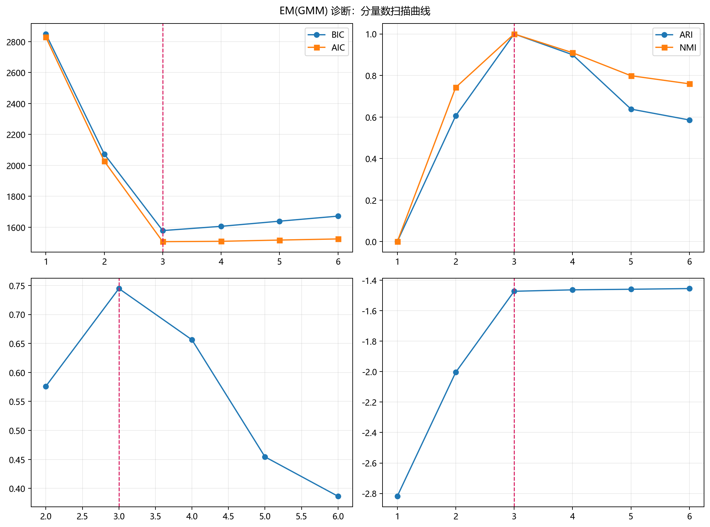

# 模型构建

> 对应代码：`model_training/probabilistic/em.py`
>  
> 运行方式：`python -m model_training.probabilistic.em`

## 本章目标

1. 明确 `train_model(...)` 如何构建并训练 `GaussianMixture`。
2. 理解默认 `n_components`、`covariance_type`、`max_iter`、`random_state` 在当前源码中的作用。
3. 看清训练函数除了 `fit(...)` 之外还做了哪些工程封装和日志输出。

## 重点方法与概念速览

| 名称 | 类型 | 作用 |
|---|---|---|
| `train_model(...)` | 函数 | 构建并训练一个 `sklearn.mixture.GaussianMixture` 模型 |
| `GaussianMixture(...)` | 类 | scikit-learn 提供的 GMM 实现 |
| `model.fit(X_train)` | 方法 | 在观测特征上执行 EM 迭代训练 |
| `model.lower_bound_` | 属性 | 返回训练收敛后的平均对数似然下界 |
| `@print_func_info` / `@timeit` / `timer(...)` | 工程包装 | 打印入口信息与训练耗时 |

## 1. `train_model(...)` 的函数签名

### 参数速览（本节）

适用函数：`train_model(X_train, n_components=3, covariance_type='full', max_iter=200, random_state=42)`

| 参数名 | 本例取值 | 说明 |
|---|---|---|
| `X_train` | 标准化后的特征 | 输入给 `GaussianMixture.fit(...)` 的训练矩阵 |
| `n_components` | `3` | 高斯分量数量 |
| `covariance_type` | `'full'` | 协方差矩阵建模方式 |
| `max_iter` | `200` | EM 最大迭代次数 |
| `random_state` | `42` | 随机种子，保证可复现 |
| 返回值 | `GaussianMixture` | 已训练完成的 GMM 模型对象 |

### 示例代码

```python
from model_training.probabilistic.em import train_model

model = train_model(X_scaled)
```

### 理解重点

- 当前训练入口返回的是单个 GMM 模型对象。
- 训练时只需要观测特征 `X_train`，不需要真实标签。
- 默认参数直接来自源码，是后续理解 EM 模型设定的基线。

## 2. `GaussianMixture(...)` 的实际构建方式

### 参数速览（本节）

适用 API（分项）：

1. `GaussianMixture(...)`
2. `model.fit(X_train)`

| 参数名 | 本例取值 | 说明 |
|---|---|---|
| `n_components` | `3` | 假设混合分量数量 |
| `covariance_type` | `'full'` | 每个分量使用完整协方差矩阵 |
| `max_iter` | `200` | 最多迭代 200 次 |
| `random_state` | `42` | 保证初始化与训练过程可复现 |

### 示例代码

```python
model = GaussianMixture(
    n_components=n_components,
    covariance_type=covariance_type,
    max_iter=max_iter,
    random_state=random_state,
)

model.fit(X_train)
```

### 理解重点

- 仓库没有自己实现 E 步和 M 步，而是直接调用 scikit-learn 的现成 `GaussianMixture`。
- 当前文档的重点，不是手写 EM，而是理解这些高层参数如何影响训练行为。
- 这是一层典型的“教学型薄封装”。

## 3. 四个核心超参数分别控制什么

### 参数速览（本节）

适用超参数（分项）：

1. `n_components`
2. `covariance_type`
3. `max_iter`
4. `random_state`

| 超参数 | 当前作用 | 调整时的常见影响 |
|---|---|---|
| `n_components` | 假设分量数量 | 设少了会混簇，设多了会过分拆分 |
| `covariance_type` | 决定协方差结构 | 影响簇形状表达能力 |
| `max_iter` | 限制 EM 迭代上限 | 太小可能提前停止 |
| `random_state` | 控制初始化随机性 | 影响可复现性与局部解 |

### 理解重点

- `n_components` 是当前 EM 分册里最重要的建模假设之一。
- `covariance_type='full'` 表示每个分量可以拥有完整协方差结构，更适合当前椭圆簇数据。
- `max_iter` 和 `random_state` 则更多影响训练收敛过程与结果稳定性。

## 4. `lower_bound_` 在当前实现里表示什么

### 参数速览（本节）

适用属性：`model.lower_bound_`

| 属性名 | 当前含义 |
|---|---|
| `lower_bound_` | 训练收敛后平均对数似然下界 |

### 示例代码

```python
print(f"log-likelihood: {model.lower_bound_:.4f}")
```

### 理解重点

- 当前日志里打印的 `log-likelihood` 实际来自 `model.lower_bound_`。
- 它更像训练收敛水平的信号，而不是监督学习里那种直接可解释的准确率。
- 因此它可以帮助判断模型是否完成了较稳定的 EM 优化，但不能单独替代聚类效果观察。

## 5. 训练阶段的工程封装

除了 `GaussianMixture(...).fit(...)` 之外，`train_model(...)` 还做了多层工程包装。

### 参数速览（本节）

适用装饰与上下文（分项）：

1. `@print_func_info`
2. `@timeit`
3. `with timer(name='模型训练耗时')`

| 包装项 | 作用 |
|---|---|
| `@print_func_info` | 打印函数调用入口 |
| `@timeit` | 打印整个函数耗时 |
| `timer(...)` | 打印模型 `fit(...)` 阶段耗时 |

### 示例代码

```python
@print_func_info
@timeit
def train_model(...):
    ...
    with timer(name="模型训练耗时"):
        model.fit(X_train)
```

### 理解重点

- 当前训练函数会同时打印“模型训练耗时”和整个函数耗时，因此终端里会看到两层计时信息。
- 这些包装不改变 EM 算法行为，但有助于观察训练入口和收敛耗时。
- 和监督学习分册相比，这里更强调模型设定和似然下界，而不是标签预测指标。



## 常见坑

1. 误以为 `train_model(...)` 手写实现了 E 步和 M 步，实际上它只是对 `GaussianMixture` 的薄封装。
2. 只关注 `n_components`，忽略 `covariance_type` 也会显著影响簇形状建模能力。
3. 把 `lower_bound_` 误读成聚类准确率或最终质量指标。

## 小结

- `train_model(...)` 是本仓库 EM / GMM 的核心训练入口。
- 它本质上是对 `sklearn.mixture.GaussianMixture` 的薄封装，重点在于超参数传递、耗时统计和收敛日志输出。
- 读懂这一层之后，再看流水线中的训练、预测和聚类可视化过程会更清晰。
