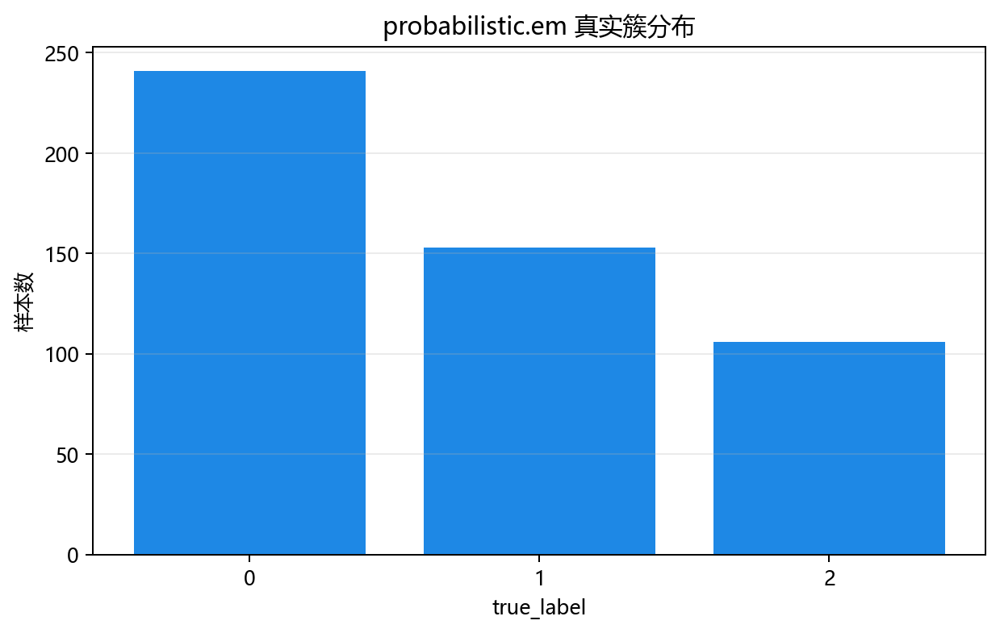

# 评估与诊断

## 本章目标

1. 理解当前 EM 流水线的评估输出——聚类分布图（预测 vs 真实标签双面板对比）和对数似然日志。
2. 理解聚类分布图中的诊断信号——软边界、椭圆形状、误分模式。
3. 明确当前流水线**已实现**和**未实现**的评估项——以及 EM 评估与分类评估的根本差异。

## 重点方法与概念速览

| 名称 | 类型 | 作用 |
|---|---|---|
| 聚类分布图 | 图表 | 双面板对比——左：EM 预测标签（`labels_pred`）；右：真实分量标签（`true_label`） |
| 对数似然日志 | 终端文本 | `lower_bound_`——收敛时数据在当前 GMM 参数下的对数似然 |
| 软归属不确定性 | 诊断信息 | $1 - \max_k \gamma_{ik}$——定量衡量每个样本在分量间的摇摆程度 |

## 1. 聚类分布图

`plot_clusters(X_scaled, labels_pred=labels_pred, labels_true=y_true, ...)` 绘制双面板聚类对比图。

### 参数速览

| 参数名 | 类型 | 说明 | 示例取值 |
|---|---|---|---|
| `X_scaled` | `ndarray`，形状 `(500, 2)` | 标准化后的 2 维特征 | `scaler.fit_transform(X)` |
| `labels_pred` | `ndarray`，形状 `(500,)` | EM 预测的硬聚类标签——$\arg\max_k \gamma_{ik}$ | `model.predict(X_scaled)` |
| `labels_true` | `ndarray`，形状 `(500,)` | 真实分量标签——**仅用于评估对比，不参与训练** | `data["true_label"].values` |
| `title` | `str` | 图表标题 | `"EM (GMM) 聚类分布"` |
| `dataset_name` | `str` | 数据集名称——决定输出路径 | `"em"` |
| `model_name` | `str` | 模型名称——决定输出路径 | `"gmm"` |

### 示例代码

```python
y_true = data["true_label"].values
labels_pred = model.predict(X_scaled)
plot_clusters(
    X_scaled,
    labels_pred=labels_pred,
    labels_true=y_true,
    title="EM (GMM) 聚类分布",
    dataset_name="em",
    model_name="gmm",
)
```

### 输出



### 理解重点

- 双面板对比是聚类评估的核心手段——左面板显示"EM 认为的 3 个簇"，右面板显示"真实的 3 个分量"。
- 理想情况：左右面板的簇边界和颜色分布基本一致，说明 EM 成功恢复了 GMM 的分量结构。
- GMM 的特色：边界模糊区域的点——左侧可能将"摇摆不定的点"划到某个分量，这是硬截断的副作用。通过 `predict_proba` 可查看这些点的真实归属不确定性。
- 与 KMeans 聚类图的对比：KMeans 的左面板分界线是 Voronoi 直线，EM 的边界是曲线（因为马氏距离度量）。

## 2. 对数似然下界

训练完成后，终端打印 `lower_bound_`：

```text
模型训练完成
n_components: 3
covariance_type: full
log-likelihood: -2.1457
```

### 理解重点

- `lower_bound_` 是 EM 在收敛点的对数似然估计——始终为负数（概率密度 < 1 时 $\log < 0$）。
- 值越接近 0，模型拟合越好——但要注意过拟合风险（参数越多，似然越高）。
- `lower_bound_` 在每次 EM 迭代中**单调递增**——如果观察到下降，说明程序存在 bug。

## 3. 已实现 vs 未实现的评估

### 参数速览

| 评估项 | 状态 | 原因 |
|---|---|---|
| 聚类分布图 | 已实现 | 无监督聚类评估的核心可视化 |
| 对数似然日志 | 已实现 | EM 收敛的定量诊断指标 |
| BIC / AIC | **未实现** | 模型选择指标——用于选择 $n\_components$。当前 $K=3$ 为已知先验 |
| 归属不确定性分析 | **部分实现** | `predict_proba` 提供数据但未做可视化——可在练习中探索 |
| 混淆矩阵 | **不适用** | `labels_pred` 的分量标签可能与 `true_label` 交换——聚类标签没有内在语义 |
| 轮廓系数 | **未实现** | 适用于硬聚类评估——与 GMM 的软赋值哲学不完全匹配 |
| 交叉验证对数似然 | **未实现** | 教学场景下单次训练的对数似然足够 |

### 理解重点

- 聚类评估与分类评估的根本差异：**聚类标签没有内在语义**——EM 的输出可能是把分量 1 标为 $0$，分量 2 标为 $1$，而真实标签的编号可能正好相反。混淆矩阵在此场景下无意义。
- BIC（贝叶斯信息准则）和 AIC（赤池信息准则）是 GMM 选择最优 $K$ 的标准方法——它们在对数似然的基础上加上了参数数量的惩罚项。

## 4. 软归属的诊断价值

虽然流水线中未显式使用 `predict_proba`，但软归属矩阵 $\gamma_{ik}$ 提供了重要的诊断信息：

- **高不确定性样本**：$\max_k \gamma_{ik} < 0.6$——这些点在分量边界处，说明分量间有重叠
- **误分模式**：高不确定性样本集中的区域——可能是真实分量交界处，也可能是 EM 初始化不佳导致的"错误边界"
- **分量体量估计**：$\sum_i \gamma_{ik} / N \approx \pi_k$——与 `model.weights_` 应一致

### 理解重点

- 软归属是 GMM 评估相对于 KMeans 的独特优势——不仅知道"点被分到哪"，还知道"分的把握有多大"。
- 高不确定性样本在决策应用中需要特殊处理——可以拒绝决策或要求人工标注。

## 5. EM vs KMeans vs DBSCAN 评估对比

| 评估维度 | KMeans | DBSCAN | EM (GMM) |
|---|---|---|---|
| 聚类可视化 | 聚类图（`labels_pred`） | 聚类图（`labels_pred` + 噪声点） | **双面板对比图**（`labels_pred` + `true_label`） |
| 定量指标 | `inertia_` | 噪声点数量 + 簇数 | **`lower_bound_`（对数似然）** |
| 软归属 | 无 | 无 | **`predict_proba()`** |
| 簇形状诊断 | Voronoi 多边形 | 任意形状簇 | **椭圆簇——观察协方差矩阵** |
| 标签语义 | 无 | 无 | 无——标签编号可以交换 |
| 噪声处理 | 无（所有点归入簇） | 核心特征（label=-1） | **无——每个点都有完整的归属概率** |

## 常见坑

1. 直接对比 `labels_pred` 和 `true_label` 的标签编号——聚类标签没有语义，编号可以互换。
2. 认为 `lower_bound_` 越大越好（无上限）——过参数化（增大 $K$ 或使用 `full` 协方差）总会增加似然，需要 BIC 平衡。
3. 忽略高不确定性样本——它们在分析中可能表示"分量间重叠区"或"数据不满足 GMM 假设"。
4. 把聚类分布图中的边界曲线当成确定性分界线——GMM 的分界线是 $\gamma_{ik}$ 最大分量切换的位置，边界处的软归属需额外关注。

## 小结

- EM 当前有两项评估输出：聚类分布图（预测 vs 真实标签双面板对比）和对数似然下界日志（收敛定量指标）。
- GMM 评估的独特价值在于软归属——`predict_proba()` 提供每个样本对各分量的归属概率，可用于不确定性分析和边界模糊诊断。
- 与分类评估的根本差异：聚类标签无内在语义，不能直接用准确率/混淆矩阵评判——聚类图的眼睛对比是最直观的评估方式。
