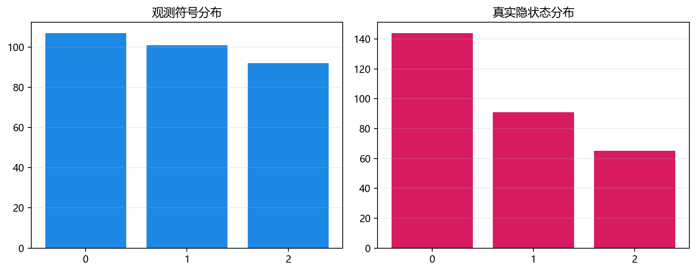
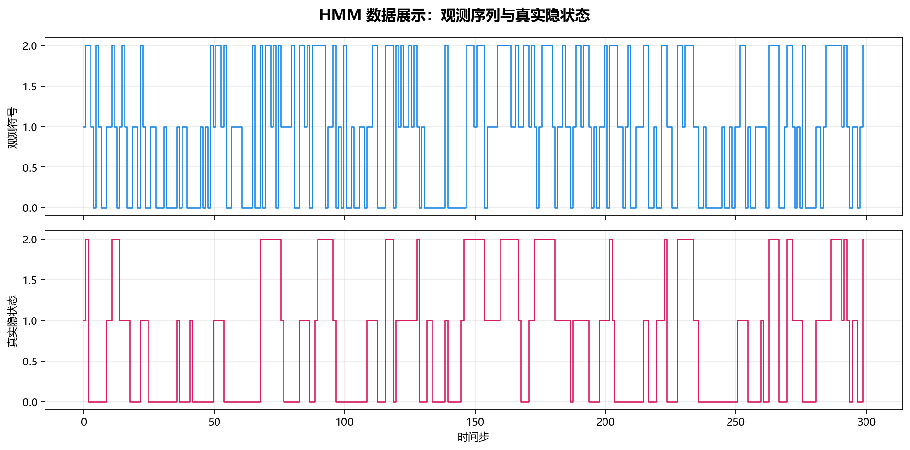

# 数据构成

## 本章目标

1. 明确本仓库 HMM 数据来自 `ProbabilisticData.hmm()` 手动参数化生成的离散序列。
2. 理解三列数据（`time`、`obs`、`state_true`）各自的角色与边界——训练只依赖 `obs`。
3. 理解序列数据特有的整形步骤（`reshape(-1, 1)` + `lengths`）及其与表格型数据的根本差异。

## 重点方法与概念速览

| 名称 | 类型 | 作用 |
|---|---|---|
| `ProbabilisticData.hmm()` | 方法 | 手动参数化生成 HMM 离散观测序列——含真实隐状态 |
| `hmm_data` | 全局变量 | 在 `data_generation/__init__.py` 中导出的 DataFrame（300 行 × 3 列） |
| `obs` | 列 | 离散观测符号序列 $\{0, 1, 2\}$——训练 HMM 的唯一输入 |
| `state_true` | 列 | 数据生成时记录的真实隐状态——仅用于训练后评估对比 |
| `reshape(-1, 1)` | 操作 | 将一维序列整形为 hmmlearn 要求的列向量 `(300, 1)` |
| `lengths` | 参数 | 序列长度列表 `[300]`——告诉模型当前由几条序列拼接而成 |

## 1. 数据生成：`ProbabilisticData.hmm()`

### 参数速览

| 参数名 | 类型 | 说明 | 示例取值 |
|---|---|---|---|
| `hmm_n_steps` | `int` | 序列长度。`300`——足够 Baum-Welch 稳定估计 $3 \times 3$ 转移矩阵 | `50`、`100`、`300`、`1000` |
| `hmm_pi` | `list[float]` | 初始状态分布，和为 1。$\pi_1=0.6$ 意味着序列大概率从状态 0 开始 | `[0.6, 0.3, 0.1]` |
| `hmm_A` | `list[list[float]]` | 状态转移矩阵，行和为 1。对角线 $[0.80, 0.60, 0.70]$ 表示状态 0 最稳定 | `[[0.80,0.15,0.05], [0.20,0.60,0.20], [0.10,0.20,0.70]]` |
| `hmm_B` | `list[list[float]]` | 发射矩阵，行和为 1。状态 0 偏好发射符号 0（概率 0.60） | `[[0.60,0.30,0.10], [0.20,0.50,0.30], [0.10,0.20,0.70]]` |
| `random_state` | `int` | 随机种子。`42`——保证序列可复现 | `42` |
| 返回值 | `DataFrame` | 含 `time`、`obs`、`state_true` 三列 | — |

### 示例代码

```python
from data_generation.probabilistic import ProbabilisticData

data = ProbabilisticData().hmm()
# data.columns = ["time", "obs", "state_true"]
# data.shape = (300, 3)
```

### 生成流程

```python
states = np.zeros(n_steps, dtype=int)
obs_arr = np.zeros(n_steps, dtype=int)

# t=0: 从初始分布采样
states[0] = rng.choice(n_states, p=pi)
obs_arr[0] = rng.choice(n_symbols, p=B[states[0]])

# t=1..T-1: 按转移矩阵推进隐状态，按发射矩阵生成观测
for t in range(1, n_steps):
    states[t] = rng.choice(n_states, p=A[states[t - 1]])
    obs_arr[t] = rng.choice(n_symbols, p=B[states[t]])
```

### 理解重点

- 这是**完全手动参数化**的生成过程——转移矩阵 $A$ 和发射矩阵 $B$ 是预先写死的，而非从数据中学习。
- 每个时间步先按转移矩阵产生新的隐状态，再按发射矩阵产生观测符号——两层随机采样层层嵌套。
- 正是因为 $A$ 和 $B$ 已知，后续可以定量评估 Baum-Welch 恢复参数的精度——这是合成数据的核心教学价值。
- 序列的本质是**时间有序**——$o_t$ 与 $o_{t-1}$ 不独立，它们通过隐状态链 $q_{t-1} \to q_t$ 关联。

## 2. 三列数据的角色

### 参数速览

| 参数名 | 类型 | 说明 | 示例取值 |
|---|---|---|---|
| `time` | `Series`，形状 `(300,)` | 时间步索引 $\{0, 1, \dots, 299\}$——标记序列中的位置 | `0, 1, 2, ..., 299` |
| `obs` | `Series`，形状 `(300,)` | 离散观测符号 $\{0, 1, 2\}$——**训练 HMM 的唯一输入** | `data["obs"].values.astype(int)` |
| `state_true` | `Series`，形状 `(300,)` | 真实隐状态 $\{0, 1, 2\}$——**仅用于评估对比**，不参与训练 | `data["state_true"].values.astype(int)` |

### 理解重点

- `obs` 是流水线中真正送入 `model.fit()` 的数据——Baum-Welch 只看到观测序列，对真实隐状态一无所知。
- `state_true` 是生成时记录的"答案"——仅在训练后与 Viterbi 解码的 `states_pred` 做逐步对比，计算准确率。
- `time` 不直接送入模型——但它提醒我们这是一个有序序列，而非可以随意打乱的 i.i.d. 样本表。
- `astype(int)` 是必需的——确保 hmmlearn 将观测识别为离散符号而非连续浮点数。

## 3. 序列数据整形：`reshape(-1, 1)` 与 `lengths`

### 参数速览

| 参数名 | 类型 | 说明 | 示例取值 |
|---|---|---|---|
| `X_obs` | `ndarray`，形状 `(300, 1)` | 整形后的观测列向量——hmmlearn 的 `fit()` 要求二维输入 | `obs.reshape(-1, 1)` |
| `lengths` | `list[int]` | 序列长度列表。`[300]`——单条 300 步序列 | `[300]`、`[100, 200, 150]` |

### 示例代码

```python
obs = data["obs"].values.astype(int)       # (300,) 一维
X_obs = obs.reshape(-1, 1)                  # (300, 1) 列向量
lengths = [len(obs)]                        # [300]

model.fit(X_obs, lengths)                   # HMM 训练
states_pred = model.predict(X_obs, lengths)  # Viterbi 解码
```

### 理解重点

- `reshape(-1, 1)` 是将一维序列转为列向量的**必需步骤**——hmmlearn 的 `fit` 要求观测形状为 `(n_steps, n_features)`。
- `lengths` 告诉模型"这条长序列由几条子序列拼接而成"——当前是单条 300 步，所以 `[300]`；多序列场景下可以是 `[100, 200, 150]`。
- 这是 HMM 与所有其他模型（分类/聚类/回归）在数据准备上的**根本差异**——其他模型只需传 `(n_samples, n_features)`，HMM 还需传序列边界。

## 4. 当前流程边界

| 项目 | 当前状态 | 说明 |
|---|---|---|
| train/test split | 未使用 | HMM 在单条序列上训练和评估——序列不可随意切分 |
| 标准化 | 未使用 | 离散观测符号 $\{0, 1, 2\}$ 无需缩放 |
| 多条序列拼接 | 当前未展示 | 框架支持——`lengths=[100, 200]` 即可，但教学用单条更清晰 |

### 理解重点

- 当前 HMM 分册没有 train/test split——因为序列数据的时间依赖使得随机切分不合理，且当前目标是展示"参数恢复"而非泛化性能。
- 离散观测符号不需要标准化——这是 HMM 与所有连续特征模型（EM/KMeans/回归）的关键区别。
- 文档必须如实描述当前实现——不能把监督学习的 train/test split 或连续特征的标准化习惯误套到 HMM。

## 5. 数据设计意图：与 EM (GMM) 的对比

| 数据维度 | EM (GMM) | HMM |
|---|---|---|
| 生成方式 | 手动合成——3 分量各向异性高斯 | **手动参数化——Markov chain + categorical emission** |
| 数据形态 | 独立样本矩阵 `(500, 2)` | **有序序列 `(300, 1)`** |
| 特征类型 | 连续 $\mathbb{R}^2$ | **离散 $\{0, 1, 2\}$** |
| 样本独立性 | i.i.d. | **时间依赖——$o_t$ 通过 $q_t$ 与 $o_{t-1}$ 关联** |
| 标签列 | `true_label`——仅用于评估 | **`state_true`——仅用于评估** |
| 标准化 | 有（`StandardScaler`） | **无** |
| 数据拆分 | 无（全量聚类） | 无（全量序列） |
| 训练输入 | `fit(X)` | **`fit(X, lengths)`** |

### 理解重点

- HMM 数据**刻意使用离散观测**——这是为了展示 HMM 处理符号序列（如词性标注、基因序列）的经典场景，而非连续值回归。
- 序列长度为 300 是有意设计——足够 Baum-Welch 稳定估计 $3 \times 3$ 转移矩阵，又不至于太长使演示耗时。
- 与 EM 数据的核心差异：HMM 数据点之间**不独立**——$o_{100}$ 的分布受 $q_{99}$ 影响，而 EM 中 $\mathbf{x}_{100}$ 与其他样本完全独立。

## 数据可视化





## 常见坑

1. 把 `state_true` 当成训练标签——HMM 的 Baum-Welch 是无监督学习，只依赖观测序列。
2. 忘记 `reshape(-1, 1)`——直接将一维 `obs` 传给 `fit()`，hmmlearn 会报错或产生错误结果。
3. 忘记 `astype(int)`——浮点观测可能被 hmmlearn 误认为连续值，触发错误行为。
4. 在极短序列（<50 步）上期待稳定的转移矩阵估计——转移次数不足，参数方差大。

## 小结

- 当前 HMM 数据来自 `ProbabilisticData.hmm()`——手动参数化（$A$、$B$、$\pi$）生成 300 步离散观测序列，三层结构清晰。
- 三列数据角色明确：`obs` 是唯一训练输入，`state_true` 仅用于评估，`time` 标记序列顺序。
- 序列数据的两个特殊整形步骤（`reshape(-1, 1)` + `lengths`）是 HMM 与所有表格型模型在数据准备上的根本分界线。
