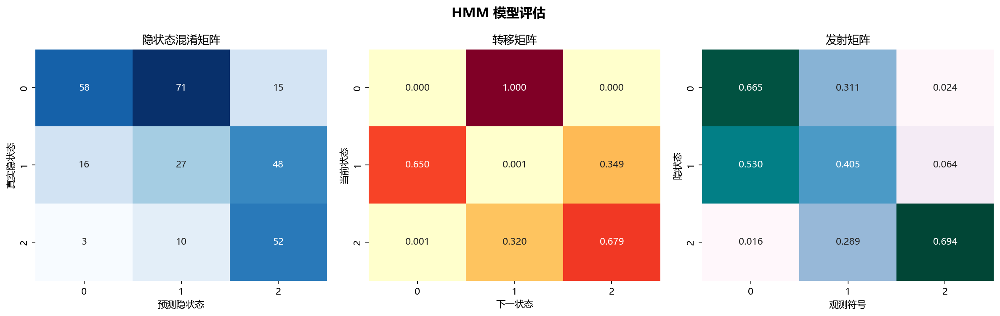
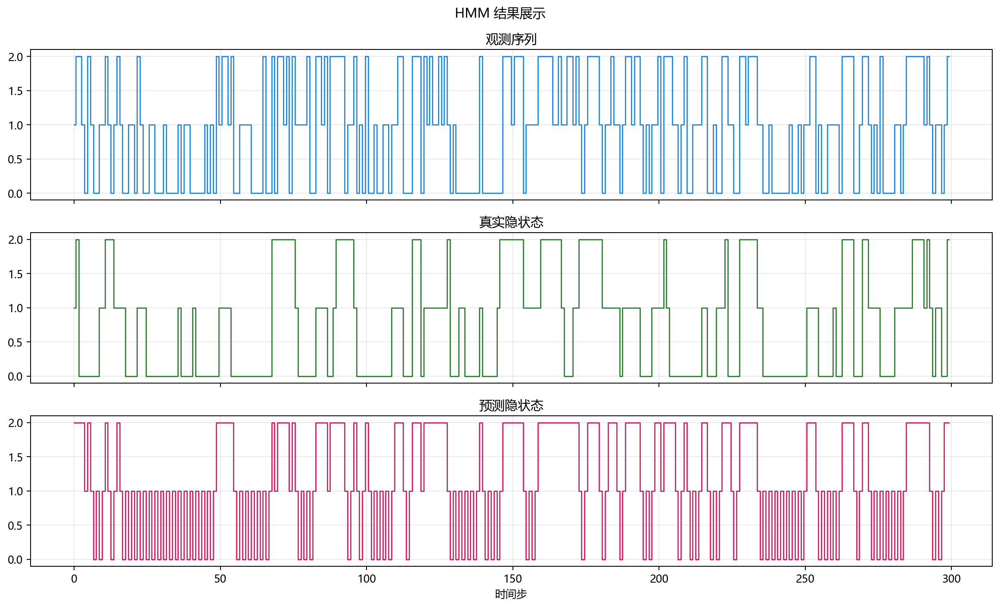

# 工程实现

> 对应代码：`data_generation/probabilistic.py`、`model_training/probabilistic/hmm.py`、`pipelines/probabilistic/hmm.py`
>  
> 运行方式：`python -m pipelines.probabilistic.hmm`

## 本章目标

1. 看清当前 HMM 分册在仓库中的模块分层与调用关系。
2. 理解从命令行入口到隐状态预测结果输出，中间依次发生了什么。
3. 明确哪些逻辑属于数据层、训练层和流水线层。

## 对应代码速览

| 组件 | 路径 | 说明 |
|---|---|---|
| 数据生成层 | `data_generation/probabilistic.py` | `ProbabilisticData.hmm()` 构造离散观测序列 |
| 数据导出层 | `data_generation/__init__.py` | 提供 `hmm_data` 给外部导入 |
| 训练层 | `model_training/probabilistic/hmm.py` | 定义 `train_model(...)` 并训练离散 HMM |
| 流水线层 | `pipelines/probabilistic/hmm.py` | 负责整理序列、训练、解码和打印结果 |

## 1. 入口命令如何触发整条链路

### 示例代码

```bash
python -m pipelines.probabilistic.hmm
```

### 理解重点

- 这个命令会执行 `pipelines/probabilistic/hmm.py` 中的 `run()`。
- `run()` 是真正的工程入口，其他模块都被它按顺序调用。
- 所以理解工程实现时，最清晰的方式也是先从入口脚本往下追踪。

## 2. 模块之间的调用关系

### 示例代码

```python
from data_generation import hmm_data
from model_training.probabilistic.hmm import train_model
```

### 理解重点

- `pipelines` 层不自己生成数据，也不自己实现 HMM 训练，而是扮演调度者角色。
- 这种分层使每个文件职责单一：数据文件只关心序列生成，训练文件只关心模型，流水线文件只关心组织执行和输出。
- 当前 HMM 分册虽然没有图形可视化模块，但工程层次依然很清晰。

## 3. 流水线层真正负责什么

### 参数速览（本节）

适用逻辑（分项）：

1. 复制数据
2. 提取观测序列
3. reshape 观测输入
4. 构造 `lengths`
5. 提取 `state_true`
6. 调用训练函数
7. 解码并打印评估结果

| 步骤 | 所在文件 | 当前职责 |
|---|---|---|
| 读取 `hmm_data` | `pipelines/probabilistic/hmm.py` | 拿到统一数据入口 |
| `obs` / `state_true` 拆分 | `pipelines/probabilistic/hmm.py` | 区分训练输入与对比标签 |
| reshape 与 `lengths` 构造 | `pipelines/probabilistic/hmm.py` | 生成符合 hmmlearn 的输入格式 |
| 调用 `train_model(...)` | `pipelines/probabilistic/hmm.py` | 获得训练好的 HMM |
| `predict(...)` + 打印结果 | `pipelines/probabilistic/hmm.py` | 完成隐状态解码与控制台输出 |

### 理解重点

- 当前仓库没有使用 `Pipeline` 类，也没有复杂的结果可视化封装。
- 这种显式写法更适合教学，因为每一步都能直接看到变量名和执行顺序。
- HMM 分册最容易被误读的地方，就是序列格式和 `state_true` 的边界，因此显式写法特别有价值。

## 4. 为什么这里没有标准化和 train/test split

### 理解重点

- 当前数据是离散观测符号，不像连续特征那样需要标准化。
- 当前实现选择直接在整条观测序列上训练和解码，以便更直观看到状态路径建模过程。
- 这是一种教学型简化实现，文档需要如实说明，而不是套用监督学习默认结构。

## 5. 训练层真正负责什么

### 参数速览（本节）

适用函数：`train_model(...)`

| 输出项 | 作用 |
|---|---|
| `model` | 返回已训练好的 HMM 模型 |
| 控制台日志 | 打印隐状态数、训练迭代设定和训练耗时 |

### 理解重点

- 训练层并不负责构造 `lengths`，也不负责计算准确率或打印转移矩阵。
- 它的核心任务是构建 HMM、执行训练，并输出与训练设定相关的日志。
- 和 EM 分册相比，这里训练输入更强调序列形状和长度信息，而不是几何空间分布。

## 6. 为什么需要 `lengths`

### 示例代码

```python
X_obs = obs.reshape(-1, 1)
lengths = [len(obs)]
model = train_model(X_obs, lengths)
```

### 理解重点

- hmmlearn 允许把多条序列拼接成一个大数组后统一训练，而 `lengths` 用来说明每条子序列的边界。
- 当前实现里只有一条完整序列，因此 `lengths` 就是一个只有一个元素的列表。
- 这说明 `lengths` 不是可有可无的附加参数，而是序列模型输入格式的一部分。

## 7. 常量 `DATASET` 和 `MODEL` 的作用

### 参数速览（本节）

适用常量：

1. `DATASET = "hmm"`
2. `MODEL = "hmm"`

| 常量 | 当前作用 |
|---|---|
| `DATASET` | 当前文件中仅用于分册标识，未参与图像输出 |
| `MODEL` | 当前文件中仅用于模型标识，未参与图像输出 |

### 理解重点

- 这两个常量在当前 HMM 流水线里没有像其他分册那样参与保存图像文件。
- 它们更像是为后续扩展结果输出能力预留的统一命名位。
- 文档需要如实说明这一点，不能套写成“决定结果图目录名”。

## 8. 从命令到结果输出的执行链

### 示例代码

```python
python -m pipelines.probabilistic.hmm
    -> run()
    -> hmm_data.copy()
    -> data["obs"] / data["state_true"]
    -> obs.reshape(-1, 1)
    -> lengths = [len(obs)]
    -> train_model(...)
    -> model.predict(...)
    -> print(accuracy)
    -> print(model.transmat_)
```

### 理解重点

- 这条链里最关键的中间产物有四个：`X_obs`、`lengths`、训练后的 `model`、预测隐状态 `states_pred`。
- 一旦这些中间变量理解清楚，整个 HMM 分册的代码结构就基本串起来了。
- 文档中的各章节，其实就是在拆解这条执行链上的不同环节。





## 常见坑

1. 把 `pipelines` 层和 `model_training` 层职责混在一起，误以为训练函数负责全部工程流程。
2. 不理解为什么当前分册没有图像输出，就误判它没有评估逻辑。
3. 忽略 `lengths` 和 `state_true` 的作用，看不懂序列输入和控制台准确率为什么能成立。

## 小结

- 当前 HMM 实现采用了清晰的分层结构：数据层、训练层、流水线层各司其职。
- 入口脚本负责调度，训练模块负责模型，流水线层负责解码和结果展示。
- 这种结构既方便阅读，也方便后续继续补发射矩阵输出、序列可视化或多序列实验。
