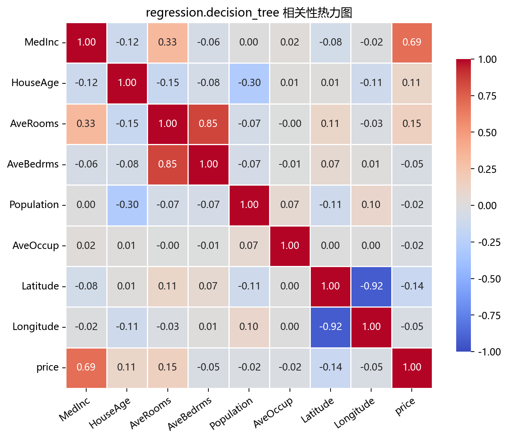
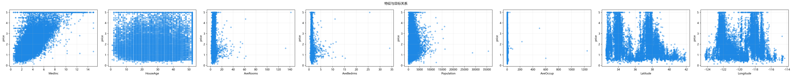

# 数据构成

## 本章目标

1. 明确本仓库决策树回归数据来自 `fetch_california_housing` 真实数据集——非手动合成。
2. 理解 8 个特征与标签 `price` 的角色，以及为何不需要标准化。
3. 明确训练/测试集切分方式（`randomSplit`，`test_size=0.2`）及其与 SVR/线性回归的预处理差异。

## 重点方法与概念速览

| 名称 | 类型 | 作用 |
|---|---|---|
| `RegressionDatasetFactory.loadDecisionTreeRegressionDataset()` | 方法 | 加载 California Housing 真实回归数据——标签列重命名为 `price` |
| `fetch_california_housing(as_frame=True)` | 函数 | scikit-learn 提供的加州房价数据集加载器——20640 样本 × 8 特征 |
| `price` | 列 | 回归目标列——加州街区房价中位数（单位：$100k） |
| `train_test_split` | 函数 | 随机切分训练/测试集——`test_size=0.2, random_state=42` |

## 1. 数据生成：`RegressionDatasetFactory.loadDecisionTreeRegressionDataset()`

### 参数速览

| 参数名 | 类型 | 说明 | 示例取值 |
|---|---|---|---|
| `as_frame` | `bool` | `True`——直接返回带列名的 `DataFrame` | `True` |
| 返回值 | `DataFrame` | 含 8 个特征列 + `price` 标签列的完整数据表，形状 `(20640, 9)` | — |

### 示例代码

```python
from sklearn.datasets import fetch_california_housing

data = fetch_california_housing(as_frame=True)
df = data.frame.rename(columns={"MedHouseVal": "price"})
# df.shape = (20640, 9)
```

### 理解重点

- 当前分册使用的是**真实数据集**而非手动合成数据——这使回归树的非线性分裂能力有实际意义，而非仅展示数学性质。
- 标签列 `MedHouseVal` 在源码中被重命名为 `price`——与其他回归分册（线性回归、SVR）保持标签列名统一。
- 20640 个样本对于树模型来说非常充裕——足够展示不同复杂度约束下的过拟合/欠拟合行为。
- 因为是真实数据，数据中的非线性关系和特征交互更复杂——这正是决策树回归相对于线性回归的优势场景。

## 2. 特征列与标签列

### 参数速览

| 参数名 | 类型 | 说明 | 示例取值 |
|---|---|---|---|
| 特征列 | `DataFrame`，形状 `(20640, 8)` | 8 个连续特征——涵盖收入、房屋属性、人口和地理位置 | `data.drop(columns=["price"])` |
| `price` | `Series`，形状 `(20640,)` | 目标变量——加州街区房价中位数（$100k），范围约 $[0.15, 5.0]$ | `data["price"]` |

California Housing 的 8 个特征：

| 特征名 | 含义 | 单位 |
|---|---|---|
| `MedInc` | 街区收入中位数 | $10k |
| `HouseAge` | 房屋年龄中位数 | 年 |
| `AveRooms` | 平均房间数 | 间 |
| `AveBedrms` | 平均卧室数 | 间 |
| `Population` | 街区人口 | 人 |
| `AveOccup` | 平均居住人数 | 人/户 |
| `Latitude` | 纬度 | 度 |
| `Longitude` | 经度 | 度 |

### 理解重点

- `Latitude` 和 `Longitude` 是地理位置特征——树模型可以自然切出"北加州 vs 南加州"或"沿海 vs 内陆"这样的空间模式。
- `MedInc`（收入中位数）通常是最重要的分裂特征——房价与收入高度相关，树会优先在收入维度切分。
- 8 个特征覆盖了经济（MedInc）、物理（HouseAge/AveRooms）、人口（Population/AveOccup）和地理（Latitude/Longitude）四个维度——特征类型多样化，适合展示决策树的多维分裂行为。

## 3. 数据切分

### 参数速览

适用 API：`train_test_split(X, y, test_size=0.2, random_state=42)`

| 参数名 | 类型 | 说明 | 示例取值 |
|---|---|---|---|
| `test_size` | `float` | 测试集占比。`0.2`——20640 × 0.2 ≈ 4128 个测试样本 | `0.2` |
| `random_state` | `int` | 随机种子。`42`——保证可复现划分 | `42` |
| 返回值 | `tuple` | `(X_train, X_test, y_train, y_test)`——训练集约 16512 样本，测试集约 4128 样本 | — |

### 示例代码

```python
from sklearn.model_selection import train_test_split

X_train, X_test, y_train, y_test = train_test_split(
    X, y, test_size=0.2, random_state=42
)
```

### 理解重点

- 当前使用随机切分（`randomSplit`）而非分层切分——回归目标 `price` 是连续值，无法分层。
- 与线性回归/SVR 的切分方式完全一致——使用相同的 `test_size=0.2` 和 `random_state=42`。
- 切分后训练集约 16512 样本——对于决策树来说非常充足，学习曲线可以看出随样本量增加得分趋于稳定。

## 4. 为什么不需要标准化

### 参数速览

| 项目 | 当前状态 | 原因 |
|---|---|---|
| 标准化 | **未使用** | 树模型基于特征阈值的相对排序分裂——不依赖距离或内积 |
| 缺失值处理 | **未使用** | California Housing 无缺失值 |

### 理解重点

- 决策树的分裂准则是"$x_j \le s$"——只关心特征值的相对排序，不关心绝对尺度。将特征统一放大 10 倍，分裂阈值也放大 10 倍，树结构完全不变。
- 这与线性回归和 SVR 形成鲜明对比——线性回归的系数估计和梯度下降对特征尺度敏感，SVR 的 RBF 核依赖欧氏距离。
- 但标准化并非对树模型"毫无影响"——如果特征间数量级差异极大（如一个特征范围 0.001-0.01，另一个 0-100000），在与其他模型对比时标准化可以统一预处理管道。当前分册因只涉及树模型，不标准化是正确选择。

## 5. 数据设计意图：与线性回归/SVR 的对比

| 数据维度 | 线性回归 | SVR | 决策树回归 |
|---|---|---|---|
| 数据来源 | 手动合成——`面积`/`房间数`/`房龄` → `price` | `make_friedman1`——10 特征非线性 | **`fetch_california_housing`——真实加州房价** |
| 样本数 | 200 | 200 | **20640** |
| 特征维度 | 3 | 10 | **8** |
| 标签类型 | 连续（手动公式 + 噪声） | 连续（Friedman 函数 + 噪声） | **连续（真实房价中位数）** |
| 标准化 | 有（`StandardScaler`） | 有（`StandardScaler`） | **无** |
| 数据拆分 | 随机切分 | 随机切分 | 随机切分 |
| 设计意图 | 展示线性关系 + 系数解释 | 展示核方法非线性拟合 | **展示真实数据非线性 + 特征交互 + 复杂度控制** |

### 理解重点

- 线性回归用公式 `price = 2*面积 + 10*房间数 - 3*房龄 + noise` 手动合成——数据中的关系是精确线性的，适合展示系数解释。
- SVR 用 `make_friedman1`——非线性函数 + 噪声，适合展示核方法的非线性拟合能力。
- 决策树回归用真实 California Housing——数据中的关系未知且复杂，既有非线性又有特征交互，正是树模型的天然优势场景。
- 三种数据设计形成递进：手动线性 → 合成非线性 → 真实复杂——覆盖了回归问题的典型数据形态。

## 数据可视化





## 常见坑

1. 看到回归任务就默认写入标准化步骤——当前决策树回归源码**没有**标准化，且这是正确的设计决策。
2. 期待在数据中找到精确的线性公式——California Housing 是真实数据，关系复杂且含噪声，不存在简洁的生成公式。
3. 忽略 `random_state=42` 的作用——它保证了每次运行的数据切分完全一致，是实验可复现的基础。

## 小结

- 当前决策树回归数据来自 `fetch_california_housing(as_frame=True)`——20640 样本 × 8 特征的真实加州房价数据集，标签列为 `price`。
- 数据流为：加载 → 列重命名 → 随机切分（`test_size=0.2`）→ 直接训练（无标准化）。
- 不标准化的设计意图明确——树模型仅依赖特征阈值的相对排序，与线性回归/SVR 的预处理形成有意义的工程对比。
