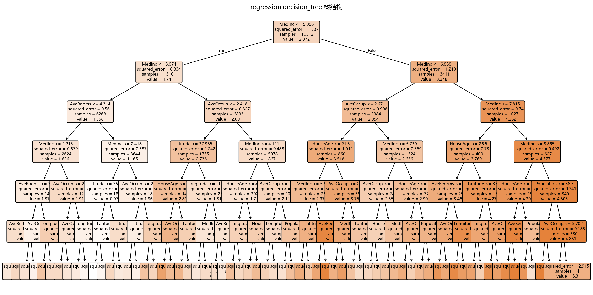

# 思路与直觉

> 对应代码：`data_generation/regression.py`、`model_training/regression/decision_tree.py`
>  
> 相关对象：`RegressionData.decision_tree()`、`train_model(...)`

## 本章目标

1. 理解决策树回归为什么适合处理非线性关系和特征交互。
2. 理解决策树回归不是拟合一条全局函数，而是递归切分特征空间。
3. 把这些直觉和当前仓库的 California Housing 真实数据对应起来。

## 重点方法与概念速览

| 名称 | 类型 | 作用 |
|---|---|---|
| `DecisionTreeRegressor` | 模型 | 通过递归划分特征空间做分段常数预测 |
| 树深度 | 结构属性 | 反映模型分裂层数与复杂度 |
| 叶子节点 | 结构属性 | 每个叶子区域给出一个局部预测值 |
| `feature_importances_` | 属性 | 表示各特征对分裂贡献的相对大小 |

## 1. 决策树回归想做什么

决策树回归的核心目标，不是学一条全局直线或单一公式，而是不断提问“某个特征是否大于某个阈值”，把样本分到不同区域，再在每个区域内给出一个局部预测值。

### 参数速览（本节）

适用过程（本节）：

1. 选择特征
2. 选择分裂阈值
3. 递归划分
4. 叶子节点输出预测值

| 阶段 | 直观含义 |
|---|---|
| 分裂 | 把当前样本空间一刀切成两部分 |
| 递归 | 对每个子区域继续切分 |
| 停止 | 满足深度或样本数约束时停止生长 |
| 预测 | 落入哪个叶子，就输出哪个叶子的常数值 |

### 理解重点

- 决策树回归的拟合方式更像“分段建模”，而不是“整体套一个公式”。
- 这使它能更自然地处理不同区域表现不同的数据模式。
- 当前 California Housing 数据包含收入、位置、人口等复杂因素，非常适合展示这种局部划分能力。

## 2. 为什么当前数据特别适合讲决策树

### 参数速览（本节）

适用数据特点（本节）：

1. 真实数据集
2. 多种异质特征
3. 复杂交互关系

| 数据特点 | 对树模型意味着什么 |
|---|---|
| 地理位置特征 | 可能形成明显区域划分 |
| 收入和房屋结构特征 | 可能产生多层条件分裂 |
| 真实数据噪声与复杂性 | 更容易体现非线性模型的灵活性 |

### 理解重点

- 如果数据关系非常简单、几乎线性，决策树的优势不一定明显。
- 但当前真实房价数据中的关系通常不是单一线性公式能完整描述的。
- 因此决策树回归在这个分册里的主要价值，是展示“用分裂处理复杂模式”。

## 3. 如何理解“局部常数预测”

### 参数速览（本节）

适用概念：叶子节点预测

| 概念 | 直观含义 |
|---|---|
| 一个叶子节点 | 一个被切分出来的局部区域 |
| 叶子预测值 | 该区域样本目标值的代表值 |
| 多个叶子 | 多个不同的局部规则 |

### 理解重点

- 线性回归会对任意输入输出一条连续的线性函数值。
- 决策树回归则更像在不同区域里使用不同的常数近似。
- 这也是为什么树模型可以拟合明显的非线性边界，但预测函数会呈现分段、阶梯式特征。

## 4. 为什么树模型适合处理非线性和特征交互

### 参数速览（本节）

适用能力（本节）：

1. 非线性关系
2. 条件分支
3. 特征交互

| 能力 | 直观解释 |
|---|---|
| 非线性拟合 | 不需要假设全局线性函数 |
| 条件规则 | 可以先按一个特征切，再按另一个特征细分 |
| 特征交互 | 不同特征在不同区域里可共同决定结果 |

### 理解重点

- 决策树天然支持“如果收入高且位置在某片区域，则房价更高”这类条件式结构。
- 这类规则很难用单一线性函数直接表达，但对树模型来说非常自然。
- 当前分册中的特征重要性图，也正是这种分裂行为的一个可视化侧面。

## 5. 与线性回归相比，决策树回归的优势和边界

### 参数速览（本节）

适用对比对象（本节）：

1. 线性回归
2. 决策树回归

| 维度 | 线性回归 | 决策树回归 |
|---|---|---|
| 关系假设 | 偏向全局线性 | 支持局部分裂和非线性 |
| 可解释性 | 系数层面强 | 规则层面直观 |
| 特征交互 | 需手工构造 | 可自然表达 |
| 过拟合风险 | 相对可控 | 树过深时更明显 |

### 理解重点

- 线性回归擅长提供稳定、简单的全局解释。
- 决策树回归擅长处理更复杂的局部模式，但如果树长得太深，也更容易过拟合。
- 这也是为什么当前源码要显式设置 `max_depth`、`min_samples_split`、`min_samples_leaf`。

## 6. 直觉如何映射到当前训练日志

### 参数速览（本节）

适用输出项（分项）：

1. `树深度`
2. `叶子节点数`

| 日志项 | 可以帮助判断什么 |
|---|---|
| 树深度 | 模型是否过深、结构是否复杂 |
| 叶子节点数 | 划分区域数量是否过多 |

### 示例代码

```python
print(f"树深度: {model.get_depth()}")
print(f"叶子节点数: {model.get_n_leaves()}")
```

### 理解重点

- 当前训练日志最重要的结构性信息，不是系数，而是树深度和叶子节点数。
- 如果树特别深、叶子特别多，通常说明模型复杂度更高，也更需要关注过拟合风险。
- 这就是树模型和线性模型在“如何观察训练结果”上的明显区别。

## 可视化



## 常见坑

1. 把决策树回归误解成”自动拟合一条更复杂的曲线”，忽略它其实是递归分裂空间。
2. 只看特征重要性，不看树深度和叶子节点数，错过模型复杂度信息。
3. 误以为树模型一定比线性模型更好，忽略了过拟合风险和数据规模影响。

## 小结

- 决策树回归的核心直觉，是通过递归划分特征空间来做局部预测，而不是学习一条全局公式。
- 当前 California Housing 数据非常适合展示这种非线性分裂与特征交互能力。
- 把这些直觉建立起来之后，再看模型构建、训练流程和评估图像会更容易。
