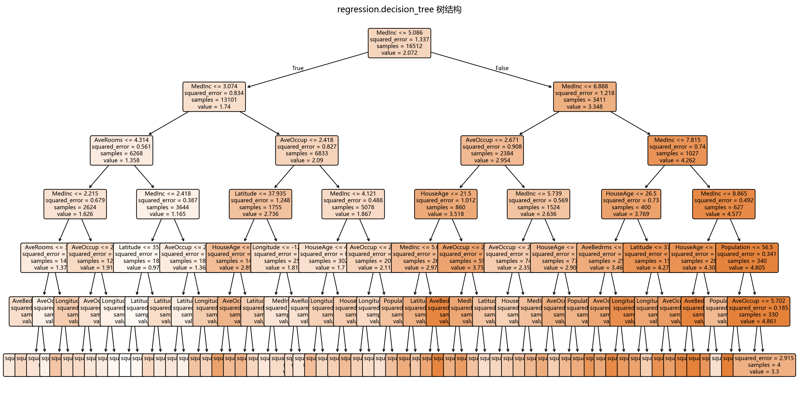

# 思路与直觉

## 本章目标

1. 理解决策树回归的核心直觉——不是拟合一条全局曲线，而是不断提问"哪个特征超过哪个阈值"，把样本分到越来越纯的区域。
2. 理解为什么 California Housing 真实数据特别适合展示树模型的非线性与特征交互能力。
3. 建立"区域划分 → 局部常数 → 复杂度约束"的直觉链，并与线性回归形成对比。

## 重点方法与概念速览

| 名称 | 类型 | 作用 |
|---|---|---|
| 递归分裂 | 核心机制 | 每次选一个特征和一个阈值，把当前区域一分为二——不断重复直到满足停止条件 |
| 局部常数预测 | 预测方式 | 落入同一叶子的样本共享同一个预测值（该区域训练样本目标值的均值） |
| `max_depth` | 复杂度约束 | 限制树最多分裂多少层——防止无限生长 |
| `feature_importances_` | 模型解释 | 量化各特征在分裂过程中对误差降低的总贡献 |

## 1. 决策树回归想做什么

决策树回归的核心目标不是学一条全局公式，而是不断提问"$x_j \le s$？"，把特征空间切成越来越小的矩形区域，每个区域用一个常数值（区域内目标均值）作为预测。

### 理解重点

- 线性回归问"所有特征一起贡献多少"——输出是 $\sum \beta_j x_j$ 的加权和。
- 决策树回归问"先看收入高不高，再看位置在哪"——输出是一系列 if-else 规则引导下的局部均值。
- 这种"问答式"结构使决策树天然适合处理"不同区域表现不同"的数据模式。

## 2. 为什么 California Housing 特别适合讲决策树回归

California Housing 数据中的房价由多种异质因素共同决定：收入水平、地理位置、房屋年龄、人口密度等。这些因素与房价的关系通常不是简单线性的——例如"沿海高收入区"和"内陆农业区"的房价形成机制完全不同。

### 理解重点

- 如果房价与所有特征的关系都是线性的，线性回归的系数解释更清晰——不需要树模型。
- 但真实房价数据中，"位置 + 收入"的交互、"老房子在好地段仍贵"等模式很难用单一线性公式表达。
- 决策树可以自然地先按 `Latitude` 切出"南加州 vs 北加州"，再按 `MedInc` 细分"高收入区 vs 低收入区"——这正是树模型直觉的核心。

## 3. 如何理解"局部常数预测"

决策树回归的预测函数是一条分段常数函数——不像线性回归那样输出连续变化的数值。

| 对比项 | 线性回归 | 决策树回归 |
|---|---|---|
| 预测形态 | 连续超平面——输入微小变化，输出也微小变化 | **阶梯状——同一叶子内输入变化不影响输出** |
| 输入-输出关系 | 全局统一公式 | **局部独立规则** |
| 极端值外推 | 线性外推 | **叶子边界外无外推能力** |

### 理解重点

- 树的预测值只在分裂边界处跳变——同一条"if-else"路径走到同一个叶子的样本，输出相同。
- 这是优点的代价：树能拟合复杂非线性，但也失去了线性模型的外推能力和平滑性。
- 叶子节点数越多，分段越细，预测函数越接近连续——但过拟合风险也越大。

## 4. 为什么树模型适合处理非线性和特征交互

树模型通过条件分支自然表达"如果 A 且 B，则..."的交互逻辑：

1. 第一层按 `MedInc` 切——"高收入区"和"低收入区"分开。
2. 第二层对"高收入区"按 `Latitude` 再切——"沿海高收入"和"内陆高收入"分开。
3. 第三层对"沿海高收入"按 `HouseAge` 再切——"新房贵区"和"老房区"分开。

这种"先按一个特征切，再按另一个特征细分"的模式，本质上就是在自动发现特征交互。

### 理解重点

- 在线性回归中，`MedInc × Latitude` 的交互需要**手工构造**交互项。
- 在决策树中，"先切 MedInc，再切 Latitude"自动实现了这一交互——不需要特征工程。
- 树的深度越大，能表达的交互阶数越高——深度为 3 的树最多能表达三阶交互。

## 5. 复杂度约束的直觉：为什么不放任树自由生长

不设约束的决策树会一直分裂到每个叶子只有一个样本——在训练集上误差为零，但预测新样本时表现极差。

| 约束 | 直觉 | 过松的症状 |
|---|---|---|
| `max_depth=6` | "最多问 6 个问题" | 树太深——对训练集中偶然模式过度敏感 |
| `min_samples_split=6` | "节点里至少 6 个样本才继续问" | 叶子太细——单个异常样本就能长出一个分支 |
| `min_samples_leaf=3` | "每个答案至少覆盖 3 个样本" | 叶子不可靠——基于极少量样本的均值波动大 |

### 理解重点

- 三个约束从不同角度"早停"树的生长——就像考试时限制答题步骤数，防止钻牛角尖。
- 当前默认值 `(6, 6, 3)` 是中等保守配置——在 California Housing 上既有足够的灵活性又不会过拟合。
- 这些约束是回归树"偏差-方差权衡"的工程杠杆——约束越紧，偏差越大但方差越小。

## 6. 直觉如何映射到训练日志与可视化

### 理解重点

- 训练日志中的**树深度**和**叶子节点数**是结构复杂度的直接反映——深度 6 意味着最多 $2^6 = 64$ 个叶子（实际通常少于上限）。
- **特征重要性图**告诉你"模型主要看什么"——在 California Housing 上，`MedInc` 和 `Latitude`/`Longitude` 通常排在最前。
- **残差图**告诉你"哪里没拟合好"——如果残差在地理位置上有系统偏移，说明树的空间切分可能不够细。
- **学习曲线**告诉你"样本量够不够"——如果训练得分远高于验证得分，说明过拟合；两者都低则欠拟合。

## 可视化

## 常见坑

1. 把决策树回归误解成"自动拟合一条更复杂的曲线"——它实际上是在做分段常数近似，而非连续函数拟合。
2. 只看特征重要性，不看树深度和叶子节点数——错过模型复杂度的关键信息。
3. 误以为树模型一定比线性模型好——树在非线性数据上有优势，但在近似线性的数据上可能不如线性回归稳定。

## 小结

- 决策树回归的核心直觉：递归二分空间 → 每个区域用均值预测 → 复杂度约束防止过拟合。
- California Housing 真实数据天然适合展示树的非线性与特征交互能力——地理位置切分 + 收入细分正是树模型的直觉优势。
- 建立"区域划分 → 局部常数 → 复杂度约束 → 残差/重要性/学习曲线"的完整直觉链后，再看模型构建与评估会水到渠成。
