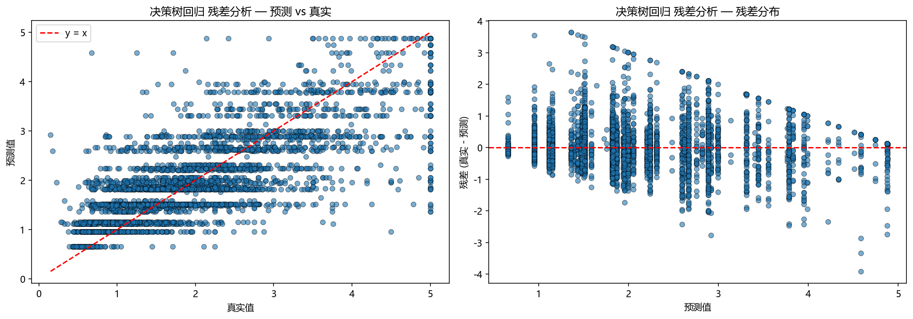
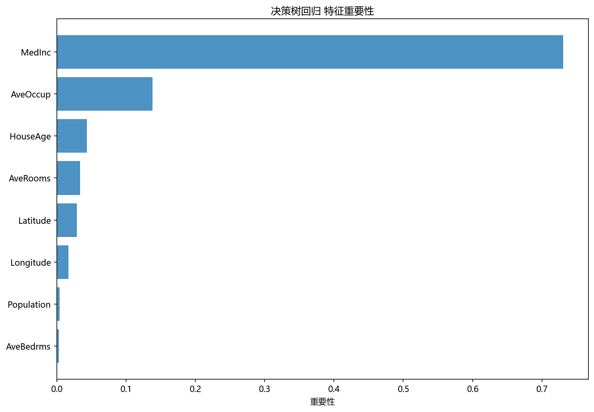
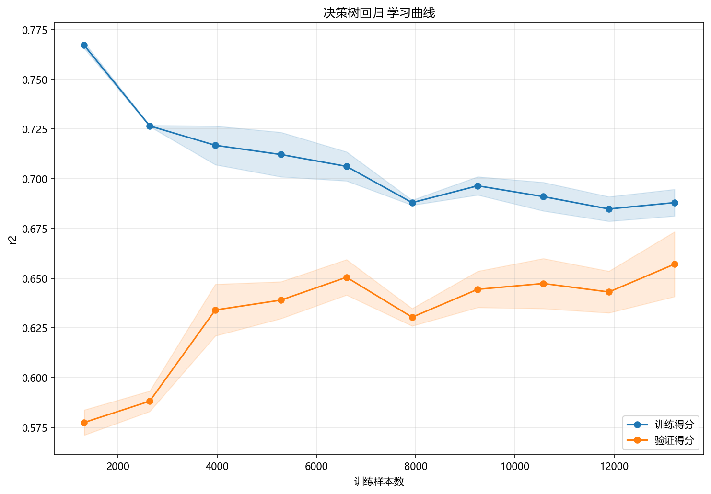

# 评估与诊断

## 本章目标

1. 理解当前决策树回归流水线的四类评估输出——残差图、特征重要性图、学习曲线和树结构图。
2. 理解每类评估分别诊断什么问题，以及如何交叉解读。
3. 明确当前流水线**已实现**和**未实现**的评估项——回归树评估与分类树评估的本质差异。

## 重点方法与概念速览

| 名称 | 类型 | 作用 |
|---|---|---|
| `plot_residuals(...)` | 函数 | 生成预测-真实散点图 + 残差分布图——诊断拟合质量和系统偏差 |
| `plot_feature_importance(...)` | 函数 | 生成特征重要性柱状图——揭示哪些特征主导分裂决策 |
| `plot_learning_curve(...)` | 函数 | 生成训练/验证 R² 曲线——诊断过拟合/欠拟合和样本量充足性 |
| `plot_tree_structure(...)` | 函数 | 绘制决策树可视化结构——展示完整的分裂路径和叶子值 |
| `model.feature_importances_` | 属性 | 各特征对平方误差降低的累积贡献——特征重要性图的底层数据 |

## 1. 残差图

### 参数速览

适用函数：`plot_residuals(y_true, y_pred, title, dataset_name, model_name)`

| 参数名 | 类型 | 说明 | 示例取值 |
|---|---|---|---|
| `y_true` | `ndarray`，形状 `(4128,)` | 测试集真实房价 | `y_test` |
| `y_pred` | `ndarray`，形状 `(4128,)` | 模型预测房价 | `model.predict(X_test)` |
| `title` | `str` | 图标题 | `"决策树回归 残差分析"` |
| `dataset_name` | `str` | 输出目录名 | `"decision_tree_regression"` |
| `model_name` | `str` | 输出文件名前缀 | `"decision_tree"` |

### 示例代码

```python
y_pred = model.predict(X_test)
residuals = y_test - y_pred

# 左图: 预测值 vs 真实值散点图（对角线 = 完美预测）
ax1.scatter(y_test, y_pred, alpha=0.6)

# 右图: 残差 vs 预测值散点图（红线 = 零残差）
ax2.scatter(y_pred, residuals, alpha=0.6)
ax2.axhline(y=0, color="r", linestyle="--")
```

### 输出



### 理解重点

- 左图（预测 vs 真实）：点越贴近对角线 $y = \hat{y}$，预测越准确。对决策树回归，由于分段常数特性，预测值会呈现离散的水平条带。
- 右图（残差 vs 预测）：残差应围绕 0 随机分布。若残差随预测值增大而发散（漏斗形），说明模型对高价区预测不稳定。若残差整体偏正或偏负，说明模型存在系统性高估或低估。
- 决策树特有的诊断信号：残差图中出现明显的"阶梯"模式——同一叶子内的样本有相同的预测值但不同的真实值，残差在叶子内呈现垂直线段。

## 2. 特征重要性图

### 参数速览

适用函数：`plot_feature_importance(model, feature_names, title, dataset_name, model_name)`

| 参数名 | 类型 | 说明 | 示例取值 |
|---|---|---|---|
| `model` | `DecisionTreeRegressor` | 已训练的回归树——提供 `feature_importances_` | `model` |
| `feature_names` | `list[str]` | 特征名列表——为重要性值提供可读标签 | `["MedInc", "HouseAge", ...]` |
| `top_n` | `int` 或 `None` | 展示前 N 个重要特征。`None`——展示全部 | `None`、`5` |
| `title` | `str` | 图标题 | `"决策树回归 特征重要性"` |

### 示例代码

```python
importances = model.feature_importances_
indices = np.argsort(importances)[::-1]
for i in indices:
    print(f"{feature_names[i]}: {importances[i]:.4f}")
```

### 输出



### 理解重点

- 特征重要性反映的是**分裂贡献**——特征在树中每次分裂带来的平方误差降低的累积量。值越大，该特征在模型中越重要。
- 在 California Housing 上，`MedInc`（收入中位数）通常是重要性最高的特征——收入是房价最直接的预测因子。`Latitude` 和 `Longitude`（地理位置）通常排第二、第三。
- 重要性**不表示影响方向**——"MedInc 重要性 0.5"不意味着收入增加房价一定增加（虽然直觉上确实如此），只看重要性数值无法判断正负效应。
- 如果少数几个特征占据了绝大部分重要性（如 80%+），说明树主要依赖这些特征分裂——其他特征的分裂贡献很小。

## 3. 学习曲线

### 参数速览

适用函数：`plot_learning_curve(estimator, X, y, scoring, cv, title, dataset_name, model_name)`

| 参数名 | 类型 | 说明 | 示例取值 |
|---|---|---|---|
| `estimator` | `DecisionTreeRegressor` | **未训练的**新模型实例——学习曲线内部会多次 fit | `DecisionTreeRegressor(max_depth=6, random_state=42)` |
| `X` | `ndarray`，形状 `(16512, 8)` | 训练集特征 | `X_train` |
| `y` | `ndarray`，形状 `(16512,)` | 训练集目标 | `y_train` |
| `scoring` | `str` | 评分指标。`"r2"`——R² 决定系数 | `"r2"`、`"neg_mean_squared_error"` |
| `cv` | `int` | 交叉验证折数。默认 `5` | `5` |
| `train_sizes` | `ndarray` | 训练样本比例序列。默认 10 个点从 0.1 到 1.0 | `np.linspace(0.1, 1.0, 10)` |

### 示例代码

```python
plot_learning_curve(
    DecisionTreeRegressor(max_depth=6, random_state=42),
    X_train,
    y_train,
    scoring="r2",
    title="决策树回归 学习曲线",
    dataset_name=DATASET,
    model_name=MODEL,
)
```

### 输出



### 理解重点

- 学习曲线用不同规模的训练子集重复训练和验证——揭示模型性能随样本量增加的变化趋势。
- **过拟合信号**：训练得分远高于验证得分（两条曲线之间有明显间隙）——树过于复杂，学到了训练集中的噪声模式。
- **欠拟合信号**：训练得分和验证得分都很低且接近——树约束过紧，连训练数据中的基本模式都未充分学习。
- **理想状态**：两条曲线逐渐收敛到一个较高的得分——样本量充足，模型复杂度适中。
- 当前 `max_depth=6` 的配置在 California Housing 的 16512 训练样本上通常表现为轻微过拟合——训练 R² 约 0.7~0.8，验证 R² 约 0.6~0.7。

## 4. 树结构图

### 理解重点

- 树结构图将训练完成的决策树可视化——每个节点显示分裂特征、阈值、平方误差、样本数和预测值。
- 叶子节点的 `value` 即为该区域的局部常数预测值——可以直接读出"这个叶子预测的房价是多少"。
- 从根到叶子的路径就是一条完整的 if-else 规则——例如"MedInc ≤ 5.0 → Latitude ≤ 34.0 → HouseAge ≤ 25.0 → 预测房价 2.5"。
- 结构图可以直观判断树是否过深、某些分支是否基于极少样本等结构性问题。

## 5. 已实现 vs 未实现的评估

### 参数速览

| 评估项 | 状态 | 原因 |
|---|---|---|
| 残差图 | 已实现 | 回归模型的核心诊断工具——比单一数值指标更丰富 |
| 特征重要性图 | 已实现 | 树模型独有的解释性优势——线性模型看不出来 |
| 学习曲线 | 已实现 | 诊断过拟合/欠拟合和样本量充足性 |
| 树结构图 | 已实现 | 展示完整的分裂路径——树模型独有 |
| MSE / MAE / RMSE / R² 数值打印 | **未实现** | 当前流水线侧重图形化诊断而非数值指标 |
| 交叉验证 R² | **未实现** | 学习曲线内部使用了 CV，但未单独输出 CV 均值 |
| 超参数搜索 | **未实现** | 未使用 `GridSearchCV` 或 `RandomizedSearchCV` |

### 理解重点

- 当前评估设计强调**图形化诊断**而非数值指标——残差图比单个 MSE 数字更能揭示误差的分布和模式。
- 树结构图是决策树回归独有的评估资产——线性回归和 SVR 没有等效的可视化。
- 评估章节必须以源码为准——不能将"常见的回归评估手段"写成"当前已实现"。

## 6. 决策树回归 vs 分类决策树 vs 线性回归 评估对比

| 评估维度 | 分类决策树 | 线性回归 | 决策树回归 |
|---|---|---|---|
| 任务类型 | 分类 | 回归 | 回归 |
| 核心可视化 | 混淆矩阵 + ROC + 决策边界 | 残差图 + 学习曲线 | **残差图 + 特征重要性 + 学习曲线 + 树结构图** |
| 定量指标 | accuracy / precision / recall | 无显式打印 | **无显式打印** |
| 模型解释 | 特征重要性 + 树结构 | 系数 $\beta_j$ | **特征重要性 + 树结构** |
| 诊断重点 | 类别区分度 | 线性假设验证 | **过拟合/欠拟合 + 特征贡献** |
| 独有诊断 | 决策边界 + ROC 曲线 | 系数显著性 | **树结构可视化——完整规则路径** |

## 常见坑

1. 只看特征重要性不看残差图——重要性高不意味着预测准确，特征重要但分裂不够细仍会导致高误差。
2. 只看残差图不看学习曲线——残差图只展示单次测试集上的表现，学习曲线揭示泛化趋势。
3. 期待树结构图像线性回归系数一样"简洁"——深度为 6 的树可能有几十个节点，结构图可能较大。
4. 把特征重要性解读为"对目标的正负影响"——重要性只衡量分裂贡献大小，不表示方向。

## 小结

- 当前决策树回归有四类评估输出：残差图（误差分布）、特征重要性图（特征贡献）、学习曲线（泛化趋势）、树结构图（分裂路径）——四者交叉解读才构成完整诊断。
- 残差图揭示"误差分布是否健康"，特征重要性图揭示"模型依赖哪些特征"，学习曲线揭示"复杂度与样本量是否匹配"，树结构图揭示"具体的分裂规则"。
- 与分类决策树的评估差异源于任务性质——回归评估关注误差分布和连续性，分类评估关注类别区分和混淆模式。
