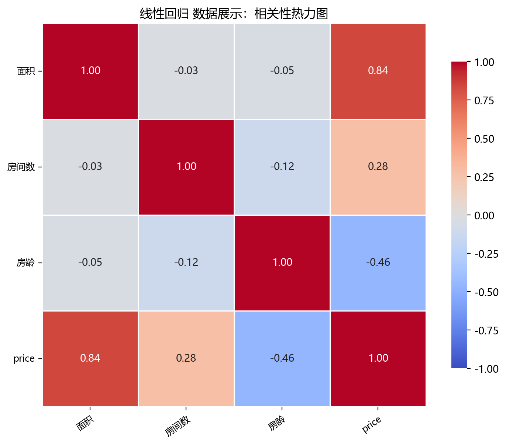
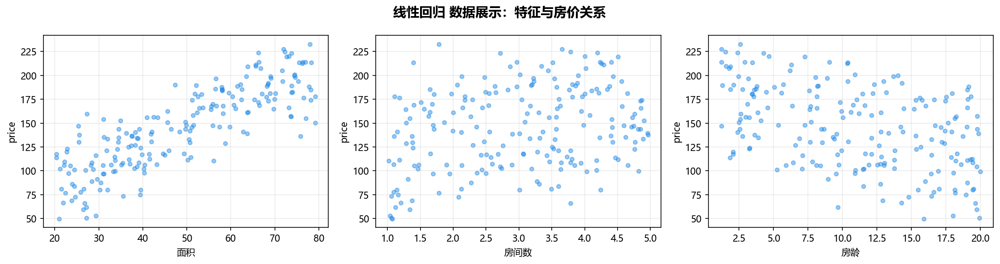

# 数据构成

> 对应代码：`data_generation/regression.py`、`data_generation/__init__.py`、`pipelines/regression/linear_regression.py`
>  
> 相关对象：`RegressionData.linear_regression()`、`linear_regression_data`

## 本章目标

1. 明确本仓库线性回归数据来自 `RegressionData.linear_regression()` 的手工合成逻辑。
2. 明确特征列、标签列与真实生成公式之间的对应关系。
3. 明确训练集/测试集切分方式，以及当前实现没有标准化步骤这一事实。

## 重点方法与概念速览

| 名称 | 类型 | 作用 |
|---|---|---|
| `RegressionData.linear_regression()` | 方法 | 生成线性回归使用的合成房价数据 |
| `linear_regression_data` | 变量 | 在 `data_generation/__init__.py` 中导出的数据对象 |
| `面积` | 列名 | 房屋面积特征 |
| `房间数` | 列名 | 房屋房间数量特征 |
| `房龄` | 列名 | 房屋年龄特征 |
| `price` | 列名 | 当前流水线中的回归目标列 |

## 1. 本仓库数据入口

- 数据变量：`data_generation/__init__.py` 中导出的 `linear_regression_data`
- 生成来源：`data_generation/regression.py` 中的 `RegressionData.linear_regression()`
- 流水线使用：`pipelines/regression/linear_regression.py` 中的 `data = linear_regression_data.copy()`

### 理解重点

- `linear_regression_data` 在导入时就已经生成完成，因此流水线里直接 `.copy()` 使用即可。
- 使用 `.copy()` 的目的，是避免后续拆分或调试时意外修改原始数据对象。

## 2. 数据生成函数 `RegressionData.linear_regression()`

### 参数速览（本节）

适用 API（分项）：

1. `RegressionData.linear_regression()`
2. `rng.uniform(...)`
3. `rng.normal(...)`

| 参数名 | 本例取值 | 说明 |
|---|---|---|
| `n_samples` | `200` | 样本数，来自 `RegressionData` 默认属性 |
| `random_state` | `42` | 随机种子，保证数据可复现 |
| `lr_noise` | `10.0` | 目标变量高斯噪声标准差 |
| `area` 范围 | `[20, 80]` | 面积随机采样区间 |
| `num` 范围 | `[1, 5]` | 房间数随机采样区间 |
| `age` 范围 | `[1, 20]` | 房龄随机采样区间 |
| 返回值 | `DataFrame` | 含 `面积`、`房间数`、`房龄` 与 `price` 的数据表 |

### 示例代码

```python
area = rng.uniform(low=20, high=80, size=self.n_samples)
num = rng.uniform(low=1, high=5, size=self.n_samples)
age = rng.uniform(low=1, high=20, size=self.n_samples)

price = (
    2 * area
    + 10 * num
    - 3 * age
    + rng.normal(loc=0, scale=self.lr_noise, size=self.n_samples)
    + 50
)
```

### 理解重点

- 这份数据不是来自真实房价数据集，而是按一个显式线性公式手工构造出来的。
- 这样做的最大好处是：模型学到的系数可以直接和真实生成公式对照。
- 当前数据非常适合教学，因为特征影响方向和大小都比较直观。

## 3. 特征列、标签列与真实关系

当前数据表结构如下：

- 特征列：`面积`、`房间数`、`房龄`
- 标签列：`price`

### 参数速览（本节）

适用公式（本节）：

1. `price = 2 * 面积 + 10 * 房间数 - 3 * 房龄 + noise + 50`

| 项目 | 当前含义 |
|---|---|
| `面积` 系数 | `+2`，面积越大，价格越高 |
| `房间数` 系数 | `+10`，房间越多，价格越高 |
| `房龄` 系数 | `-3`，房龄越大，价格越低 |
| 截距项 | `+50` |
| 噪声项 | 来自 `N(0, 10.0^2)` 的高斯噪声 |

### 示例代码

```python
X = data.drop(columns=["price"])
y = data["price"]
```

### 理解重点

- 当前分册最重要的特征不是“维度高”或“关系复杂”，而是“真实关系透明”。
- 因为真实系数已知，所以训练后的 `coef_` 和 `intercept_` 是否接近 `2`、`10`、`-3`、`50`，就很值得观察。
- 这也是为什么线性回归分册特别适合讲“系数可解释性”。

## 4. 切分方式与预处理边界

### 参数速览（本节）

适用 API（分项）：

1. `train_test_split(X, y, test_size=0.2, random_state=42)`

| 参数名 | 本例取值 | 说明 |
|---|---|---|
| `test_size` | `0.2` | 测试集占比 |
| `random_state` | `42` | 保证可复现划分 |
| 返回值 | `X_train`、`X_test`、`y_train`、`y_test` | 训练/测试数据拆分结果 |

### 示例代码

```python
X_train, X_test, y_train, y_test = train_test_split(
    X, y, test_size=0.2, random_state=42
)
```

### 理解重点

- 当前线性回归流水线只有训练/测试集切分，没有额外的标准化步骤。
- 这一点必须和 `svr`、`regularization` 分册区分开，因为它们都显式做了 `StandardScaler`。
- 文档只应描述当前实现真实存在的流程，不能把常见预处理习惯误写成现有代码逻辑。

## 数据可视化





## 常见坑

1. 把当前数据误认为真实房价数据集，忽略它其实是按显式公式合成的教学数据。
2. 看到回归任务就默认写入标准化步骤，但当前源码并没有这样做。
3. 忽略噪声项的存在，误以为训练后系数一定会精确等于 `2`、`10`、`-3`。

## 小结

- 当前线性回归数据来自 `RegressionData.linear_regression()`，底层是手工合成的三特征房价数据。
- 数据表结构非常清晰：`面积`、`房间数`、`房龄` 是特征，`price` 是标签。
- 读懂真实生成关系，是后续理解模型参数、训练结果和误差来源的前提。
