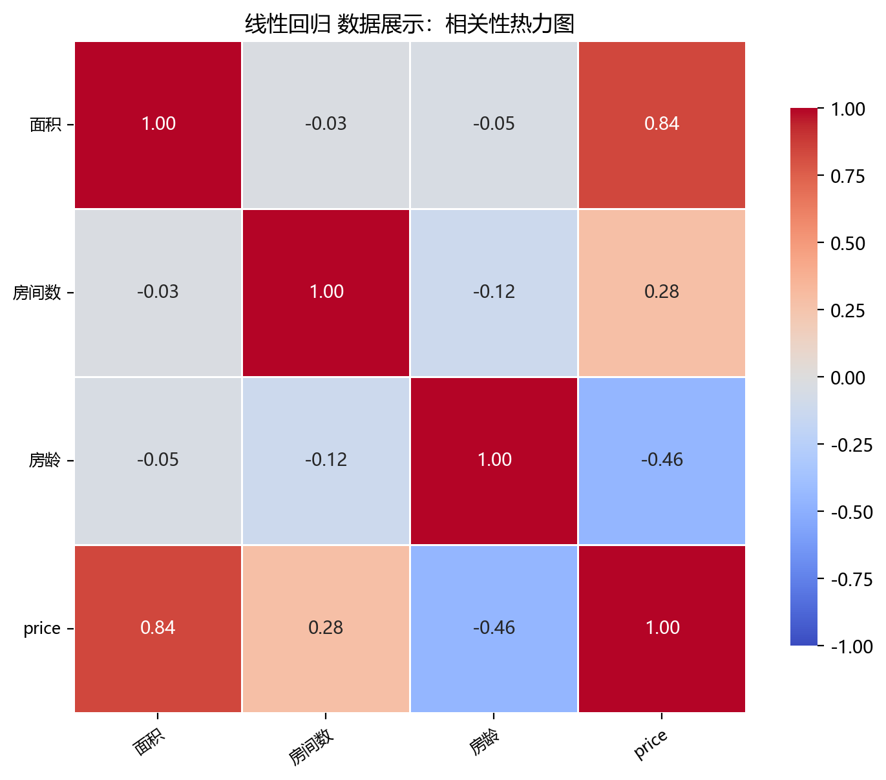
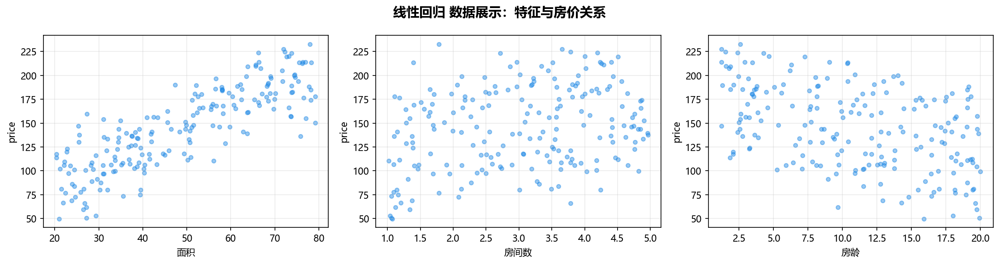

# 数据构成

## 本章目标

1. 明确本仓库线性回归数据来自 `RegressionDatasetFactory.loadLinearRegressionDataset()` 手工合成的线性房价数据。
2. 理解显式生成公式——`price = 2×面积 + 10×房间数 - 3×房龄 + N(0,10²) + 50`——与训练结果之间的对照关系。
3. 明确训练/测试集切分方式，以及当前实现**没有标准化**这一关键事实。

## 重点方法与概念速览

| 名称 | 类型 | 作用 |
|---|---|---|
| `RegressionDatasetFactory.loadLinearRegressionDataset()` | 方法 | 手工合成 3 特征线性房价数据——含真实生成公式 |
| `面积` | 列 | 房屋面积特征——范围 $[20, 80]$，正向影响房价 |
| `房间数` | 列 | 房屋房间数量特征——范围 $[1, 5]$，正向影响房价 |
| `房龄` | 列 | 房屋年龄特征——范围 $[1, 20]$，负向影响房价 |
| `price` | 列 | 回归目标——由显式线性公式加高斯噪声生成 |

## 1. 数据生成：`RegressionDatasetFactory.loadLinearRegressionDataset()`

### 参数速览

| 参数名 | 类型 | 说明 | 示例取值 |
|---|---|---|---|
| `nSamples` | `int` | 样本数。`200`——适中规模，OLS 可瞬间求解 | `200`、`500`、`1000` |
| `randomState` | `int` | 随机种子。`42`——保证数据可复现 | `42` |
| `area` | `ndarray`，形状 `(200,)` | 面积——$\mathcal{U}(20, 80)$ | `rng.uniform(20, 80, ...)` |
| `rooms` | `ndarray`，形状 `(200,)` | 房间数——$\mathcal{U}(1, 5)$ | `rng.uniform(1, 5, ...)` |
| `age` | `ndarray`，形状 `(200,)` | 房龄——$\mathcal{U}(1, 20)$ | `rng.uniform(1, 20, ...)` |
| 返回值 | `DataFrame` | 含 `面积`、`房间数`、`房龄`、`price` 四列 | — |

### 示例代码

```python
rng = np.random.RandomState(42)
area = rng.uniform(20, 80, size=200)
rooms = rng.uniform(1, 5, size=200)
age = rng.uniform(1, 20, size=200)
noise = rng.normal(0, 10, size=200)
price = 2 * area + 10 * rooms - 3 * age + noise + 50
```

### 生成公式

$$
\text{price} = 2 \times \text{面积} + 10 \times \text{房间数} - 3 \times \text{房龄} + \epsilon + 50, \quad \epsilon \sim \mathcal{N}(0, 10^2)
$$

### 理解重点

- 这是**完全手动合成**的数据——生成公式是显式写出的，不是从真实世界采集的。
- 这种设计的最大教学价值：训练得到的 `coef_` 和 `intercept_` 可以直接与真实系数 `[2, 10, -3]` 和截距 `50` 对照——透明地验证 OLS 的正确性。
- 高斯噪声的标准差为 10——相对于房价范围（约 30~300），噪声水平适中，训练结果会接近但不会精确等于真实公式。
- 三个特征来自独立的均匀分布——特征间无共线性，$\mathbf{X}^T\mathbf{X}$ 条件良好，OLS 求解稳定。

## 2. 特征列与标签列

### 参数速览

| 参数名 | 类型 | 说明 | 示例取值 |
|---|---|---|---|
| `面积` | `Series`，形状 `(200,)` | 房屋面积，范围 $[20, 80]$ | `data["面积"]` |
| `房间数` | `Series`，形状 `(200,)` | 房间数量，范围 $[1, 5]$ | `data["房间数"]` |
| `房龄` | `Series`，形状 `(200,)` | 房屋年龄，范围 $[1, 20]$ | `data["房龄"]` |
| `price` | `Series`，形状 `(200,)` | 目标变量——由显式公式生成 | `data["price"]` |

各特征的真实影响：

| 特征 | 真实系数 | 影响方向 | 单位影响的房价变化 |
|---|---|---|---|
| `面积` | `+2` | 正——面积越大，房价越高 | 面积每增加 1 单位，房价增加 2 |
| `房间数` | `+10` | 正——房间越多，房价越高 | 房间数每增加 1，房价增加 10 |
| `房龄` | `-3` | 负——房龄越大，房价越低 | 房龄每增加 1 年，房价减少 3 |
| 截距 | `+50` | — | 所有特征取 0 时的基线房价 |

### 理解重点

- 因为真实系数已知，训练后可以直接验证：`面积` 的系数是否接近 `2`？`房龄` 是否接近 `-3`？——这是手工合成数据的核心诊断价值。
- 特征使用中文命名——这在本仓库中独树一帜，训练日志直接显示 `面积`、`房间数`、`房龄`，可读性极强。
- 三个特征量纲不同但量级接近（20~80 vs 1~5 vs 1~20）——不标准化时系数的绝对值仍有可比性。

## 3. 数据切分

### 参数速览

适用 API：`train_test_split(X, y, test_size=0.2, random_state=42)`

| 参数名 | 类型 | 说明 | 示例取值 |
|---|---|---|---|
| `test_size` | `float` | 测试集占比。`0.2`——200 × 0.2 = 40 个测试样本 | `0.2` |
| `random_state` | `int` | 随机种子。`42` | `42` |
| 返回值 | `tuple` | `(X_train, X_test, y_train, y_test)`——训练集 160 样本，测试集 40 样本 | — |

### 示例代码

```python
X_train, X_test, y_train, y_test = train_test_split(
    X, y, test_size=0.2, random_state=42
)
```

### 理解重点

- 当前使用随机切分（`randomSplit`）——回归目标 `price` 是连续值，无法分层。
- 训练集 160 样本对 3 特征线性回归绰绰有余——$N \gg d$，参数估计稳定。
- 与决策树回归/SVR 使用相同的切分配置——保证不同模型在同一数据划分上可比。

## 4. 为什么当前实现没有标准化

### 参数速览

| 项目 | 当前状态 | 原因 |
|---|---|---|
| 标准化 | **未使用** | 数据量纲直观、关系简单——正规方程/SVD 求解无需标准化；当前实现聚焦系数可解释性 |

### 理解重点

- 线性回归的闭式解（正规方程/SVD）在数学上不需要标准化——解是精确的，不依赖特征尺度。
- 但标准化**在以下场景非常重要**：（1）使用梯度下降求解时加速收敛；（2）正则化（Ridge/Lasso）需要统一惩罚尺度；（3）比较不同量纲特征的系数大小时。
- 当前实现不标准化是因为数据本身量纲接近且关系简单——这是有意保留的最简教学配置，不代表"线性回归永远不需要标准化"。

## 5. 数据设计意图：与决策树回归/SVR 的对比

| 数据维度 | 线性回归 | 决策树回归 | SVR |
|---|---|---|---|
| 数据来源 | 手工合成——显式线性公式 | California Housing 真实数据 | `make_friedman1`——非线性合成 |
| 样本数 | 200 | 20640 | 200 |
| 特征维度 | 3 | 8 | 10 |
| 真实关系 | **已知——`2×面积 + 10×房间数 - 3×房龄 + 50`** | 未知——真实世界复杂关系 | 已知——Friedman 非线性函数 |
| 噪声 | 显式高斯 $N(0,10^2)$ | 真实世界噪声 | 显式高斯噪声 |
| 标准化 | 无 | 无 | 有（`StandardScaler`） |
| 设计意图 | **系数可验证——关系透明的教学基线** | 真实数据非线性 + 特征交互 | 核方法非线性拟合 |

### 理解重点

- 三种数据设计形成清晰的递进：线性回归用显式线性公式（关系完全透明）→ 决策树回归用真实数据（关系复杂未知）→ SVR 用合成非线性（关系已知但非线性）。
- 线性回归数据的核心价值在于"已知答案"——训练后可以定量验证 OLS 恢复了多少真实信号。
- 200 样本是有意的小规模——足以展示 OLS 的基本行为，又保持训练和可视化的即时性。

## 数据可视化





## 常见坑

1. 把当前数据误认为真实房价数据集——它是按显式公式合成的教学数据，真实关系完全已知。
2. 看到回归任务就默认写入标准化步骤——当前源码**没有**标准化，且这是正确的设计选择。
3. 忽略噪声项的存在，误以为训练后系数一定会精确等于 `2`、`10`、`-3`——噪声 $\sigma=10$ 意味着训练结果会有偏差。
4. 期待在 200 样本上得到极端精确的系数估计——样本量有限，系数波动在统计上是正常的。

## 小结

- 当前线性回归数据来自 `RegressionDatasetFactory.loadLinearRegressionDataset()`——手工合成 3 特征 200 样本的线性房价数据，生成公式完全透明。
- 数据流为：独立均匀采样 → 线性组合 + 高斯噪声 → DataFrame（`面积`/`房间数`/`房龄`+`price`）→ 随机切分（`test_size=0.2`）→ 直接训练（无标准化）。
- 透明的关系设计使线性回归分册成为"系数可验证"的教学基线——训练结果可直接与真实公式对照，这是所有其他回归分册不具备的核心优势。
