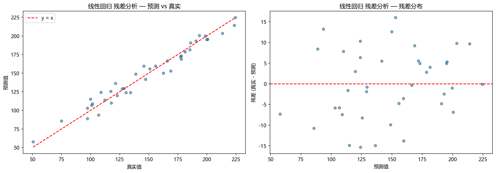
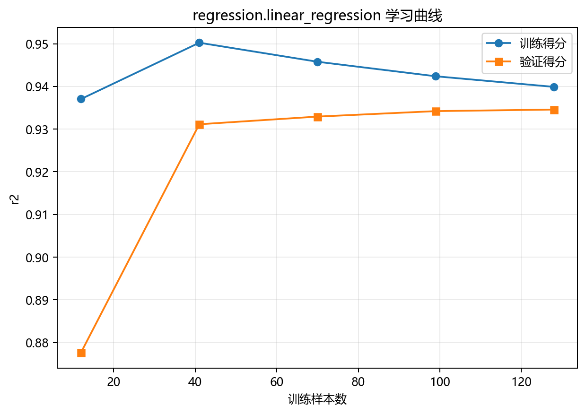

# 评估与诊断

## 本章目标

1. 理解当前线性回归流水线的两类评估输出——残差图和学习曲线。
2. 理解每类评估分别诊断什么——残差图看误差分布，学习曲线看泛化趋势。
3. 明确当前流水线**已实现**和**未实现**的评估项——线性回归评估以图形化诊断为主。

## 重点方法与概念速览

| 名称 | 类型 | 作用 |
|---|---|---|
| `plot_residuals(...)` | 函数 | 生成预测-真实散点图 + 残差分布图——诊断拟合质量和系统偏差 |
| `plot_learning_curve(...)` | 函数 | 生成训练/验证 R² 曲线——诊断样本量充足性和泛化趋势 |
| `residuals = y_true - y_pred` | 派生量 | 衡量每个样本的预测误差——残差图的数据源 |
| `scoring='r2'` | 参数 | 学习曲线使用的评分指标——$R^2 = 1 - \frac{\sum(y_i - \hat{y}_i)^2}{\sum(y_i - \bar{y})^2}$ |

## 1. 残差图

### 参数速览

适用函数：`plot_residuals(y_true, y_pred, title, dataset_name, model_name)`

| 参数名 | 类型 | 说明 | 示例取值 |
|---|---|---|---|
| `y_true` | `ndarray`，形状 `(40,)` | 测试集真实房价 | `y_test` |
| `y_pred` | `ndarray`，形状 `(40,)` | 模型预测房价 | `model.predict(X_test)` |
| `title` | `str` | 图标题 | `"线性回归 残差分析"` |
| `dataset_name` | `str` | 输出目录名 | `"linear_regression"` |
| `model_name` | `str` | 输出文件名前缀 | `"linear_regression"` |

### 示例代码

```python
y_pred = model.predict(X_test)
residuals = y_test - y_pred

# 左图: 预测值 vs 真实值散点图（对角线 = 完美预测）
ax1.scatter(y_test, y_pred, alpha=0.6)

# 右图: 残差 vs 预测值散点图（红线 = 零残差）
ax2.scatter(y_pred, residuals, alpha=0.6)
ax2.axhline(y=0, color="r", linestyle="--")
```

### 输出



### 理解重点

- 左图（预测 vs 真实）：点越贴近对角线 $y = \hat{y}$，预测越准确。对于线性回归，在数据关系近线性的前提下，点应大致沿对角线分布。
- 右图（残差 vs 预测）：残差应围绕 0 随机分布。若残差呈现明显的曲线趋势（如 U 形），说明线性假设可能不足——数据中存在非线性关系需要捕捉。
- 当前合成数据的关系是精确线性的（仅叠加高斯噪声），残差图通常表现规整——残差随机散开，无系统模式。这也是为什么线性回归在该数据上是最合适的模型。
- 若残差随预测值增大而发散（漏斗形），说明存在异方差——不同预测值区间的误差方差不一致。

## 2. 学习曲线

### 参数速览

适用函数：`plot_learning_curve(estimator, X, y, scoring, cv, title, dataset_name, model_name)`

| 参数名 | 类型 | 说明 | 示例取值 |
|---|---|---|---|
| `estimator` | `LinearRegression` | **未训练的**新模型实例——学习曲线内部会多次 fit | `LinearRegression()` |
| `X` | `ndarray`，形状 `(160, 3)` | 训练集特征 | `X_train` |
| `y` | `ndarray`，形状 `(160,)` | 训练集目标 | `y_train` |
| `scoring` | `str` | 评分指标。`"r2"`——R² 决定系数 | `"r2"`、`"neg_mean_squared_error"` |
| `cv` | `int` | 交叉验证折数。默认 `5` | `5` |
| `train_sizes` | `ndarray` | 训练样本比例序列。默认 10 个点从 0.1 到 1.0 | `np.linspace(0.1, 1.0, 10)` |

### 示例代码

```python
plot_learning_curve(
    LinearRegression(),
    X_train,
    y_train,
    scoring="r2",
    title="线性回归 学习曲线",
    dataset_name=DATASET,
    model_name=MODEL,
)
```

### 输出



### 理解重点

- 对于线性回归在当前数据上，学习曲线通常表现良好——因为 3 特征线性模型参数极少（4 个），160 训练样本远多于参数数，不容易过拟合。
- 训练和验证得分应较快收敛到相近的值——两条曲线之间不应有大的间隙。
- 如果样本量极少（如 < 20），验证曲线可能出现大幅波动——这是小样本下 CV 估计不稳定的典型表现。
- 学习曲线和残差图回答不同问题：残差图回答"这次预测误差分布如何"，学习曲线回答"样本量变化时性能如何变化"。

## 3. 已实现 vs 未实现的评估

### 参数速览

| 评估项 | 状态 | 原因 |
|---|---|---|
| 残差图 | 已实现 | 回归模型的核心诊断工具——可视化误差分布 |
| 学习曲线 | 已实现 | 诊断样本量充足性和泛化趋势 |
| 系数打印 | 已实现 | 训练日志中打印 `coef_` 和 `intercept_`——可对照真实公式 |
| MSE / MAE / RMSE / R² 数值打印 | **未实现** | 当前流水线侧重图形化诊断而非数值指标 |
| 交叉验证 R² 均值 | **未实现** | 学习曲线内部使用了 CV，但未单独输出 CV 均值 |
| 特征重要性图 | **不适用** | 线性回归的 `coef_` 直接表达了特征影响——不需要重要性图 |

### 理解重点

- 当前评估设计强调**图形化诊断 + 系数对照**——残差图看误差模式，系数对照验证 OLS 恢复精度。
- 线性回归独有的评估优势是可以直接对照 `coef_` 与真实公式——这比任何数值指标都更直观地验证模型正确性。
- 评估章节必须以源码为准——不能将常见的回归指标（MSE/MAE）写成当前已实现。

## 4. 线性回归 vs 决策树回归 评估对比

| 评估维度 | 线性回归 | 决策树回归 |
|---|---|---|
| 核心可视化 | 残差图 + 学习曲线 | **残差图 + 特征重要性 + 学习曲线 + 树结构** |
| 模型解释 | `coef_` + `intercept_`——直接对照真实公式 | **`feature_importances_`——分裂贡献排名** |
| 独有诊断 | **系数方向与大小的可验证性** | **树结构可视化——完整规则路径** |
| 过拟合风险 | 低——参数极少 | **高——需显式深度约束** |
| 定量指标 | 无显式打印 | 无显式打印 |
| 教学价值 | 残差 + 系数的联合解读 | 结构 + 重要性 + 残差的交叉诊断 |

## 常见坑

1. 只看残差图不看学习曲线——残差图只反映单次测试集表现，学习曲线揭示泛化趋势。
2. 在关系近线性的合成数据上期待看到复杂诊断信号——线性回归在此数据上表现良好是正常的，不需要"调优"。
3. 误以为当前流水线已输出 MSE/MAE/R² 数值——实际上仅打印了系数，数值指标需自行添加。
4. 忽略了线性回归独有的"系数可验证"评估优势——对照 `coef_` 与 `[2, 10, -3]` 是其他任何回归模型都没有的评估手段。

## 小结

- 当前线性回归有两类评估输出（残差图 + 学习曲线）+ 一项日志输出（系数打印）——三者构成完整的诊断体系。
- 残差图揭示"误差分布是否健康"，学习曲线揭示"泛化趋势是否稳定"，系数打印揭示"模型是否学到了正确的方向与大小"。
- 线性回归独有的评估优势：`coef_` 和 `intercept_` 可以直接与透明生成公式对照——这是所有回归分册中唯一能进行"有标准答案验证"的评估。
