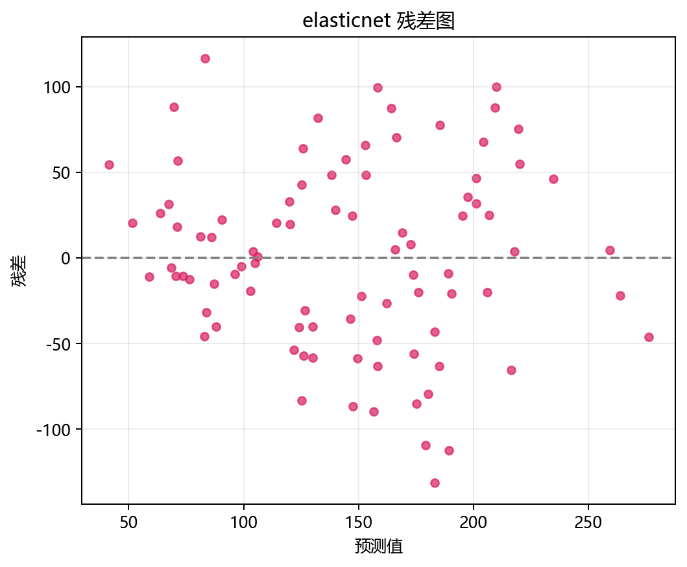
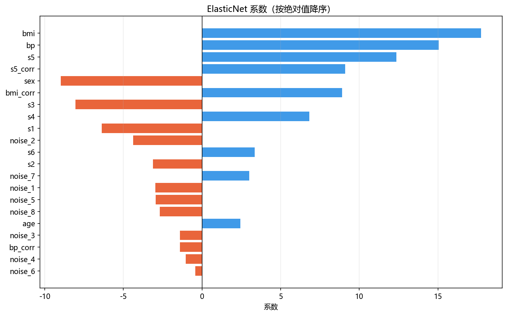
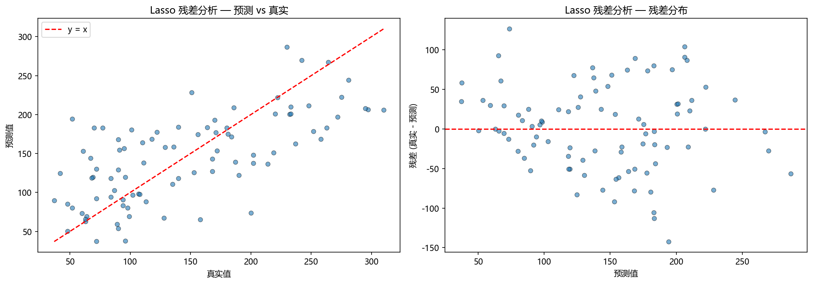
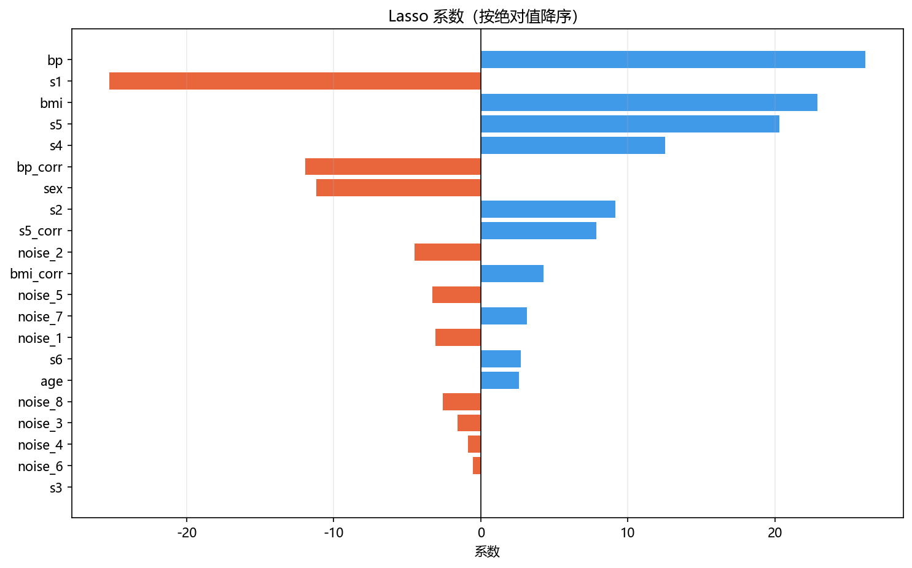
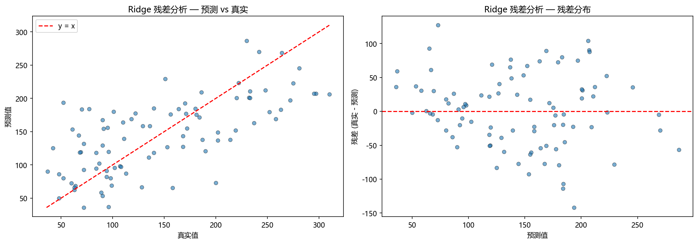
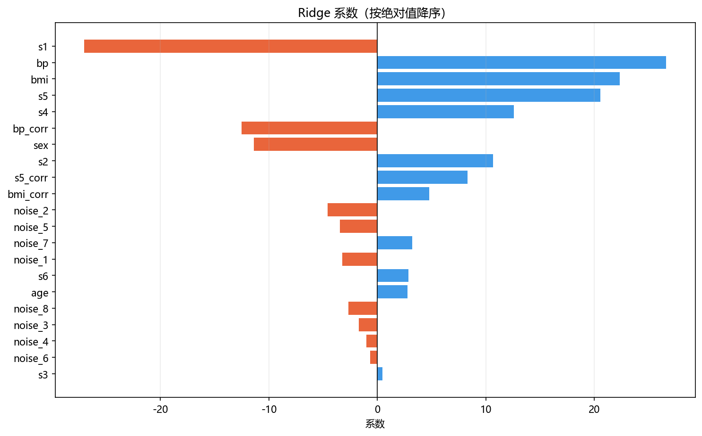

# 评估与诊断

> 对应代码：`pipelines/regression/regularization.py`、`result_visualization/residual_plot.py`、`model_training/regression/regularization.py`
>  
> 相关对象：`plot_residuals(...)`、`near_zero`

## 本章目标

1. 明确当前仓库实际使用了哪些评估手段，而不是泛泛讨论所有回归指标。
2. 理解残差图和系数日志分别能帮助我们诊断什么。
3. 明确当前实现没有做哪些评估，以免误读源码能力边界。

## 重点方法与概念速览

| 名称 | 类型 | 作用 |
|---|---|---|
| `plot_residuals(...)` | 函数 | 生成预测-真实图和残差分布图 |
| `residuals = y_true - y_pred` | 派生量 | 衡量每个样本的预测误差 |
| `near_zero` | 派生量 | 统计接近 0 的系数数量 |
| `coef_` | 属性 | 用于判断特征被保留、收缩还是压到接近 0 |

## 1. 当前实现真正做了什么评估

### 参数速览（本节）

适用评估手段（本节）：

1. 残差图
2. 系数打印

| 评估方式 | 来源 | 用途 |
|---|---|---|
| 残差图 | `plot_residuals(...)` | 观察整体拟合情况与误差分布 |
| 系数日志 | `train_model(...)` | 观察稀疏性、共线性处理方式和特征权重 |

### 理解重点

- 当前 regularization 流水线没有显式打印 `R^2`、`MAE`、`MSE` 等数值指标。
- 这并不表示这些指标不重要，而是说明本仓库当前实现更强调“行为观察式”教学：看残差图、看系数、看稀疏化。
- 因此阅读这一分册时，不能套用“先看分数再看别的”的习惯，而要重视图像和日志本身。

## 2. 残差图是怎么生成的

### 参数速览（本节）

适用函数：`plot_residuals(y_true, y_pred, title='残差分析', dataset_name='default', model_name='model', figsize=(14, 5))`

| 参数名 | 本例取值 | 说明 |
|---|---|---|
| `y_true` | `y_test` | 测试集真实值 |
| `y_pred` | 当前模型预测值 | 测试集预测结果 |
| `dataset_name` | `"regularization"` | 输出目录名 |
| `model_name` | `name.lower()` | 区分不同模型的输出文件 |
| `figsize` | `(14, 5)` | 图像尺寸 |

### 示例代码

```python
residuals = y_true - y_pred

ax1.scatter(y_true, y_pred, alpha=0.6, edgecolors="k", linewidth=0.5, s=30)
ax2.scatter(y_pred, residuals, alpha=0.6, edgecolors="k", linewidth=0.5, s=30)
ax2.axhline(y=0, color="r", linestyle="--", linewidth=1.5)
```

### 理解重点

- 第一张子图看“预测值是否接近真实值对角线”，适合粗看拟合效果。
- 第二张子图看“残差是否围绕 0 随机分布”，适合观察系统偏差、异常点和可能的异方差线索。
- 这两张图组合起来，比单看一个均值误差更容易发现模型哪里出了问题。

## 3. 看残差图时重点观察什么

### 参数速览（本节）

适用观察点（本节）：

1. 对角线贴合程度
2. 残差围绕 0 的分布
3. 离群点与扇形结构

| 现象 | 可能含义 |
|---|---|
| 点大多贴近 `y=x` | 整体预测较稳定 |
| 残差围绕 0 随机散开 | 没有明显系统偏差 |
| 残差整体偏正或偏负 | 模型存在系统性高估或低估 |
| 残差呈扇形扩散 | 可能存在异方差或局部拟合不足 |
| 少量极端散点 | 可能有离群样本或局部难例 |

### 理解重点

- 正则化并不会自动保证残差图好看，它只是在限制系数复杂度。
- 所以“系数更稀疏”不等于“残差更理想”，这两件事必须分开看。
- 当前实现把三种模型都画成残差图，就是为了让你直观看到不同正则化策略在误差分布上的差异。

## 4. 系数日志是正则化分册的第二条诊断主线

### 参数速览（本节）

适用输出项（分项）：

1. `coef_`
2. `intercept_`
3. `near_zero = np.sum(np.abs(coef) < 1e-3)`

| 观察项 | 可以诊断什么 |
|---|---|
| `near_zero` 数量 | 模型是否明显稀疏化 |
| `noise_*` 的系数 | 是否压制了无效特征 |
| `bmi` 与 `bmi_corr` 等成组系数 | 如何处理共线性 |
| `intercept_` | 常数项是否异常漂移 |

### 示例代码

```python
coef = model.coef_
near_zero = np.sum(np.abs(coef) < 1e-3)
print(f"接近 0 的系数数量: {near_zero}/{len(coef)}")
for f, c in zip(feature_names, coef):
    print(f"  {f}: {c:.3f}")
```

### 理解重点

- 对正则化模型来说，系数形态本身就是评估结果的一部分，而不只是模型内部细节。
- 如果 `noise_*` 仍大量保留明显非零系数，说明当前正则化强度可能还不够。
- 如果相关特征中只有少数特征被保留，说明模型更偏向特征筛选；如果同组特征都保留，则更偏向平滑分摊。

## 5. 当前实现没有做什么

### 参数速览（本节）

当前源码未包含的内容：

1. 显式数值指标打印
2. 学习曲线
3. 交叉验证
4. 自动调参

| 未实现项 | 当前状态 |
|---|---|
| `R^2` / `MAE` / `MSE` 打印 | 未在流水线中出现 |
| 学习曲线 | 未调用相关可视化函数 |
| 交叉验证 | 未使用 `cross_val_score` 等 API |
| 网格搜索 | 未使用 `GridSearchCV` 等 API |

### 理解重点

- 评估章节必须以源码为准，不能把“理论上常用”写成“当前仓库已经实现”。
- 如果后续要扩展这部分，最自然的方向是补数值指标和交叉验证，而不是重写现有残差图逻辑。
- 这也是为什么本章反复强调“当前实现真实存在什么”。

### ElasticNet





### Lasso





### Ridge





## 常见坑

1. 只看 `near_zero` 数量，不看残差图，误把”更稀疏”当成”更准确”。
2. 只看残差图，不看 `noise_*` 和 `*_corr` 的系数分布，错过正则化分册最核心的观察点。
3. 误以为当前流水线已经输出了完整数值指标，实际源码并没有这一步。

## 小结

- 当前正则化回归的评估主线由两部分组成：残差图和系数日志。
- 残差图负责看预测误差分布，系数日志负责看模型如何处理噪声特征与共线性。
- 只有把这两条线索一起看，才能真正读懂当前实现里三种模型的差异。
