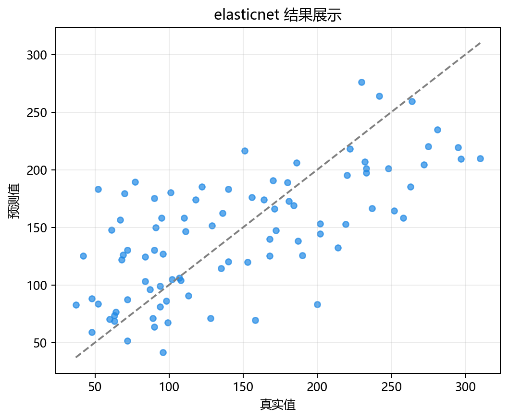
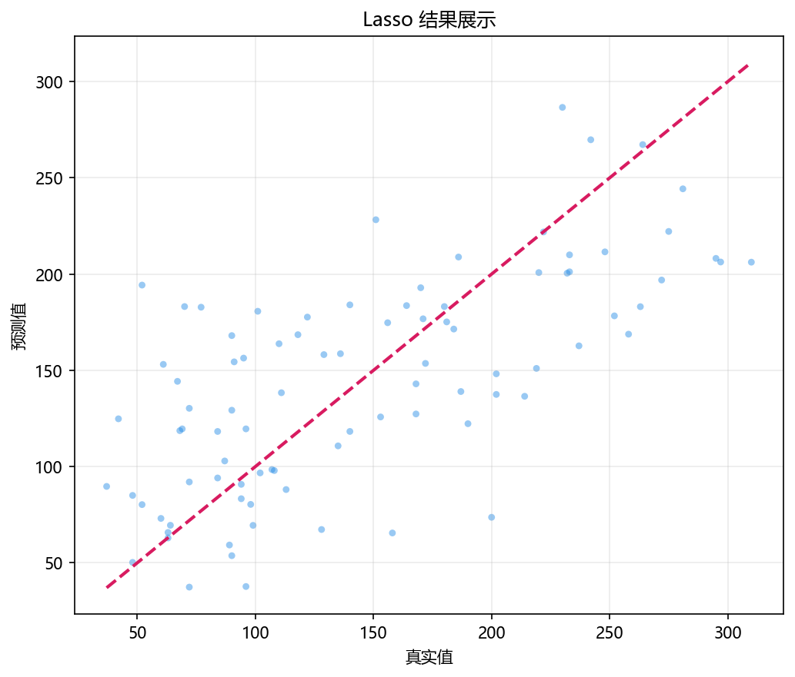
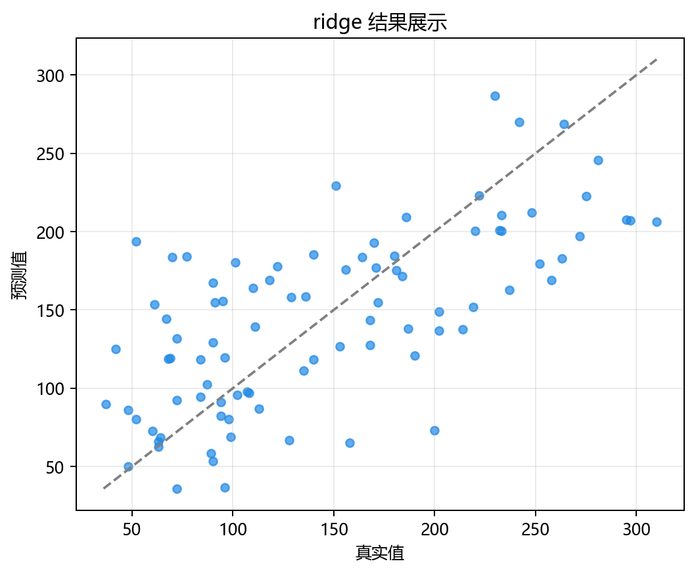

# 工程实现

> 对应代码：`data_generation/regression.py`、`model_training/regression/regularization.py`、`pipelines/regression/regularization.py`、`result_visualization/residual_plot.py`
>  
> 运行方式：`python -m pipelines.regression.regularization`

## 本章目标

1. 看清当前正则化回归分册在仓库中的模块分层与调用关系。
2. 理解从命令行入口到残差图落盘，中间依次发生了什么。
3. 明确哪些逻辑属于数据层、训练层、流水线层和可视化层。

## 对应代码速览

| 组件 | 路径 | 说明 |
|---|---|---|
| 数据生成层 | `data_generation/regression.py` | `RegressionData.regularization()` 构造数据 |
| 数据导出层 | `data_generation/__init__.py` | 提供 `regularization_data` 给外部导入 |
| 训练层 | `model_training/regression/regularization.py` | 定义 `train_model(...)` 并统一训练三模型 |
| 流水线层 | `pipelines/regression/regularization.py` | 负责切分、标准化、训练、预测、画图 |
| 可视化层 | `result_visualization/residual_plot.py` | 负责残差图绘制与保存 |

## 1. 入口命令如何触发整条链路

### 示例代码

```bash
python -m pipelines.regression.regularization
```

### 理解重点

- 这个命令会执行 `pipelines/regression/regularization.py` 中的 `run()`。
- `run()` 是真正的工程入口，其他模块都被它按顺序调用。
- 所以理解工程实现时，最清晰的方式不是从模型类开始，而是先从入口脚本往下追踪。

## 2. 模块之间的调用关系

### 示例代码

```python
from data_generation import regularization_data
from model_training.regression.regularization import train_model
from result_visualization.residual_plot import plot_residuals
```

### 理解重点

- `pipelines` 层不自己造数据、不自己实现模型，也不自己画图，而是扮演调度者角色。
- 这种分层使得每个文件职责相对单一：数据文件只关心数据，训练文件只关心模型训练，可视化文件只关心画图。
- 也正因为如此，文档按“数据 → 模型 → 训练 → 评估 → 工程实现”的顺序组织会更自然。

## 3. 流水线层真正负责什么

### 参数速览（本节）

适用逻辑（分项）：

1. 复制数据
2. 拆分特征与标签
3. 切分训练/测试集
4. 标准化
5. 训练三模型
6. 循环预测与画图

| 步骤 | 所在文件 | 当前职责 |
|---|---|---|
| 读取 `regularization_data` | `pipelines/regression/regularization.py` | 拿到统一数据入口 |
| `X` / `y` 拆分 | `pipelines/regression/regularization.py` | 明确特征与标签 |
| 切分与标准化 | `pipelines/regression/regularization.py` | 生成模型可直接使用的输入 |
| 调用 `train_model(...)` | `pipelines/regression/regularization.py` | 获得三模型字典 |
| 循环 `predict(...)` + `plot_residuals(...)` | `pipelines/regression/regularization.py` | 完成统一评估输出 |

### 理解重点

- 当前仓库没有使用 `Pipeline` 类，而是把预处理与训练步骤显式写在 `run()` 中。
- 这种写法更适合教学，因为每一步都能直接看到变量名和执行顺序。
- 代价是工程复用性稍弱，但对当前文档目标来说是合理取舍。

## 4. 训练层真正负责什么

### 参数速览（本节）

适用函数：`train_model(...)`

| 输出项 | 作用 |
|---|---|
| `models` 字典 | 统一返回三种已训练模型 |
| 控制台日志 | 打印 `alpha`、`l1_ratio`、截距、近零系数数目、各特征系数 |

### 理解重点

- 训练层并不负责切分数据，也不负责计算残差图。
- 它的核心任务只有两个：构建模型对象，拟合训练数据。
- 同时它还承担了教学型日志输出职责，这也是为什么 `feature_names` 会作为参数传进来。

## 5. 可视化层真正负责什么

### 参数速览（本节）

适用函数：`plot_residuals(...)`

| 参数名 | 当前用途 |
|---|---|
| `dataset_name` | 决定保存目录，如 `regularization` |
| `model_name` | 决定文件名前缀，如 `lasso` |
| `title` | 决定图上的展示标题 |

### 理解重点

- 可视化层不关心模型是 Lasso 还是 Ridge，它只接收真实值和预测值并统一画图。
- `DATASET = "regularization"` 的作用，就是让这套结果图被保存到和当前分册对应的目录中。
- 这说明当前工程实现已经在为“多算法共享同一套画图工具”做设计。

## 6. 从命令到结果图的执行链

### 示例代码

```python
python -m pipelines.regression.regularization
    -> run()
    -> regularization_data.copy()
    -> train_test_split(...)
    -> StandardScaler().fit_transform(...)
    -> train_model(...)
    -> model.predict(...)
    -> plot_residuals(...)
    -> savefig(...)
```

### 理解重点

- 这条链里最关键的中间产物有三个：`X_train_s`/`X_test_s`、`models`、每个模型对应的 `y_pred`。
- 一旦这三个中间变量理解清楚，整个 regularization 分册的代码结构就基本串起来了。
- 文档中的各章节，其实就是在拆解这条执行链上的不同环节。

### ElasticNet



### Lasso



### Ridge



## 常见坑

1. 把 `pipelines` 层和 `model_training` 层的职责混在一起，误以为训练函数负责全部工程流程。
2. 忽略 `dataset_name` 和 `model_name` 的作用，看不懂为什么每个模型会生成单独图片文件。
3. 把当前显式写出的训练流程误记成 scikit-learn `Pipeline` 自动完成，导致后续扩展时判断失误。

## 小结

- 当前正则化回归实现采用了清晰的分层结构：数据层、训练层、流水线层、可视化层各司其职。
- 入口脚本负责调度，训练模块负责模型，画图模块负责结果呈现。
- 这种结构既方便阅读，也方便后续把评估指标或调参逻辑继续接到现有流水线上。
