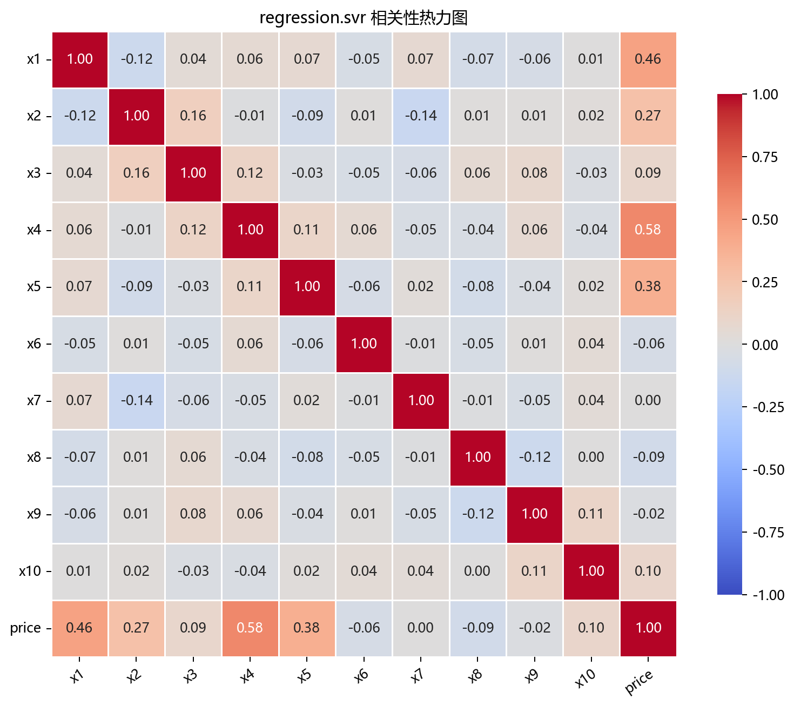
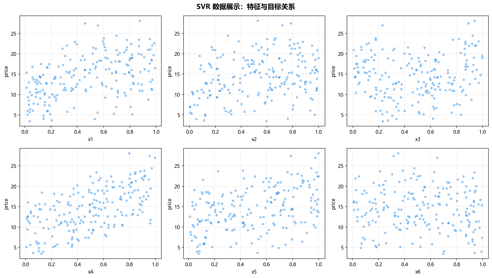

# 数据构成

> 对应代码：`data_generation/regression.py`、`data_generation/__init__.py`、`pipelines/regression/svr.py`
>  
> 相关对象：`RegressionData.svr()`、`svr_data`

## 本章目标

1. 明确本仓库 SVR 数据来自 `RegressionData.svr()` 的 Friedman1 生成逻辑。
2. 明确特征列与标签列在流水线中的拆分方式。
3. 明确训练集/测试集切分与标准化的顺序和边界。

## 重点方法与概念速览

| 名称 | 类型 | 作用 |
|---|---|---|
| `RegressionData.svr()` | 方法 | 生成 SVR 使用的非线性回归数据 |
| `make_friedman1(...)` | 函数 | scikit-learn 提供的 Friedman1 数据生成器 |
| `svr_data` | 变量 | 在 `data_generation/__init__.py` 中导出的数据对象 |
| `price` | 列名 | 当前流水线中的回归目标列 |

## 1. 本仓库数据入口

- 数据变量：`data_generation/__init__.py` 中导出的 `svr_data`
- 生成来源：`data_generation/regression.py` 中的 `RegressionData.svr()`
- 流水线使用：`pipelines/regression/svr.py` 中的 `data = svr_data.copy()`

### 理解重点

- `svr_data` 在导入时就已经生成完成，因此流水线里直接 `.copy()` 使用即可。
- 用 `.copy()` 的目的，是避免后续处理意外修改原始数据对象。

## 2. 数据生成函数 `RegressionData.svr()`

### 参数速览（本节）

适用 API（分项）：

1. `RegressionData.svr()`
2. `make_friedman1(n_samples=self.n_samples, n_features=10, noise=self.svr_noise, random_state=self.random_state)`

| 参数名 | 本例取值 | 说明 |
|---|---|---|
| `n_samples` | `200` | 样本数，来自 `RegressionData` 默认属性 |
| `n_features` | `10` | 特征数，源码中固定为 10 |
| `noise` | `1.0` | 标签噪声强度，来自 `self.svr_noise` |
| `random_state` | `42` | 随机种子，保证数据可复现 |
| 返回值 | `DataFrame` | 含 `x1` ~ `x10` 与 `price` 的数据表 |

### 示例代码

```python
X, y = make_friedman1(
    n_samples=self.n_samples,
    n_features=10,
    noise=self.svr_noise,
    random_state=self.random_state,
)
columns = [f"x{i + 1}" for i in range(X.shape[1])]
df = DataFrame(X, columns=columns)
df["price"] = y
```

### 理解重点

- Friedman1 是典型的非线性回归数据，很适合展示 RBF 核的拟合能力。
- 前 5 个特征有效，后 5 个特征偏噪声，这一点源码注释里也明确写出。

## 3. 特征列与标签列

当前数据表结构如下：

- 特征列：`x1` ~ `x10`
- 标签列：`price`

### 示例代码

```python
X = data.drop(columns=["price"])
y = data["price"]
```

### 理解重点

- 当前流水线使用 `price` 作为统一的回归标签列名。
- 因此训练代码不需要关心 Friedman1 原始返回值的变量名，而是直接按表格字段拆分。

## 4. 切分与标准化

### 参数速览（本节）

适用 API（分项）：

1. `train_test_split(X, y, test_size=0.2, random_state=42)`
2. `StandardScaler().fit_transform(X_train)`
3. `StandardScaler().transform(X_test)`

| 参数名 | 本例取值 | 说明 |
|---|---|---|
| `test_size` | `0.2` | 测试集占比 |
| `random_state` | `42` | 保证可复现划分 |
| `X_train` | 训练特征 | 只在训练集上拟合标准化统计量 |
| `X_test` | 测试特征 | 使用训练集统计量做变换 |
| 返回值 | `X_train_s`、`X_test_s` | 标准化后的训练和测试特征 |

### 示例代码

```python
X_train, X_test, y_train, y_test = train_test_split(
    X, y, test_size=0.2, random_state=42
)

scaler = StandardScaler()
X_train_s = scaler.fit_transform(X_train)
X_test_s = scaler.transform(X_test)
```

### 理解重点

- 标准化必须发生在切分之后，否则会造成数据泄露。
- 当前文档中的 `X_train_s`、`X_test_s` 都是源码里真实使用的变量名。

## 数据可视化





## 常见坑

1. 把 `price` 当成普通特征一起送进模型。
2. 忽略 Friedman1 后 5 维偏噪声这一事实，错误理解特征重要性。
3. 在切分之前就对全量数据做标准化。

## 小结

- 当前 SVR 数据来自 `RegressionData.svr()`，底层使用的是 `make_friedman1(...)`。
- 数据表结构清晰：`x1` ~ `x10` 是特征，`price` 是标签。
- 读懂数据来源和预处理顺序，是理解后续训练与评估章节的前提。
